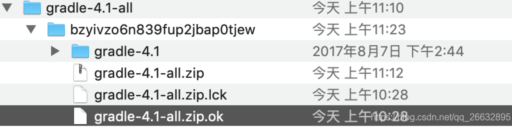

# Mac OS 下AndroidStudio手动下载gradle(自动下载太慢)
<!--more-->
1.获取url并下载
在gradle-wrapper.properties中获取url

#Thu Nov 29 10:32:13 CST 2018
distributionBase=GRADLE_USER_HOME
distributionPath=wrapper/dists
zipStoreBase=GRADLE_USER_HOME
zipStorePath=wrapper/dists
distributionUrl=https\://services.gradle.org/distributions/gradle-4.1-all.zip
```
#Thu Nov 29 10:32:13 CST 2018
distributionBase=GRADLE_USER_HOME
distributionPath=wrapper/dists
zipStoreBase=GRADLE_USER_HOME
zipStorePath=wrapper/dists
distributionUrl=https\://services.gradle.org/distributions/gradle-4.1-all.zip

```
将https://services.gradle.org/distributions/gradle-4.1-all.zip复制到迅雷或其他工具下载，会很快。

2.放到gradle目录
mac下gralde目录在 ~/.gradle中

将下载的压缩包放到~/.gradle/wrapper/dists/gradle-4.1-all/生成的文件夹/ 下并解压

将gradle-4.1-all.zip.part文件删除；复制一份gradle-4.1-all.zip.lck文件，重命名为gradle-4.1-all.zip.ok；
点击Sync Project With Gradle Files。

"“生成的文件夹”"是studio中gradle自动下载时生成的.

android gradle插件 和 gradle版本对应关系参见

https://developer.android.google.cn/studio/releases/gradle-plugin#updating-plugin

原文引用：https://blog.csdn.net/qq_26632895/article/details/108276511

感谢，特记录方便平时使用