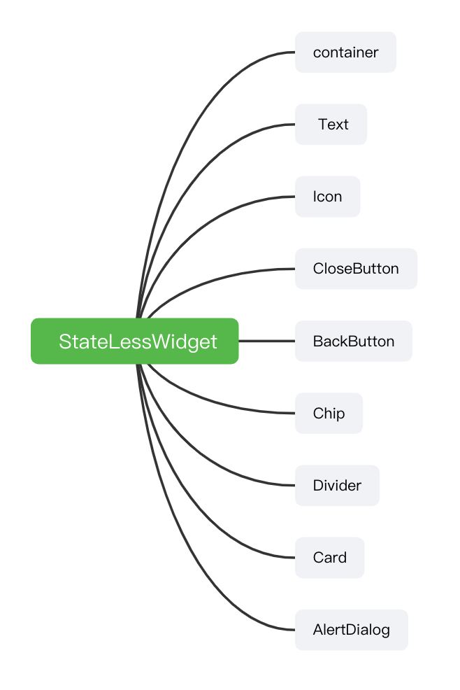
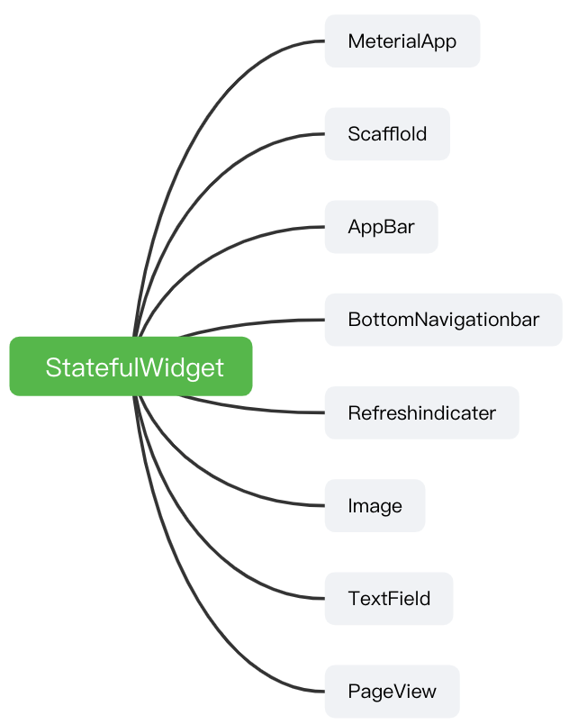

# Flutter基础


### Flutter 包和插件

https://pub.flutter-io.cn/ （pub.dev）中国站点，相当于npm.js 之于node工具链。

eg：https://pub.flutter-io.cn/packages/flutter_color_plugin 颜色插件

使用： To get a color 

```dart
Color color1 = ColorUtil.color('#f2f2f2');
Color color2 = ColorUtil.color('f2f2f2');
print(color1 == color2); //true
Color color3 = ColorUtil.color('#a1FF5733');
Color color4 = ColorUtil.color('a1FF5733');
print(color3 == color4); //true
//The following is the same
int colorInt1 = ColorUtil.intColor('#f2f2f2');
int colorInt2 = ColorUtil.intColor('f2f2f2');
int colorInt3 = ColorUtil.intColor('#fff2f2f2');
int colorInt5 = ColorUtil.intColor('fff2f2f2');
```


#### 安装

##### 添加依赖

```shell
 $ flutter pub add flutter_color_plugin
```

This will add a line like this to your package's pubspec.yaml (and run an implicit `dart pub get`):

```yaml
dependencies:
  flutter_color_plugin: ^1.0.0
```

##### 引入

```dart
import 'package:flutter_color_plugin/flutter_color_plugin.dart';
```

### StateLessWidget

在Flutter中一切皆组件

常用的StateLessWidget子 组件



StateLessWidget是不包含状态的，不依靠自身的状态来渲染自己。常用实现类：

```dart
import 'package:flutter/material.dart';
import 'package:flutter_color_plugin/flutter_color_plugin.dart';

// StateLessWidget与基础组件
class LessGroupPage extends StatelessWidget {
  String name = 'StateLessWidget与基础组件';
  @override
  Widget build(BuildContext context) {
    TextStyle textStyle = TextStyle(fontSize: 20);
    return MaterialApp(
      title: name,
      theme: ThemeData(
        primarySwatch: Colors.blue,
      ),
      home: Scaffold(
        appBar: AppBar(title: Text(name)),
        body: Container(
          decoration: BoxDecoration(color: Colors.white),
          alignment: Alignment.center,
          child: Column(
            children: <Widget>[
              Text(
                'I am Text',
                style: textStyle,
              ), 
              Icon(
                  Icons.android,
                  size: 50,
                  color: Colors.red
              ),
              CloseButton(),
              BackButton(),
              //材料设计中一个非常有趣的小部件，什么是Chip@https://material.io/design/components/chips.html
              Chip(
                  avatar: Icon(Icons.people),
                  label: Text(name)
              ),
              //分割线
              Divider( //无法设置高度
                height: 10,//容器高度，不是线的高度
                indent: 10, //左侧间距
                color: Colors.orange
              ),
              Card(
                //带有圆角，阴影，边框等效果的卡片
                color: Colors.blue,
                elevation: 5,
                margin: EdgeInsets.all(10),
                child: Container(
                  padding: EdgeInsets.all(10),
                  child: Text(
                    'I am Card',
                    style: textStyle,
                  ),
                ),
              ),
              AlertDialog(
                title: Text('盘他'),
                content: Text('你这个糟老头子坏得很'),
              )
            ],
          ),
        ),
      ),
    );
  }
}
```

#### Container

容器组件我们可以约束它的child（子节点）

```dart
class Container extends StatelessWidget {
  Container({
    Key? key,
    this.alignment, //居中方式
    ...
    this.color, // 颜色
    this.decoration,//装饰器 ，可以配置圆角背景等属性
    this.foregroundDecoration,// 背景
    double? width, //宽度
    double? height,//高度
    ...
    this.child, //子节点
    ...
  }) : assert(margin == null || margin.isNonNegative),
       ...
       super(key: key);
       ...
 }     
```

### StatefulWidget

有状态的组件，常用子组件



常用子组件：

MaterialApp :materral 材质组件，一般位于根节点

Scaffold（脚手架）：包含AppBar 侧边栏等效果的组件

AppBar： 顶部导航栏

BottomNavigationbar: 底部导航栏

RefreshIndicator： 刷新指示器

Image：图片

TextFeild: 输入框

PageView

```
///StatefulWidget与基础组件
```

脚手架：

```dart
class Scaffold extends StatefulWidget {
  /// Creates a visual scaffold for material design widgets.
  const Scaffold({
    Key? key,
    this.appBar, // appbar 设置
    this.body, // body 设置
    this.floatingActionButton, //悬浮按钮设置
    ...
    this.drawer, //侧边栏
    ...
    this.bottomNavigationBar,//底部导航栏
    ...
    this.restorationId,
  }) : assert(primary != null),
       assert(extendBody != null), ...
}
```

常用组件

```dart
import 'package:flutter/material.dart';

///StatefulWidget与基础组件
class StateFulGroup extends StatefulWidget {
  @override
  _StateFulGroupState createState() => _StateFulGroupState();
}

class _StateFulGroupState extends State<StateFulGroup> {
  int _currentIndex = 0;

  @override
  Widget build(BuildContext context) {
    TextStyle textStyle = TextStyle(fontSize: 20);
    String pageName = 'StatefulWidget与基础组件';
    // MaterialApp 可以轻松构建出整个主题
    return MaterialApp(
      title: pageName,
      theme: ThemeData(
        primarySwatch: Colors.blue,
      ),
      // home： 整个页面
      home: Scaffold(
        appBar: AppBar(title: Text(pageName)),

        //底部导航栏至少两个Item ，title属性被替换成了label
        bottomNavigationBar: BottomNavigationBar(
            currentIndex: _currentIndex,
            // 底部导航根据切换的状态刷新页面，只有statefulgroup才有
            onTap: (index) {
              setState(() {
                _currentIndex = index;
              });
            },
            items: [
              BottomNavigationBarItem(
                  icon: Icon(Icons.home, color: Colors.grey),
                  activeIcon: Icon(Icons.home, color: Colors.blue),
                  label: '首页'),
              BottomNavigationBarItem(
                  icon: Icon(Icons.list, color: Colors.grey),
                  activeIcon: Icon(Icons.list, color: Colors.blue),
                  label: '列表')
            ]),
        //悬浮按钮
        floatingActionButton: FloatingActionButton(
          onPressed: null,
          child: Text('点我'),
        ),
        //根据底部导航切换的位置，切换body页面
        body: _currentIndex == 0
            ? RefreshIndicator(
                //刷新组件，一定配合列表使用
                child: ListView(
                  children: <Widget>[
                    Container(
                      decoration: BoxDecoration(color: Colors.white),
                      alignment: Alignment.center,
                      child: Column(
                        children: <Widget>[
                          Image.network('http://www.devio.org/img/avatar.png',
                              width: 100, height: 100),
                          TextField(
                            //输入文本的样式
                            decoration: InputDecoration(
                                contentPadding: EdgeInsets.fromLTRB(5, 0, 5, 0),
                                hintText: '请输入',
                                hintStyle: TextStyle(fontSize: 15)),
                          ),
                          Container(
                            height: 100,
                            margin: EdgeInsets.only(top: 10),
                            decoration: BoxDecoration(color: Colors.lightBlueAccent),
                            //Pageview 类似viewpager
                            child: PageView(
                              children: <Widget>[
                                _item('Page1', Colors.deepPurple),
                                _item('Page2', Colors.green),
                                _item('Page3', Colors.red)
                              ],
                            ),
                          )
                        ],
                      ),
                    )
                  ],
                ),
                onRefresh: handlerRefresh)
            : Text('列表'),
      ),
    );
  }

  Future<Null> handlerRefresh() async {
    await Future.delayed(Duration(milliseconds: 200));
  }

  _item(String title,Color color) {
    return Container(
      alignment: Alignment.center,
      decoration: BoxDecoration(color: color),
      child: Text(
        title,
        style: TextStyle(fontSize: 22,color: Colors.white),
      ),
    );
  }
}

```

## 布局

- `RenderObjectWidget` 约束里面布局的一些配置
  - `SingleChildRenderObjectWidget` 单节点布局组件
    - `Opacity` 改变透明度的组件
    - `ClipOval` 布局裁剪成圆形的组件
    - `ClipRReact` 裁剪成方形的组件
    - `PhysicalModel `将布局显示成不同形状的组件
    - `Align`
      - `Cnter`居中
    - `Padding` 边距
    - `SizedBox`约束布局的大小
    - `FractionallySizedBox` 约束里面水平布局/垂直布局的伸展
  - `MultiChildRenderObjectWidget` 多节点布局组件
    - `Stack` 相当于`FrameLayout`
    - `Flex`
      - `Column`从上到下布局的组件 y
      - `Row`从左到右布局组件 x
    - `Wrap`类似row 从左到右，但是可以换行
    - `Flow`很少用到
- `ParentDataWidget`
  - `Positioned`用于规定view位置到组件，通常和`Stack`搭配
  - `Flexible`
    - `Expanded`在父容器可以展开的组件

Eg:

```dart
import 'package:flutter/material.dart';

///StatefulWidget与基础组件
class FlutterLayoutPage extends StatefulWidget {
  @override
  _FlutterLayoutPage createState() => _FlutterLayoutPage();
}

class _FlutterLayoutPage extends State<FlutterLayoutPage> {
  int _currentIndex = 0;

  @override
  Widget build(BuildContext context) {
    TextStyle textStyle = TextStyle(fontSize: 20);
    String pageName = 'StatefulWidget与基础组件';
    // MaterialApp 可以轻松构建出整个主题
    return MaterialApp(
      title: pageName,
      theme: ThemeData(
        primarySwatch: Colors.blue,
      ),
      // home： 整个页面
      home: Scaffold(
        appBar: AppBar(title: Text(pageName)),

        //底部导航栏至少两个Item ，title属性被替换成了label
        bottomNavigationBar: BottomNavigationBar(
            currentIndex: _currentIndex,
            // 底部导航根据切换的状态刷新页面，只有statefulgroup才有
            onTap: (index) {
              setState(() {
                _currentIndex = index;
              });
            },
            items: [
              BottomNavigationBarItem(
                  icon: Icon(Icons.home, color: Colors.grey),
                  activeIcon: Icon(Icons.home, color: Colors.blue),
                  label: '首页'),
              BottomNavigationBarItem(
                  icon: Icon(Icons.list, color: Colors.grey),
                  activeIcon: Icon(Icons.list, color: Colors.blue),
                  label: '列表')
            ]),
        //悬浮按钮
        floatingActionButton: FloatingActionButton(
          onPressed: null,
          child: Text('点我'),
        ),
        //根据底部导航切换的位置，切换body页面
        body: _currentIndex == 0
            ? RefreshIndicator(
                //刷新组件，一定配合列表使用
                child: ListView(
                  children: <Widget>[
                    Container(
                      decoration: BoxDecoration(color: Colors.white),
                      alignment: Alignment.center,
                      child: Column(
                        children: <Widget>[
                          Row(
                            children: <Widget>[
                              ClipOval(
                                child: SizedBox(
                                  width: 100,
                                  height: 100,
                                  child: Image.network(
                                      'http://www.devio.org/img/avatar.png'),
                                ),
                              ),
                              Padding(
                                  padding: EdgeInsets.all(10),
                                  child: ClipRRect(
                                      borderRadius:
                                          BorderRadius.all(Radius.circular(6)),
                                      clipBehavior: Clip.antiAlias, //抗锯齿
                                      // 有锯齿 clipBehavior: Clip.hardEdge,
                                      // 不会裁 clipBehavior: Clip.none,
                                      child: Opacity(
                                        opacity: 0.6,
                                        child: Image.network(
                                          'http://www.devio.org/img/avatar.png',
                                          width: 100,
                                          height: 100,
                                        ),
                                      )))
                            ],
                          ),
                          TextField(
                            //输入文本的样式
                            decoration: InputDecoration(
                                border: OutlineInputBorder(
                                    borderRadius: BorderRadius.circular(5.0),
                                    borderSide: BorderSide()),
                                contentPadding:
                                    EdgeInsets.fromLTRB(10, 0, 10, 0),
                                hintText: '请输入',
                                hintStyle: TextStyle(fontSize: 15)),
                          ),
                          Container(
                            height: 100,
                            margin: EdgeInsets.only(
                                top: 10, left: 10, right: 10, bottom: 10),
                            child: PhysicalModel(
                              color: Colors.transparent,
                              borderRadius: BorderRadius.circular(6),

                              clipBehavior: Clip.antiAlias, //抗锯齿
                              child: PageView(
                                children: <Widget>[
                                  _item('Page1', Colors.deepPurple),
                                  _item('Page2', Colors.green),
                                  _item('Page3', Colors.red)
                                ],
                              ),
                            ),
                          ),
                          Column(
                            children: <Widget>[
                              FractionallySizedBox(
                                widthFactor: 1,
                                child: Container(
                                  decoration: BoxDecoration(
                                    color: Colors.green,
                                  ),
                                  child: Text(
                                    '宽度撑满',
                                    textAlign: TextAlign.center,
                                  ),
                                ),
                              )
                            ],
                          )
                        ],
                      ),
                    ),
                    Stack(
                      children: <Widget>[
                        Image.network(
                          'http://www.devio.org/img/avatar.png',
                          width: 100,
                          height: 100,
                        ),
                        Positioned(
                            left: 0,
                            bottom: 0,
                            child: Image.network(
                              'http://www.devio.org/img/avatar.png',
                              width: 36,
                              height: 36,
                            ))
                      ],
                    ),
                    Wrap(
                      //创建一个wrap布局，从左向右进行排列，会自动换行
                      spacing: 8, //水平间距
                      runSpacing: 6, //垂直间距
                      children: <Widget>[
                        _chip('Flutter'),
                        _chip('进阶'),
                        _chip('实战'),
                        _chip('携程'),
                        _chip('App'),
                      ],
                    )
                  ],
                ),
                onRefresh: handlerRefresh)
            : Column(
                children: <Widget>[
                  Text('列表'),
                  // 因为是Colunm 所以会伸满垂直高度
                  Expanded(
                      child: Container(
                    decoration: BoxDecoration(color: Colors.red),
                    child: Text('拉伸填满高度'),
                  ))
                ],
              ),
      ),
    );
  }

  Future<Null> handlerRefresh() async {
    await Future.delayed(Duration(milliseconds: 200));
  }

  _item(String title, Color color) {
    return Container(
      alignment: Alignment.center,
      decoration: BoxDecoration(color: color),
      child: Text(
        title,
        style: TextStyle(fontSize: 22, color: Colors.white),
      ),
    );
  }

  _chip(String label) {
    return Chip(
      label: Text(label),
      avatar: CircleAvatar(
        backgroundColor: Colors.blue.shade900,
        child: Text(
          label.substring(0, 1),
          style: TextStyle(fontSize: 10),
        ),
      ),
    );
  }
}

```

## 路由&导航

```dart
void main() {
  runApp(MyApp());
}

class MyApp extends StatelessWidget {
  Container? container = null;

  @override
  Widget build(BuildContext context) {
    return MaterialApp(
        title: 'Flutter Demo',
        theme: ThemeData(
          primarySwatch: Colors.blue,
        ),
        home: Scaffold(
          appBar: AppBar(
            title: Text('如何使用Flutter的路由和导航')
          ),
          body: RouteNavigator(),
        ),
        routes: <String, WidgetBuilder>{
          'less': (BuildContext) => LessGroupPage(),
          'plugin': (BuildContext) => PluginUser(),
          'ful': (BuildContext) => StateFulGroupPage(),
          'layout': (BuildContext) => FlutterLayoutPage(),
        });
  }
}

class RouteNavigator extends StatefulWidget {
  @override
  _RouteNavigatorState createState() => _RouteNavigatorState();
}

class _RouteNavigatorState extends State<RouteNavigator> {
  bool byName = false;

  @override
  Widget build(BuildContext context) {
    return Container(
      child: Column(
        children: [
          SwitchListTile(
              title: Text('${byName ? '' : '不'}通过路由名跳转'),
              value: byName,
              onChanged: (value) {
                setState(() {
                  byName = value;
                });
              }),
          _items('StateLessWidget与基础组件', LessGroupPage(), 'less'),
          _items('如何使用Flutter包和插件', PluginUser(), 'plugin'),
          _items('StatefulWidget与基础组件', StateFulGroupPage(), 'ful'),
          _items('布局', FlutterLayoutPage(), 'layout'),
        ],
      ),
    );
  }

  _items(String title, page, String routeName) {
    return Container(
      child: ElevatedButton(
        onPressed: () {
          if (byName) {
            Navigator.pushNamed(context, routeName);
          } else {
            Navigator.push(
                context, MaterialPageRoute(builder: (context) => page));
          }
        },
        child: Text(title),
      ),
    );
  }
}
```

