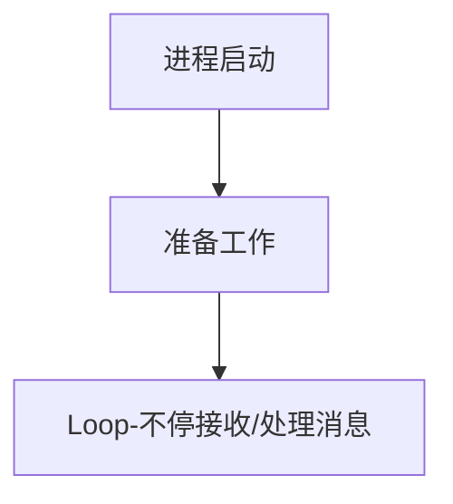
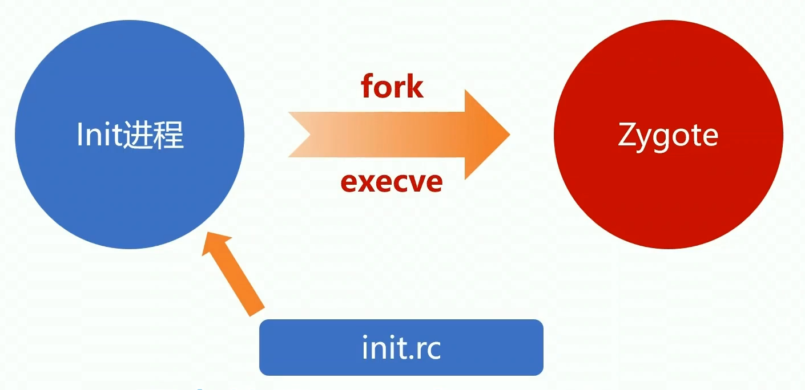
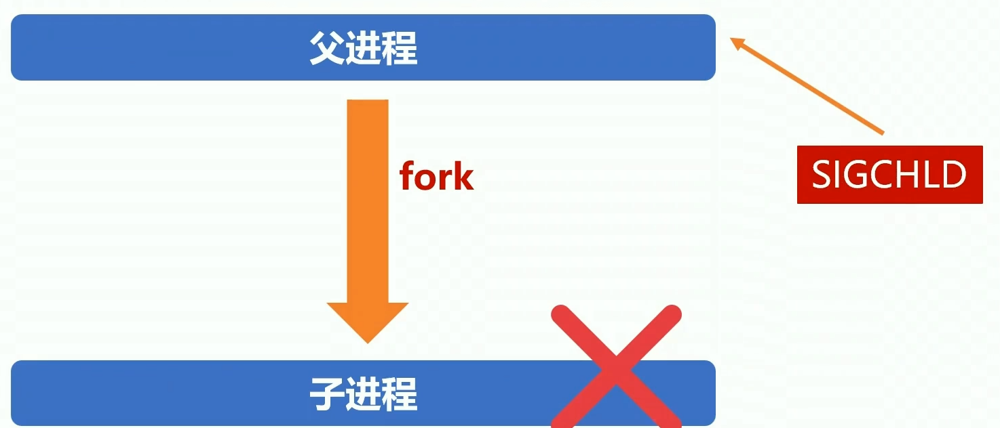
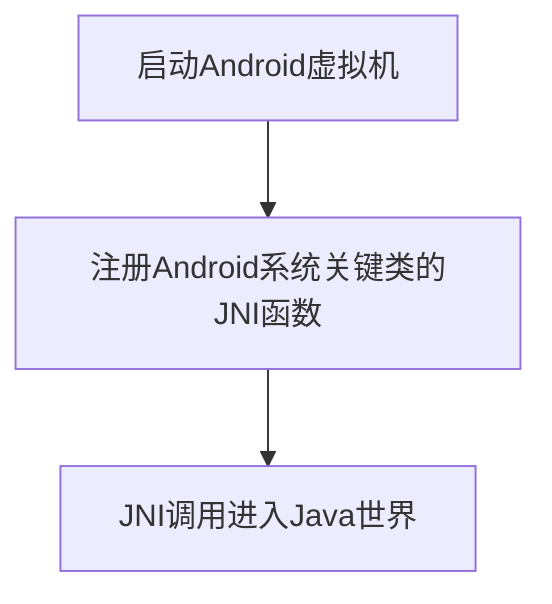
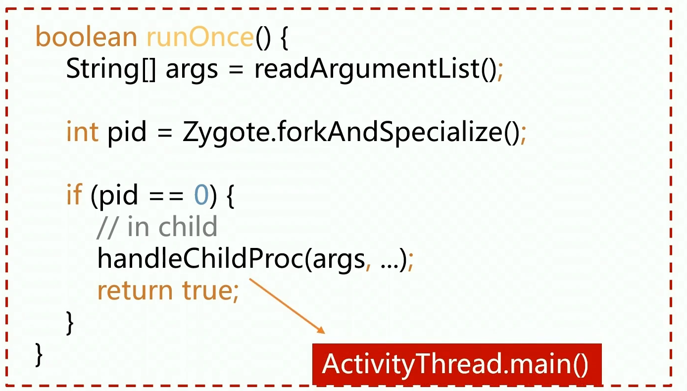

# Framework面试之系统服务

## 谈谈对Zygote的理解

-  Zygote的作用（初）
  - 启动SystemServer
  - 孵化应用进程
- 熟悉Zygote的启动流程（中）
- 深刻理解Zygote的工作原理（高）

### Zygote的作用是什么？

- 启动SystemServer

  `常用类`,`JNI函数`,`主题资源`,`共享库`如果都从`Zygote`继承比较方便

- 孵化应用进程

### 启动三段式 

Android进程启动常用套路：



### Zygote是怎么启动的？

Init进程：Linux启动后用户空间的第一个进程



1. Init进程启动后，首先会去加载一个启动配置文件`init.rc`。
2. 查看启动配置文件定义了哪些需要启动的系统服务 `Zygote`服务也是需要启动的进程之一，`Service Manager`也是需要启动的进程。
3. 通过 `fork`和 `execve`系统调用，启动`Zygote`。

#### 启动配置


红色：service的名称。蓝色：可执行路径。黄色：参数。

进程启动靠的是fork和exeve系统调用，需要传可执行的路径和参数，

#### 启动进程

启动进程有两种方式

- fork + handle

  ```cpp
  pid_t pid = fork();
  if( pid == 0) {
    // child process
  }else{
    // parent process
  }
  ```

- fork + exeve

  ```cpp
  pid_t pid = fork();
  if( pid == 0) {
    // child process
    execve(path,argv,env);// 执行程序路径，执行程序参数，环境变量
  }else{
    // parent process
  }
  ```

第一步都调用`fork`函数创建子进程。`fork()`函数会返回两次，子进程父进程各一次。区别在于子进程的`pid`返回0 ，父进程的pid返回的是子进程的`pid` ，所以可以根据判断pid是不是0判断是否是子进程还是父进程。

默认来说创建的子进程会继承父进程的所有资源，调用`execve`系统调用去启动新的二进制程序，子进程继承的父进程资源就会被清掉，完全被新的二进制程序替换。

#### 信号处理- SiGCHILD

fork进程的时候父进程一般都要关注这个信号。



如果父进程`fork`一个子进程，子进程挂了会发送一个`SIGCHILD`信号给父进程，这时父进程就可以做一些处理。比如`Zygote`挂了就会发送一个`SIGCHILD`信号给`Init`进程进行重启。

### Zygote进程启动之后做了什么？

- Zygote的Native世界 （准备工作）

  Zygote启动之后执行了一个`execve`系统调用,执行一个二进制可执行程序（c++，里面有一个`main`函数作为入口）所以说Zygote天生就是Native的，做一些准备工作之后就切到Java中运行了。

- Zygote的Java世界 （实际运行）

#### Zygote的Native世界 

目的是为了Java执行做准备。


##### Native切换到Java


关键： JNICreateJavaVM 函数创建虚拟机。

1. JNICreateJavaVM 创建虚拟机
2. 找到ZygoteInit这个Java类
3. 在ZygoteInit类中找到 Main这个静态函数
4. 用CallStaticVOidMethod去调用这个函数
5. 最后DestoryJavaVM 销毁Java虚拟机

应用进程不需要创建虚拟机，是因为在Zygote进程中已经加载好了，我们应用进程是由Zygote孵化出来的，继承了Java虚拟机，只需要在进程启动的时候重置一下虚拟机的状态，再重启一下虚拟机的属性就可以了

#### Zygote的Java世界

主要做了三件事

1. 预加载资源：孵化子进程的时候可以继承给他们，包括常用类主题相关的资源、共享库。
2. fork SystemServer进程。
3. 进入Loop循环，等待Socket消息，Socket用一个名称表示就行了，别人知道这个名称就可以跟这个Socket通信。


##### Loop循环

Zygote启动之后，会启动Socket Loop循环，会不断轮询Socket，当有请求过来的时候会执行runOnce函数。

runOnece方法：

1. 读取参数列表 readArgumentLIst()。

2. 根据参数启动子进程 forkAndSpecialize()。

3. 子进程启动后调用ActivityThread.Main函数

   子进程中调用 handleChidPro()，它会在子进程中调用一个Java类的Main函数，Java类名来自于读取的参数列表，是由AMS跨进程发过来的，类名其实是ActivityThread




### 需要注意的细节

#### Zygote fork 要单线程

不管父进程里有多少线程，子进程在创建的时候就只有一个线程，对于子进程来说，这些多的线程就不见了，可能会导致奇怪的问题，比如死锁，状态不一致等。所以fork创建子进程的时候，把主线程之外的其他线程都停了，创建完进程之后再把这些线程重启。

Zygote本身就是这样做的，Zygote本身不是单线程的，跑了很多虚拟机相关的守护线程。

### 扩展问题

#### Zygote的IPC通信机制没有采用binder

才用了本地Socket所以应用系统的binder机制，不是从Zygote继承过来的，而是在应用程序的进程创建之后自己启动的Binder机制。

#### 孵化应用进程为什么不给SystemServer来做，而专门设计一个Zygote？

我们知道，应用在启动的时候需要做很多准备工作，包括启动虚拟机，加载各类系统资源等等，这些都是非常耗时的，如果能在zygote里就给这些必要的初始化工作做好，子进程在fork的时候就能直接共享，那么这样的话效率就会非常高。这个就是zygote存在的价值，这一点呢SystemServer是替代不了的，主要是因为SystemServer里跑了一堆系统服务，这些是不能继承到应用进程的。而且我们应用进程在启动的时候，内存空间除了必要的资源外，最好是干干净净的，不要继承一堆乱七八糟的东西。所以呢，不如给SystemServer和应用进程里都要用到的资源抽出来单独放在一个进程里，也就是这的zygote进程，然后zygote进程再分别孵化出SystemServer进程和应用进程。孵化出来之后，SystemServer进程和应用进程就可以各干各的事了。

#### Zygote的IPC通信机制为什么不采用binder？如果采用binder的话会有什么问题？

android间的进程通信是使用Binder，唯独Zygote和SystemService是使用socket

##### 第一种解释：

第一个原因，我们可以设想一下采用binder调用的话该怎么做，首先zygote要启用binder机制，需要打开binder驱动，获得一个描述符，再通过mmap进行内存映射，还要注册binder线程，这还不够，还要创建一个binder对象注册到serviceManager，另外AMS要向zygote发起创建应用进程请求的话，要先从serviceManager查询zygote的binder对象，然后再发起binder调用，这来来回回好几趟非常繁琐，相比之下，zygote和SystemServer进程本来就是父子关系，对于简单的消息通信，用管道或者socket非常方便省事。

第二个原因，如果zygote启用binder机制，再fork出SystemServer，那么SystemServer就会继承了zygote的描述符以及映射的内存，这两个进程在binder驱动层就会共用一套数据结构，这显然是不行的，所以还得先给原来的旧的描述符关掉，再重新启用一遍binder机制，这个就是自找麻烦了。

##### 第二种解释：

怕父进程binder线程有锁，然后子进程的主线程一直在等其子线程(从父进程拷贝过来的子进程)的资源，但是其实父进程的子进程并没有被拷贝过来，造成死锁，所以fork不允许存在多线程。而非常巧的是Binder通讯偏偏就是多线程，所以干脆父进程（Zgote）这个时候就不使用binder线程。

## 说一说Android系统的启动流程

这道题想考察什么

- Android有哪些主要的系统进程
- 这些系统进程是怎么启动的
- 进程启动之后主要做了什么事