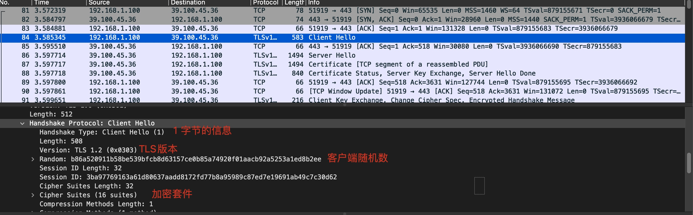
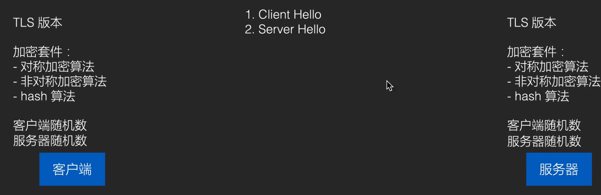
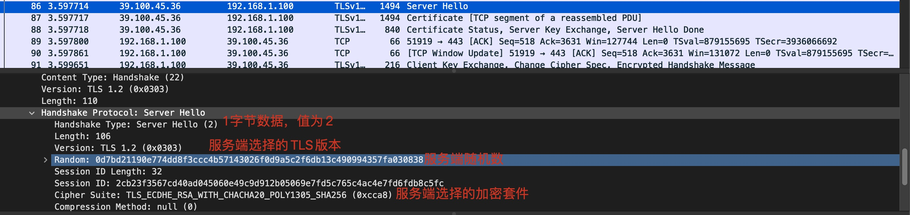
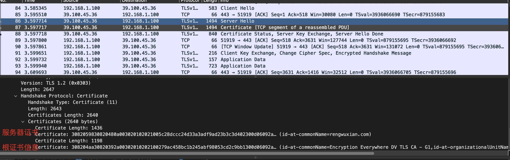
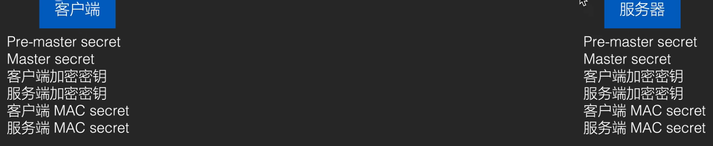
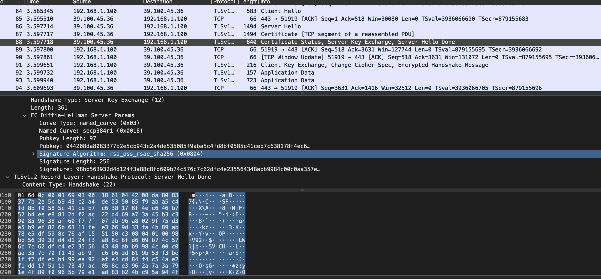
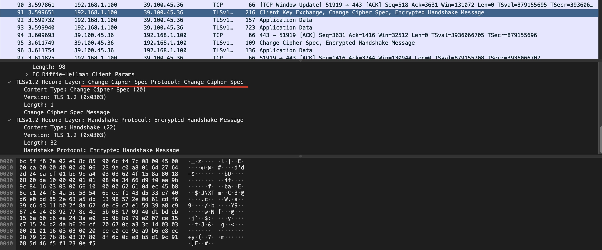
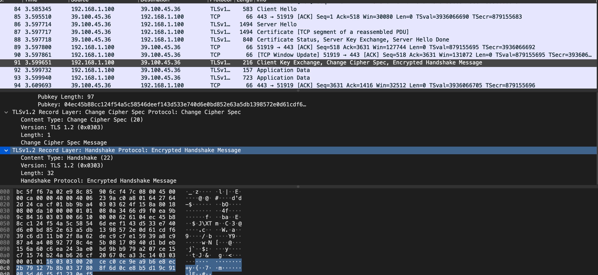
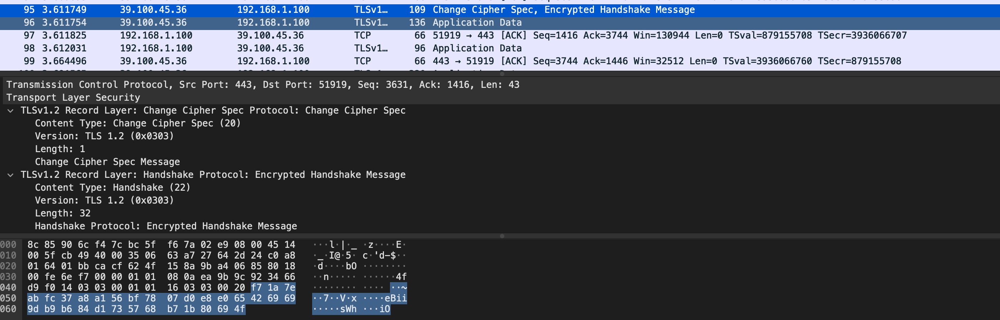

# HTTPS

## 定义

HTTP over SSL 的简称，即工作在 SSL (或 TLS)上的 HTTP。说白了就是加密通信 的 HTTP。

HTTPS本是网景为了安全开发的协议，SSL和HTTP本是共生的，SSL后来独立出来演变成了TLS

TSL定义：Http之下的一个安全层，其实就是http把数据交给TCP之前，先交给TLS加密，再交给IP层传输

## 工作原理

在客户端和服务器之间用非对称加密协商出一套对称密钥，每次发送信息之前将内容加密，收到之后解密，达到内容的加密传输

### 为什么不直接用非对称加密?

非对称加密由于使用了复杂了数学原理，因此计算相当复杂，如果完全使用非对称加密来加密通信内容，会严重影响网络通信的性能

## HTTPS链接

HTTP不是稳定链接，稳定的是TCP，HTTPS主要用于加密传输数据。

### HTTPS 连接建立的过程

简单：

1. 客户端请求TLS连接 say hello
   1. ClientHello
   2. ServerHello
2. 服务器发回证书
3. 客户端验证服务器证书
4. 客户端信任服务器后，和服务器协商对称密钥（使用非对称加密）
5. 使用对称加密开始通信

详细：

1. ClientHello

   

   客户端向服务端发送一个字节数据，这个数据被称为ClientHello，是客户端对服务器第一次打招呼的意思

   除此之外还包含：

   **可选的TLS版本的集合**，因为客户端可能包含好几个版本，给服务器一个选择。

   **可选的加密套件集合**：

   - 可选的对称加密算法
   - 可选的非对称加密算法
   - 可选的hash算法

   **客户端的随机数**，同时客户端也会本地保存一份随机数。

   

2. ServerHello

   

   服务端返回一个自己的 Server Hello数据，表示响应客户端请求。1字节数据后面会紧跟着：

   - 服务端选好的TLS版本，加密套件
   - 服务端随机数（服务端也会保存一份）

   

3. 服务端发送证书到客户端

   服务端发送证书给给客户端 ，其中数据包括：

   1. 服务器证书 （内容包含服务器主机名，证书名等，但最重要的数据是服务端公钥）
   2. 服务器证书的签名
   3. 证书签发机构的证书（包含签发机构的名字，地区等，最重要的是用于验证这个`服务端公钥签名`的公钥，也就是服务器服务器公钥的公钥）
   4. 证书签发机构的证书的签名
   5. 根证书的相关信息（证书签发机构的签发机构的公钥）

   根证书：系统中默认可以无条件信任的证书，比如Mac中的钥匙串。

   服务器证书的最大作用证书中的服务器公钥对数据非对称加密信息，和服务端协商一个对称加密密钥。

   

4. 客户端验证证书是否可信：（大量使用数字签名（非对称加密）技术）

   为了保证服务器证书（也就是服务器公钥）的可信，我们需要一个公钥来验证服务器证书的签名是否正确，这个用来验证服务器证书签名的公钥就是 证书签发机构的证书。

   但是证书签发机构可能也会被篡改，所以需要一个公钥来验证签发机构的证书的签名，这个用于验证签发机构的签名的公钥就是 根证书。

   因为系统里已经内置了根证书，所以我们只需要读取服务端发送的根证书相关的信息即可。

   除此之外，我们还需要验证服务器证书中的Host是否是我们想要的。

   **若黑客只更换Host不修改其他信息，是否能通过验证**

   不能，因为签名是对整个服务器证书的全部数据做的，只改Host hash值也会改变。

5. Pre-masterSecret

   

   1. 客户端再次发送一次随机数，不过这次是通过服务端公钥加密过的。

   2. 接下来，客户端和服务端会结合之前发送的随机数计算出Master Secret
   3. Master Secret会生成一些密钥（6个），可以实现对称加密通信
      - 客户端加密密钥
      - 服务端加密密钥
      - 客户端 MAC secret
      - 服务端 MAC secret

   **Pre-masterSecret一个随机数就可以计算MasterSecret，为什么要结合之前发的两个个随机数？**

   虽然之前发送的随机数没有被加密，但是可以用它们防止重放攻击（Replay attack）如果你将今天的请求信息都保存下来在第二天发送，服务器会返回不同的随机数让你本地存储的信息失效。

   **为什么生成两个加密密钥？**

   因为客户端和服务端通信的时候各自使用不同的密钥。为了防止恶意将客户端发送的信息再发回来，由于密钥不同就根本无法解析，也就不会把这种重复发送的消息当作服务端发回来的。

   **MAC secret**

   是HMAC hash-based message authenticate code 带密钥的hash算法。不仅能验证数据的指纹，还能验证身份，且不能被公众验证身份。

   

6. 客户端通知:将使用加密通信 

   

7. 客户端发送:Finished

   将前面五步的内容结合，用客户端加密密钥加密，再做一个HMAC ，再由服务器验证

   

8. 服务器通知:将使用加密通信 

   

9. 服务器发送:Finished

   将前面五步的内容结合，用服务端密钥加密在做一个HMAC，再由客户端验证，内容会比客户端Finished发送的多一点。

   