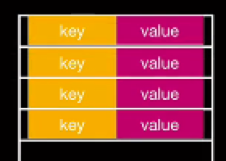

<!-- more -->

## HashMap

HashMap的底层数据结构是数组+链表，

在Jdk1.8之后链表的数据量达到一定程度的时候会转换成红黑树（树结构）。

HashMap是怎么存取的

简单思路：

用key-value组成的容器，也就是用不同的key保存不通的value。但是用这个思路存普通的数组也能实现的。

我们用key-value组成一个对象然后存入数组即可，但是我们想让相同的key可以覆盖，这样一来只用数组就难以实现，当我们想用相同的key存数据的时候我们需要遍历整个数组保证没有相同的key才能存入元素。

查询的时候如果运气差可能要遍历整个数组才能找到想找的key效率很差。

