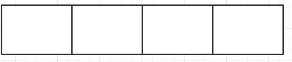
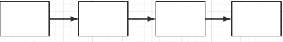
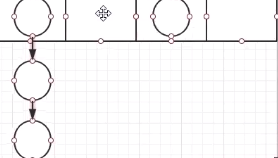
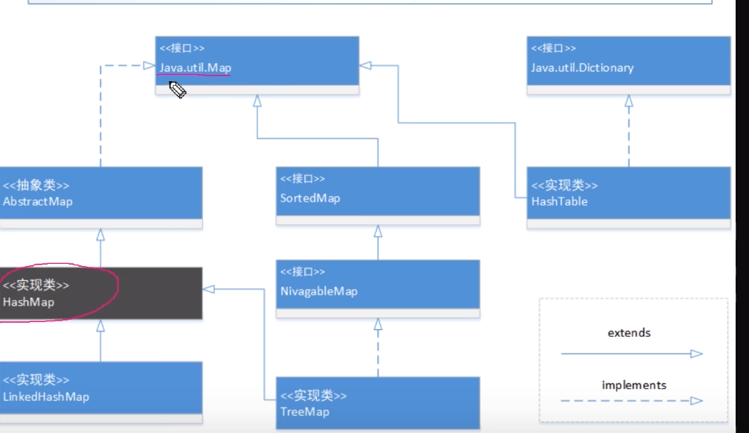
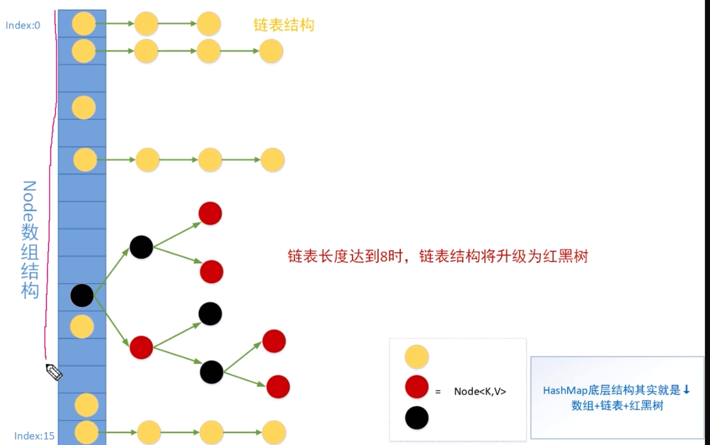
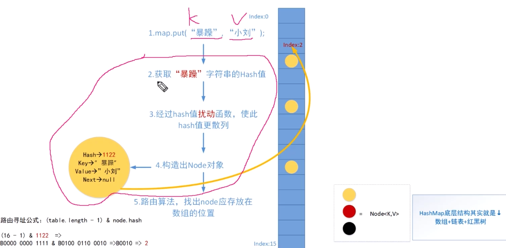

<!-- more -->

## HashMap 

## 第一部分：基础入门

### 1. 数组的优势劣势



数组的内存是连续的，每一块空间是一样大的。

优势：索引速度快，数组都是有index下标的，只要拿到数组的引用，就可以根据index快速访问到指定的位置。

劣势：因为Java中的内存申请完之后大小是固定的，想插入新的数据只能申请一个块更大的内存空间，将旧数组的数据导入新数组后再插入新数据，不灵活且浪费性能


### 2. 链表的优势劣势



链表在内存中不是一段连续的空间，每一块内存都有一块小空间去保留下一块内存的地址。

优势：插入速度快，只要修改内存存储的指向下一个内存的引用就行了。

劣势：索引速度慢，链表不存在index下标，只能从头元素（Head）开始，挨个查存储的指向下一块内存地址的引用。

### 3.整合两者数据结构的优势：散列表



数组里保存的数据是链表，这就是散列表。


### 4.散列表的特点

整合了俩者的优势，既可以利用数组的优势，index快速查找，也可以利用链表的优势快速扩容。

### 5. Hash是什么

Hash ，也成散列，Hash英文本意即为切碎。

基本原理：把**任意长度**的输入通过Hash算法变成**固定长度**的输出。

这个**映射规则**就是对应的Hash算法，而原始数据**映射后的二进制串**就是Hash值。


Hash的特点：

1. 从Hash值不可以**反向推导**出原始数据。
2. 输入数据的**微小变化**会得到完全不同的hash值，相同的数据会得到相同的值。
3. Hash算法的执行效率要**高效**，长的文本也能快速 地计算出Hash值。
4. Hash算法的**冲突概率要小**。


由于Hash的原理是将输入空间的值映射成Hash空间内，而Hash值的空间远小于输入空间。

根据抽屉原理，一定会存在不同的输入背映射成相同输出的情况。


抽屉原理：**十个**苹果放进九个抽屉里，无论怎么放，总有一个抽屉**不少于两个**苹果。


## 第二部分：HashMap原理简介

### 1.HashMap的继承体系



### 2. Node的数据结构分析

HashMap的静态内部类，实现了Map.Entry接口

- hash：存储key 的hash值，key获取hash值后会经过一次扰动再赋值给hash，和直接调用HashCode方法得到的结果不同。
- key，value：就是我们put进来的key-value，我们存的key-value格式的数据都会封装成 Node结构的元素存入散列表。
- next：Hash会碰撞，碰撞后无法存入数组（因为数组中不能存入两个元素），所以只能将数据链起来形成链 表。


```java
  /**
     * Basic hash bin node, used for most entries.  (See below for
     * TreeNode subclass, and in LinkedHashMap for its Entry subclass.)
     */
    static class Node<K,V> implements Map.Entry<K,V> {
        final int hash;
        final K key;
        V value;
        Node<K,V> next;

        Node(int hash, K key, V value, Node<K,V> next) {
            this.hash = hash;
            this.key = key;
            this.value = value;
            this.next = next;
        }

        public final K getKey()        { return key; }
        public final V getValue()      { return value; }
        public final String toString() { return key + "=" + value; }

        public final int hashCode() {
            return Objects.hashCode(key) ^ Objects.hashCode(value);
        }

        public final V setValue(V newValue) {
            V oldValue = value;
            value = newValue;
            return oldValue;
        }

        public final boolean equals(Object o) {
            if (o == this)
                return true;
            if (o instanceof Map.Entry) {
                Map.Entry<?,?> e = (Map.Entry<?,?>)o;
                if (Objects.equals(key, e.getKey()) &&
                    Objects.equals(value, e.getValue()))
                    return true;
            }
            return false;
        }
    }
```

接口 Map.Entry key ：set Value：set+get

```java
    interface Entry<K, V> {
        /**
         * Returns the key corresponding to this entry.
         *
         * @return the key corresponding to this entry
         * @throws IllegalStateException implementations may, but are not
         *         required to, throw this exception if the entry has been
         *         removed from the backing map.
         */
        K getKey();

        /**
         * Returns the value corresponding to this entry.  If the mapping
         * has been removed from the backing map (by the iterator's
         * {@code remove} operation), the results of this call are undefined.
         *
         * @return the value corresponding to this entry
         * @throws IllegalStateException implementations may, but are not
         *         required to, throw this exception if the entry has been
         *         removed from the backing map.
         */
        V getValue();

        /**
         * Replaces the value corresponding to this entry with the specified
         * value (optional operation).  (Writes through to the map.)  The
         * behavior of this call is undefined if the mapping has already been
         * removed from the map (by the iterator's {@code remove} operation).
         *
         * @param value new value to be stored in this entry
         * @return old value corresponding to the entry
         * @throws UnsupportedOperationException if the {@code put} operation
         *         is not supported by the backing map
         * @throws ClassCastException if the class of the specified value
         *         prevents it from being stored in the backing map
         * @throws NullPointerException if the backing map does not permit
         *         null values, and the specified value is null
         * @throws IllegalArgumentException if some property of this value
         *         prevents it from being stored in the backing map
         * @throws IllegalStateException implementations may, but are not
         *         required to, throw this exception if the entry has been
         *         removed from the backing map.
         */
        V setValue(V value);

       //... 还有其它方法先不看
    }

```


### 3. 底层数据结构介绍

它的结构就是数组+链表+红黑树

- 最外层是一个Node数组结构，不指定长度的话默认初始化长度为16。

- 无冲突发生时链表只存储一个数据，发生冲突时数组的同位会形成一个链表。

- 当链表长度超过8，且HashMap中所有元素数量超过64时，链表会升级成红白树。（Jdk1.8之后才会将链表升级为红黑树）




### 4. put数据原理分析 (流程)



1. map.put(“key值”,"value值")

2. key值取得Hash值

3. Hash值经过**扰动**函数，使此Hash值更散列。

4. 构造出Node对象 （Hash，Key，Value，Next）

5. 使用路由算法寻找Node存放在数组的位置路由公式：

   `数组长度 与上 node的hash值`

   table（数组）的长度一定是2的次方数比如 2，16，32，64，

   数组的长度转换成二进制 ,比如:

   16-1 =15 转二进制 => 1111

   32-1 =31 转二进制 => 11111

   (table.length - 1) & node hash

   (16-1) &1122 => 

   B0000 0000 1111 & B0100 00110 0010 => B0010 =>2

   我们使用24位表示法，也只有后门四位是1，

   进行 与 &操作的时候前面8位都变成0了，只有后四位和hash的与 &操作结果生效，转换成10进制为2

   所以存储的位置为index = 2 

### 5.什么是Hash碰撞

第一种，根据寻址运算后算出的结果和之前的结果相同，发生碰撞

接着上步的操作

假如hashtable（数组）的长度不变 ，新的Node转换成的hash值后四位还是0010（当然Hash值也有完全一样的可能）

`B0000 0000 1111` & `B前8位改变，后四位刚巧还是 0010` 

由于前8位是0，与的结果还是0，只有后四位参与了运算，这后四位刚好和上一步的结果一样。

与的结果就仍然是 0010 ,转成10进制还是2，两个Node就会在寻址操作中存入同一个数组元素，这就发生了Hash碰撞。

第二种：

根据抽屉原理，Hash值有可能是相同的。

寻址的结果相同，此时如果数组的元素中已经有数据了，就要把Node中next指向这个新的元素，它就形成一个链表了。

### 6.什么是链化

Hash 碰撞带来一个问题，假如一直发生Hash碰撞，**链表的长度会变得很长**，在通过key 做get的操作之后，经过寻址会找到相同的Node 头位，此时这个数组已经存储了一个很长的链表了，想要找到指定的Node最坏的情况可能要遍历整个链表才能找到和你指定的Key相同的Node**，查询效率就会变得低下**，原本的O(1) 效率在链表过长的情况下可能会退化成O(n)


### 7.为什么引入红黑树

就是为了解决链化链的很长，提出的红黑树。红黑树是一个自平衡的二叉查找树，可以提高查找效率。


### 8. HashMap扩容原理

这是以空间换时间的思想，比如一个长度为16的数组，查询的性能很差退化到O(n)了，扩大数组长度为32，桶位更多，每个数组内存储的链表长度就会减半，查询速度会快一倍。


## 第三部分： 源码

 ### 1.HashMap 核心属性分析

HashMap 重要常量：

```java
// table 默认长度    
static final int DEFAULT_INITIAL_CAPACITY = 1 << 4; // aka 16
// table 最大长度
static final int MAXIMUM_CAPACITY = 1 << 30;
// 缺省负载因子大小 （默认）
static final float DEFAULT_LOAD_FACTOR = 0.75f;
// 树化阈值 ，链表元素超过8 有可能树化
static final int TREEIFY_THRESHOLD = 8;
// 树降级阈值 
static final int UNTREEIFY_THRESHOLD = 6;
// 树化的另一个参数，当Hash表中所有元素个数超过64时，才会允许树化 capacity：容量
static final int MIN_TREEIFY_CAPACITY = 64;
```

HashMap 核心属性

```java
/* Hash 表
*	什么时候初始化
*/
transient Node<K,V>[] table;

// 当前Hash表中的元素个数
transient int size;
// 当前 Hash表 结构修改次数 （插入和修改，如果Key相同去替换不计数）
transient int modCount;
```

#### threshold 英文含义：门槛，起始，开端

扩容阈值，当你的Hash表中元素超过阈值时，触发扩容。

#### loadFactory

即为负载因子，一般使用默认的大小（0.75），用它来计算扩容的阈值。

```java
扩容阈值 = Hash表的数组长度（容量）* 负载因子
threshold = capacity * loadFactor
```

#### size

当前Hash表中的元素个数

#### modCount

当前 Hash表 结构修改次数 （插入和修改，如果Key相同去替换不计数）

 ### 2.  构造方法分析

##### 1. 两参数：

- 入参： 
  - HashTable能存储的元素最大值 initialCapacity，
  - 负载因子的值loadFactor
- 方法体：
  - 校验：
    - HashTable能存储的元素最大值initialCapacity，必须大于 0 ，最大值也就是 MAX_CAPACITY,不能超过，超过久服之为MAX_CAPACITY（1<<30）
    - 负载因子的值 loadFactor必须大于0，我们一般就用默认值0.75
  - 赋值：
    -  给负载因子赋值loadFactor
    -  给扩容阈赋值，扩容阈赋值通过tableSizeFor方法计算而出，返回的值大于等于当前capacity值，且为2的倍数

```java
		public HashMap(int initialCapacity, float loadFactor) {
        //做了一些校验
        //Capacity 必须大于 0 最大值也就是 MAX_CAPACITY,不能超过
        if (initialCapacity < 0)
            throw new IllegalArgumentException("Illegal initial capacity: " +
                                               initialCapacity);
        if (initialCapacity > MAXIMUM_CAPACITY)
            initialCapacity = MAXIMUM_CAPACITY;
        //loadFactor 必须 > 0
        if (loadFactor <= 0 || Float.isNaN(loadFactor))
            throw new IllegalArgumentException("Illegal load factor: " +
                                               loadFactor);
        //给负载因子赋值
        this.loadFactor = loadFactor;
        //扩容阈值 =tableSizeFor的返回值
				//tableSizeFor  返回一个大于等于当前值cap值的一个数字，并且这个数字一定是2的次方数
        this.threshold = tableSizeFor(initialCapacity);
    }
```
```java
      cap = 10
      n = 10 - 1 => 9
      0b1001
      0b1001 | 0b0100 => 0b1101
      0b1101 | 0b0011 => 0b1111
      0b1111 | 0b0000 => 0b1111
      0b1111 => 15 
		static final int tableSizeFor(int cap) {
        //此处不减1 会得到一个比你想要的数字大一倍的数字
        int n = cap - 1;
        n |= n >>> 1;
        n |= n >>> 2;
        n |= n >>> 4;
        n |= n >>> 8;
        n |= n >>> 16;
        return (n < 0) ? 1 : (n >= MAXIMUM_CAPACITY) ? MAXIMUM_CAPACITY : n + 1;
    }
```

##### 2. 一参数：套娃了两参数方法

```java
 public HashMap(int initialCapacity) {
        this(initialCapacity, DEFAULT_LOAD_FACTOR);
}
```
##### 3. 无参数：默认，只给负载因子赋值默认值

```java
 public HashMap() {
        this.loadFactor = DEFAULT_LOAD_FACTOR; // all other fields defaulted
 }
```
##### 4. 传Map作为参数

```java
 public HashMap(Map<? extends K, ? extends V> m) {
        this.loadFactor = DEFAULT_LOAD_FACTOR;
        putMapEntries(m, false);
}
```

 ### 3.  HashMap put 方法分析 => putVal 方法分析（重点）

```java
		// 其实内部调用的是 putVal方法,也是个套娃方法
		// 我们知道Node存储的hash 值，是通过key的hash值经过扰动函数后产生的，这个扰动函数就是调用putVal时调用的 hash（key）
		public V put(K key, V value) {
      			//putVal 之前， key会先调用扰动函数 
        		return putVal(hash(key), key, value, false, true);
		}
		/**
		* 扰动函数： 作用：让key的Hash值的 高16位也参与运算，否则若HashTable的长度很短 （16），
		* 根据路由算法
		*（length - 1）& hash，高位的数无法参与运算（高位都是0，怎么与& 都是0），
		* 所以必须经过扰动让高位参与进来，增加散列性。
		* 
		* 异或：相同则返0，不同返1
		* hash = 0b 0010 0101 1010 1100 0011 1111 0010 1110
		* 0b 0010 0101 1010 1100 0011 1111 0010 1110  :key的Hash值
		* ^ 异或
		*	0b 0000 0000 0000 0000 0010 0101 1010 1100	：key的Hash 右移16位，让高位参与运算	
		*	0b 0010 0101 1010 1100 0001 1010 1000 0010
		*
		*
		*/
 
    static final int hash(Object key) {
        int h;
        return (key == null) ? 0 : (h = key.hashCode()) ^ (h >>> 16);
    }

		// hash，key，value不必说
		//onlyIfAbsent 如果这个key已经有值了，就不要再改变了，我们通常都传false，没有key就插入，有
	 //key就修改value
    final V putVal(int hash, K key, V value, boolean onlyIfAbsent,
                   boolean evict) {
      // tab ：引用当前HashMap的散列表
     	// p： 当前散列表的元素
      // n：表示散列表数组的长度
      // i： 表示路由寻址的结果
        Node<K,V>[] tab; Node<K,V> p; int n, i;
      	
      	// 延迟初始化逻辑，第一次调用putVal时会初始化HashMap中最耗内存的散列表
        if ((tab = table) == null || (n = tab.length) == 0)
            n = (tab = resize()).length;
      
      	//最简单的一种情况，寻址找到的桶位，刚好是null，这时直接将当前k-v => node 扔进去就可以了
        if ((p = tab[i = (n - 1) & hash]) == null)
            tab[i] = newNode(hash, key, value, null);
        else {
          // e： 不为null的话，找到了一个蛋清要插入的key-value一致的key的元素，（临时node）
          // k： 表示临时的一个key
            Node<K,V> e; K k;
          // 表示桶位中的该元素，与你当前插入的元素的key完全一致，表示后续需要替换操作
            if (p.hash == hash &&
                ((k = p.key) == key || (key != null && key.equals(k))))
                e = p;
            else if (p instanceof TreeNode)// 红黑树
                e = ((TreeNode<K,V>)p).putTreeVal(this, tab, hash, key, value);
            else {
              // 条件成立的话，迭代到最后一个元素了，也没找到一个与你要插入的key一致的node，说明需要加入到当前链表的末尾
                for (int binCount = 0; ; ++binCount) {
                    if ((e = p.next) == null) {
                        p.next = newNode(hash, key, value, null);
                      	//条件成立的话，说明当前链表的长度达到树化标准了，需要进行树化
                        if (binCount >= TREEIFY_THRESHOLD - 1) // -1 for 1st
                          	// 树化操作
                            treeifyBin(tab, hash);
                        break;
                    }
                  
                    //条件成立的话，说明找到了相同key的node元素，需要进行替换操作
                    if (e.hash == hash &&
                        ((k = e.key) == key || (key != null && key.equals(k))))
                        break;
                  	//跳出循环后替换
                    p = e;
                }
            }
          //e 不等于null，条件成立说明，找到了一个与你插入元素key完全一致的数据，需要进行替换
            if (e != null) { // existing mapping for key
                V oldValue = e.value;
                if (!onlyIfAbsent || oldValue == null)
                    e.value = value;
                afterNodeAccess(e);
                return oldValue;
            }
        }
      	// 散列表结构背修改的次数（替换Node元素的value不计数）
        ++modCount;
      
      //插入新元素size自增，如果自增后的值大于扩容阈值，则触发扩容。
        if (++size > threshold)
            resize();
        afterNodeInsertion(evict);
        return null;
    }


```


 ### 4. HashMap resize 扩容方法分析（核心）


### 5. HashMap get 方法分析


### 6. HashMap remove 方法分析


### 7. HashMap replace方法分析