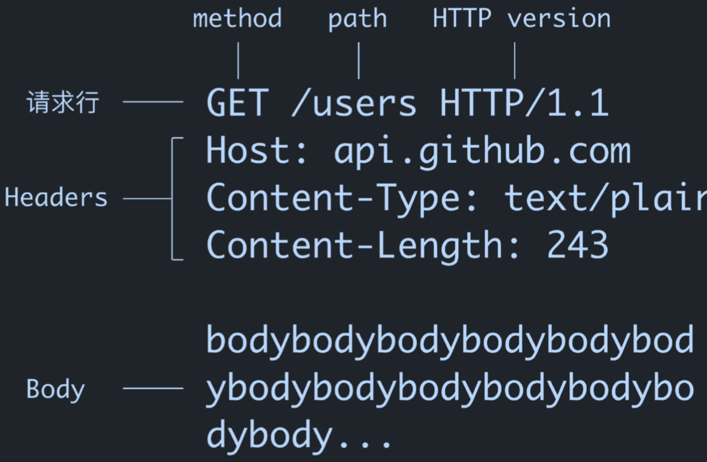
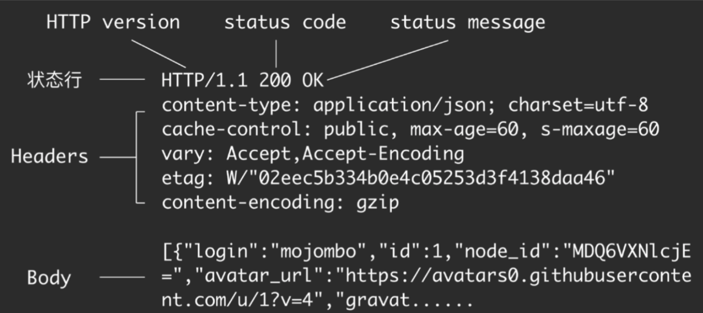
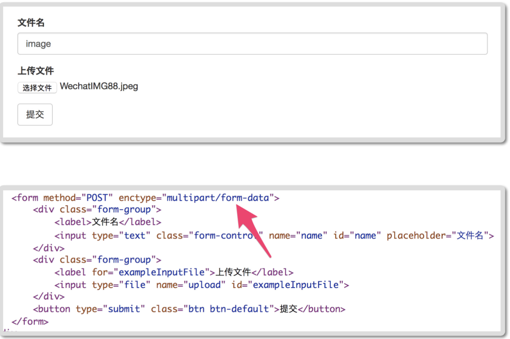

[toc]

#Http 基础 

## Http的原理和工作机制

### Http 定义 Http到底是什么

直观印象：

1. 浏览器输入地址，打开网页
2. Android发送请求，返回对应的内容

HyperText Transfer Protocol 超文本传输协议

- 超文本：在电脑显示的，含有可以指向其他文本的文本

  其实就是Html，http最初就是为了传输Html文档而诞生的。

  HyperText ，所谓的超其实是可扩展的意思。

#### **HTTP** 的工作方式 

##### 浏览器 :

用户输入地址后回⻋或点击链接 -> 浏览器拼装 HTTP 报文并发送请求给服务器 -> 服 务器处理请求后发送响应报文给浏览器 -> 浏览器解析响应报文并使用渲染引擎显示 到界面

##### 手机 **App** :

用户点击或界面自动触发联网需求 -> Android 代码调用拼装 HTTP 报文并发送请求 到服务器 -> 服务器处理请求后发送响应报文给手机 -> Android 代码处理响应报文并 作出相应处理(如储存数据、加工数据、显示数据到界面)

### URL -> HTTP报文

#### **URL** 格式

三部分:协议类型、服务器地址(和端口号)、路径(Path) 协议类型://服务器地址[:端口号]/路径

 http://hencoder.com/users?gender=male

在浏览器输入Url会被转化成请求报文。

#### HTTP报文

请求/响应报文都是由三大部分组成的

第一行（请求/状态行）+Headers+Body

Header和Body两者基本相同

请求报文的第一行（请求行）：method + path + HTTP version组成（Host不是给服务器看的，是给主机的，所以不属于请求行，属于Header）

响应报文的第一行（请求行）：HTTP version +status code+status message组成

####请求报文 Request			

 		

Host不是给服务器看的，是给主机的，所以不属于请求行。

​	  Http 有，0.9 1.1 2.0版本，0.9已经废弃，1.1正被大量使用，正在向2.0迁移

Body，提供给服务器看的具体内容（一般般业务相关），不是必须的。

Body是提供给服务器，让服务器去处理的内容，而用来定位请求的都在Head中。

#### 响应报文



和请求报文（Request）基本一样，

除了第一行，叫状态行。返回了一个状态码和状态信息，是这次请求的简单描述。


## Http的请求方法和状态码

### 请求方法

> 重复执行多次结果还是一样，就是有幂等性

#### Get

- 获取资源，没有Body,具有幂等性
- 是第一个版本（0.9）就存在的方法，在浏览器输入地址调用的就是Get方法，它不对服务器的数据进行操作。

> Body是操作服务器数据用的，里面的的内容是给服务器读的，作为只获取数据不操作数据的Get请求**自然不需要Body**，
>
> 如果想传递参数，就要拼在Requst 请求行等path上 比如 /user/1 传递参数1

```http
GET  /users/1  HTTP/1.1
Host: api.github.com
```

对应 Retrofit 的代码:

```java
@GET("/users/{id}")
Call<User> getUser(@Path("id") String id,
@Query("gender") String gender);
```


> 在Get 增加Body标签，Retrofit甚至会报错。

#### Post 

- 增加和修改资源，有且一定有Body，不具有幂等性

> 既然要新增/修改资源，不增加参数（Body）服务器自然无法修改

```http
POST  /users  HTTP/1.1
Host: api.github.com
Content-Type: application/x-www-form-urlencoded
Content-Length: 13
name=rengwuxian&gender=male
```

对应 Retrofit 的代码:

```java
@FormUrlEncoded
@POST("/users")
Call<User> addUser(@Field("name") String name,
@Field("gender") String gender);
```

#### Put

- 修改（只修改），有Body，具有幂等性

Post的和Put的区别

|           相似           |                             区别                             |
| :----------------------: | :----------------------------------------------------------: |
| 都可以修改数据都符合标准 | Post不具有幂等性，执行多次返回不同的结果，因为它可以增加资源。Put具有幂等性，执行多次返回相同的结果，例如多次修改性别为女，结果用户的性别还是女。 |

```http
PUT  /users/1  HTTP/1.1
Host: api.github.com
Content-Type: application/x-www-form-urlencoded
Content-Length: 13
gender=female
```

对应 Retrofit 的代码:

```java
@FormUrlEncoded
@PUT("/users/{id}")
Call<User> updateGender(@Path("id") String id,
@Field("gender") String gender);
```

#### Delete

- 删除资源，没有Body，有幂等性（删除用户1，重复执行无反应，因为已经删除了，从结果来看是一样的）

```http
Delete /users/1 Http/1.1
Host api.github.com  
```

从path就足以定位用户删除了，无需Body

对应 Retrofit 的代码:

```http
@DELETE("/users/{id}")
Call<User> getUser(@Path("id") String id,
@Query("gender") String gender);
```

#### Head

和Get请求完全相同，返回响应没有Body，其他请求方法的响应都是有Body的。可以快速得到资源信息。

### 状态码 （日常中最重要的2打头 成功，4打头客户端错误。）

-  作用： 对结果作出类型化的描述（如获得成功，内容未找到）

  - 1xx:临时性消息。如:

    - 100 (继续发送)，如果你发送的文件太大，想分段发送。

      Header传`Excpet： 100-continue`，

      服务器响应`HTTP/1.1 100`代表允许你继续发送。 

      发送成功后返回`HTTP/1.1 200`或者201

    - 101(正在切换协议 比如http1.1和http2.0的请求不兼容，

       一般会加一个`Upgrade： h2c`的header试着请求，询问服务器是否支持`Http2.0`，

       服务器响应`HTTP/1.1 101`，则代表服务器支持http2.0

       服务器响应`HTTP/1.1 200`，代表不识别Http2.0的请求) 

  - 2xx:成功。最典型的是 200(OK)、201(创建成功)。

  -  3xx:重定向。如 301(永久移动)、302(暂时移动)、304(内容未改变)。 对于浏览器来说表现一样，

    但是301可以通知搜索引擎，你的网站已迁移，搜索引擎会将权重转移到新域名。

  - 4xx:客户端错误。如 400(客户端请求错误)、401(认证失败)、403(被禁 止)、404(找不到内容)。

  - 5xx:服务器错误。如 500(服务器内部错误)

日常中最重要的2打头 成功，4打头客户端错误。

## HTTP的Header和Body

Body是报文的核心，但是所有的Body都是配合Header使用的，提交用户信息有多个方法，都是由Header定义的。

Header是Http消息的元数据（metadata） 即**数据的数据** 关于数据的数据，数据的属性。

### Host 目标主机名 ，作用是给DNS查询IP地址，交给主机查找子主机。

```http
Get /user/1 HTTP/1.1
Host api.github.com

host不是查询主机地址的，查询主机地址的工作DNS已经做了。 Domain Name System 域名系统，
所以这个Host 是给对方主机看的，英文一个主机可能有多个虚拟主机（子主机），比如阿里云服务器部署了多个主机
hencoder.com
haocoder.com
```

### ContentType/ContentLength:Body的类型和长度

#### ContentLength 

Body的字节长度，因为我门传输的是二进制字符我们不知道主机的解析方式，所以不能🈯️定某个字符作为终止符号（例如用\n做终止符号，可能这次请求的Body数据只是用\n换行），所以我们用二进制字节长度来告诉主机在哪里结束读取/解析Body中的数据。

#### ContentType内容的类型 ，也即是Body的格式

##### text/html : html文本，

用于浏览器页面的响应。浏览器是不知道用户访问的url的资源类型的，可以是html也可以是Json

```http
HTTP/1.1 200 OK
Content-Type: text/html; charset=utf-8
Content-Length: 853
<!DOCTYPE html>
<html>
<head>
  <meta charset="utf-8">
......
```


##### application/x-www-form-urlencoded: 普通表单/纯文字表单，也是最早的表单。

```http
POST  /users  HTTP/1.1
Host: api.github.com
Content-Type: application/x-www-form-urlencoded
Content-Length: 27
name=rengwuxian&gender=male
```

对应 Retrofit 的代码:

```java
@FormUrlEncoded
@POST("/users")
Call<User> addUser(@Field("name") String name,
@Field("gender") String gender)
```


##### multipart/form-data Web ⻚面（表单）含有二进制文件时的提交方式。 常见的传图片方式。

```http
POST  /users  HTTP/1.1
Host: hencoder.com
Content-Type: multipart/form-data; boundary=----
WebKitFormBoundary7MA4YWxkTrZu0gW
Content-Length: 2382
------WebKitFormBoundary7MA4YWxkTrZu0gW
Content-Disposition: form-data; name="name"
rengwuxian
------WebKitFormBoundary7MA4YWxkTrZu0gW
Content-Disposition: form-data; name="avatar";
filename="avatar.jpg"
Content-Type: image/jpeg
JFIFHHvOwX9jximQrWa......
------WebKitFormBoundary7MA4YWxkTrZu0gW--


Boundary 后面的一长串文字是为了分割普通表单文字和二进制数据的，如果和二进制数据恰好重复请求就会失败，概率很小。普通表单不会用boundary来分割内容，因为分割用的字符串长度太长，浪费资源。
```

对应 Retrofit 的代码:

```java
@Multipart
@POST("/users")
Call<User> addUser(@Part("name") RequestBody name,
@Part("avatar") RequestBody avatar);
...
RequestBody namePart =
RequestBody.create(MediaType.parse("text/plain"),
nameStr);
RequestBody avatarPart =
RequestBody.create(MediaType.parse("image/jpeg"),
avatarFile);
api.addUser(namePart, avatarPart)
```

 所以Retrofit 的参数的注解@Query，@Feild 都是因为Content-type不同所以才改变的，它们是不兼容的Body格式。Ps: 用普通表单+base64传图片是错误的。

Retrofit中

```
body 要用field活着Part注解，它们是不兼容的，user?gender = femal  这个@Qurey标签就是管gender字段的
```

##### 单项内容(文本或非文本都可：application/json , image/jpeg , application/zip ...)

用于 Web Api 的响应或者 POST / PUT 的请求 请求中提交 JSON

**application/json , image/jpeg , application/zip ...：**

> 请求中提交Json：

```
POST /users HTTP/1.1
Host: hencoder.com
Content-Type: application/json; charset=utf-8
Content-Length: 38
{"name":"rengwuxian","gender":"male"}
```

```http
POST /users HTTP/1.1
Host: hencoder.com
Content-Type: application/json; charset=utf-8
Content-Length: 38
{"name":"rengwuxian","gender":"male"}
```

Retrofit中

```java
å@POST("/users")
Call<User> addUser(@Body("user") User user);
```

// 需要使用 JSON 相关的 Converter api.addUser(user);

响应中返回 JSON

```http
HTTP/1.1 200 OK
content-type: application/json; charset=utf-8
content-length: 234
[{"login":"mojombo","id":1,"node_id":"MDQ6VXNl
cjE=","avatar_url":"https://avatars0.githubuse
rcontent.com/u/1?v=4","gravat......
```


> 请求中提交二进制内容

```http
POST /user/1/avatar HTTP/1.1
Host: hencoder.com
Content-Type: image/jpeg
Content-Length: 1575
JFIFHH9......
```

对应 Retrofit 的代码:

```java
@POST("users/{id}/avatar")
Call<User> updateAvatar(@Path("id") String id, @Body
RequestBody avatar);
```

...

```java
RequestBody avatarBody =
RequestBody.create(MediaType.parse("image/jpeg"),
avatarFile);
api.updateAvatar(id, avatarBody)
```

相应中返回二进制内容

```http
HTTP/1.1 200 OK
content-type: image/jpeg
content-length: 1575
JFIFHH9......
```

### Transfer: chunked (分块传输编码 Chunked Transfer Encoding)

用于当响应发起时，内容⻓度还没能确定的情况下。和 Content-Length 不同时使 用。用途是尽早给出响应，减少用户等待。

格式:

```http
HTTP/1.1 200 OK
Content-Type: text/html
Transfer-Encoding: chunked
4 (当前数据块的长度)
Chun
9
ked Trans
12
fer Encoding
0
```

### Location

指定重定向的目标 URL

### User-Agent

用户代理，即是谁实际发送请求、接受响应的，例如手机浏览器、某款手机 App。

### Range / Accept-Range

按范围取数据

`Accept-Range: bytes `响应报文中出现，表示服务器支持按字节来取范围数据

`Range: bytes=<start>-<end> `请求报文中出现，表示要取哪段数据

`Content-Range:<start>-<end>/total` 响应报文中出现，表示发送的是哪段 数据

作用:断点续传、多线程下载。

### 其他 Headers

- Accept: 客户端能接受的数据类型。如 text/html 
- Accept-Charset: 客户端接受的字符集。如 utf-8
- Accept-Encoding: 客户端接受的压缩编码类型。如 gzip 
- Content-Encoding:压缩类型。如 gzip

### Cache

作用:在客户端或中间网络节点缓存数据，降低从服务器取数据的频率，以提高网络性能。

Cache和Buffer的区别：

Cache：用过了，以后还会用，先存着。

Buffer：针对工作流，下游稍后用，上游先多生产一些。

## REST

REST 的定义众说纷纭，没有统一答案。 扔物线的观点:REST HTTP 即正确使用 HTTP。包括:

- 使用资源的格式来定义 URL
- 规范地使用 method 来定义网络请求操作 
- 规范地使用 status code 来表示响应状态 
- 其他符合 HTTP 规范的设计准则