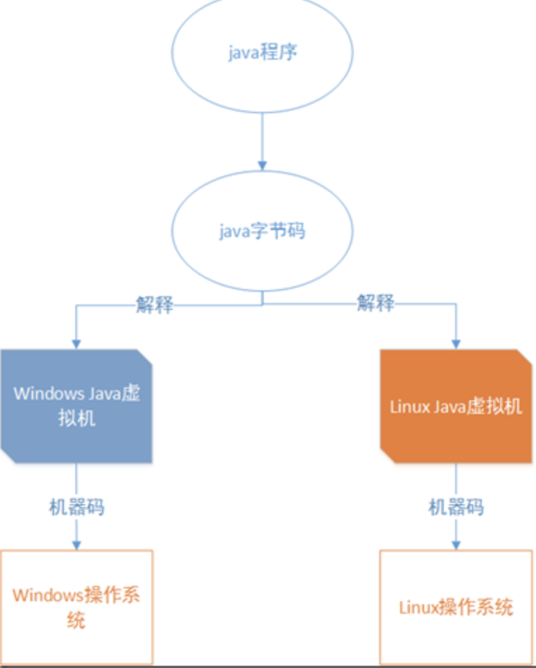
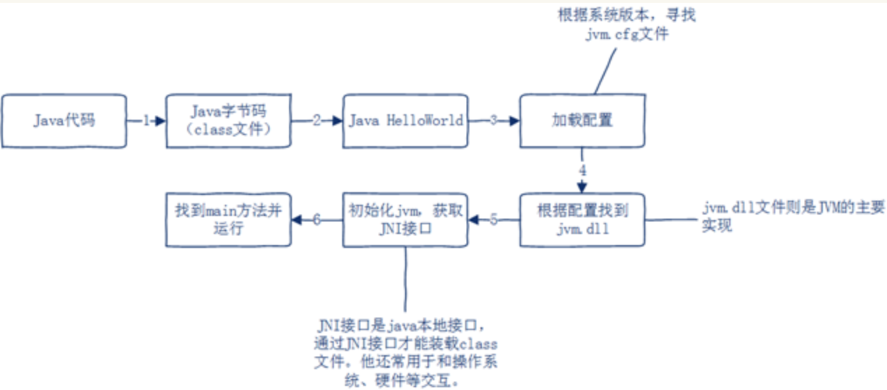
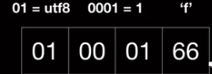
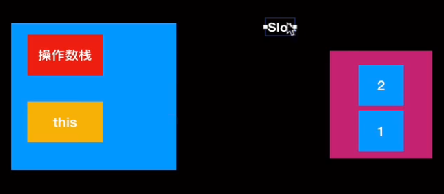
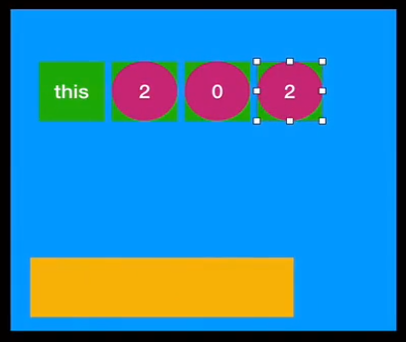
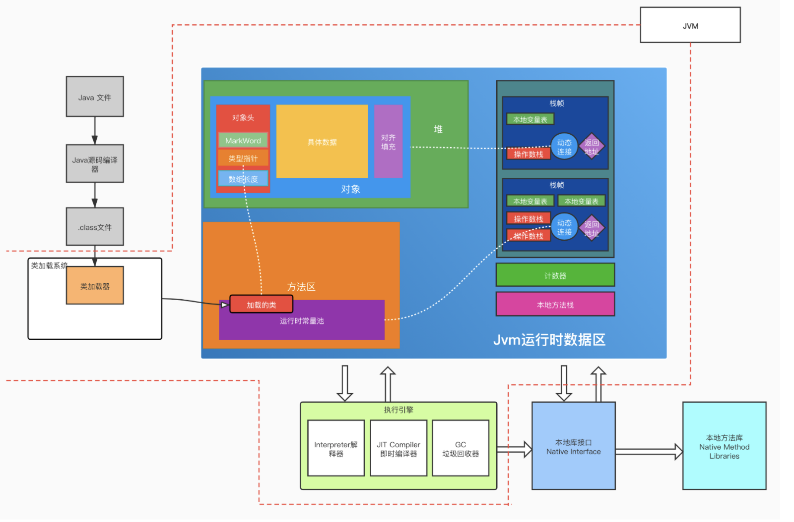
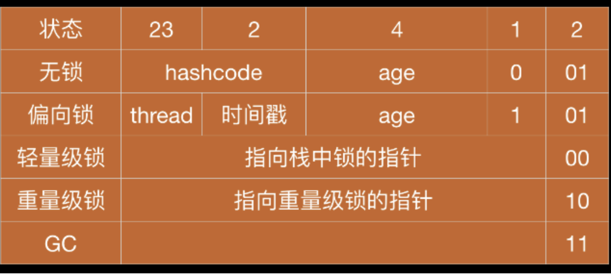
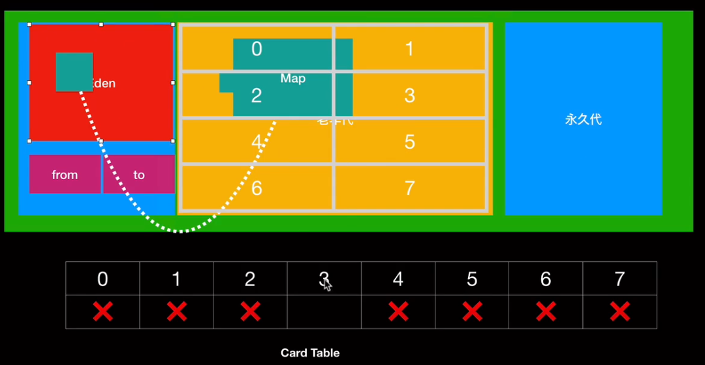

# Jvm原理解析


## 基本原理

 Java程序经过一次编译之后，将java代码编译为字节码也就是class文件，然后在不同的操作系统上依靠不同的Java虚拟机进行解释，最后再转换为不同平台的机器码。

<!-- more -->



程序从编译到运行经过哪些步骤：

`public class HelloWorld { public static void main(String[] args) { System.out.print("Hello world"); } }`



通过jvm.cfg文件找到对应的jvm.dll，jvm.dll则是java虚拟机的主要实现。接下来会初始化JVM,并且获取JNI接口.

JNI接口:Java被编译成了class文件，JVM通过JNI接口从硬盘上找到这个文件并装载到JVM里呢（它还常用于java与操作系统、硬件交互），找到class文件后并装载进JVM，然后找到main方法，最后执行。

## 字节码

### 字节码结构

官方文档：https://docs.oracle.com/javase/specs/jvms/se8/html/jvms-4.html

如下所示：字节码文件不使用分隔符

Jvm.Java

```java
package com.hencoder.customviewdrawing;

/**
 * Created by amazingZZ on 8/17/21
 */
class Jvm {
    public static void main(String[] args) {
        System.out.println("Hello");
    }
}
```

对Java文件执行Javac获得class文件

使用 hexdump 命令可以用来查看我们的 16 进制字节码。

```shell
$ javac Jvm.java 
$ java Jvm.class 
```

Jvm.class对应的字节码：

```text
000000 ca fe ba be 00 00 00 34 00 1d 0a 00 06 00 0f 09
0000010 00 10 00 11 08 00 12 0a 00 13 00 14 07 00 15 07
0000020 00 16 01 00 06 3c 69 6e 69 74 3e 01 00 03 28 29
0000030 56 01 00 04 43 6f 64 65 01 00 0f 4c 69 6e 65 4e
0000040 75 6d 62 65 72 54 61 62 6c 65 01 00 04 6d 61 69
0000050 6e 01 00 16 28 5b 4c 6a 61 76 61 2f 6c 61 6e 67
0000060 2f 53 74 72 69 6e 67 3b 29 56 01 00 0a 53 6f 75
0000070 72 63 65 46 69 6c 65 01 00 08 4a 76 6d 2e 6a 61
0000080 76 61 0c 00 07 00 08 07 00 17 0c 00 18 00 19 01
0000090 00 05 48 65 6c 6c 6f 07 00 1a 0c 00 1b 00 1c 01
00000a0 00 22 63 6f 6d 2f 68 65 6e 63 6f 64 65 72 2f 63
00000b0 75 73 74 6f 6d 76 69 65 77 64 72 61 77 69 6e 67
00000c0 2f 4a 76 6d 01 00 10 6a 61 76 61 2f 6c 61 6e 67
00000d0 2f 4f 62 6a 65 63 74 01 00 10 6a 61 76 61 2f 6c
00000e0 61 6e 67 2f 53 79 73 74 65 6d 01 00 03 6f 75 74
00000f0 01 00 15 4c 6a 61 76 61 2f 69 6f 2f 50 72 69 6e
0000100 74 53 74 72 65 61 6d 3b 01 00 13 6a 61 76 61 2f
0000110 69 6f 2f 50 72 69 6e 74 53 74 72 65 61 6d 01 00
0000120 07 70 72 69 6e 74 6c 6e 01 00 15 28 4c 6a 61 76
0000130 61 2f 6c 61 6e 67 2f 53 74 72 69 6e 67 3b 29 56
0000140 00 20 00 05 00 06 00 00 00 00 00 02 00 00 00 07
0000150 00 08 00 01 00 09 00 00 00 1d 00 01 00 01 00 00
0000160 00 05 2a b7 00 01 b1 00 00 00 01 00 0a 00 00 00
0000170 06 00 01 00 00 00 06 00 09 00 0b 00 0c 00 01 00
0000180 09 00 00 00 25 00 02 00 01 00 00 00 09 b2 00 02
0000190 12 03 b6 00 04 b1 00 00 00 01 00 0a 00 00 00 0a
00001a0 00 02 00 00 00 08 00 08 00 09 00 01 00 0d 00 00
00001b0 00 02 00 0e                                    
00001b4
```

```java
ClassFile {
    u4             magic;
    u2             minor_version;
    u2             major_version;
    u2             constant_pool_count;
    cp_info        constant_pool[constant_pool_count-1];
    u2             access_flags;
    u2             this_class;
    u2             super_class;
    u2             interfaces_count;
    u2             interfaces[interfaces_count];
    u2             fields_count;
    field_info     fields[fields_count];
    u2             methods_count;
    method_info    methods[methods_count];
    u2             attributes_count;
    attribute_info attributes[attributes_count];
}
```

>  u 代表字节数

#### magic 魔术码:cafe babe 

魔术码magic，许多语言的字节码都有五花八门的魔术码,u4

#### 版本号：

  - minor_version: 小版本号 ,u2
  - major_version：主版本号, u2

  shell执行`echo $((0x34))得到版本号为`52

#### 常量池：

- Constant_pool_count: 常量数量 001d，shell执行`echo $((0x1d))得到29，u2
- Constant_pool[Constant_pool_count-1]:  常量池对象，常量数量-1，因为创造者将第0位空出来了，若指向0无法指向常量池中任何一个对象 （本文件中常量池对象为29-1=28）,长度不确定

常量池支持的数据类型占空间是不同的:

| Constant Type      | Value |
| ------------------ | ----- |
| `CONSTANT_Class`   | 7     |
| `CONSTANT_Utf8`    | 1     |
| `CONSTANT_Integer` | 3     |
| `CONSTANT_Double`  | 6     |
...

数据未必是两部分比如 utf-8 ,它的数据就是三部分组成 ：

1. tag=01 
2. length：数据长度
3. 数据内容：具体的字符，比如'f'

```c++
CONSTANT_Utf8_info {
    u1 tag;  //代表类型utf-8，
    u2 length; //数据长度
    u1 bytes[length]; //数据内容：具体的字符，比如'f'
}

CONSTANT_Integer_info {
    u1 tag; //数据类型
    u4 bytes; //具体数据
}
_Class_info代表类，接口的引用，
CONSTANT_Class_info {
    u1 tag; //代表classinfo类型
    u2 name_index; //指向常量的位置，一定不为0（因为0是空的被预留了）
}

```

eg：utf8类型：



#### 访问标志：

access_flags,2u

| Flag Name        | Value  | Interpretation                                               |
| ---------------- | ------ | ------------------------------------------------------------ |
| `ACC_PUBLIC`     | 0x0001 | Declared `public`; may be accessed from 	outside its package. |
| `ACC_FINAL`      | 0x0010 | Declared `final`; no subclasses allowed.                     |
| `ACC_SUPER`      | 0x0020 | 1.1之后才有的，在较早的版本中子类继承父类，孙类继承	子类，孙类的重写方法会越级继承父类的方法，这个访问标志就是为了解决这一个问题 |
| `ACC_INTERFACE`  | 0x0200 | Is an interface, not a class.                                |
| `ACC_ABSTRACT`   | 0x0400 | Declared `abstract`; must not be instantiated.               |
| `ACC_SYNTHETIC`  | 0x1000 | 代表是由编译器生成的而不是源码生成的                         |
| `ACC_ANNOTATION` | 0x2000 | Declared as an annotation type.                              |
| `ACC_ENUM`       | 0x4000 | Declared as an `enum` type.                                  |

#### 类名：

当前类名： this_class，u2 
父类类名： super_class， u2;

#### 接口：

接口可以实现多个，即可以实现一组接口

- 接口数量： interfaces_count,u2
- interfaces[interfaces_count]：指向常量池中的引用（对应接口的接口名），u2

####  属性

​    u2             fields_count;
​    field_info     fields[fields_count];

#### 方法

- methods_count;     u2   
- method_info    methods[methods_count];     u2    

#### 附加属性

文件名之类的

- attributes_count，    u2            
- attribute_info attributes[attributes_count] ;u2

###  反编译字节码

我们不需记住所有字节码的位置，执行`javap JVM.java`即可以反编译class，可以简单显示类的结构

```shell
$ javap Jvm.class
Compiled from "Jvm.java"
class com.hencoder.customviewdrawing.Jvm {
  // 编译器自动添加的构造方法
  com.hencoder.customviewdrawing.Jvm();
  public static void main(java.lang.String[]);
}
```

执行`javap JVM.java -c` 还可以看到具体每一步操作

```shell
$ javap -c Jvm.class
Compiled from "Jvm.java"
class com.hencoder.customviewdrawing.Jvm {
  com.hencoder.customviewdrawing.Jvm();
    Code:
       0: aload_0
       1: invokespecial #1                  // Method java/lang/Object."<init>":()V
       4: return

  public static void main(java.lang.String[]);
    Code:
       0: getstatic     #2                  // Field java/lang/System.out:Ljava/io/PrintStream;
       3: ldc           #3                  // String Hello
       5: invokevirtual #4                  // Method java/io/PrintStream.println:(Ljava/lang/String;)V
       8: return
}

```

执行`javap  -v JVM.class `会显示更多的信息（verbose啰嗦），这些信息都是从字节码得到的

```shell
Classfile ./JVM.class
  Last modified 2021-8-17; size 436 bytes
  MD5 checksum b35d35363b5da415dcdd65f77d01f777
  Compiled from "Jvm.java"
class com.hencoder.customviewdrawing.Jvm
  #版本号 
  minor version: 0
  major version: 52
  # access flag 访问标志
  flags: ACC_SUPER
 # 常量池   001d 29-1因为0是没有值的
Constant pool:
   #1 = Methodref          #6.#15         // java/lang/Object."<init>":()V
   #2 = Fieldref           #16.#17        // java/lang/System.out:Ljava/io/PrintStream;
   #3 = String             #18            // Hello
   #4 = Methodref          #19.#20        // java/io/PrintStream.println:(Ljava/lang/String;)V
   #5 = Class              #21            // com/hencoder/customviewdrawing/Jvm
   #6 = Class              #22            // java/lang/Object
   #7 = Utf8               <init>
   #8 = Utf8               ()V
   #9 = Utf8               Code
  #10 = Utf8               LineNumberTable
  #11 = Utf8               main
  #12 = Utf8               ([Ljava/lang/String;)V
  #13 = Utf8               SourceFile
  #14 = Utf8               Jvm.java
  #15 = NameAndType        #7:#8          // "<init>":()V
  #16 = Class              #23            // java/lang/System
  #17 = NameAndType        #24:#25        // out:Ljava/io/PrintStream;
  #18 = Utf8               Hello
  #19 = Class              #26            // java/io/PrintStream
  #20 = NameAndType        #27:#28        // println:(Ljava/lang/String;)V
  #21 = Utf8               com/hencoder/customviewdrawing/Jvm
  #22 = Utf8               java/lang/Object
  #23 = Utf8               java/lang/System
  #24 = Utf8               out
  #25 = Utf8               Ljava/io/PrintStream;
  #26 = Utf8               java/io/PrintStream
  #27 = Utf8               println
  #28 = Utf8               (Ljava/lang/String;)V  
{
# 方法信息
# 自动生成的空参构造
  com.hencoder.customviewdrawing.Jvm();
    descriptor: ()V # 没有返回参数的 V表示 viod
    flags: # 可见修饰符
    Code: #方法的核心
    # slot 空间大小单位，英文意思为插槽
    # 数量不等同于空间大小，因为一些参数需要超过自身数量的空间（比如double需要2slot位）
    
    # stack 操作数栈，表示给多大的空间给这个方法操作，大小为1 slot
    # locals 本地变量表 大小为1 slot  操作数算出的数据存储在本地变量表的空间中 
    # args_size 传入参数数量，只要不是静态方法都会传入this作为默认参数，所以args_size = 1 
    # args_size 在字节码中是没有记录的，是通过反编译推断出来的
      stack=1, locals=1, args_size=1
     
         0: aload_0
         1: invokespecial #1                  // Method java/lang/Object."<init>":()V
         4: return
      LineNumberTable:
        line 6: 0

  public static void main(java.lang.String[]);
    descriptor: ([Ljava/lang/String;)V
    flags: ACC_PUBLIC, ACC_STATIC
    Code:
    # stack 操作栈2 slot，本地变量表1 slot，参数数量：默认1
      stack=2, locals=1, args_size=1
         # 方法的具体调用过程；
         # 实际在字节码中  具体操作码只有一个字节大小，比如 getstatic=0xb2
         0: getstatic     #2  // Field java/lang/System.out:Ljava/io/PrintStream;
         #  getstatic=0xb2 获取指定类的静态域, 并将其压入栈顶
         # #2对应是常量池的中的#2，其实是字节码中的某个字节，它的静态域就是
         # Field java/lang/System.out:Ljava/io/PrintStream；
         # L 代表一个东西的引用，
         # 其实就是获取成员变量（静态变量）的引用，压入程序的栈顶
         
         3: ldc           #3                  // String Hello
         # ldc = 0x12 将int,float或String型常量值从常量池中推送至栈顶,
         # #3对应 常量池中的 #3 ,数据为   String Hello

         5: invokevirtual #4   // Method java/io/PrintStream.println:(Ljava/lang/String;)V
         # invokevirtua = 0xb6 调用实例方法，方法为实例方法非静态，也就是需要传this参数
         # this 就是 PrintStream.println
         # String Hello 的引用Ljava/lang/String;和this：PrintStream.println将会出操作栈，传递过去

         8: return
         # return = 0xb1 从当前方法返回void
         
         # 具体操作码前面的 0，1，2不是行号，是操作码在字节码中的偏移量，可以用于调试判断

      LineNumberTable:
        line 8: 0
        line 9: 8
}
SourceFile: "Jvm.java"

```

操作数栈，用来执行计算



#### 总结：

从Code信息中可以看到

- 字节码上已经明确了**操作数栈的大小**,**本地变量表的大小**和传入**参数数量**	

  >  操作数栈和本地变量表的大小的单位为 Slot , double 类型和 long 类型会 占用 2 个 Slot
  >
  
- 每个**非静态方法**的**传入参数都会有一个 this**,存在本地变量表中的0号位置

- 在字节码中每个指令都用一个字节来表示

   [JVM 虚拟机字节码指令表](https://www.cnblogs.com/GarfieldEr007/p/9943528.html)

### 通过字节码我们能得到什么

Java文件编程class字节文件得到的信息反而更多了，这是因为语法糖的存在隐藏了很多细节

#### 从字节码看 Integer 的装箱拆箱

```java
class Jvm {
    Integer integer = 1;
    public static void main(String[] args) {
       ...
```

反编译可以看到是：它其实是在构造函数中调用的静态函数赋值

```shell
  com.hencoder.customviewdrawing.Jvm();
    descriptor: ()V
    flags:
    Code:
      stack=2, locals=1, args_size=1
        	...
      
         6: invokestatic  #2                  // Method java/lang/Integer.valueOf:(I)Ljava/lang/Integer;
         9: putfield      #3                  // Field integer:Ljava/lang/Integer;
    ...

```

#### 从字节码看 ++ 操作

```java
    public  void inc(){
        int i = 1;
        int a = ++i;
        int b = i++;
    }
```


```shell
Code:
    # 操作数栈 1，本地变量表4:this（默认），i，a,b, 参数数量 默认1:this
      stack=1, locals=4, args_size=1
     		 # i = 1 的过程
         0: iconst_1 #将int型1推送至栈顶 
         1: istore_1 #将栈顶int型数值存入第二个本地变量  
         # a = i++  result:a =2  ，先++,先将数据推入操作数栈，最后存入本地变量
         2: iinc          1, 1
         5: iload_1
         6: istore_2
         # b= ++i b=2 先将数据推入操作数栈， 在++，再存入本地变量
         7: iload_1
         8: iinc          1, 1
        11: istore_3
        12: return
```



#### 内部类

内部类会持有外部类的原因是在内部类中用一个成员变量记录了外部类对象 

在 Kotlin 中，如果在内部类中没有使用到外部类，那么不会持有外部类

```java
public class Jvm  extends Object{
    class Inner {}

    void foo(){
        new Inner();
    }
}
```

使用$查看内部类`javap -v Jvm\$Inner.class `

Java:Inner

```shell
final com.hencoder.customviewdrawing.Jvm this$0; # 外部Jvm类型的成员变量 this$0
    descriptor: Lcom/hencoder/customviewdrawing/Jvm;
    flags: ACC_FINAL, ACC_SYNTHETIC
# 构造函数传入外部Jvm类
  com.hencoder.customviewdrawing.Jvm$Inner(com.hencoder.customviewdrawing.Jvm);
    descriptor: (Lcom/hencoder/customviewdrawing/Jvm;)V
    flags:
    Code:
      stack=2, locals=2, args_size=2
         0: aload_0
         1: aload_1
         # 存入了外部的Jvm变量	
         2: putfield      #1                  // Field this$0:Lcom/hencoder/customviewdrawing/Jvm;
         5: aload_0
         6: invokespecial #2                  // Method java/lang/Object."<init>":()V
         9: return
      LineNumberTable:
        line 8: 0
```

Outter.kt

```kotlin
class Outter {
    var an = object : Any() {
        override fun hashCode(): Int {
         // 不会持有外部引用
         //return super.hashCode()
         // 会持有引用
         return this@Outter.hashCode()
        }
    }
}
```


#### 泛型

Java 的泛型擦除并不是将所有泛型信息全部都擦除了，会将类上和方法上声明的泛型信息保存在字节码中的 Signature 属性中，这也是反射能够获取泛型的原因。但是在方法中的泛型信息是完全擦除了

```java
public class Jvm {
    public void print(List<String> list) {}
    public void print(List<Object> list) {}
}
```

这个类执行Javac是会报错的，因为类型信息被擦除了

```shell
Jvm.java:8: 错误: 名称冲突: print(List<Object>)和print(List<String>)具有相同疑符
    public void print(List<Object> list) {}
                ^
1 个错误
```

反编译.class 文件Signature 属性中保留了泛型信息，所以反射能回的泛型，

不过方法中的泛型信息是完全删除了

```
ublic void print(java.util.List<java.lang.String>);
    descriptor: (Ljava/util/List;)V
    flags: ACC_PUBLIC
    Code:
      stack=0, locals=2, args_size=2
         0: return
      LineNumberTable:
        line 7: 0
    Signature: #11                          // (Ljava/util/List<Ljava/lang/String;>;)V

```


#### synchronized关键字

 synchronized 会在方法调用前后通过 monitor 来进入和退出锁

```java
public class Jvm  {
    Object  lock = new Object();
    void monitor() {
        synchronized(lock) {
            fun();
        }
     // 这块也是语法糖，实际上应该是
      try{
        enter(lock)
        fun()
        exit(lock)
      }finally {
        exit(lock)
      }
    }
    void fun() {

    }

    synchronized void fun1() {

    }
    synchronized static void fun2() {

    }
}

```

反编译结果：

```shell
void monitor();
    descriptor: ()V
    flags:
    Code:
      stack=2, locals=3, args_size=1
         0: aload_0
         1: getfield      #3                  // Field lock:Ljava/lang/Object;
         4: dup
         5: astore_1
         6: monitorenter # 进入监视
         7: aload_0
         8: invokevirtual #4                  // Method fun:()V 执行fun方法
        11: aload_1
        12: monitorexit # 退出监视
        13: goto          21
        16: astore_2
        17: aload_1
        18: monitorexit # 防止fun方法内部发生异常时无法退出
        19: aload_2
        20: athrow
        21: return
   # 普通/静态方法 也可以锁，原理和锁代码块是一样的，只不过细节被JVM隐藏了     
   synchronized void fun1();
    descriptor: ()V
    flags: ACC_SYNCHRONIZED
    Code:
      stack=0, locals=1, args_size=1
         0: return
      LineNumberTable:
        line 19: 0

  static synchronized void fun2();
    descriptor: ()V
    flags: ACC_STATIC, ACC_SYNCHRONIZED
    Code:
      stack=0, locals=0, args_size=0
         0: return
      LineNumberTable:
        line 22: 0      
```

## JVM运行时数据区



JVM内存划分，是数据在内存上的划分，字节码的具体执行和它无关。

class文件被jvm装载以后，经过jvm的内存空间调配，最终是由执行引擎完成class文件的执行。当然这个过程还有其他角色模块的协助，这些模块协同配合才能让一个java程序成功的运行。

### 类加载器

类加载器不属于运行时数据区，是外部的

class文件通过类加载器加载到方法区中（一部分会进入运行时常量池）

### 被所有线程共享的

- 堆 ： 对象存储在这里，GC回收也在此发生（占空间最大）,空间不足会抛出OOM
- 方法区：存放类信息、常量、静态变量
- 运行时常量池： 存在于方法区之中，我们可以直接在字节码中看到

### 每个线程私有的

- 虚拟机栈（Java栈）：它的生命周期与线程相同，一个线程对应一个java栈
- 程序计数器（PC计数器）：字节码解释器工作时就是通过改变这个计数器的值来选取下一条需要执行的字节码指令，也就是反编译字节码中记录的操作码在字节码中的偏移量e g:`19: aload_2`
- 本地方法栈：类似Java栈，不过它是表示执行本地方法的，存放的方法调用本地方法接口，最终调用本地方法库，实现与操作系统、硬件交互的目的

#### 虚拟机栈（Java栈）中的栈帧

每执行一个方法就会往栈中压入一个元素，这个元素叫“栈帧”，

栈帧包括：

- 操作数栈 

- 本地变量表 

- 动态连接：指向运行时常量池的引用

  - 常量池中有很多UTF8符号引用，运行时需要转换成直接引用

    Eg:` \#29 = Utf8        Ljava/io/PrintStream;`

- 返回地址：较早版本中用报错后用于返回，现在已经没用了
  

### 从反编译看字节码运行时数据区

```java
public class Jvm  {
    public static void main(String[] args) {
        Jvm jvm = new Jvm();
        jvm.greeting();
    }  

    public void greeting() {
        System.out.print("Hello Jvm");
    }
}
```
#### main静态方法执行前准备：

1. 启动虚拟机：堆，方法区，运行时常量池都被创建
2. 创建线程支持:虚拟机栈，计数器，本地方法栈也会被创建
3. 需要JVM类加载出来，就需要通过类加载器加载（类加载器不属于运行时数据区，是外部的，将class文件加载到方法区`一部分进入运行时常量池`）


#### main方法的执行

创建一个栈帧压入虚拟机栈

栈帧包括

- 操作数栈 大小stack = 2 slot

- 本地变量表 大小locals =2 slot

- 动态连接：指向运行时常量池的引用

  - 常量池中有很多UTF8符号引用，运行时需要转换成直接引用

    Eg:` \#29 = Utf8        Ljava/io/PrintStream;`
  
- 返回地址

接下来就可以执行指令：

`javap -v Jvm.class`

```shell
public com.hencoder.customviewdrawing.Jvm();
    descriptor: ()V
    flags: ACC_PUBLIC
    Code:
    # 在Main中会被初始化，并且创建栈帧压入虚拟机栈
      stack=1, locals=1, args_size=1
         0: aload_0
         # 调用初始化构造
         1: invokespecial #1                  // Method java/lang/Object."<init>":()V
         # 出栈
         4: return
      LineNumberTable:
        line 6: 0

    public static void main(java.lang.String[]);
    descriptor: ([Ljava/lang/String;)V
    flags: ACC_PUBLIC, ACC_STATIC
    Code:
    # 操作数栈 大小2slot ，本地变量表大小2slot，参数数量（默认this）
      stack=2, locals=2, args_size=1
      #==================== 创建对象并赋值到局部对象 ====================
      	 # 对应 Jvm jvm = new Jvm();
      	 
         # 创建对象，将引用压入栈帧中
         # 执行后会在堆中创建一个对象，随后将对象的引用压入操作数栈
         # 执行引擎（系统）会将计数器的值改成 3（字节码偏移量）
         0: new           #2                  // class com/hencoder/customviewdrawing/Jvm
         
         # 赋值栈顶数值并将复制的值压入栈顶
         3: dup
         
         # 类的初始化：调用超类构建方法，实例初始化方法，私有方法
         # 这个方法会消耗掉一个类的引用，dup复制的引用就会被消耗掉（出栈）
         # 因为调用了构造方法，会创造一个新的栈帧压入虚拟机栈
         # JVM类调用初始化构造后调用了return 出栈，对象初始化完成
         4: invokespecial #3                  // Method "<init>":()V
        
        # 将初始化变量传递到本地变量表1的位置
         7: astore_1         
      #==================== 创建对象并赋值到局部对象 ====================
         # 赋值完成后，把对象的引用加载进操作数栈
         8: aload_1
         # 调用greeting方法，又会创建出栈帧
         # 会调用pirnt方法形成新的栈帧
         # print 执行完毕后栈帧出栈
         9: invokevirtual #4                  // Method greeting:()V
         # main方法执行完毕，栈帧出栈
        12: return
      LineNumberTable:
        line 8: 0
        line 9: 8
        line 10: 12

  public void greeting();
    descriptor: ()V
    flags: ACC_PUBLIC
    Code:
      stack=2, locals=1, args_size=1
         # 获得System.out 静态成员变量 
         0: getstatic     #5                  // Field java/lang/System.out:Ljava/io/PrintStream;
         # 调用print方法
         3: ldc           #6                  // String Hello Jvm
         5: invokevirtual #7                  // Method java/io/PrintStream.print:(Ljava/lang/String;)V
         8: return
      LineNumberTable:
        line 13: 0
        line 14: 8
```

### 对象在堆中的结构
分三部分组成


- 对象头 ：

     - MarkWord
     - 类型指针：指向方法区中类的信息 
     - 数组⻓度(对象是数组时才有这部分，其他类型只有两部分)
- 具体数据：一般占的空间最大
- 对⻬填充 ：保证整个对象都是8个字节的倍数

#### MarkWord结构

MarkWord 的结构(32位虚拟机)

32位虚拟机中markword的大小是32位 0,1 数据类似这样

`1011100100101100101101011 0101 1 01`

- 最后两位是01 ，那么分两种情况

  1. 倒数第三位是0：说明是无锁状态，再倒数4位用来记录gc年龄，前面25位作为对象的HashCode

     `hashcode:011100100101100101101011 gc年龄0101 无锁0 01`

  2. 倒数第三位是1: 偏向锁状态

     `记录进入哪个线程:0111001001011001011010 偏向锁的时间戳11 gc年龄0101 偏向锁1 01`

     >  什么是偏向锁：
     >
     > 大多时候一段可能被多线程访问的所以需要同步的代码，大部分情况下都是同一个线程在操作，所以在虚拟机层面上就做了这样一个优化：
     >
     > 直接在锁上面添加了目标线程的id，下一次在遇到进入锁的操作，进入的线程和记录的线程是相同的那么你跟不不必竞争这个锁直接就获取到这个锁了。

  3. 最后两位00：说明处于轻量级锁状态前面30位指向栈中锁的指针

     轻量级锁：如果程序很快就执行完，像重量级锁一样阻塞线程过于耗费资源，就有了我们轻量级锁，轻量级锁在获取锁失败的时候并不会让线程处于阻塞状态而是一直活跃，通过自旋再次尝试获得锁，若另一个线程执行完把锁释放了，我们就可以直接执行了。所以轻量级锁也叫自旋锁。自旋次数也是有限制的，达到一定次数的时候锁就会膨胀为重量级锁

  4. 最后两位10：说明是重量级锁的状态，前面30位都是重量锁的指针，每次线程进入的时候都需要竞争来获取锁。在线程竞争失败的时候，会让线程进入阻塞状态线程恢复的时候再次竞争获得锁

  5. 最后两位11: 代表对象被gc标记，对象可以回收了，即将回收的对象不能作为锁对象

#### 锁相关

**锁的升级（膨胀）：**

锁只能升级不能降级，无锁 -> 偏向锁 -> 轻量级锁 -> 重量级锁

没有被偏向锁标记id的线程调用偏向锁，会处于等待状态，偏向锁升级轻量锁

偏向锁自旋次数超过限制，升级为重量级锁

无锁状态中的 hashcode 是懒加载的，一个对象一旦计算过 hashcode 就被不会成为偏向锁，而是直接升级成重量锁。 而一个偏向锁状态的对象，一旦计算过 hashcode (Object 默认 的或者是 System 类提供的)，那么会立即升级到重量级锁。 所以使用的时候我们会在对象内部专门建一个对象作为锁，这种情况下一定程度上能防止对象直接升级成重量级锁。




## 垃圾回收

主流的虚拟机实现都是堆区域回收（并没有明确说明方法区不能回收）。

GC是通过判断GCRoot能否直接或间接引用来判断是否可以回收的。



### 垃圾回收算法

- 标记-清除算法 (会产生空闲内存碎片 )遍历整个堆，标记出要回收的对象，然后回收所有标记对象，这样会产生很多不连续的内存片段。
- 标记-整理算法(防止产生内存碎片) 将标记过回收的内存片段集中到一起，这样就没有不连续的内存片段了。
- 复制算法(效率最高，但是内存利用率低)：把内存分成AB两块，只用A存储，存储满后将所有活着的对象复制到B，再将A全部清空掉。

JVM通过将内存分成不同的区域结合各自算法的优点执行不同的垃圾回收算法

> JVM 中新生代使用复制算法，老年代使用标记整理算法

### JVM 堆的结构划分

-  新生代
  - eden (80%) 伊甸园
  - Survivor 区（幸存区）
    - from (10%) 
    - To (10%)
- 老年代
- 永久代（有些分类里不包含它）

### 回收过程

1. 对象会在新生代的 eden 区域中创建(大对象会直接进入老年代)
2. 第一次 eden 区满了以后进行 minor GC （复制算法）将存货对象 age + 1，然后放入 from 区域，将 Eden 区域内存清空。
  
2. 以后每次 minor GC 都将 eden 和 from 中的存活对象 age + 1 ，然后放入 to 区域，然后将 to 区域和 from 区域互相调换（这样to区总是接受存活对象）

4. 在 age 达到一定值时会移动到老年代，在 minor GC 时，存活对象大于 to 区域，那么会直接进入老年代 
5. 老年代也满了之后会触发full gc（标记-整理算法GC老年代）

### 关于跨代引用 

为了防止不能确定新生代的对象是否被老年代的对象引用而需要进行 full GC（把老年代全扫一遍才能看出来有没有引用新生代的内存） 。

通过 card table 将老年代分成若干个区域，所以在 minor GC 时只需要对表中 记录的老年代区 域进行扫描就可以了。


