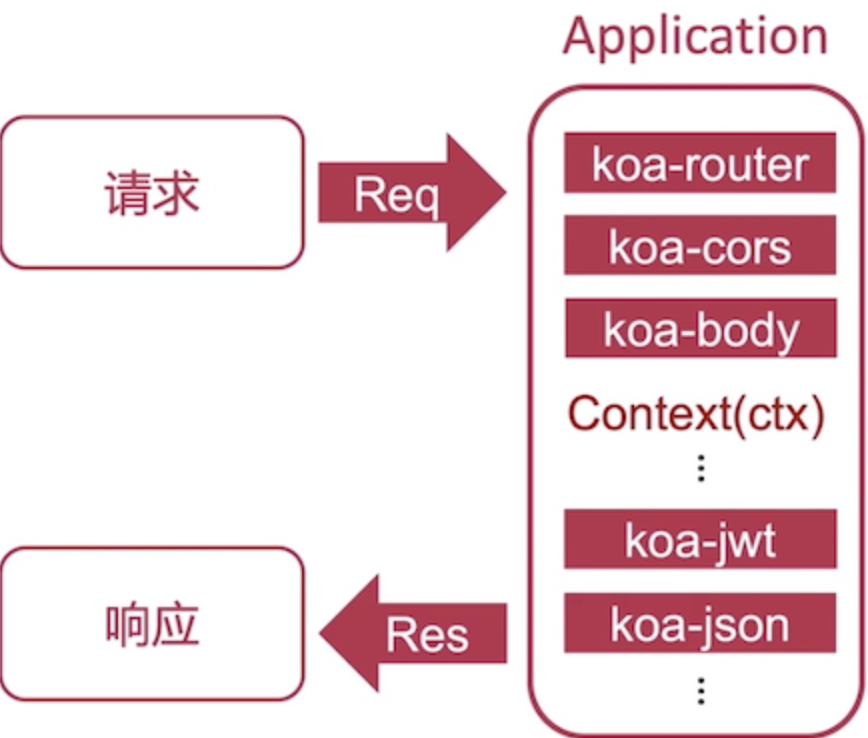
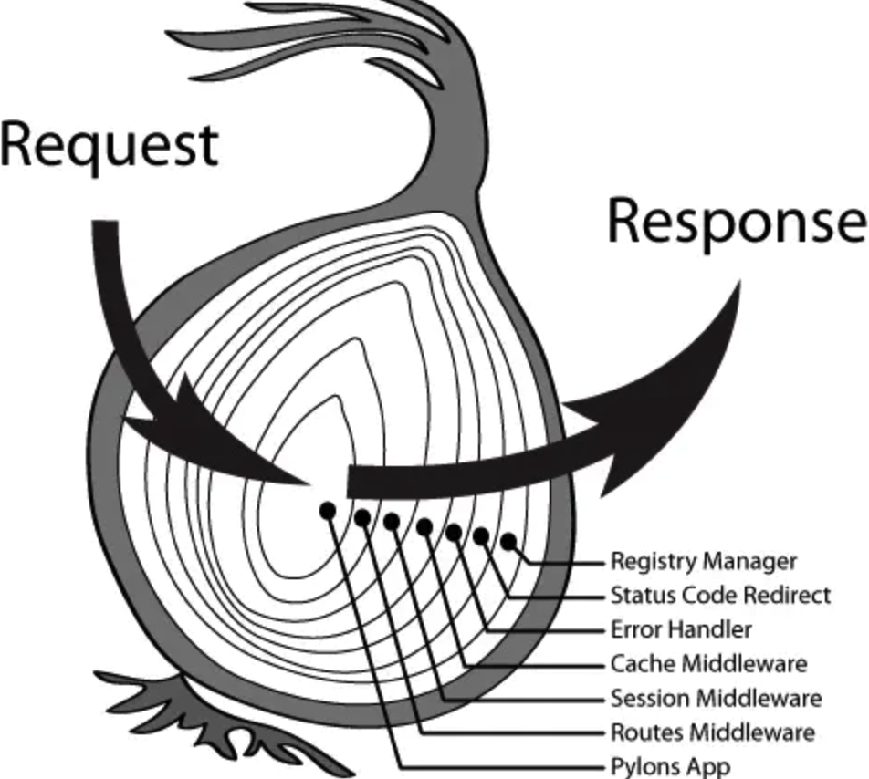
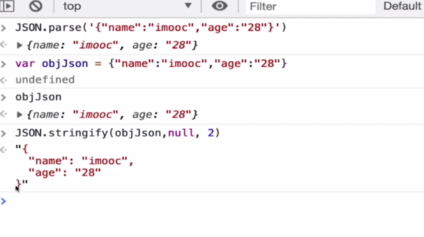

# Koa 简介

##什么是Koa

Koa是一个新的Web框架，致力于成为web应用和 API 开发领域中的一个更小的、更有表现力的、更健壮的基石。

利用 **asyc 函数** 丢弃回调函数，并增强错误处理。Koa没有任何预置的中间件，可以快速地编写服务端的应用程序。

### 核心概念

- koa application （应用程序）
- Context （上下文） 责任链模式使用中间件响应request
- Request （请求）、Response （响应）



###Hello Wolrd

```
npm init -y
npm install --save koa
```

index.js

```
const Koa = require('koa')
const app = new Koa()

app.use(async ctx => { 
  ctx.body = 'Helllo World'
})
//端口号 3000
app.listen(3000)
```

运行

```
node index.js
```

## Requst 属性、路由基本用法、await & sync核心原理

### ctx 和Request &Response

ctx对象包括此次请求的host，request ，response等信息。

ctx.request 获取request信息，包括请求方法和内容。

console.log(ctx)：

```
{
  request: {
    method: 'GET',
    url: '/',
    header: {
      host: 'localhost:3000',
      connection: 'keep-alive',
      'cache-control': 'max-age=0',
      'sec-ch-ua': '" Not A;Brand";v="99", "Chromium";v="90", "Google Chrome";v="90"',
      'sec-ch-ua-mobile': '?0',
      'upgrade-insecure-requests': '1',
      'user-agent': 'Mozilla/5.0 (Macintosh; Intel Mac OS X 10_14_6) ' +
        'AppleWebKit/537.36 (KHTML, like Gecko) Chrome/90.0.4430.85 ' +
        'Safari/537.36',
      accept: 'text/html,application/xhtml+xml,application/xml;q=0.9,image/avif,image/webp,image/apng,*/*;q=0.8,application/signed-exchange;v=b3;q=0.9',
      'sec-fetch-site': 'none',
      'sec-fetch-mode': 'navigate',
      'sec-fetch-user': '?1',
      'sec-fetch-dest': 'document',
      'accept-encoding': 'gzip, deflate, br',
      'accept-language': 'en-GB,en;q=0.9,zh-CN;q=0.8,zh;q=0.7'
    }
  },
  response: {
    status: 404,
    message: 'Not Found',
    header: [Object: null prototype] {}
  },
  app: { subdomainOffset: 2, proxy: false, env: 'development' },
  originalUrl: '/',
  req: '<original node req>',
  res: '<original node res>',
  socket: '<original node socket>'
}
```


### router让应用拥有api/url 的地址

npmjs.com 下载koa-router

```bash
npm install -s koa-router 
```

```javascript
// 引入router
const Router = require('koa-router')
// router类实例
const router = new Router()
//get请求，url 为空(根目录)
router.get('/',ctx => {
  console.log(ctx)
  console.log(ctx.request)
  ctx.body = 'Hello World!!'
})
//get请求，url路径 为/api
router.get('/api',ctx => {
  console.log(ctx)
  console.log(ctx.request)
  ctx.body = 'Hello Api!!'
})

//将所有定义在router类傻姑娘的方法应用到app上去处理
app.use(router.routes())//应用router对象上的所有route
  .use(router.allowedMethods())// 拦截器，拦截应用中没有的请求，直接返回4xx或者5xx

app.listen(3000)
```


### async/await

#### Koa核心原理：洋葱模型



一个Request进来，会依次执行中间件，

- 执行顺序：顺序执行
- 回调的舒徐：反向执行
- 先进后出

官方推荐对数据的操作全部使用中间件完成。

参考文档：

app.use(function)

将给定的中间件方法添加到此应用程序。`app.use()` 返回 `this`, 因此可以链式表达.

```javascript
app.use(someMiddleware)
app.use(someOtherMiddleware)
app.listen(3000)
```

它等同于

```js
app.use(someMiddleware)
  .use(someOtherMiddleware)
  .listen(3000)
```

执行过程：先入后出

先入：request 进入时：

1. request进入后按顺序执行next（）方法之前的代码 顺序是middleware1，2，3，
2. middleware3 ，没有next()方法，视为终止传递，开始回传

后出：

1. 顺序将会反过来：2，1，因为3 中next() 后面的代码,(因为middleware3没有next方法，所以回传后也没有可以执行的内容)

2. middleware3加入next方法则执行next（）后面代码的顺序为：middleware3，middleware2，middleware1，因为request进入时middleware3 已经没有可以向下传递的中间件了，还是从3开始回传

```javascript
const Koa = require('koa')
const app = new Koa()

//中间件 0
const middleware3 = function async(ctx,next) {
  console.log('this is a middleware3!')
  console.log(ctx.request.path)
  //不写next（）方法， 视为终止传递，开始回传
  // next()
  // console.log('this is a middleware3! End')

}
//中间件1
const middleware1 = function async(ctx,next) {
  console.log('this is a middleware1!')
  console.log(ctx.request.path)
  //写了next方法，会传递给下一个中间件
  next()
  //按照app.use方法插入中间件的顺序（先进后出）middleware2回传后执行，
  console.log('this is a middleware1! End')


}
//中间件2
const middleware2 = function async(ctx,next) {
  console.log('this is a middleware2')
  console.log(ctx.request.path)
  //写了next方法，会传递给下一个中间件
  next()
  //middleware没有next方法，so按照app.use方法插入中间件的顺序，middleware2先执行回传的方法
  console.log('this is a middleware2! End')

}

app.use(middleware1)
app.use(middleware2)
app.use(middleware3)
app.listen(3000)
```

terminal输出：

```bash
this is a middleware1!
/
this is a middleware2
/
this is a middleware3!
/
this is a middleware3! End
this is a middleware2! End
this is a middleware1! End
```

#### Koa中的async、await

**小tip：Await必须 async包裹，async里面可以没有await**

```
//await async eg
router.get('/async',async (ctx) => {
  let result = await new Promise((resolve) => {
    setTimeout(function () {
      resolve('hello world 2s later')
    },2000)
  })
  ctx.body = result
})
```


### Koa特点

- 简洁
- await /async
- 丰富的中间件

# 进阶篇


## Koa开发RESTful接口

### Koa中间件

- 路由： [koa-router](https://www.npmjs.com/package/koa-router)
- 协议解析： [koa-body](https://www.npmjs.com/package/koa-body)
- 跨域处理：[@koa/cors](https://www.npmjs.com/package/@koa/cors)

中间件查看：https://www.npmjs.com/

一次性安装以上中间件：

```bash
npm install -S koa-router koa-body @koa/cors
```

#### 基本使用

Eg:

```javascript
// 引入router
const Router = require('koa-router')
//引入 跨域处理中间件
const cors = require('@koa/cors')
//引入 koa-body，协议解析中间件
const koaBody = require('koa-body')
...

//restful 接口
router.post('/post',async (ctx) => {
  // es6 写法，相当于body请求体里的内容全部赋值给body对象
    let {body} =ctx.request
    console.log(body)
    console.log(ctx.request)
    ctx.body = {
      // 扩展运算符，相当于把body中的内容扩展开后返回回去,如果去掉的话，传json串的时候返回的最外层会带上body{}
      ...body
    }

})
//中间件是有执行顺序的，先use koabody解析，再use @koa/cors 处理跨域
app.use(koaBody())
app.use(cors())

...
```

#### 路由前缀设置

也就是router的prefix

Eg：在所有router前面加上

```javascript
// 增加前缀 api 加上它，所有请求都要在前面加上前缀/api
router.prefix('/api')
```

#### 获取GET请求中的params

请求参数：`http://localhost:3000/api/api?name=zz1&age=28`

Eg

```javascript
router.get('/api',ctx => {
   const params = ctx.request.query
   //parms = { name: 'zz1', age: '28' }
   console.log(params)
   console.log(params.name,params.age)
  // console.log(ctx)
  // console.log(ctx.request)
  ctx.body = {
    name : params.name,
    age  : params.age
  }
})
```

Terminal 输出

```
[Object: null prototype] { name: 'zz1', age: '28' }
zz1
```

请求后返回的body为：

```
{
    "name": "zz1",
    "age": "28"
}
```

因为是Json类型的，默认的返回不够美观我们可以使用 中间件[koa-json](https://www.npmjs.com/package/koa-json)

安装：

```bash
npm install -S koa-json
```

简单Eg：

```javascript
var json = require('koa-json');
var Koa = require('koa');
var app = new Koa();
 
app.use(json());
```

只在传参pretty=pretty时开启Json解析

```javascript
app.use(json({ pretty: false, param: 'pretty' }));
```

Eg：浏览器访问：http://localhost:3000/api/api?name=zz1&age=28&pretty=pretty此时body中的json串已解析，不传pretty参数则不解析Json

也可以在浏览器复制返回的Json在console输入JS代码格式化Json



## webpack 升级v5

webpack核心概念

- [入口(entry)](https://webpack.docschina.org/concepts/#entry)
- [输出(output)](https://webpack.docschina.org/concepts/#output)
- [loader](https://webpack.docschina.org/concepts/#loaders)
- [插件(plugin)](https://webpack.docschina.org/concepts/#plugins)
- [模式(mode)](https://webpack.docschina.org/concepts/#mode)

webpack v5版本会对以上代码产生影响，解决方案：

1. 使用webpack v4 webpackcli v3`cnpm i -D webpack@4 webpack-cli@3`
2. 使用webpack v5 webpackcli v4则采用如下配置

```javascript
const path = require('path')
const { CleanWebpackPlugin } = require('clean-webpack-plugin')
const nodeExternals = require('webpack-node-externals')

const webpackconfig = {
  mode: 'development',
  entry: {
    server: path.join(__dirname, 'src/index.js')
  },
  output: {
    filename: '[name].bundle.js',
    path: path.join(__dirname, './dist')
  },
  devtool: 'eval-cheap-source-map'
  module: {
    rules: [
      {
        test: /\.(js|jsx)$/,
        use: {
          loader: 'babel-loader'
        },
        exclude: [path.join(__dirname, 'node_modules')]
      }
    ]
  },
  plugins: [
    new CleanWebpackPlugin()
  ],
  externals: [nodeExternals()],
  target: 'node'
}

module.exports = webpackconfig

```

v5 说明：https://webpack.docschina.org/blog/2020-10-10-webpack-5-release/

v4迁移v5指南：https://webpack.docschina.org/migrate/5/

## 工作目录、合并路由、静态资源服务

工作目录：


1. 按照功能模块进行区分
2. 路由压缩： npm install koa-combine-routers --save
3. 静态资源： koa-static


## Koa开发热加载、ES6语法支持


# 调试篇

## 调试webpack、配置vscode调试


#实战篇

## 优化webpack配置、npm构建脚本


## Koa应用打包优化