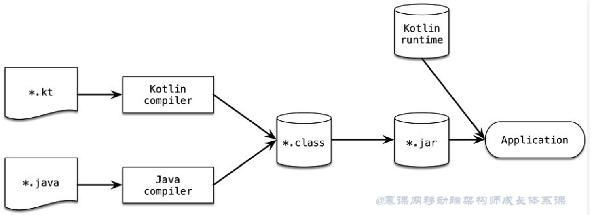

# Kotlin 基础

## 概述

​	Kotlin是一种在Java虚拟机上运行的静态类型编程语言。它主要是JetBrains开发团队所开发出来的编程语言。
虽然Kotlin与Java语法并不兼容，但Kotlin被设计成可以和Java代码相互运作，并可以重复使用如Java集合框架等现有Java引用的方法库。它很容易在Android项目中替代Java或者同Java一起使用。

### Kotlin的特点：

- 简洁易用: Kotlin中提供了大量的扩展，使得我们的代码更加简洁，开发出来的框架更加易用
- 安全: 避免空指针异常等整个类的错误
- 互操作性: 充分利用 JVM、Android 和浏览器的现有库
- 工具友好: 可用任何 Java IDE 或者使用命令行构建
  

### Kotlin 构建流程：



- *kt 会被Kotlin编译器变成编译为.class 的字节码文件，然后被归档成.jar ，最后由各平台打包工具输出最终的程序
- 我们用Java写的程序所有的实现都会有标准的Java类库来做支撑，比如：`java.lang.*`,`java.util.*`但是Kot lin中的类库是不在标准的Java类库中的，所以，Kotlin应用程序需要在最后一步借助Kotlin运行时来支撑这些Java标准库没有的实现。


## Kotlin和Java的异同

### 打印日志

Java：

```java
System.out.print("hello world");
System.out.println("hello world");
```

Kotlin:

```kotlin
print("hello world")
println("hello world")
```

### 定义变量与常量

Java：

```java
String name = "hello world";
final String name = "hello world";
```

Kotlin:

```kotlin
var name = "hello world"
val name = "hello world"
```

### null声明

Java：

```java
String otherName;
otherName = null;
```

Kotlin:

```kotlin
var otherName : String?
otherName = null
```

### 空判断

Java：

```java
if (text != null) {
    int length = text.length();
}
```

Kotlin:

```kotlin
text?.let {//表示text不为null的条件下，才会去执行let函数体
    val length = text.length
}
// or simply
val length = text?.length
```

### 字符串拼接

Java：

```java
String firstName = "Android";
String lastName = "Architect";
String message = "My name is: " + firstName + " " + lastName;
```

Kotlin:

```kotlin
val firstName = "Android"
val lastName = "Architect"
val message = "My name is: $firstName $lastName"
```

### 换行

Java：

```java
String text = "First Line\n" +
              "Second Line\n" +
              "Third Line";
```

Kotlin:

```kotlin
val text = """
        |First Line
        |Second Line
        |Third Line
        """.trimMargin()
```

### 三元表达式

Java：

```java
String text = x > 5 ? "x > 5" : "x <= 5";
```

Kotlin:

```kotlin
val text = if (x > 5)
              "x > 5"
           else "x <= 5"
```

### 操作符

Java：

```java
final int andResult  = a & b;
final int orResult   = a | b;
final int xorResult  = a ^ b;
final int rightShift = a >> 2;
final int leftShift  = a << 2;
final int unsignedRightShift = a >>> 2;
```

Kotlin:

```kotlin
val andResult  = a and b
val orResult   = a or b
val xorResult  = a xor b
val rightShift = a shr 2
val leftShift  = a shl 2
val unsignedRightShift = a ushr 2
```

### 类型判断和转换（声明式）

Java：

```java
if (object instanceof Car) {
   Car car = (Car) object;
}
```

Kotlin:

```kotlin
if (object is Car) {
   var car = object // 自动识别
}
```

### 类型判断和转换（隐式）

Java：

```java
if (object instanceof Car) {
   Car car = (Car) object;
}
```

Kotlin:

```kotlin
if (object is Car) {
   var car = object // 自动识别
}
```

### 多重条件

Java：

```java
if (score >= 0 && score <= 300) { }
```

Kotlin:

```kotlin
if (score in 0..300) { }
```

### 更灵活的case语句

Java：

```java
int score = // some score;
String grade;
switch (score) {
    case 10:
    case 9:
        grade = "Excellent";
        break;
    case 8:
    case 7:
    case 6:
        grade = "Good";
        break;
    case 5:
    case 4:
        grade = "OK";
        break;
    case 3:
    case 2:
    case 1:
        grade = "Fail";
        break;
    default:
        grade = "Fail";
}
```

Kotlin:

```kotlin
var score = // some score
var grade = when (score) {
    9, 10 -> "Excellent"
    in 6..8 -> "Good"
    4, 5 -> "OK"
    in 1..3 -> "Fail"
    else -> "Fail"
}
```

### for 循环

Java：

```java
for (int i = 1; i <= 10 ; i++) { }

for (int i = 1; i < 10 ; i++) { }

for (int i = 10; i >= 0 ; i--) { }

for (int i = 1; i <= 10 ; i+=2) { }

for (int i = 10; i >= 0 ; i-=2) { }

for (String item : collection) { }

for (Map.Entry<String, String> entry: map.entrySet()) { }

```

Kotlin:

```kotlin
for (i in 1..10) { }

for (i in 1 until 10) { }

for (i in 10 downTo 0) { }

for (i in 1..10 step 2) { }

for (i in 10 downTo 0 step 2) { }

for (item in collection) { }

for ((key, value) in map) { }
```

### 更方便的集合

Java：

```java
final List<Integer> listOfNumber = Arrays.asList(1, 2, 3, 4);

final Map<Integer, String> keyValue = new HashMap<Integer, String>();
map.put(1, "Android");
map.put(2, "Ali");
map.put(3, "Mindorks");

// Java 9
final List<Integer> listOfNumber = List.of(1, 2, 3, 4);

final Map<Integer, String> keyValue = Map.of(1, "Android",
                                             2, "Ali",
                                             3, "Mindorks");
```

Kotlin:

```kotlin
val listOfNumber = listOf(1, 2, 3, 4)
val keyValue = mapOf(1 to "Android",
                     2 to "Ali",
                     3 to "Mindorks")
```

### 遍历

Java：

```java
// Java 7 and below
for (Car car : cars) {
  System.out.println(car.speed);
}

// Java 8+
cars.forEach(car -> System.out.println(car.speed));

// Java 7 and below
for (Car car : cars) {
  if (car.speed > 100) {
    System.out.println(car.speed);
  }
}

// Java 8+
cars.stream().filter(car -> car.speed > 100).forEach(car -> System.out.println(car.speed));
```

Kotlin:

```kotlin
cars.forEach {
    println(it.speed)
}

cars.filter { it.speed > 100 }
      .forEach { println(it.speed)}
```

### 方法定义

Java：

```java
void doSomething() {
   // logic here
}

void doSomething(int... numbers) {
   // logic here
}

```

Kotlin:

```kotlin
fun doSomething() {
   // logic here
}

fun doSomething(vararg numbers: Int) {
   // logic here
}
```

###带返回值的方法

Java：

```java
int getScore() {
   // logic here
   return score;
}
```

Kotlin:

```kotlin
fun getScore(): Int {
   // logic here
   return score
}

// as a single-expression function

fun getScore(): Int = score
```

###无结束符号

Java：

```java
int getScore(int value) {
    // logic here
    return 2 * value;
}
```

Kotlin:

```kotlin
fun getScore(value: Int): Int {
   // logic here
   return 2 * value
}

// as a single-expression function

fun getScore(value: Int): Int = 2 * value
```

### Constructor 构造器

Java：

```java
public class Utils {

    private Utils() {
      // This utility class is not publicly instantiable
    }

    public static int getScore(int value) {
        return 2 * value;
    }

}
```

Kotlin:

```kotlin
class Utils private constructor() {

    companion object {

        fun getScore(value: Int): Int {
            return 2 * value
        }

    }
}

// another way

object Utils {

    fun getScore(value: Int): Int {
        return 2 * value
    }

}
```

### GetSet 构造器

Java：

```java
public class Developer {

    private String name;
    private int age;

    public Developer(String name, int age) {
        this.name = name;
        this.age = age;
    }

    public String getName() {
        return name;
    }

    public void setName(String name) {
        this.name = name;
    }

    public int getAge() {
        return age;
    }

    public void setAge(int age) {
        this.age = age;
    }
}
```

Kotlin:

```kotlin
data class Developer(val name: String, val age: Int)
```

## 必备基础

学习新语言，第一步就是学习它有怎样的数据类型，以及它的数组集合和方法是怎样子，因为这些事我们入手一门新语言时的第一步，也是基础汇总的基础。

### Kotlin基本类型

#### 数字

Kotlin 提供了一组表示数字的内置类型。 对于整数，有四种不同大小的类型，因此值的范围也不同。

| 类型  | 大小（比特数） | 最小值                            | 最大值                              |
| :---- | :------------- | :-------------------------------- | :---------------------------------- |
| Byte  | 8              | -128                              | 127                                 |
| Short | 16             | -32768                            | 32767                               |
| Int   | 32             | -2,147,483,648 (-231)             | 2,147,483,647 (231 - 1)             |
| Long  | 64             | -9,223,372,036,854,775,808 (-263) | 9,223,372,036,854,775,807 (263 - 1) |

对于浮点数，Kotlin 提供了 `Float` 与 `Double` 类型。 根据 [IEEE 754 标准](https://zh.wikipedia.org/wiki/IEEE_754)， 两种浮点类型的*十进制位数*（即可以存储多少位十进制数）不同。 `Float` 反映了 IEEE 754 *单精度*，而 `Double` 提供了*双精度*。

| 类型   | 大小（比特数） | 有效数字比特数 | 指数比特数 | 十进制位数 |
| :----- | :------------- | :------------- | :--------- | :--------- |
| Float  | 32             | 24             | 8          | 6-7        |
| Double | 64             | 53             | 11         | 15-16      |

### Kotlin的数组

数组在 Kotlin 中使用 `Array` 类来表示，它定义了 `get` 与 `set` 函数（按照运算符重载约定这会转变为 `[]`）以及 `size` 属性，以及一些其他有用的成员函数：

```
class Array<T> private constructor() {
    val size: Int
    operator fun get(index: Int): T
    operator fun set(index: Int, value: T): Unit

    operator fun iterator(): Iterator<T>
    // ……
}
```

#### 数组的创建技巧

我们可以使用库函数 `arrayOf()` 来创建一个数组并传递元素值给它，这样 `arrayOf(1, 2, 3)` 创建了 array `[1, 2, 3]`。 或者，库函数 `arrayOfNulls()` 可以用于创建一个指定大小的、所有元素都为空的数组。

另一个选项是用接受数组大小以及一个函数参数的 `Array` 构造函数，用作参数的函数能够返回给定索引的每个元素初始值：

```
// 创建一个 Array<String> 初始化为 ["0", "1", "4", "9", "16"]
val asc = Array(5) { i -> (i * i).toString() }
asc.forEach { println(it) }
```

如上所述，`[]` 运算符代表调用成员函数 `get()` 与 `set()`。

Kotlin 中数组是*不型变的（invariant）*。这意味着 Kotlin 不让我们把 `Array<String>` 赋值给 `Array<Any>`，以防止可能的运行时失败。

#### 原生类型数组

Kotlin 也有无装箱开销的专门的类来表示原生类型数组: `ByteArray`、 `ShortArray`、`IntArray` 等等。这些类与 `Array` 并没有继承关系，但是它们有同样的方法属性集。它们也都有相应的工厂方法:

```kotlin
val x: IntArray = intArrayOf(1, 2, 3)
x[0] = x[1] + x[2]
// 大小为 5、值为 [0, 0, 0, 0, 0] 的整型数组
val arr = IntArray(5)

// 例如：用常量初始化数组中的值
// 大小为 5、值为 [42, 42, 42, 42, 42] 的整型数组
val arr = IntArray(5) { 42 }

// 例如：使用 lambda 表达式初始化数组中的值
// 大小为 5、值为 [0, 1, 2, 3, 4] 的整型数组（值初始化为其索引值）
var arr = IntArray(5) { it * 1 }
```

#### Kotlin数组的遍历

##### 数组遍历

```kotlin
for (item in array) {
    println(item)
}
```

##### 带索引遍历数组

```kotlin
for (i in array.indices) {
    println(i.toString() + "->" + array[i])
}
```

##### 遍历元素（带索引）

```kotlin
for ((index, item) in array.withIndex()) {
    println("$index->$item")
}
```

##### forEach遍历数组

```kotlin
array.forEach { println(it) }
```

##### forEach增强版

```kotlin
array.forEachIndexed {
	println("$index: $item")
}
```

### Kotlin集合

Kotlin 标准库提供了一整套用于管理*集合*的工具，集合是可变数量（可能为零）的一组条目，各种集合对于解决问题都具有重要意义，并且经常用到。

- *List* 是一个有序集合，可通过索引（反映元素位置的整数）访问元素。元素可以在 list 中出现多次。列表的一个示例是一句话：有一组字、这些字的顺序很重要并且字可以重复。
- *Set* 是唯一元素的集合。它反映了集合（set）的数学抽象：一组无重复的对象。一般来说 set 中元素的顺序并不重要。例如，字母表是字母的集合（set）。
- *Map*（或者*字典*）是一组键值对。键是唯一的，每个键都刚好映射到一个值。值可以重复。map 对于存储对象之间的逻辑连接非常有用，例如，员工的 ID 与员工的位置。

#### 集合的可变性与不可变性

Kotlin中存在两种意义上的集合，一种是可以修改的，一种是不可以修改的。

##### 不可变集合

```kotlin
val stringList = listOf("one", "two", "one")
println(stringList)

val stringSet = setOf("one", "two", "three")
println(stringSet)
```

##### 可变集合（list 前面加mutable）

```kotlin
val numbers = mutableListOf(1, 2, 3, 4)
numbers.add(5)
numbers.removeAt(1)
numbers[0] = 0
println(numbers)
```

不难发现，每个不可变集合都有对应的可变集合，也就是以mutable为前缀的集合。

##### 集合排序

```kotlin
val numbers = mutableListOf(1, 2, 3, 4)
//随机排列元素
numbers.shuffle()
println(numbers)
numbers.sort()//排序，从小打到
numbers.sortDescending()//从大到小
println(numbers)

//定义一个Person类，有name 和 age 两属性
data class Language(var name: String, var score: Int)

val languageList: MutableList<Language> = mutableListOf()
languageList.add(Language("Java", 80))
languageList.add(Language("Kotlin", 90))
languageList.add(Language("Dart", 99))
languageList.add(Language("C", 80))
//使用sortBy进行排序，适合单条件排序
languageList.sortBy { it.score }
println(languageList)
//使用sortWith进行排序，适合多条件排序
languageList.sortWith(compareBy(
        //it变量是lambda中的隐式参数
        { it.score }, { it.name })
)
println(languageList)

```

### Set和Map

```kotlin
/**set**/
val hello = mutableSetOf("H", "e", "l", "l", "o")//自动过滤重复元素
hello.remove("o")
//集合的加减操作，前面的集合必须是可变集合
hello += setOf("w", "o", "r", "l", "d")
println(hello)

/**Map<K, V> 不是 Collection 接口的继承者；但是它也是 Kotlin 的一种集合类型**/

val numbersMap = mapOf("key1" to 1, "key2" to 2, "key3" to 3, "key4" to 1)

println("All keys: ${numbersMap.keys}")
println("All values: ${numbersMap.values}")
if ("key2" in numbersMap) println("Value by key \"key2\": ${numbersMap["key2"]}")
if (1 in numbersMap.values) println("1 is in the map")
if (numbersMap.containsValue(1)) println(" 1 is in the map")
```

