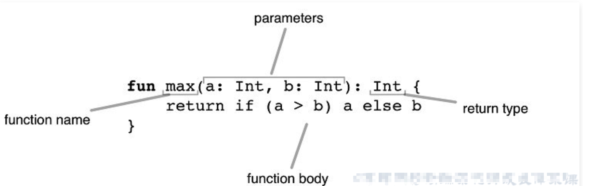

# Kotlin方法与Lambda表达式
<!-- more -->

Java中对象是一等公民，而在Kotlin中方法是一等公民。

Java中方法分为成员方法和类方法，Kotlin直接在文件中即可定义方法。

## Kotlin的方法

### 方法声明



```kotlin
fun functionLearn(days: Int):Boolean {
    return days > 100
}
```

#### 类方法

- companion object 实现的类方法
- 静态类
- 全局静态

 kotlin中没有静态方法，我们可以借助companion object来实现方法的目的

##### companion object 实现的类方法

```kotlin
class Person {
    companion object {
        fun test2() {
            println("companion object 实现的类方法")
        }
    }
}
Person.test2()
```

##### 静态类

```kotlin
/**
 * 整个静态类，里面所有的方法都是静态方法
 */
object NumUtil {
    fun double(num: Int): Int {
        return num * 2
    }
}
```

##### 全局静态

我们可以直接新建一个Kotlin file 然后定义一些常方法。

#### 单表达式方法

当方法返回单个表达式时，可以省略花括号并且在 = 符号之后指定代码即可：

```kotlin
fun double(x: Int): Int = x * 2
```

当返回值类型可由编译器推断时，显示声明返回类型是可选的：

```kotlin
fun double(x: Int) = x * 2
```

#### 匿名方法

高级用法 ⬇️

#### 局部方法

方法作用域⬇️

#### 泛型方法

深入理解Kotlin 泛型

#### 扩展方法

Extensions 技术探秘与应用

### 方法参数

- 默认参数
- 具名参数
- 可变数量参数

#### 默认参数

方法参数可以有默认值，当省略相应的参数时使用默认值，与其Java相比，这可以减少重载数量：

```kotlin
fun read(b: Array<Byte>, off: Int = 0, len: Int = b.size) { /*……*/ }
```

我们可以通过类型后面的 = 来设置默认值。

如果一个默认参数在一个无默认值的参数之前，那么该默认值只能通过使用具名参数调用该方法来使用：

```kotlin
fun foo(bar: Int = 0, baz: Int) { /*……*/ }

foo(baz = 1) // 使用默认值 bar = 0
```

如果在默认参数之后的最后一个参数是Lambda表达式

#### 可变数量参数(Varargs)

方法的参数（通常是最后一个）可以用vararg 修饰符标记

```kotlin
fun append(vararg str: Char): String {
    val result = StringBuffer()
    for (char in str) {
        result.append(char)
    }
    return result.toString()
}
```

允许将可变数量的参数传递给方法。

```kotlin
append('h', 'e', 'l', 'l', 'o')
```

可变参数的要求:

- 只有一个参数可以标注为vararg
- 如果vararg参数不是列表中的最后一个参数，可以使用具名参数语法传递其后的参数的值，或者，如果参数具有方法类型，则通过在括号外部传一个Lambda

当我们调用vararg方法时，我们可以一个接一个地传参，例如append（'h','e','l','l','o'），或者，如果我们已经有一个数组并希望将其内容传给该方法，我们使用伸展**（spread）操作符（在数组前面加*）**：

```kotlin
val world = charArrayOf('w', 'o', 'r', 'l', 'd')
val result = append('h', 'e', 'l', 'l', 'o',' ', *world)
```


### 方法作用域

在Kotlin中方法可以在文件顶层声明，这意味着你不需要像一些语言如Java、C# 那样需要创建一个类来保存一个方法。

此外除了顶层方法，Kotlin中方法也可以声明在局部作用域、作为成员方法以及扩展方法。


#### 局部方法

Kotlin支持局部方法，即一个方法在另一个方法内部：

```kotlin
fun magic(): Int {
    fun foo(v: Int): Int {
        return v * v
    }

    val v1 = (0..100).random()
    return foo(v1) //在方法内部调用了局部方法
}
```

局部方法可以访问外部方法（即闭包）的局部变量

## Lambda 表达式

在Java 8的时候开始支持Lambda表达式，目前Lambda语法在Java中已经被广泛运用，Lambda表达式可以理解为是一种语法糖，值得庆幸的是，Kotlin一经开源成熟就已经支持这种语法。

> Lambda表达式的本质其实是匿名方法，因为在其底层实现中还是通过匿名方法来实现的。但是我们在用的时候不必关心起底层实现。不过Lambda的出现确实是减少了代码量的编写，同时也是代码更佳简洁明了。


Lambda作为表达式编程的基础，其语法也是相当简单的。这里先通过一段简单的代码演示没让大家了解Lambda表达式的简洁之处。

```java
view.setOnClickListener(new View.OnClickListener() {
    @Override
    public void onClick(View v) {
        Toast.makeText(v.getContext(), "Lambda简洁之道", Toast.LENGTH_LONG).show();
    }
});

```

Lambda

```java
view.setOnClickListener { v -> Toast.makeText(v.context, "Lambda简洁之道", Toast.LENGTH_LONG).show() }
```

#### Lambda表达式的特点

- 是匿名方法
- 可以传递

#### Lambda语法

语法如下：

##### 无参数的情况：

```kotlin
val/var 变量名 = { 操作的代码 }
```

Eg:

```kotlin
val test1 = { println("无参数") }
```

##### 有参数的情况

```kotlin
val/var 变量名 : (参数的类型，参数类型，...) -> 返回值类型 = {参数1，参数2，... -> 操作参数的代码 }
```

Eg: 

```kotlin
val test3:(Int, Int) -> Int = { a, b -> a + b }
```

等价于

```kotlin
// 此种写法：即表达式的返回值类型会根据操作的代码自推导出来。
val/var 变量名 = { 参数1 ： 类型，参数2 : 类型, ... -> 操作参数的代码 }
```

Eg:

Lambda表达式作为方法中的参数的时候，这里举一个例子：

```kotlin
fun test(a : Int, 参数名 : (参数1 ： 类型，参数2 : 类型, ... ) -> 表达式返回类型){
    ...
}
```

#### Lambda 实践 

##### 如何使用it

认识it

- it 并不是Kotlin中的一个关键字（保留字）
- it 是在当一个高阶方法中Lambda表达式的参数只有一个的时候可以使用it来使用此参数
- it可表示为单个参数的隐式名称，是Kotlin语言约定的。

实例A：单个参数的隐式名称，是Kotlin语言约定的

```kotlin
// 这里举例一个语言自带的一个高阶方法filter,此方法的作用是过滤掉不满足条件的值。
val arr = arrayOf(1,3,5,7,9)
// 过滤掉数组中元素小于2的元素，取其第一个打印。这里的it就表示每一个元素。
println(arr.filter { it < 5 }.component1())

//结合上文的
testClosure(1)(2) {
    println(it)
}
```

##### 如何使用下划线_

在使用Lambda表达式的时候，可以用下划线（_）表示未使用的参数，表示不处理这个参数

在遍历一个Map集合的时候，这非常有用

```kotlin
val map = mapOf("key1" to "value1", "key2" to "value2", "key3" to "value3")
map.forEach { (key, value) ->
    println("$key \t $value")
}

// 不需要key的时候
map.forEach { (_, value) ->
    println(value)
}
```

