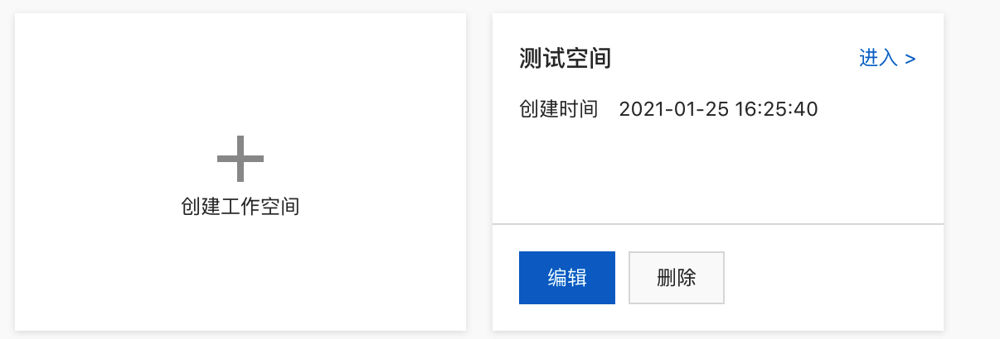
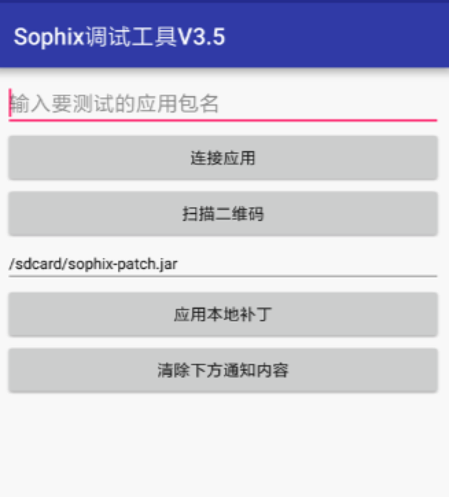

# Sophix

移动热修复（Mobile Hotfix）是面向Android、iOS平台应用提供的在线热修复服务方案，产品基于阿里巴巴首创的Hotpatch技术，提供细粒度热修复能力，无需等待发版即可实时修复应用线上问题，用户全程无感知。

# 接入热修复SDK

[官方文档](https://help.aliyun.com/document_detail/181015.html?spm=a2c4g.11174283.2.16.3fd09c664MAItx)

 

<!--more-->

## 创建应用

EMAS平台中的应用即您实际端应用的映射，您需要在EMAS控制台创建应用，与您要加载SDK的端应用进行关联。创建应用请参考[EMAS 快速入门>创建产品及应用](https://help.aliyun.com/document_detail/169962.html)。


### 注册登陆

[阿里云官网](https://www.aliyun.com/)->登陆账号->产品->开发与运维->移动研发平台 EMAS->运维 -> [移动热修复]( https://www.aliyun.com/product/hotfix?spm=5176.185759.J_8058803260.420.5aa565f7pRwzCe ) ，切换到当前页面先去注册登录，登录之后，如果是之前没用过，会显示立即开通，之前已经开通的话会直接显示管理控制台


#### 创建工作空间和应用

1. 产品开通后即可进入移动研发平台的[管理控制台](https://emas.console.aliyun.com/?spm=a2c4g.11186623.2.13.11293207iFXcAB#/productList)，默认打开**我的工作空间**页面。

2. 在**我的工作空间**页面，单击**创建工作空间**标签，打开**创作工作空间**右侧栏。

   

3. 在**创作工作空间**右侧栏，填写**工作空间名称**。

   | 选项             | 说明                                                         |
   | ---------------- | ------------------------------------------------------------ |
   | **工作空间名称** | 用于设置工作空间的名称。【取值范围】1～30字符【字符类型】中文/英文大小写/数字/下划线 |

4. 单击**创建并进入**按钮，保存工作空间，并打开**工作空间概览**页面。

5. 在**工作空间概览**页面，单击**添加应用**按钮，打开**应用配置**右侧栏。

   

   

6. 在**应用配置**右侧栏 > **填写应用信息**步骤，输入应用信息。

   

经典模式是用代码开发

低代码模式是用可视化工具开发，支持平台为小程序和H5

## SDK集成

> 说明：SDK下载请参见[EMAS 快速入门>下载SDK](https://help.aliyun.com/document_detail/169962.html)。

- [Android SDK稳健接入（推荐使用）](https://help.aliyun.com/document_detail/61082.html)
- [Android SDK快速接入（不推荐使用）](https://help.aliyun.com/document_detail/53240.html)只支持9.0一下设备，9.0以上有崩溃风险没有使用Application代理，直接初始化了Sophix
- iOS SDK接入方式：请接入技术支持钉钉群获取，参见[技术支持](https://help.aliyun.com/document_detail/173248.html)

***我们采用的是稳健接入（兼容Android 9.0）***

***以下内容是基于Android Studio的稳健接入方案***

### 前提条件

- SDK下载，请参见[EMAS快速入门>下载SDK](https://help.aliyun.com/document_detail/169962.html)
- Demo程序：[Github地址](https://github.com/aliyun/alicloud-android-demo/tree/master/hotfix_android_demo)

### 使用限制

支持Android 4.0.3及以上系统，如自研设备和系统，请关闭系统级jit后进行接入。

### 集成步骤

#### 添加工程依赖

app的build.gradle文件，添加如下配置：

添加maven仓库地址：

```groovy
repositories {
   maven {
       url "http://maven.aliyun.com/nexus/content/repositories/releases"
   }
}
```

Module/build.gradle 添加依赖

```groovy
android {
    ......
    defaultConfig {
        applicationId "com.xxx.xxx" //包名
        ......
        ndk {
            //选择要添加的对应cpu类型的.so库。
            //热修复支持五种
            abiFilters 'arm64-v8a', 'armeabi', 'armeabi-v7a', 'x86', 'x86_64'
        }
        ......
    }
    ......
}
dependencies {
    ......
        compile 'com.aliyun.ams:alicloud-android-hotfix:3.2.17'
    ......
}
```

如若仓库访问失败, 那么用本地依赖的方式进行依赖。

> **注意** :
>
> - 使用android studio打包生成apk时，要关闭instant run。
> - 若SDK集成过程中出现UTDID冲突，请参考[阿里云-移动云产品SDK UTDID冲突解决方案](https://help.aliyun.com/knowledge_detail/59152.html)。

#### 添加应用权限

Sophix SDK使用到以下权限，使用maven依赖或者aar依赖可以不用配置。具体配置在`AndroidManifest.xml`中。

```
<uses-permission android:name="android.permission.INTERNET" />
<uses-permission android:name="android.permission.ACCESS_NETWORK_STATE" />
<uses-permission android:name="android.permission.ACCESS_WIFI_STATE" />
<uses-permission android:name="android.permission.READ_EXTERNAL_STORAGE"/>
```

> **说明**: 
>
> `READ_EXTERNAL_STORAGE`权限属于Dangerous Permissions，仅调试工具获取外部补丁需要，不影响线上发布的补丁加载，调试时请自行做好Android 6.0以上的运行时权限获取。

#### 配置AndroidManifest文件（最好在Application初始化时配置而不是Mainfest文件）

在`AndroidManifest.xml`中间的`application`节点下添加如下配置：

```xml
<meta-data
android:name="com.taobao.android.hotfix.IDSECRET"
android:value="App ID" />
<meta-data
android:name="com.taobao.android.hotfix.APPSECRET"
android:value="App Secret" />
<meta-data
android:name="com.taobao.android.hotfix.RSASECRET"
android:value="RSA密钥" />
```

将上述value中的值分别改为通过平台HotFix服务申请得到的App Secret和RSA密钥，出于安全考虑，建议使用setSecretMetaData这个方法进行设置，详见[SDK API](https://help.aliyun.com/document_detail/180965.html)的方法说明。如找不到对应参数，可参考[EMAS快速入门>下载配置文件](https://help.aliyun.com/document_detail/169962.html)获取应用配置信息。

> **说明** 
>
> - 另外，热修复暂不支持EMAS统一插件的json文件读取。
> - `App ID/App Secret`将被用于计量计费，请妥善保管注意安全。

#### 混淆 (注意修复时打开mapping的注释，保存好mapping文件)

```properties
#基线包使用，生成mapping.txt
-printmapping mapping.txt
#生成的mapping.txt在app/build/outputs/mapping/release路径下，移动到/app路径下
#修复后的项目使用，保证混淆结果一致
#-applymapping mapping.txt
#hotfix
-keep class com.taobao.sophix.**{*;}
-keep class com.ta.utdid2.device.**{*;}
-dontwarn com.alibaba.sdk.android.utils.**
#防止inline
-dontoptimize
```

> **注意** ：开启混淆时，生成修复包要使用旧包的mapping文件以保证混淆结果一致。

#### 应用内 初始化

初始化的调用应该尽可能的早，必须在`Application.attachBaseContext()`的最开始（在super.attachBaseContext之后，如果有Multidex，也需要在Multidex.install之后）进行SDK初始化操作，初始化之前不能用到其他自定义类，否则极有可能导致崩溃。而查询服务器是否有可用补丁的操作可以在后面的任意地方。不建议在`Application.onCreate()`中初始化，因为如果带有ContentProvider，就会使得Sophix初始化时机太迟从而引发问题。

具体就是，用户自行加入以下这个类：

```java
package com.my.pkg;
import android.app.Application;
import android.content.Context;
import android.support.annotation.Keep;
import android.util.Log;
import com.taobao.sophix.PatchStatus;
import com.taobao.sophix.SophixApplication;
import com.taobao.sophix.SophixEntry;
import com.taobao.sophix.SophixManager;
import com.taobao.sophix.listener.PatchLoadStatusListener;
import com.my.pkg.MyRealApplication;
/**
 * Sophix入口类，专门用于初始化Sophix，不应包含任何业务逻辑。
 * 此类必须继承自SophixApplication，onCreate方法不需要实现。
 * 此类不应与项目中的其他类有任何互相调用的逻辑，必须完全做到隔离。
 * AndroidManifest中设置application为此类，而SophixEntry中设为原先Application类。
 * 注意原先Application里不需要再重复初始化Sophix，并且需要避免混淆原先Application类。
 * 如有其它自定义改造，请咨询官方后妥善处理。
 */
public class SophixStubApplication extends SophixApplication {
    private final String TAG = "SophixStubApplication";
    // 此处SophixEntry应指定真正的Application，并且保证RealApplicationStub类名不被混淆。
    @Keep
    @SophixEntry(MyRealApplication.class)
    static class RealApplicationStub {}
    @Override
    protected void attachBaseContext(Context base) {
        super.attachBaseContext(base);
//         如果需要使用MultiDex，需要在此处调用。
//         MultiDex.install(this);
        initSophix();
    }
    private void initSophix() {
        String appVersion = "0.0.0";
        try {
            appVersion = this.getPackageManager()
                             .getPackageInfo(this.getPackageName(), 0)
                             .versionName;
        } catch (Exception e) {
        }
        final SophixManager instance = SophixManager.getInstance();
        instance.setContext(this)
                .setAppVersion(appVersion)
                .setSecretMetaData(null, null, null)
                .setEnableDebug(true)
                .setEnableFullLog()
                .setPatchLoadStatusStub(new PatchLoadStatusListener() {
                    @Override
                    public void onLoad(final int mode, final int code, final String info, final int handlePatchVersion) {
                        if (code == PatchStatus.CODE_LOAD_SUCCESS) {
                            Log.i(TAG, "sophix load patch success!");
                        } else if (code == PatchStatus.CODE_LOAD_RELAUNCH) {
                            // 如果需要在后台重启，建议此处用SharePreference保存状态。
                            Log.i(TAG, "sophix preload patch success. restart app to make effect.");
                        }
                    }
                }).initialize();
    }
}
```

```
// queryAndLoadNewPatch不可放在attachBaseContext 中，否则无网络权限，建议放在后面任意时刻，如onCreate中
SophixManager.getInstance().queryAndLoadNewPatch();
```

这其中，关键一点是：

```java
    @Keep
    @SophixEntry(MyRealApplication.class)
    static class RealApplicationStub {}
```

SophixEntry应指定项目中原先真正的Application（原项目里application的android::name指定的），这里用MyRealApplication指代。并且保证RealApplicationStub类名不被混淆。而SophixStubApplication的类名和包名可以自行取名。

这里的Keep是android.support包中的类，目的是为了防止这个内部静态类的类名被混淆，因为sophix内部会反射获取这个类的SophixEntry。如果项目中没有依赖android.support的话，就需要在progurad里面手动指定RealApplicationStub不被混淆，详见下文。

然后，在proguard文件里面需要加上下面内容：

```java
-keepclassmembers class com.my.pkg.MyRealApplication {
    public <init>();
}
-keep class com.my.pkg.SophixStubApplication$RealApplicationStub
```

目的是防止真正Application的构造方法被proguard混淆。

最后，需要把AndroidManifest里面的application改为这个新增的SophixStubApplication类：

```xml
    <application
        android:name="com.my.pkg.SophixStubApplication"
        ... ...>
        ... ...
```

这样便完成了新方式的初始化接入改造。

遇到集成问题可先查看[常见问题](https://help.aliyun.com/document_detail/172286.html)解决，通过文档不能解决，可以联系：[技术支持](https://help.aliyun.com/document_detail/173248.html).


## 创建版本

在控制台创建对应的应用版本，该版本与**基线包初始化时setAppVersion**所传的版本号对应。更多详情，参见[创建版本](https://help.aliyun.com/document_detail/93805.html)。

1. 登录移动热修复控制台。

2. 在左侧导航栏选择**补丁管理**。

3. 在补丁管理页面单击**添加版本**，输入应用版本号后单击**确认**

   

## 生成补丁

上传补丁前您需要先在线下生成补丁包，打包工具下载及使用详情，参见[生成补丁](https://help.aliyun.com/document_detail/53247.html)。

上传补丁前您需先生成补丁包，本文介绍如何使用我方提供的打包工具生成补丁包。

### 补丁版本说明

1. 补丁是针对客户端具体某个版本的，补丁和具体版本绑定。

   示例：应用当前版本号是1.1.0，那么只能在后台查询到1.1.0版本对应发布的补丁，而查询不到之前1.0.0旧版本发布的补丁。

2. 针对某个具体版本发布的新补丁，必须包含所有的bugfix，而不能依赖补丁递增修复的方式，因为应用仅可能加载一个补丁。

   示例：针对1.0.0版本在后台发布了一个补丁版本号为1的补丁修复了bug1，然后发现此时针对这个版本补丁1修复的不完全，代码还有bug2，在后台重新发布一个补丁版本号为2的补丁，那么此时补丁2就必须同时包含bug1和bug2的修复；如果只包含bug2的修复，bug1的修复就会失效。

### 打包工具下载

补丁包生成需要使用打补丁工具SophixPatchTool，如还未下载打补丁工具，请前往下载Android打包工具。

打包工具下载地址如下：

- [Mac版本打包工具下载](http://ams-hotfix-repo.oss-cn-shanghai.aliyuncs.com/SophixPatchTool_macos.zip)
- [Windows版本打包工具下载](http://ams-hotfix-repo.oss-cn-shanghai.aliyuncs.com/SophixPatchTool_windows.zip)
- [Linux版本打包工具地址](http://ams-hotfix-repo.oss-cn-shanghai.aliyuncs.com/SophixPatchTool_linux.zip)

#### 补丁版本说明

1. 补丁是针对客户端具体某个版本的，补丁和具体版本绑定。

   示例：应用当前版本号是1.1.0，那么只能在后台查询到1.1.0版本对应发布的补丁，而查询不到之前1.0.0旧版本发布的补丁。

2. 针对某个具体版本发布的新补丁，必须包含所有的bugfix，而不能依赖补丁递增修复的方式，因为应用仅可能加载一个补丁。

   示例：针对1.0.0版本在后台发布了一个补丁版本号为1的补丁修复了bug1，然后发现此时针对这个版本补丁1修复的不完全，代码还有bug2，在后台重新发布一个补丁版本号为2的补丁，那么此时补丁2就必须同时包含bug1和bug2的修复；如果只包含bug2的修复，bug1的修复就会失效。

#### 打包工具下载

补丁包生成需要使用打补丁工具SophixPatchTool，如还未下载打补丁工具，请前往下载Android打包工具。

打包工具下载地址如下：

- [Mac版本打包工具下载](http://ams-hotfix-repo.oss-cn-shanghai.aliyuncs.com/SophixPatchTool_macos.zip)
- [Windows版本打包工具下载](http://ams-hotfix-repo.oss-cn-shanghai.aliyuncs.com/SophixPatchTool_windows.zip)
- [Linux版本打包工具地址](http://ams-hotfix-repo.oss-cn-shanghai.aliyuncs.com/SophixPatchTool_linux.zip)

#### 使用打包工具打包

1. 双击打开打包工具，进入打包工具主对话框。

  

  | 参数 | 说明                                                         |
  | :--- | :----------------------------------------------------------- |
  | 旧包 | <必填> 选择基线包路径（有问题的APK）。                       |
  | 新包 | <必填> 选择新包路径（修复过该问题APK）。                     |
  | 日志 | 打开日志输出窗口。                                           |
  | 设置 | • 补丁输出路径：<必填>指定生成补丁之后补丁的存放位置，必须是已存在的目录。• Key Store Path：<选填>本地的签名文件的路径，不输入则不做签名。目前只支持jks的签名文件。• Key Store Password：<选填>证书文件的密码。• Key Alias：<选填>Key的别名。• Key Passwrod：<选填>Key的密码。• AES Key：<选填>自定义aes秘钥，必须是16位数字或字母的组合。必须与setAesKey中设置的秘钥一致。• Filter Class File：<选填>本地的白名单类列表文件的路径，放进去的类不会再计算patch，文件格式：一行一个类名。 |
  | 高级 | • 强制冷启动：勾选的话强制生成补丁包为需要冷启动才能修复的格式。默认不选的话，工具会根据代码变更情况自动选择即时热替换或者冷启动修复。• 不比较资源：打补丁时不比较资源的变化。• 不比较SO库：打补丁时不比较SO库的变化。• 检查初始化：检查初始化写法是否正确。• 快速打包：加快补丁生成速度。• 优化资源补丁：压缩补丁资源的大小。 |
  | GO！ | 开始生成补丁。                                               |

  > 注意，这里如果勾选了检查初始化，打补丁工具会检查 SophixStubApplication 中的代码，不能包含非系统API，会报错。如果使用了 AndroidX 的 MultiDex，工具也会报错，可以先不勾选检查初始化，自行确定SophixStubApplication中无其他非系统API的使用，该工具后面会对AndroidX的库进行识别。

2. 上传新旧包，进行设置后单击**GO**。

## 上传补丁

上传补丁到移动热修复管理控制台的对应版本中，使用详情，参见[上传补丁](https://help.aliyun.com/document_detail/93812.html)。

1. 登录移动热修复控制台。

2. 左侧导航栏选择**补丁管理**。

3. 选择版本，单击**上传补丁**，选则补丁文件、填写补丁描述后单击**确定**

4. 一般我们传递VersionName为补丁版本，所以补丁版本和VersionName是一致的。

   

## 调试补丁

补丁正式发布前，请对补丁进行调试，参见[调试补丁](https://help.aliyun.com/document_detail/93827.html)。

### 调试方法

1. **调试工具下载**

   单击[Android调试工具下载地址](http://ams-hotfix-repo.oss-cn-shanghai.aliyuncs.com/hotfix_debug_tool-release.apk)，将下载的调试工具安装到您的Android手机上。

   

2. **连接测试的应用**

   打开手机调试工具，在顶部的编辑框内输入要进行测试的应用包名，确认输入无误后点击连接应用按钮。

   **说明** 

   工具与测试的应用建立连接，连接成功后输出应用的信息；aidl方式连接原应用，所以在部分机型上可能导致失败，比如MIUI最新系统上，默认禁用了跨应用aidl，MIUI上可以设置取消这个限制，其它系统类似处理。

3. **应用补丁**

   - **扫描二维码方式**
     1. 登录移动热修复控制台。
     2. 左侧导航栏选择**补丁管理**，并选择**版本**。
     3. 单击版本下待调试补丁右侧的**发布**，进入补丁发布页面。
     4. 单击扫码验证补丁右侧的二维码，在手机调试工具中点击**扫描二维码**按钮扫码，向应用发出拉去补丁的请求。
     5. 补丁拉取和加载状态在调试应用界面输出，当显示下载和加载成功，打开应用进行检查。
   - **应用本地补丁方式**
     1. 将生成的补丁包存储到以安装调试供的手机本地存储任何一个目录下。
     2. 打开调试工具，在应用本地补丁按钮上面的输入框中输入补丁在手机存储中的绝对路径，并点击**应用本地补丁**。
     3. 补丁加载状态在调试应用界面输出，当显示下载和加载成功，打开应用进行检查。

4. **断开连接的应用**

   调试完成后，在手机调试工具中点击**断开应用连接**。

## 过滤机型

您可以对发布的补丁设置过滤机型操作，过滤机型使用详情，参见[机型过滤](https://help.aliyun.com/document_detail/93816.html)。

## 发布补丁

移动热修复提供了多种发布方式，方便您根据自身业务需要选择性使用，使用详情，参见[补丁发布推荐流程](https://help.aliyun.com/document_detail/130163.html)。

热修复补丁发布的标准流程需要经过3个步骤，准守标准作业流程，可以规避更多风险。

**说明** 

标准作业流程为：线下测试>灰度发布>全量发布

### 线下测试

1. 使用调试工具，进行补丁调试，请参见[调试补丁](https://help.aliyun.com/document_detail/93827.html)。
2. 线下使用市场主流手机进行补丁验证，尽可能完整覆盖主流的时长机型和ROM。说明：如果您没有足够的线下机型，可使用[EMAS 移动测试](https://www.aliyun.com/product/mqc)产品进行线下测试。

### 生产灰度

基于热修复灰度功能，进行3轮灰度，灰度设备数依次为1%、5%、20%，然后观察以下指标：

- 补丁生效率指标：补丁加载成功设备数/补丁下载成功设备数。（预期数值>70%）
  - 补丁清除率指标：补丁被动清除成功设备数/补丁下载成功设备数。（预期数值<2%）

**说明** 

端上发生启动Crash会触发端侧保护机制，自动清除热修复补丁。

- Crash监控指标（补丁发布后App的崩溃数据情况，您可以使用[EMAS 崩溃分析](https://www.aliyun.com/product/emascrash/crash)产品，预期热修复补丁发布后没有出现崩溃数据增长）

### 正式发布

灰度数据符合预期后正式生产发布

## 查看计费数据

查看补丁查询接口被调用次数、活跃设备数、补丁加载数量等，详情参见[计费数据](https://help.aliyun.com/document_detail/93817.html)。


