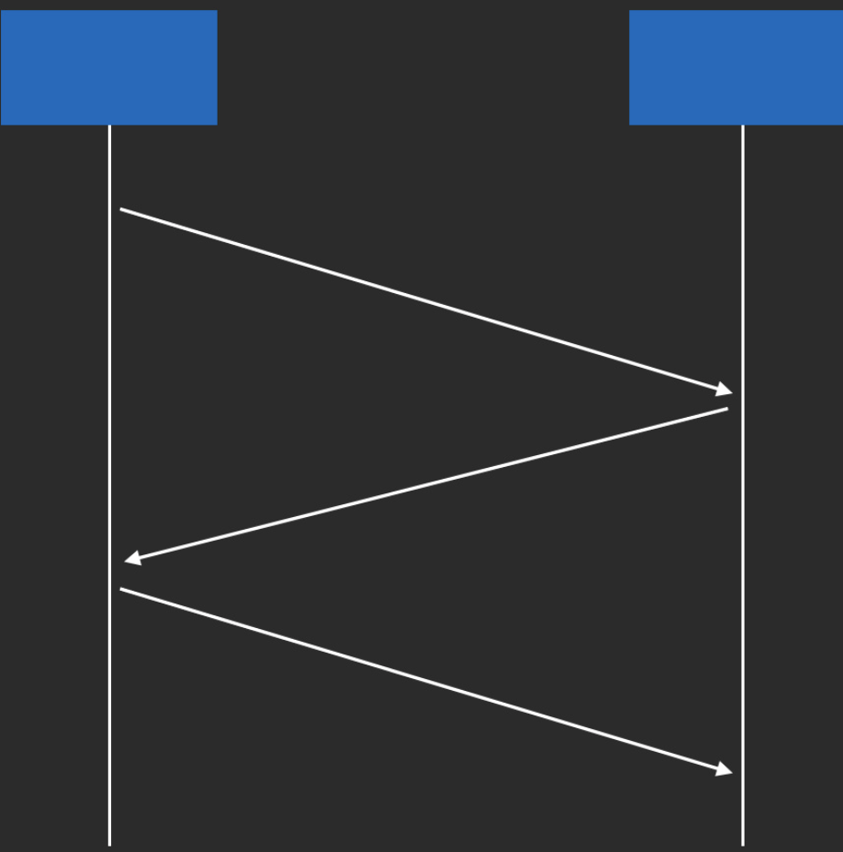
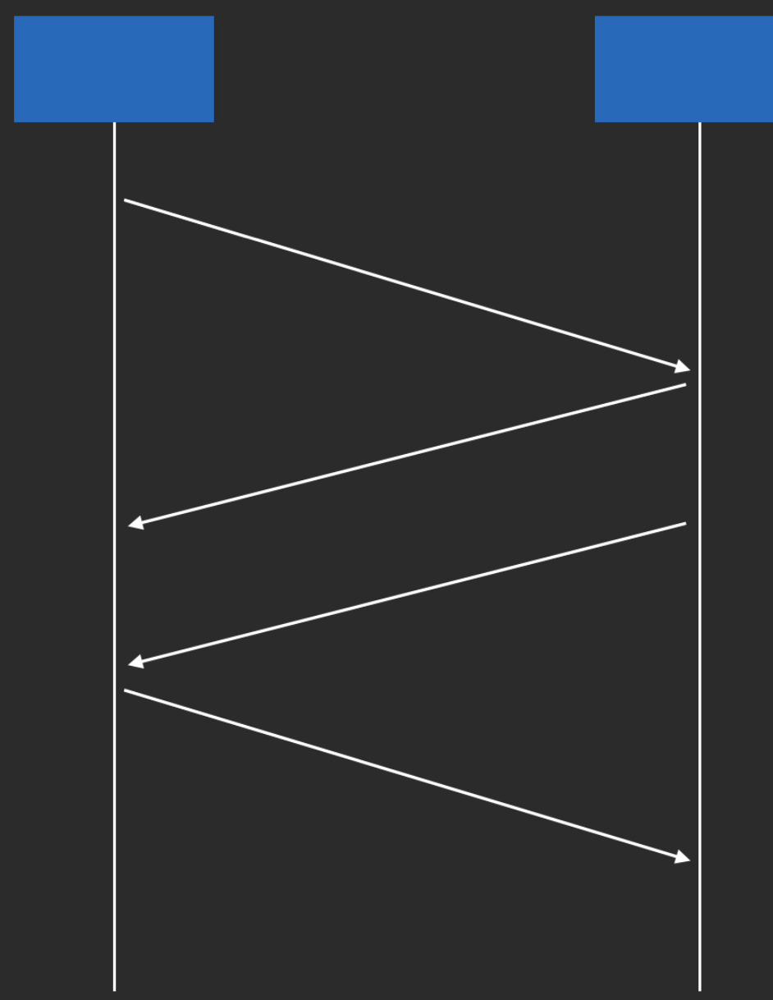

# TCP/IP

概念：一系列协议组成的网络分层模型。

## **为什么要分层？**

因为网络不稳定。

**网络不稳定造成的问题：**

- 传输较大数据时，在复杂网络环境中容易传输失败。

- 若传输失败时，需要把整个报文重新传因此

为了解决这些问题：我们需要将报文分块，传输成功后接收方再将报文拼装好。

**分块传输的优点：**

- 数据分块后，体积变小了，提高了传输的成功率

- 数据分块后，若传输失败，可以只重新传失败的数据块而不是重传全部数据

**实际应用中，我们使用的网络协议不止有HTTP，还有FTP，DNS等协议都有分块传输的需求，我们需要划分两个层级：**

1. HTTP，FTP，DNS等协议组成的应用层。
2. 用于分块传输/接收组装报文的传输层。

**两层分层仍然不能满足实际应用，因为不是所有请求都是需要失败重传的**，游戏/直播等追求实时性的应用是不需要失败重传的，使用的是UDP协议，而失败重传的是TCP协议，所以我们需要拆分一个网络层（IP层）来支持传输层，进行网络数据传输。

**最后，网络层（IP层）也只是一个协议/标准，我们仍然需要真正的物理层面的支持**，这部分能力被划分为数据链路层。


- Application Layer 应用层:HTTP、FTP、DNS 

- Transport Layer 传输层:TCP、UDP
- Internet Layer 网络层:IP
- Link Layer 数据链路层:以太网、Wi-Fi

## TCP 连接

### TCP链接

链接：通信双方互相确认可以通信

建立链接：通信双方建立确认「可以通信」，不会将对方的消息丢弃，即为「建立连接」

TCP链接是有状态的（HTTP是无状态的）

所谓状态是指：我不用每次通信都告知对方自己是谁，要请求什么，对方已经了解你的状态了。

而Http则需要每次请求时都带上header等信息确认状态。

### Java中的TCP实现 ：Socket(套接字)

是对TCP端口的具象化，可以收发消息。

端口：  和外界链接，确认对象状态需要一个收发器，这个收发器就是端口。它只和链接对象做交互，这样的话每个对象对应的链接身份一定是确认过的。Java中端口的具像化则是套接字（Socket英文原意则为插座，正如连根线相连需要插座一样）


###  TCP连接的建立与关闭

#### 建立：

三次握手：

所谓三次握手(Three-way Handshake)，是指建立一个 TCP 连接时，需要客户端和服务器总共发送3个包。 三次握手的目的是连接服务器指定端口，建立 TCP 连接，并同步连接双方的序列号和确认号，交换 TCP 窗口大小信 息。在 socket 编程中，客户端执行 connect() 时。将触发三次握手。

简单模型：

1. 连接方给接收方发一个消息 
2. 接收方：知道了，我也要给你发消息
3. 发送方，我也知道你要给我发消息了

详细：

第一次握手：主机A发送位码为syn＝1,随机产生seq number=10001的数据包到服务器，主机B由SYN=1知道，A要求建立联机，此时状态为SYN_SENT；

第二次握手：主机B收到请求后要确认联机信息，向A发送ack number=(主机A的seq+1),syn=1,ack=1,随机产生seq=20001的包，此时状态由LISTEN变为SYN_RECV；

第三次握手：主机A收到后检查ack number是否正确，即第一次发送的seq number+1,以及位码ack是否为1，若正确，主机A会再发送ack number=(主机B的seq+1),ack=1，主机B收到后确认seq值与ack=1则连接建立成功，双方状态ESTABLISHED。

完成三次握手，主机A与主机B开始传送数据。

各个状态名称与含义

 ```
  - CLOSED: 这个没什么好说的了，表示初始状态。 
  - LISTEN: 这个也是非常容易理解的一个状态，表示服务器端的某个SOCKET处于监听状态，可以接受连接了。 
  - SYN_RECV: 这个状态表示接受到了SYN报文，在正常情况下，这个状态是服务器端的SOCKET在建立TCP连接时的三次握手会话过程中的一个中间状态，很短暂，基本 上用netstat你是很难看到这种状态的，除非你特意写了一个客户端测试程序，故意将三次TCP握手过程中最后一个ACK报文不予发送。因此这种状态 时，当收到客户端的ACK报文后，它会进入到ESTABLISHED状态。 
  - SYN_SENT: 这个状态与SYN_RECV遥想呼应，当客户端SOCKET执行CONNECT连接时，它首先发送SYN报文，因此也随即它会进入到了SYN_SENT状 态，并等待服务端的发送三次握手中的第2个报文。SYN_SENT状态表示客户端已发送SYN报文。
  - ESTABLISHED：这个容易理解了，表示连接已经建立了。
 ```

  



#### 关闭

为什么关闭：省资源

怎么关闭：释放链接

四次挥手


由于TCP连接是全双工的，因此每个方向都必须单独进行关闭。这个原则是当一方完成它的数据发送任务后就能发送一个FIN来终止这个方向的连接。收到一个 FIN只意味着这一方向上没有数据流动，一个TCP连接在收到一个FIN后仍能发送数据。首先进行关闭的一方将执行主动关闭，而另一方执行被动关闭。

TCP的连接的拆除需要发送四个包，因此称为四次挥手(four-way handshake)。客户端或服务器均可主动发起挥手动作，在socket编程中，任何一方执行close()操作即可产生挥手操作。

简单：

第一条

A：我没有消息给你了

B：我知道了

第二条：

B：我也没有消息给你了

A：我也知道了


为何分两条发：A不发送的时候，B可能还有消息要发送。


详细：

1. 客户端A发送一个FIN，用来关闭客户A到服务器B的数据传送。
2. 服务器B收到这个FIN，它发回一个ACK，确认序号为收到的序号加1。和SYN一样，一个FIN将占用一个序号。
3. 服务器B关闭与客户端A的连接，发送一个FIN给客户端A。
4. 客户端A发回ACK报文确认，并将确认序号设置为收到序号加1。
   



##  ⻓连接

###  为什么要⻓连接?

因为移动网络并不在 Internet 中，而是在运营商的内网，并不具有真正的公网 IP， 因此当某个 TCP 连接在一段时间不通信之后，网关会出于网络性能考虑而关闭这条 TCP 连接和公网的连接通道，导致这个 TCP 端口不再能收到外部通信消息，即 TCP 连接被动关闭。

### ⻓连接的实现方式

心跳。即在一定间隔时间内，使用 TCP 连接发送超短无意义消息来让网关不能将自 己定义为「空闲连接」，从而防止网关将自己的连接关闭。

