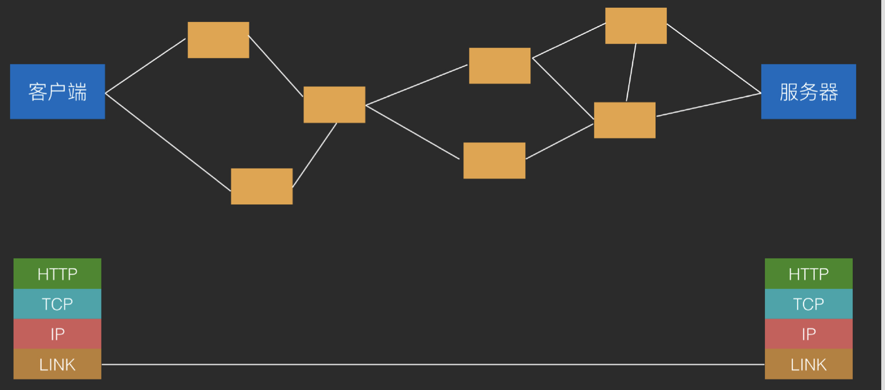
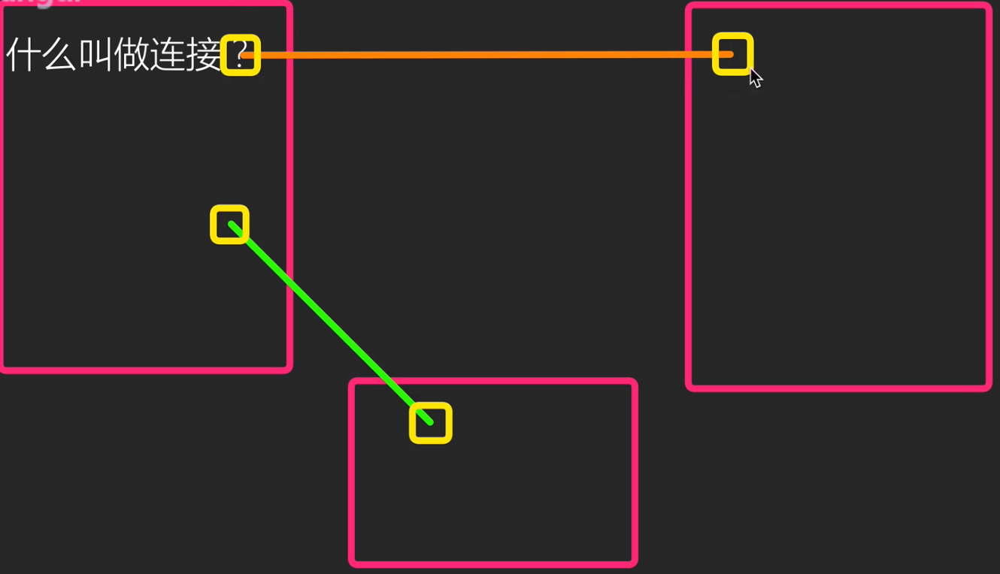
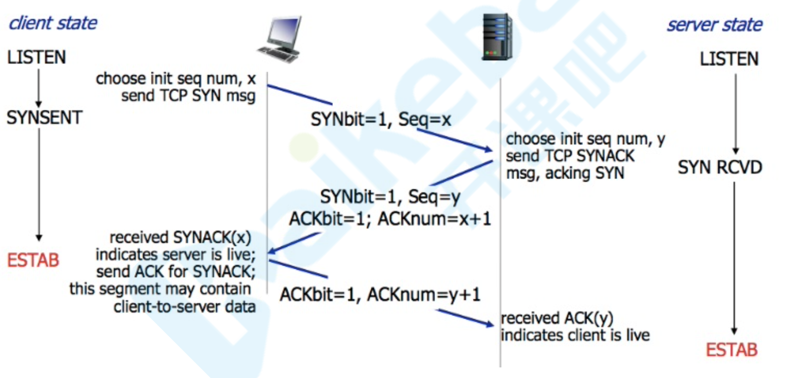
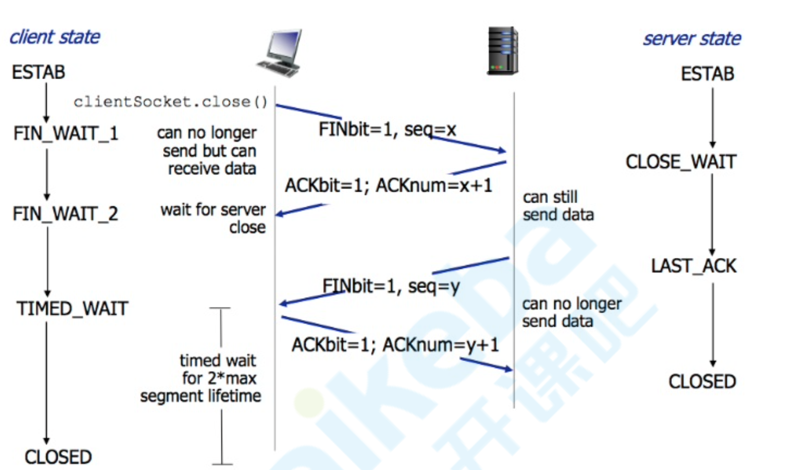

# TCP/IP

概念：一系列协议组成的网络分层模型。

## **为什么要分层？**

因为网络不稳定。

**网络不稳定造成的问题：**

- 传输较大数据时，在复杂网络环境中容易传输失败。

- 若传输失败时，需要把整个报文重新传因此

为了解决这些问题：我们需要将报文分块，传输成功后接收方再将报文拼装好。

**分块传输的优点：**

- 数据分块后，体积变小了，提高了传输的成功率

- 数据分块后，若传输失败，可以只重新传失败的数据块而不是重传全部数据

**实际应用中，我们使用的网络协议不止有HTTP，还有FTP，DNS等协议都有分块传输的需求，我们需要划分两个层级：**

1. HTTP，FTP，DNS等协议组成的应用层。
2. 用于分块传输/接收组装报文的传输层。

**两层分层仍然不能满足实际应用，因为不是所有请求都是需要失败重传的**，游戏/直播等追求实时性的应用是不需要失败重传的，使用的是UDP协议，而失败重传的是TCP协议，所以我们需要拆分一个网络层（IP层）来支持传输层，进行网络数据传输。

**最后，网络层（IP层）也只是一个协议/标准，我们仍然需要真正的物理层面的支持**，这部分能力被划分为数据链路层。



- Application Layer 应用层:HTTP、FTP、DNS 

- Transport Layer 传输层:TCP、UDP
- Internet Layer 网络层:IP
- Link Layer 数据链路层:以太网、Wi-Fi

## TCP 连接

### TCP链接

链接：通信双方互相确认可以通信

建立链接：通信双方建立确认「可以通信」，不会将对方的消息丢弃，即为「建立连接」

TCP链接是有状态的（HTTP是无状态的）

所谓状态是指：我不用每次通信都告知对方自己是谁，要请求什么，对方已经了解你的状态了。

而Http则需要每次请求时都带上header等信息确认状态。

### Java中的TCP实现 ：Socket(套接字)

是对TCP端口的具象化，可以收发消息。

端口：  和外界链接，确认对象状态需要一个收发器，这个收发器就是端口。它只和链接对象做交互，这样的话每个对象对应的链接身份一定是确认过的。Java中端口的具像化则是套接字（Socket英文原意则为插座，正如连根线相连需要插座一样）



###  TCP连接的建立与关闭

Tcp报文结构：首部+数据

首部部分字段定义：

序号（seq number）：TCP链接中传送到字节流中的每一个字节都按顺序编号。首部的序号指本报文段发送的数据的第一个字节的序号。

两个ACK：一个是确认值(Acknowledgement)，为1便是确认连接，是首部的一个字段。
另一个是确认编号(Acknowledgement Number)，即接收到的上一次远端主机传来的seq然后+1，再发送给远端主机。提示远端主机已经成功接收上一次所有数据。

同步（syn）：建立连接时用来同步序号。

终止FIN：用来释放一个链接。


#### 建立：

三次握手：

所谓三次握手(Three-way Handshake)，是指建立一个 TCP 连接时，需要客户端和服务器总共发送3个包。 三次握手的目的是连接服务器指定端口，建立 TCP 连接，并同步连接双方的序列号和确认号，交换 TCP 窗口大小信 息。在 socket 编程中，客户端执行 connect() 时。将触发三次握手。

简单模型：

1. A给B发一个消息 
2. B：知道了，我也要给你发消息
3. A: 我也知道你要给我发消息了

详细：

**第一次握手(SYN=1, seq=x):** 

客户端发送一个 TCP 的 SYN 标志位置1的包，指明客户端打算连接的服务器的端口，以及初始序号 X,保存在包头 的序列号(Sequence Number)字段里。发送完毕后，客户端进入 SYN_SEND 状态。

**第二次握手(SYN=1, ACK=1, seq=y, ACKnum=x+1)：**

服务器发回确认包(ACK)应答。即 SYN 标志位和 ACK 标志位均为1。服务器端选择自己 ISN 序列号，放到 Seq 域 里，同时将确认序号(Acknowledgement Number)设置为客户的 ISN 加1，即X+1。 发送完毕后，服务器端进入

SYN_RCVD 状态。

**第三次握手(ACK=1，ACKnum=y+1)：**

客户端再次发送确认包(ACK)，SYN 标志位为0，ACK 标志位为1，并且把服务器发来 ACK 的序号字段+1，放在确 定字段中发送给对方，并且在数据段放写ISN的+1
 发送完毕后，客户端进入 ESTABLISHED 状态，当服务器端接收到这个包时，也进入 ESTABLISHED 状态，TCP 握手 结束。

完成三次握手，主机A与主机B开始传送数据。

**注意** ：因为一个SYN将占用一个序号，所以要加1。

各个状态名称与含义

 ```
  - CLOSED: 这个没什么好说的了，表示初始状态。 
  - LISTEN: 这个也是非常容易理解的一个状态，表示服务器端的某个SOCKET处于监听状态，可以接受连接了。 
  - SYN_RECV: 这个状态表示接受到了SYN报文，在正常情况下，这个状态是服务器端的SOCKET在建立TCP连接时的三次握手会话过程中的一个中间状态，很短暂，基本 上用netstat你是很难看到这种状态的，除非你特意写了一个客户端测试程序，故意将三次TCP握手过程中最后一个ACK报文不予发送。因此这种状态 时，当收到客户端的ACK报文后，它会进入到ESTABLISHED状态。 
  - SYN_SENT: 这个状态与SYN_RECV遥想呼应，当客户端SOCKET执行CONNECT连接时，它首先发送SYN报文，因此也随即它会进入到了SYN_SENT状 态，并等待服务端的发送三次握手中的第2个报文。SYN_SENT状态表示客户端已发送SYN报文。
  - ESTABLISHED：这个容易理解了，表示连接已经建立了。
 ```



#### 关闭

为什么关闭：省资源

怎么关闭：释放链接

四次挥手


由于TCP连接是全双工的，因此每个方向都必须单独进行关闭。这个原则是当一方完成它的数据发送任务后就能发送一个FIN来终止这个方向的连接。收到一个 FIN只意味着这一方向上没有数据流动，一个TCP连接在收到一个FIN后仍能发送数据。首先进行关闭的一方将执行主动关闭，而另一方执行被动关闭。

TCP的连接的拆除需要发送四个包，因此称为四次挥手(four-way handshake)。客户端或服务器均可主动发起挥手动作，在socket编程中，任何一方执行close()操作即可产生挥手操作。

简单：

第一条

A：我没有消息给你了

B：我知道了

第二条：

B：我也没有消息给你了

A：我也知道了

为何分两条发：A不发送的时候，B可能还有消息要发送。

详细：

TCP 的连接的拆除需要发送四个包，因此称为四次挥手(Four-way handshake)，也叫做改进的三次握手。客户端或服务器均可主动发起挥手动作，在 socket 编程中，任何一方执行 close() 操作即可产生挥手操作。

1. **第一次挥手(FIN=1，seq=x)**假设客户端想要关闭连接，客户端发送一个 FIN 标志位置为1的包，表示自己已经没有数据可以发送了，但是仍然 可以接受数据。发送完毕后，客户端进入 FIN_WAIT_1 状态。
2. **第二次挥手(ACK=1，ACKnum=x+1**)服务器端确认客户端的 FIN 包，发送一个确认包，表明自己接受到了户端关闭连接的请求，但还没有准备好关闭 连接。发送完毕后，服务器端进入 CLOSE_WAIT 状态，客户端接收到这个确认包之后，进入 FIN_WAIT_2 状态，等待服务 器端关闭连接。
3. **第三次挥手(FIN=1，seq=y)** 服务器端准备好关闭连接时，向客户端发送结束连接请求，FIN 置为1。发送完毕后，服务器端进入 LAST_ACK 状态，等待来自客户端的最后一个ACK。 
4. **第四次挥手(ACK=1，ACKnum=y+1)**
   客户端接收到来自服务器端的关闭请求，发送一个确认包，并进入 TIME_WAIT 状态，等待可能出现的要求重传的 ACK 包。服务器端接收到这个确认包之后，关闭连接，进入 CLOSED 状态。 客户端等待了某个固定时间(两个最大段生命周期，2MSL，2 Maximum Segment Lifetime)之后，没有收到服务器端的 ACK ，认为服务器端已经正常关闭连接，于是自己也关闭连接，进入 四次挥手的示意图如下:




##  ⻓连接

###  为什么要⻓连接?

因为移动网络并不在 Internet 中，而是在运营商的内网，并不具有真正的公网 IP， 因此当某个 TCP 连接在一段时间不通信之后，网关会出于网络性能考虑而关闭这条 TCP 连接和公网的连接通道，导致这个 TCP 端口不再能收到外部通信消息，即 TCP 连接被动关闭。

### ⻓连接的实现方式

心跳。即在一定间隔时间内，使用 TCP 连接发送超短无意义消息来让网关不能将自 己定义为「空闲连接」，从而防止网关将自己的连接关闭。

