# Git 深入之核心概念:一切皆引用

##  Git基本概念

Git和传统中央仓库版本管理工具的区别

1. 分布式，即所有人都能得到所有文件的提交记录，而不是放在中央仓库，其他人只能拿到最新代码

2. 可以脱离中央仓库离线提交，虽然早晚得联网传，但是如果你写了1w行，一次性在提交，同事更新后就疯了，以后自己看也麻烦，Git能拆成小提交离线提交在本地，中央仓库这时不联网就不行。

3. 仓库会比较大，但是因为代码都是文本，而且依赖一般不用提交，仓库大小也不会太大，但是游戏开发一般使用中央仓库，因为游戏中使用了大量媒体文件，体积庞大

<!--more-->


##  Git 仓库数据结构和常用概念


### Git 仓库数据结构

* Git 仓库由一个个的 commit（记录） 组成

* 某些 commit 上会有一些 branch 指向它们，这些 branch 的本质是引用

* 有一个特殊的引用叫做 HEAD，它始终指向当前的位置，这个位置可以是 commit，也可以是 branch

  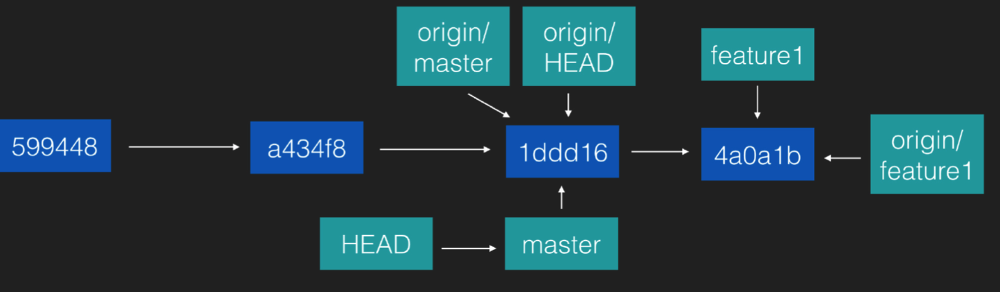


###  常用概念：commit(本质是改动)

commit 表示对于一次改动的提交，它可以代表当前时刻下 Git 仓库的完整快照，但 **本质上，commit 只是记录了距离上一次 commit 之间的改动。**

```
commit df68708ea927ab8af62a57dc1ae6e3880da23b6e (HEAD -> master, origin/master, origin/HEAD)

Author: wuyuanaaa <dao332508553@163.com>

Date: Sun May 5 21:48:49 2019 +0800

修复

commit f74ce755cbd97ce17731348a503bf70d691c53ab

Author: wuyuanaaa <dao332508553@163.com>

Date: Sat May 4 00:11:54 2019 +0800

admin
```

乱码是这次提交的hash值，代表这次提交，过去用sha1算出，以后用sha256，一般用前4，5位就行，如果重复了再加长

###  常用概念：staging area 暂存区和 add

- staging 原意:舞台表演前的筹划准备(例如汇集道具和演员)。Git 中的意 思:把改动内容汇集起来以待提交。

- staging area:待提交的修改内容暂时存放的地方。主要用于和已经改动但不打 算提交的内容区分开来。

- add 指令:把指定的内容放进暂存区。 git add README.md

  ```bash
  git add README.md
  ```

  

###  常用概念：仓库，就是.git 目录

`.git` 隐藏目录就是仓库，记录所有改动，当前状态，靠它保存历史的

###  常用概念：引用

指向某个commit的指针，或者指向某个引用的引用（指针的指针，其实还是指向commit，只有一个例子就是HEAD 只有Head能指向别的引用）

```
commit df68708ea927ab8af62a57dc1ae6e3880da23b6e (HEAD -> master, origin/master, origin/HEAD)

Author: wuyuanaaa <dao332508553@163.com>

Date: Sun May 5 21:48:49 2019 +0800
(HEAD -> master, origin/master, origin/HEAD)
```

这串就是引用

### 常用概念：branch 和 master

```
git branch feature1
```

- branch 的含义是分支，指的是仓库结构出现分叉时的不同的「叉」本质上，git 的 branch 是引用(reference)，即指向某个 commit 的指针 直观感觉的 branch:


直观感觉的 branch:

> commit 前

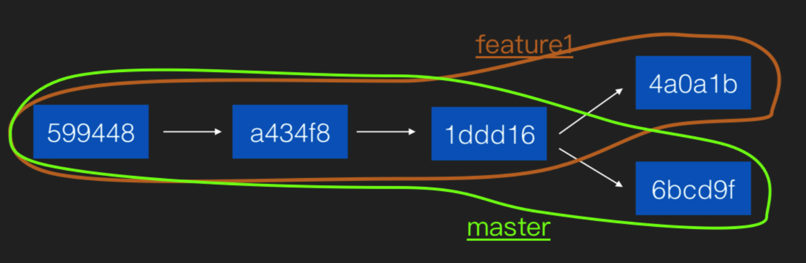

> commit 后


而实质上的brach：

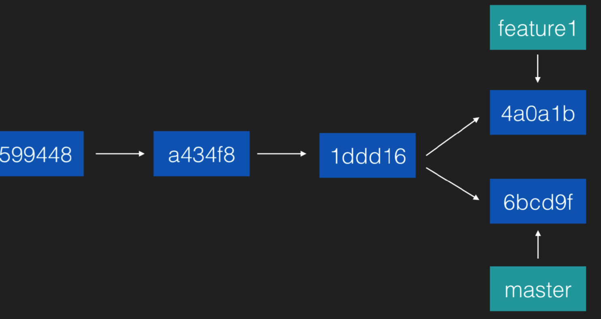

- master 是一个特殊的 branch，因为它是 Git 的默认 branch(默认 branch可以修改)。默认 branch 的特点:
  - 执行 clone 方法把仓库取到本地的时候，默认 checkout 出来的是默认 branch，即 master;
  - 在执行 push 命令把本地内容推送到远端仓库的时候，远端仓库的 HEAD 永 远跟随默认 branch，而不是和本地 HEAD 同步。换句话说，只有 push master 分支到远端的时候，远端的 HEAD 才会移动。

### 常用概念：HEAD

- HEAD 也是引用，但它不是 branch，它代表了当前所处的位置。HEAD 不仅可

- 以指向某个 commit，也可以指向某个 branch(例如 master、feature1) 当每次 commit 的时候，HEAD 不仅随着新的 commit 一起移动，而且如果它指向了某个 branch，那么它也会带着 branch 一起移动

> commit 后

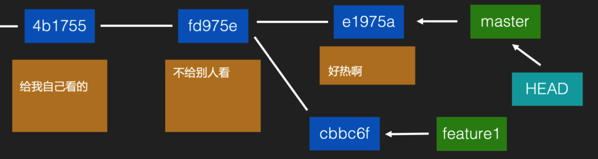

###  常用概念：clone 

clone 是从远端仓库初次把数据取下来:

```bash
git clone  https://github.com/zz/git-demo.git
```

1. 把整个仓库中的所有branch取下来，并把从初始commit到达这些branch的路径上的所有 commit 都取下来

   （把仓库`.git` 目录的提交记录down下来,然后下载代码）

   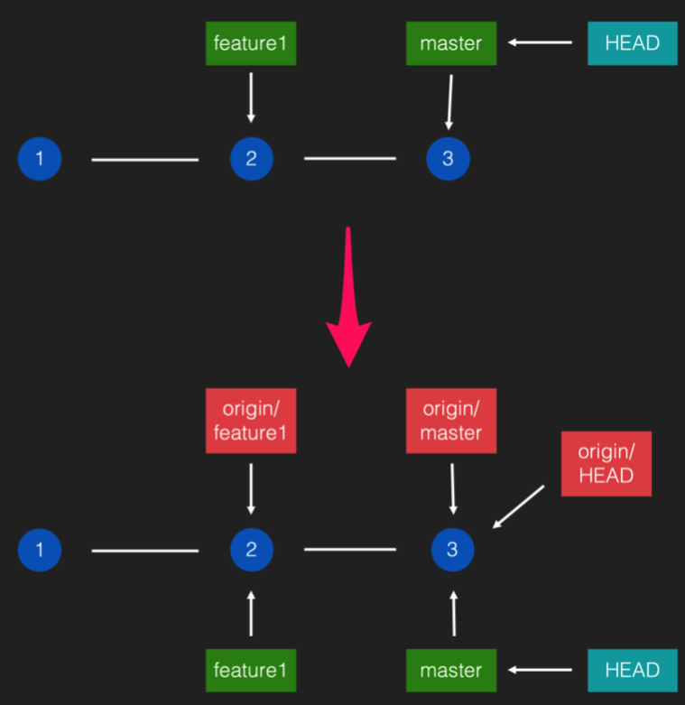

2. 从初始commit开始，向master指向的commit，一个个地把每个commit应 用，最终得到一个「当前」状态的仓库内容，写进 Git 所在的目录(这个目录叫 做 working tree)


### 常用概念：log

```bash
git log
```


从 HEAD 指向的 commit 开始，倒序显示每一个 commit 的摘要信息

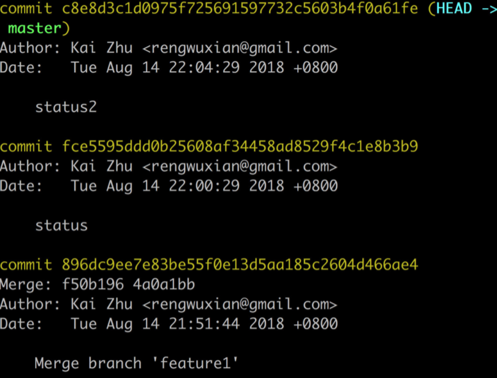

### 常用概念：merge

merge 就是合并，它会把当前 commit 和指定 commit(所谓 commit，可以直接用 它的 hash 值来指定，例如 `4a0a1b` ，也可以用一个直接或间接指向它的引用来指 定，例如` master `或者 `HEAD `)进行合并，并把这个合并行为创建成一个新的 commit。

```bash
git merge feature1
```

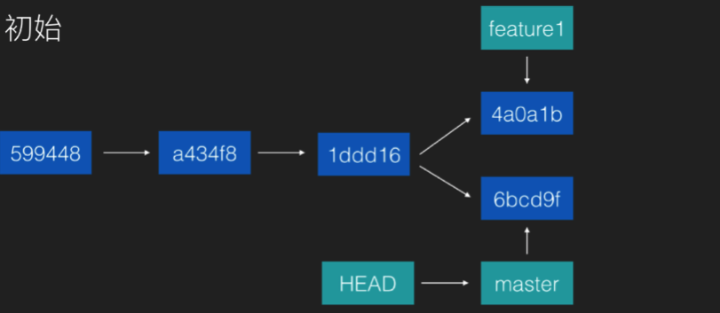

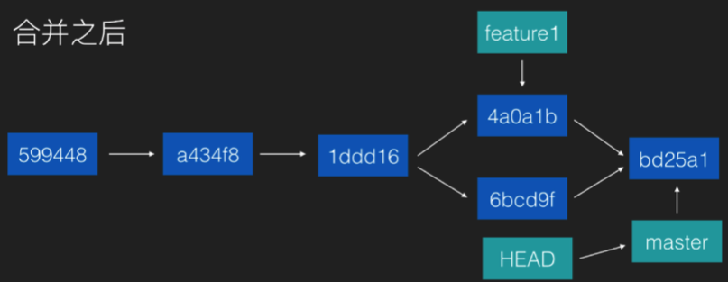

merge 行为所产生的 commit，是一种特殊的 commit:

1. 它不需要有改动，只要指定两个(或更多个)父commit就好

2. 正如上面这句说的，它有两个或更多个父commit，这是一般的commit不具有

   的性质


#### **merge** 冲突

 当 Git 不知道怎么合并某两处冲突的修改时，会中断自动合并，并对冲突文件进行标

记。解决方法:

1. 把文件手动修改好
2. 把修改的内容使用add来添加进暂存区
3. 用 git merge --continue 来继续自动合并流

3. 

### 关于 **origin/** 打头的 branch

本地仓库中，有一些以 `origin/` 打头的 branch，它们是远端仓库(别名为 origin)的本地镜像。它们的作用是方便在本地查看远端仓库的 branch 状态。

> 远端仓库默认名称是 origin，但也可以给它们起别的名称

`origin/` 分支并不在本地直接操作，它们一般只在两种情况下会进行自动更新:

1. 在执行push的时候，push成功后，push成功的branch会把它对应的 `origin/` branch 更新到当前 commit(因为远端的 branch 已经随着 push 的  成功而更新，所以本地镜像也一起更新)
2. 在执行pull或者fetch的时候，由于从远端拿到了所有最新的branch状态，所以也会一同更新所有的 `origin/ `branch

> 关于 origin/HEAD:这是一个永远跟随 origin/master 的引用，它最大的作用是用来标记默认 branch

###  常用概念：push

```bash
git push origin feature1
```

把当前 branch 推送到远端仓库的指定分支。

具体做三件事:

1. 把HEAD所指向的branch(只是一个引用哦)推送到远端仓库
2. 从这个branch向前回溯，远端仓库缺少的每一个commit也推送到远端仓库。
3. 将 push 的 branch 的本地镜像 origin/xxx 更新

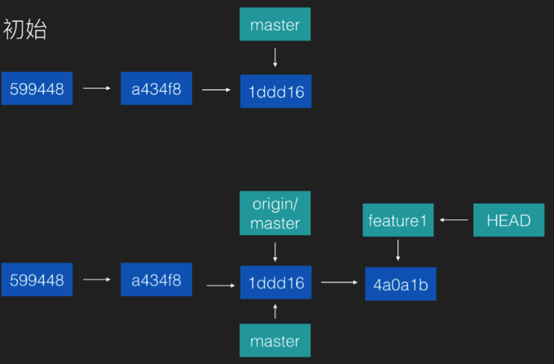

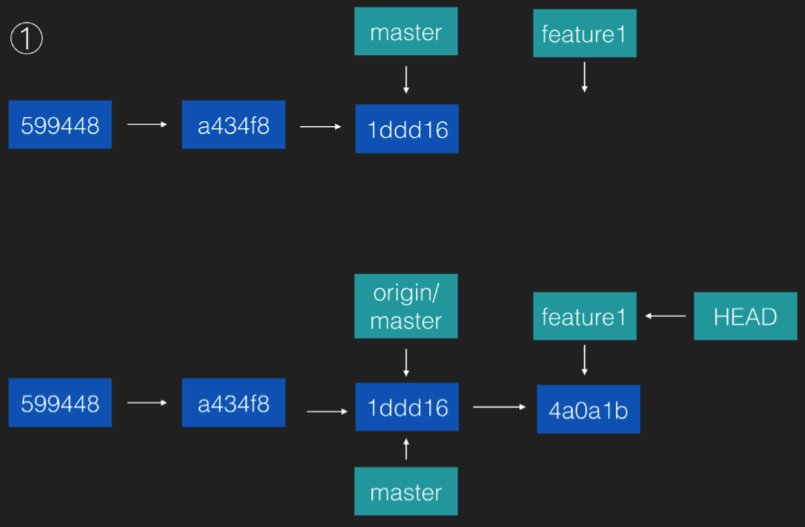

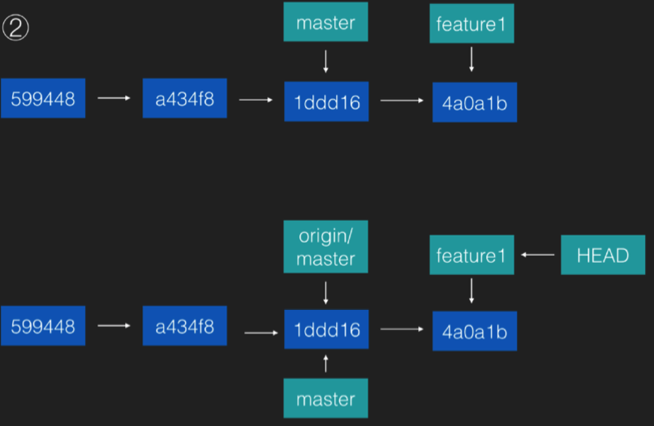

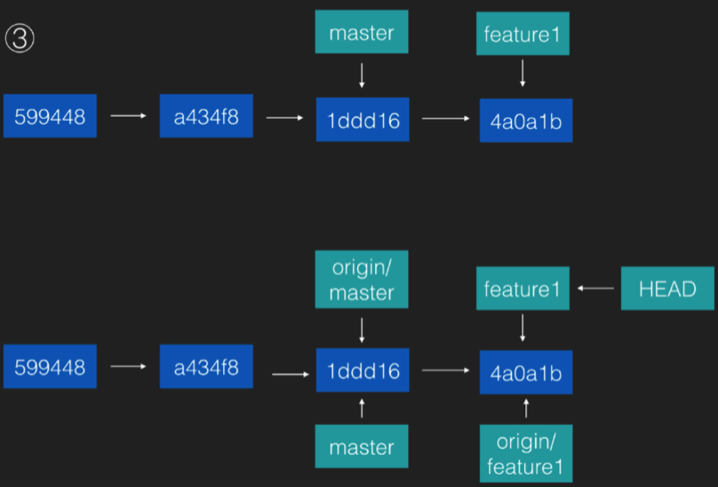

>  注意:origin/HEAD 并没有在图上画出来，但如果 push 是 master(即默认 branch)，那么本地的 `origin/HEAD` 也会更新到 master 的最新位置;当 push 的是其他 branch 的时候， `origin/HEAD` 并不会更新。
>
> 也就是说， `origin/HEAD` 只和默认分支相关，和 `HEAD` 是无关的

### 常用概念：pull

```bash
git pull origin feature1
```

把远端 branch 取到本地。 具体做的事有三件:

1. 把远端所有 branch 的最新位置更新到本地的 `origin/xxx` 镜像
2. 要到达这些branch，本地所缺少的所有commit，也取到本地
3. 把` origin/当前branch` 的内容合并到当前 branch

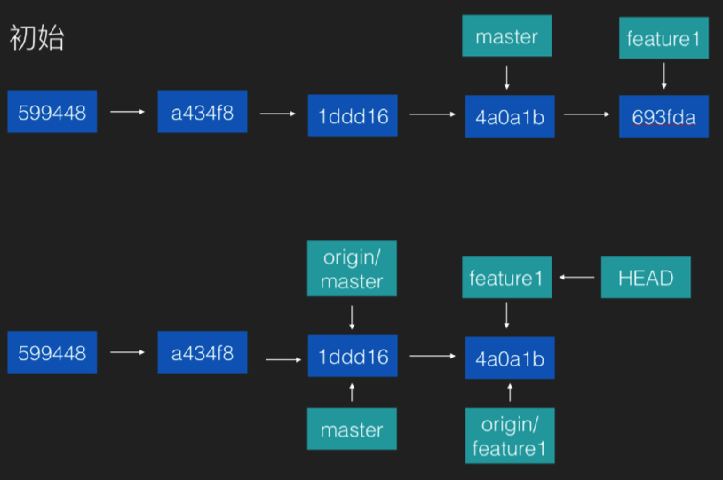

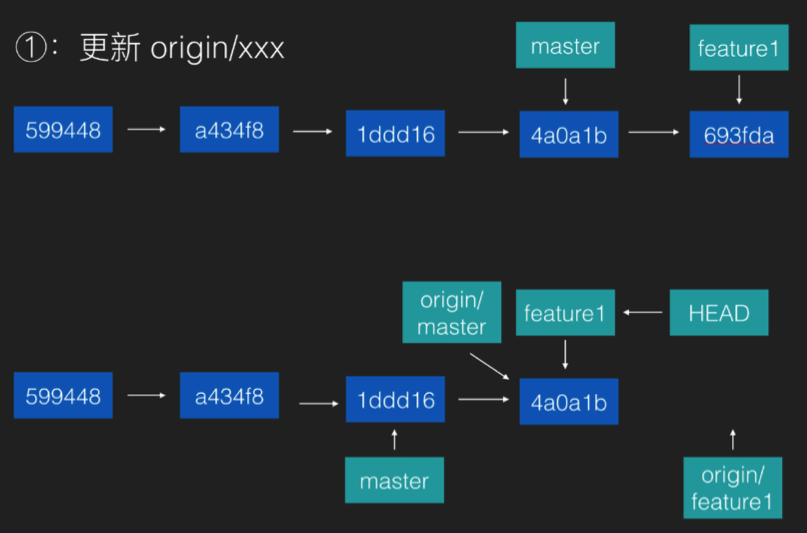

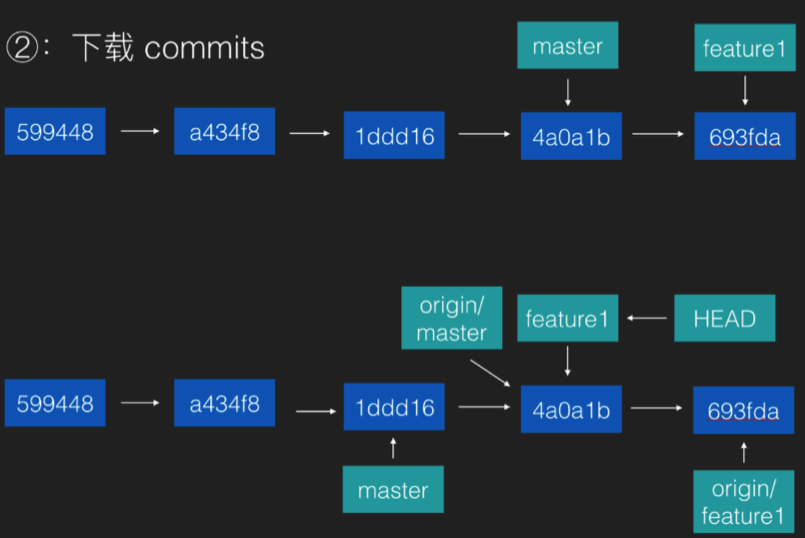

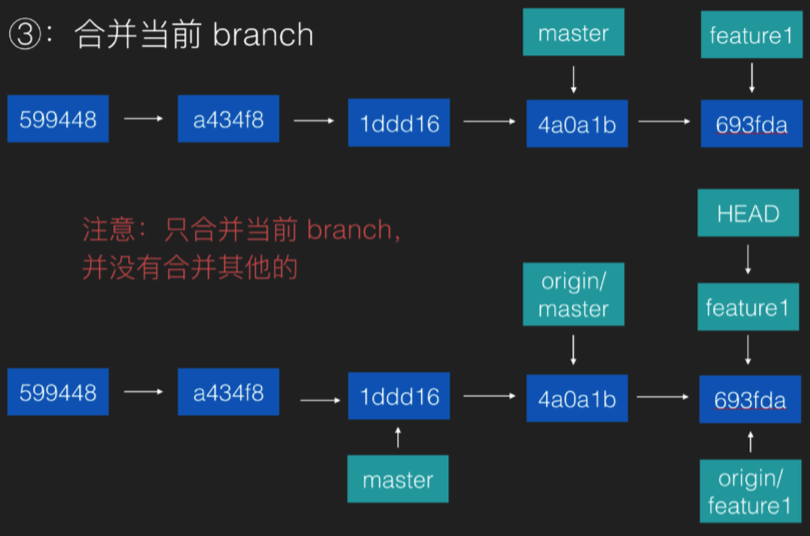

事实上，`git pull origin feature1` 会分成两部执行，它等价于下面两行:

```bash
git fetch
git merge origin/feature1
```

