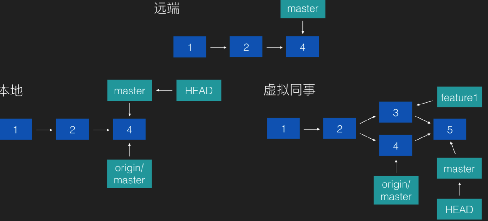
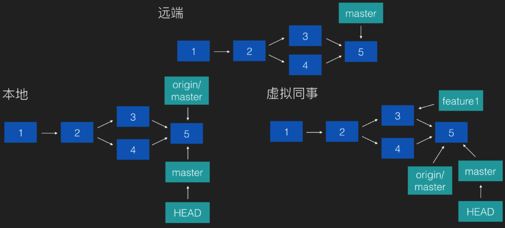
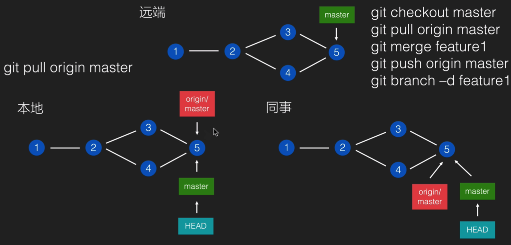
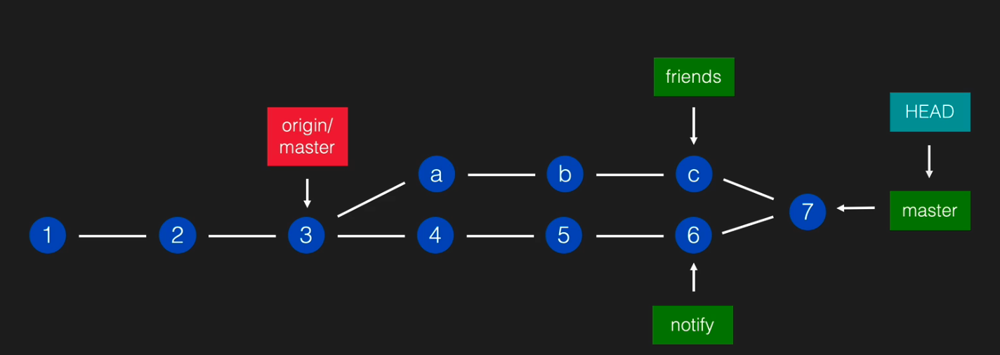
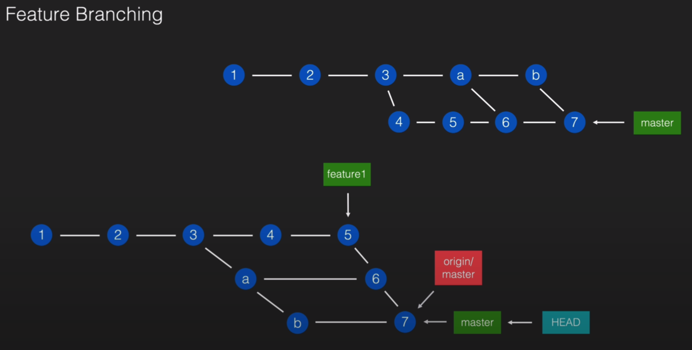

# 【Git-02】Git深入之FeatureBranching

## branch 的作用

- 让项目可以同时做多件事
- 未做完的事不会被项目真正收录

**场景1:**

1. 你的同事在本地新建了一个 本地分支 feature1 用于开发新特性

2. 在同事开发的过程中你向 远端 master 分支  push 了一条commit

3. 你的同事向提交到master 分支的时候就需要：
   1. checkout 切换到master 分支
   2. pull origin master  拉取远端 master 分支的最新代码
   3. 将 本地 feature1 分支和 master 分支合并
   4. 将 处理好合并冲突的  master分支  push 到远端
   5. 本地 feature1  分支完成使命不需要 push 到远端  `git branch -d [分支名]`

**场景2: 薛定谔的功能**

你的boss 交给你两个新功能开发的任务，分别是 **通知**功能 和 **朋友圈分享** 功能。

但这两个功能上线的先后顺序和时间都是不确定的

你可以根据两个功能的特性 在本地新建两个 分支 friends 和 notify ，这样无论要先上线哪个功能都可以迅速打包上线

当两个功能全部开发完成后再合并回master分支即可

## Feature Branching （分支特性）

做法: 每开发一个新的功能做一个修复，都使用单独的分支，在做完之后 merge 到 master 去

- 本地 merge:由于别人可能在你之前 push 过，所以你的 push 可能失败。所以 通常会需要先 pull 一下，然后再 push

- 使用 github:先创建 pull request，在同事审阅完成之后，通过按钮实现在线 merge 
  - pull request 是什么:是开发者对远端仓库的提出的「拉取某个 branch」 的请求

