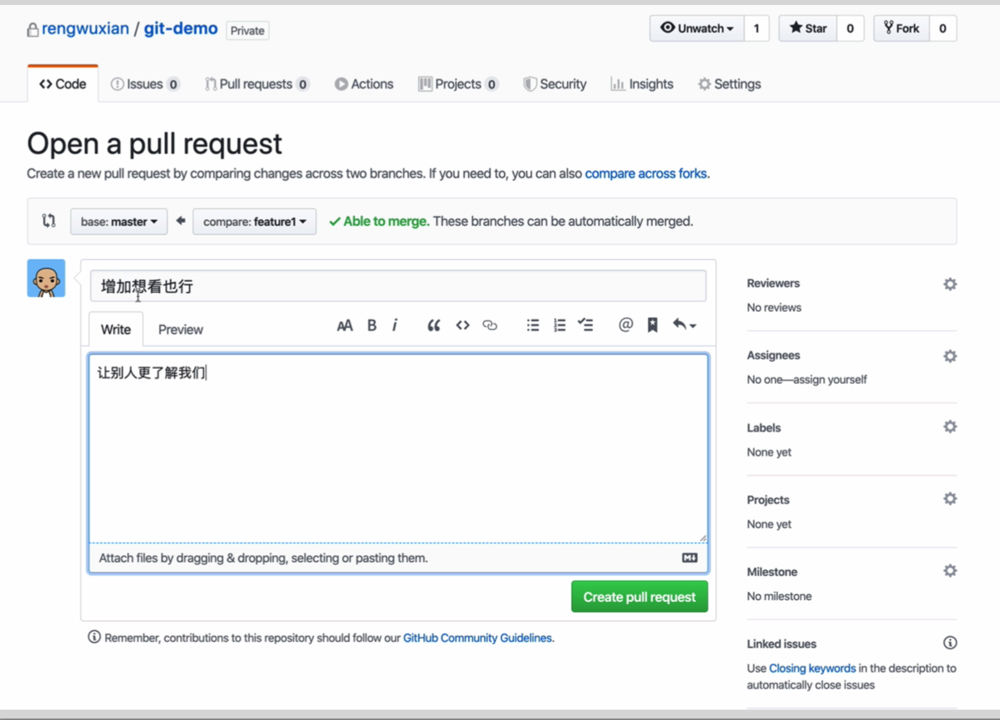

# 【Git-02】Git深入之FeatureBranching

## branch 的作用

- 让项目可以同时做多件事
- 未做完的事不会被项目真正收录

我们可以拿漫威宇宙当比喻来

实例之薛定谔的功能

## Feature Branching

做法:每开发一个新的功能做一个修复，都使用单独的分支，在做完之后 merge 到 master 去

本地 merge:由于别人可能在你之前 push 过，所以你的 push 可能失败。所以 通常会需要先 pull 一下，然后再 push

- 使用 github:先创建 pull request，在同事审阅完成之后，通过按钮实现在线 merge
  - pull request 是什么:是开发者对远端仓库的提出的「拉取某个 branch」 的请求

