# 【Git-03】Git常用指令和其本质


## checkout

- 移动 HEAD，让它指向某个 commit 或某个 branch。
- checkout --detach :让 HEAD 脱离当前 branch，直接指向下面的 commit。

<!--more-->

`checkout`很好的体现了Git 一切皆引用的思想

### 移动 HEAD，让它指向某个 commit 或某个 branch。

**指向指定分支**：

执行一下

```bash
git checkout feature1
```

打开`./git/HEAD`文件，你可以看到里面的内容是：`ref: refs/heads/master`

**你也可以指向某个commit**：

执行`git log` 打印commit记录，并找到一个想要指向的 commit 的 hash 值

```bash
$ git log

...

commit ca9dd5566cbc6bc599d1ca88e3e6cf9b8ce38cc2
Author: zhangzhuang <xx@xx.com>
Date:   Thu Feb 25 14:44:43 2021 +0800

    first commit
```

在此执行 checkout 指定想指向的hash 值

```bash 
$ git checkout ca9dd
Note: checking out 'ca9dd'.

You are in 'detached HEAD' state. You can look around, make experimental
changes and commit them, and you can discard any commits you make in this
state without impacting any branches by performing another checkout.

If you want to create a new branch to retain commits you create, you may
do so (now or later) by using -b with the checkout command again. Example:

  git checkout -b <new-branch-name>

```

这次再打开`./git/HEAD`文件，你可以看到里面的内容是：`ca9dd5566cbc6bc599d1ca88e3e6cf9b8ce38cc2`

对于文件系统而言，HEAD文件中指定的值就代表了你要想指向的文件。这个值就是所谓的引用，方便且轻便（一个值只有几个字节）。

### checkout --detach :让 HEAD 脱离当前 branch，直接指向下面的 commit。

执行 `git log` 的时候 你会发现 HEAD 一般情况都是 先指向 branch 的引用， branch 再指向指定 commit的引用

```bash
$ git log
commit c95c8ca4a1ff8d2b76be1743aec9230e5b1a6914 (HEAD -> feature1)
Author: x x <xx@doushen.com>
Date:   Thu Feb 25 18:54:17 2021 +0800

    虚拟同事的第一个commit
```

差不多就像这样：

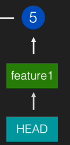

如果我们想直接指向 指定的commit 引用，脱离branch引用，你可以

```
$ git checkout c95c8c（这个id是 这个分支最后的一个commit的 ，也就是当前 feature1 指向的）
```

就会变成这样

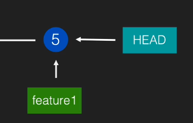

```bash
$ git log
commit c95c8ca4a1ff8d2b76be1743aec9230e5b1a6914 (HEAD, feature1)
Author: xx <xx@xx.com>
Date:   Thu Feb 25 18:54:17 2021 +0800

    虚拟同事的第一个commit
```

原本的`HEAD -> feature1`变成了`HEAD, feature1`,HEAD 不再指向 分支 feature1，它脱钩了。

当我们指向远端镜像`origin/master`的时候,因为远端引用是一种特殊的引用，无法用HEAD指向，所以当我们执行

```bash
git checkout origin/master
```

HEAD 依然会滑落向 commit的 id
```bash
$  git log
commit bf7b8810f496a4700034d9504ac35e0d54de4156 (HEAD, origin/master, origin/HEAD, master)
Merge: 885f078 c95c8ca
Author: zhangzhuang <xx@xx.com>
Date:   Thu Feb 25 18:55:47 2021 +0800

    Merge branch 'feature1'
```

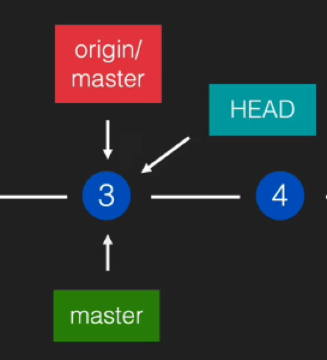

打开文件`.git/HEAD`你就会看到`bf7b8810f496a4700034d9504ac35e0d54de4156`

所以HEAD 从你指向的 `origin/master`滑落后你仍然能看到`git log`内容，就是因为HEAD文件中存储了相应的引用，当我们使用指令的时候它就会读这个文件，它就像运行时程序的内存一样，只不过它是直接存储在文件里实时读取的，

## rebase

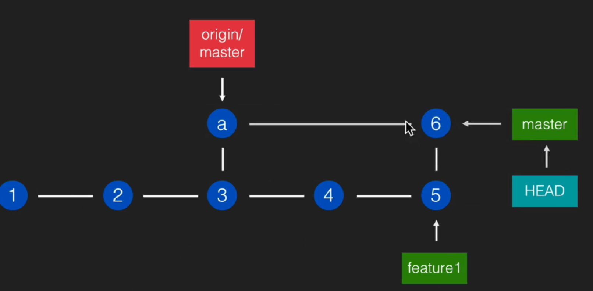

当我们在本地用 新分支 feature1 开发的时候 master分支 可能有别人提交的提交 `commit a`

我们需要做的事是

```bash
$ git checkout master
$ git merge feature1 
$ git push origin master
```

但是`merge`操作是会 产生一个新的`commit 6` ，它是由 `commit a` 和`commit  5`两个父提交产生的

有时候我们会希望像下图这样让历史这条线合成一条

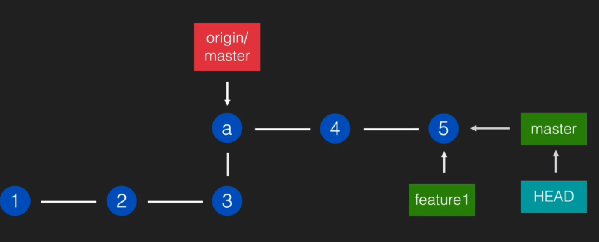

我们只需要执行  

```bash
$ git rebase master
```

当然，如果你所在的`feature1`分支完全超前于` master`分支，`rebase`是不会起任何作用的，你也不需要rebase

 **总结：**把当前 commit(以及它之前的 commits)应用到指定的需要 rebase 的 commit 上。

> Git 中的每一个 commit 都是不会改变的，所以 rebase 之后的每个 commit 都 是新产生的，而不是对原先的 commit 进行「修改」


虽然master 分支的 `commit  4‘ 和 5’`看起来和 feature1的 `coomit 4，5`是一样的内容，但是却不是 相同的commit  而是 原版 `feature1` 分支 	`4`和`5`的镜像（copy）

比如你在 `commit 5`再建立一个分支 `feature2`，再将`feature1` rebase到 `master`分支, `feature2`分支也不会消失，因为原来的commit都还存在

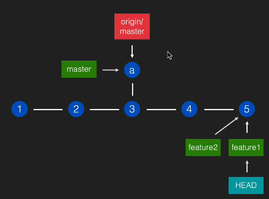

## rebase 冲突

`rebase` 的冲突解决方法和` merge` 冲突一样，只是把 `git merge --continue` 改成` git rebase --continue` 就行了

解决完冲突的文件 `add`进暂存区即可。


## reset

把当前 branch 指向指定的 commit。

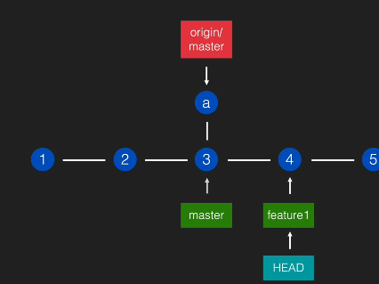

- `git reset 指定commitId `
   移动到指定 commit，并保留 working tree 的内容，

   （也就是代码仍然保留，会提示你有内容需要提交）
   
- `git reset 指定commitId --hard` 指定commit 

  移动到指定 commit，并重置 working tree，
  
  你的HEAD 分支都指向这个commit，代码也不会保留

我们可以reset到不同的引用上去：

1. 我们可以`reset`到指定commit

	```bash
	git reset 4
	git reset 5
	```

	此时`HEAD`仍然指向`feature1`，因为`reset`会带走`branch`
	
2. 我们可以`rese`到其他分支，但是因为reset会带走分，分支无法指向分支，它的指向会滑落到指定commit

   ```bash
   git reset master
   ```

   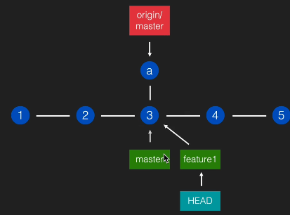

   指向不能被指的`origin/master`，当然也会滑落到具体`commit`

   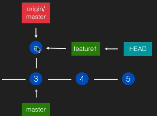

3. 如果我们指定`checkout`某个`commit`让`HEAD`和`feature1`脱钩，再做`reset feature1`它会指向`feature1`指向的` commit a`，并没有指向`feature1`。

   `reset` 的目标是纠正下面所指向的那个分支，让它指向别的某个提交。

   `reset` 会移动`HEAD`但它的目标不是移动`HEAD`·而是移动`HEAD`所指向的`branch`

   

   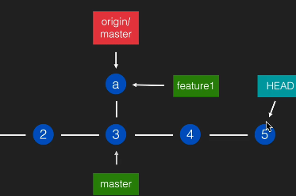

   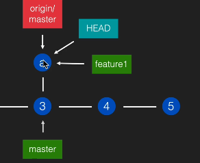

## reset 和 **checkout** 的区别

 它们都是移动 HEAD，但 chekcout 移动的时候是自己移动，不带着 branch 一起,而 reset 会带着 branch 一起移动。


## 提交过的东⻄写错了

1. 最新的一条内容需要修改（刚提交完就写错了）:

   ```bash
    git commit --amend
   ```

   > 「修改」只是概念行为，实质上会产生一个新的 commit

2. 旧的内容需要修改:

   交互式 rebase

   ```
   git rebase -i HEAD~4
   ```

   常用选项:

   - pick 或 p :沿用
   - reword 或 r :修改 commit message
   - edit 或 e :修改 commit 内容
   - drop 或 d :删除
   - squash 或 s :和上一条融合，并且合并 commit message(可编辑) fixup 或 f :和上一条融合，并且沿用上一条的 commit message

3. 已经push到master的内容需要删除:

   不能用 rebase，因为 master 上的东⻄是不能强行修改的

   可以用 git revert 指定commit 来撤销。它的原理是创建一个新的 commit，内容是指定 commit 的「相反内容」

## **add -i** 交互式 add

用法:	

```bash
git add -i
```

常用选项:

- p (patch)

选取块时的常用选项:

- y:选用当前块
- n:不用当前块 s:把当前块做自动切分后再重新询问 e:手动选取修改内容

tag

另一种引用类型。

- 和 branch 区别之一: 不能改变
- 和 branch 区别之二: 不能被 HEAD 指向
- 用处: 设置持久标记，例如版本号
- origin/master, origin/feature, origin/HEAD 和 tag 有相似之处:也不能从本地 改变位置，也不能被 HEAD 指向

## cherry-pick

用法:

```bash
git cherry-pick commit1 commit2
```

用途: 应用指定的某个或某些 commit 到 HEAD 处

- 比如我想抛弃某个 branch，这个特性不要了，但它的某两个 commit 我希望保留

- git cherry-pick 这两个 commit


## reflog

用法:

```bash
git reflog <branch>
```


用途:
 查看指定的引用(HEAD 或 branch)的移动历史，从而找到之前的某个特定 commit