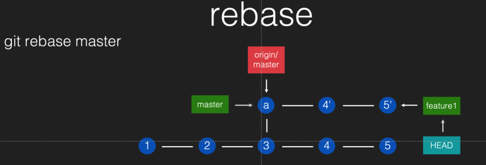
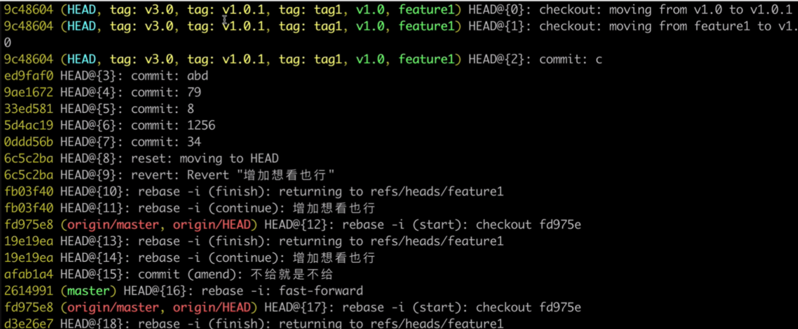

# 【Git-03】Git常用指令和其本质

## checkout

- 移动 HEAD，让它指向某个 commit 或某个 branch。
- checkout --detach :让 HEAD 脱离当前 branch，直接指向下面的 commit。

<!--more-->

## rebase

把当前 commit(以及它之前的 commits)应用到指定的需要 rebase 的 commit 上。

> Git 中的每一个 commit 都是不会改变的，所以 rebase 之后的每个 commit 都 是新产生的，而不是对原先的 commit 进行「修改」




虽然 4‘ 和 5’

## rebase 冲突

rebase 的冲突解决方法和 merge 冲突一样，只是把 git merge --continue 改成 git rebase --continue 就行了


## reset

把当前 branch 指向指定的 commit。

- git reset 指定commit
   移动到指定 commit，并保留 working tree 的内容

- git reset --hard 指定commit 

  移动到指定 commit，并重置 working tree


## reset 和 **checkout** 的区别

 它们都是移动 HEAD，但 chekcout 移动的时候是自己移动，不带着 branch 一起;

而 reset 会带着 branch 一起移动


## 提交过的东⻄写错了

1. 最新的一条内容需要修改:

   ```bash
    git commit --amend
   ```

   > 「修改」只是概念行为，实质上会产生一个新的 commit

2. 旧的内容需要修改:

   交互式 rebase

   ```
   git rebase -i HEAD~4
   ```

   常用选项:

   - pick 或 p :沿用
   - reword 或 r :修改 commit message
   - edit 或 e :修改 commit 内容
   - drop 或 d :删除
   - squash 或 s :和上一条融合，并且合并 commit message(可编辑) fixup 或 f :和上一条融合，并且沿用上一条的 commit message

3. 已经push到master的内容需要删除:

   不能用 rebase，因为 master 上的东⻄是不能强行修改的

   可以用 git revert 指定commit 来撤销。它的原理是创建一个新的 commit，内容是指定 commit 的「相反内容」

## **add -i** 交互式 add

用法:	

```bash
git add -i
```

常用选项:

- p (patch)

选取块时的常用选项:

- y:选用当前块
- n:不用当前块 s:把当前块做自动切分后再重新询问 e:手动选取修改内容

tag

另一种引用类型。

- 和 branch 区别之一: 不能改变
- 和 branch 区别之二: 不能被 HEAD 指向
- 用处: 设置持久标记，例如版本号
- origin/master, origin/feature, origin/HEAD 和 tag 有相似之处:也不能从本地 改变位置，也不能被 HEAD 指向

## cherry-pick

用法:

```bash
git cherry-pick commit1 commit2
```

用途: 应用指定的某个或某些 commit 到 HEAD 处

- 比如我想抛弃某个 branch，这个特性不要了，但它的某两个 commit 我希望保留

- git cherry-pick 这两个 commit


## reflog

用法:

```bash
git reflog <branch>
```



用途:
 查看指定的引用(HEAD 或 branch)的移动历史，从而找到之前的某个特定 commit