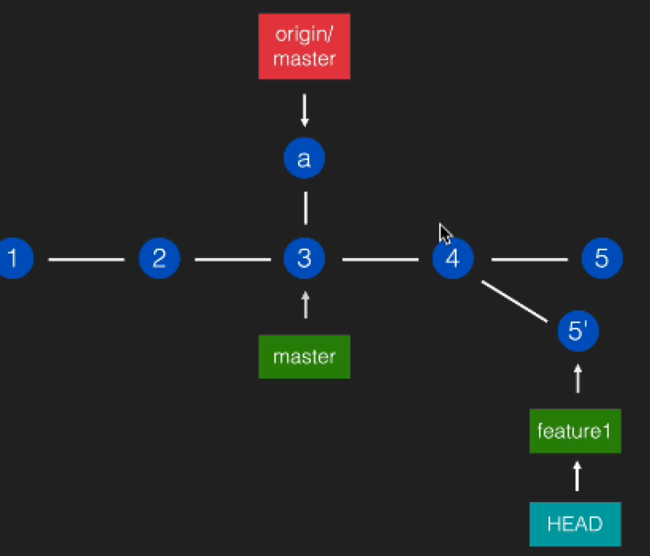
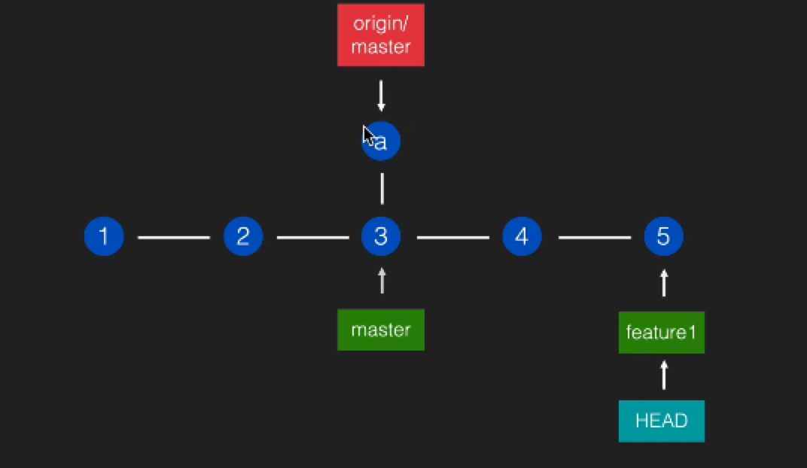
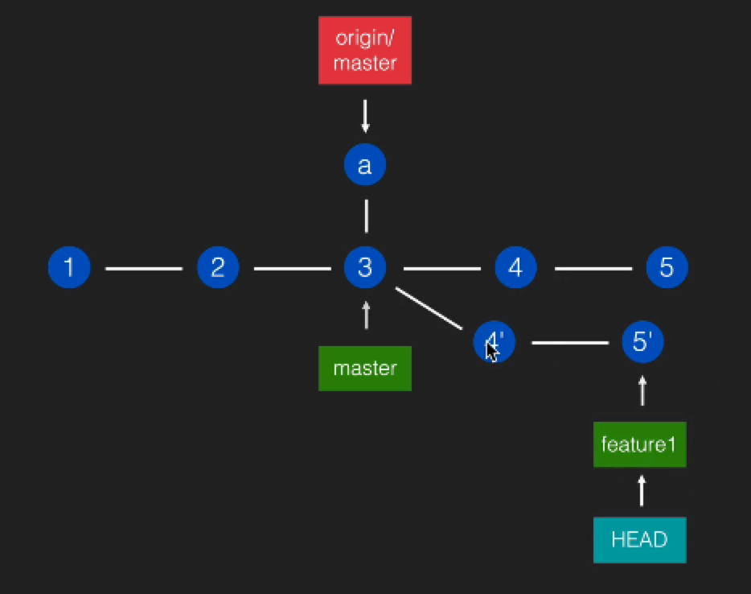
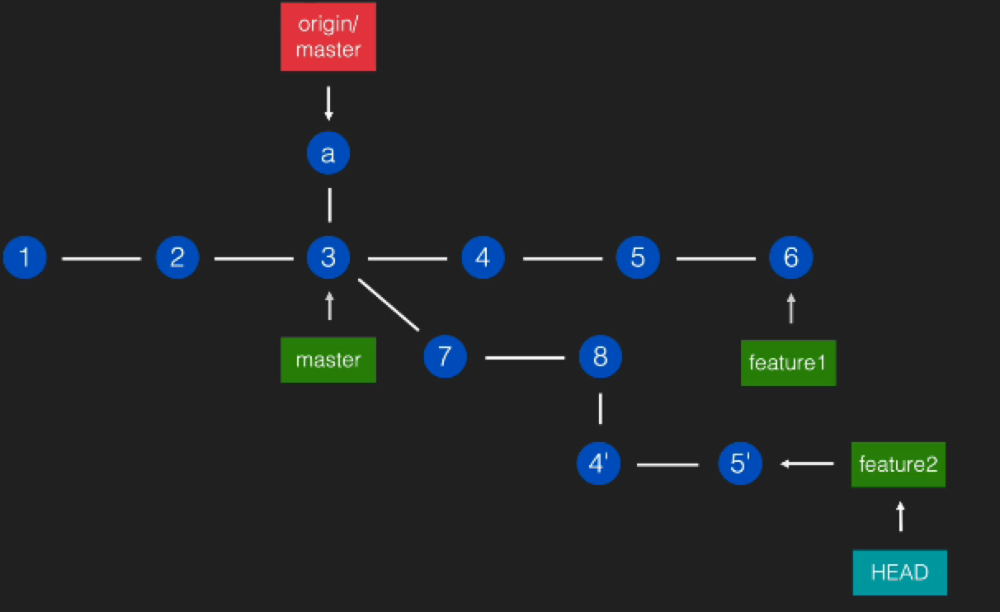
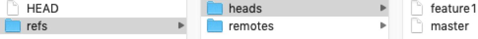

# 【Git-03】Git常用指令和其本质


## checkout

- 移动 HEAD，让它指向某个 commit 或某个 branch。
- checkout --detach :让 HEAD 脱离当前 branch，直接指向下面的 commit。

<!--more-->

`checkout`很好的体现了Git 一切皆引用的思想

### 移动 HEAD，让它指向某个 commit 或某个 branch。

**指向指定分支**：

执行一下

```bash
git checkout feature1
```

打开`./git/HEAD`文件，你可以看到里面的内容是：`ref: refs/heads/master`

**你也可以指向某个commit**：

执行`git log` 打印commit记录，并找到一个想要指向的 commit 的 hash 值

```bash
$ git log

...

commit ca9dd5566cbc6bc599d1ca88e3e6cf9b8ce38cc2
Author: zhangzhuang <xx@xx.com>
Date:   Thu Feb 25 14:44:43 2021 +0800

    first commit
```

在此执行 checkout 指定想指向的hash 值

```bash 
$ git checkout ca9dd
Note: checking out 'ca9dd'.

You are in 'detached HEAD' state. You can look around, make experimental
changes and commit them, and you can discard any commits you make in this
state without impacting any branches by performing another checkout.

If you want to create a new branch to retain commits you create, you may
do so (now or later) by using -b with the checkout command again. Example:

  git checkout -b <new-branch-name>

```

这次再打开`./git/HEAD`文件，你可以看到里面的内容是：`ca9dd5566cbc6bc599d1ca88e3e6cf9b8ce38cc2`

对于文件系统而言，HEAD文件中指定的值就代表了你要想指向的文件。这个值就是所谓的引用，方便且轻便（一个值只有几个字节）。

### checkout --detach :让 HEAD 脱离当前 branch，直接指向下面的 commit。

执行 `git log` 的时候 你会发现 HEAD 一般情况都是 先指向 branch 的引用， branch 再指向指定 commit的引用

```bash
$ git log
commit c95c8ca4a1ff8d2b76be1743aec9230e5b1a6914 (HEAD -> feature1)
Author: x x <xx@doushen.com>
Date:   Thu Feb 25 18:54:17 2021 +0800

    虚拟同事的第一个commit
```

差不多就像这样：


如果我们想直接指向 指定的commit 引用，脱离branch引用，你可以

```
$ git checkout c95c8c（这个id是 这个分支最后的一个commit的 ，也就是当前 feature1 指向的）
```

就会变成这样


```bash
$ git log
commit c95c8ca4a1ff8d2b76be1743aec9230e5b1a6914 (HEAD, feature1)
Author: xx <xx@xx.com>
Date:   Thu Feb 25 18:54:17 2021 +0800

    虚拟同事的第一个commit
```

原本的`HEAD -> feature1`变成了`HEAD, feature1`,HEAD 不再指向 分支 feature1，它脱钩了。

当我们指向远端镜像`origin/master`的时候,因为远端引用是一种特殊的引用，无法用HEAD指向，所以当我们执行

```bash
git checkout origin/master
```

HEAD 依然会滑落向 commit的 id
```bash
$  git log
commit bf7b8810f496a4700034d9504ac35e0d54de4156 (HEAD, origin/master, origin/HEAD, master)
Merge: 885f078 c95c8ca
Author: zhangzhuang <xx@xx.com>
Date:   Thu Feb 25 18:55:47 2021 +0800

    Merge branch 'feature1'
```


打开文件`.git/HEAD`你就会看到`bf7b8810f496a4700034d9504ac35e0d54de4156`

所以HEAD 从你指向的 `origin/master`滑落后你仍然能看到`git log`内容，就是因为HEAD文件中存储了相应的引用，当我们使用指令的时候它就会读这个文件，它就像运行时程序的内存一样，只不过它是直接存储在文件里实时读取的，

## rebase


当我们在本地用 新分支 feature1 开发的时候 master分支 可能有别人提交的提交 `commit a`

我们需要做的事是

```bash
$ git checkout master
$ git merge feature1 
$ git push origin master
```

但是`merge`操作是会 产生一个新的`commit 6` ，它是由 `commit a` 和`commit  5`两个父提交产生的

有时候我们会希望像下图这样让历史这条线合成一条


我们只需要执行  

```bash
$ git rebase master
```

当然，如果你所在的`feature1`分支完全超前于` master`分支，`rebase`是不会起任何作用的，你也不需要rebase

 **总结：**把当前 commit(以及它之前的 commits)应用到指定的需要 rebase 的 commit 上。

> Git 中的每一个 commit 都是不会改变的，所以 rebase 之后的每个 commit 都 是新产生的，而不是对原先的 commit 进行「修改」


虽然master 分支的 `commit  4‘ 和 5’`看起来和 feature1的 `coomit 4，5`是一样的内容，但是却不是 相同的commit  而是 原版 `feature1` 分支 	`4`和`5`的镜像（copy）

比如你在 `commit 5`再建立一个分支 `feature2`，再将`feature1` rebase到 `master`分支, `feature2`分支也不会消失，因为原来的commit都还存在


#### rebase 冲突

`rebase` 的冲突解决方法和` merge` 冲突一样，只是把 `git merge --continue` 改成` git rebase --continue` 就行了

解决完冲突的文件 `add`进暂存区即可。


## reset

把当前 branch 指向指定的 commit。


- `git reset 指定commitId `
   移动到指定 commit，并保留 working tree 的内容，

   （也就是代码仍然保留，会提示你有内容需要提交）
   
- `git reset 指定commitId --hard` 指定commit 

  移动到指定 commit，并重置 working tree，
  
  你的HEAD 分支都指向这个commit，代码也不会保留
  
- 直接执行 `git reset --hard`会指向所在分支最后一次提交                                                                                                                                                                                                                                                                                                                                                                                                                                                                                                                                                                                                                                                                                                                                                                                                                                                                                                                                                                                                    

我们可以reset到不同的引用上去：

1. 我们可以`reset`到指定commit

	```bash
	git reset 4
	git reset 5
	```

	此时`HEAD`仍然指向`feature1`，因为`reset`会带走`branch`
	
2. 我们可以`rese`到其他分支，但是因为reset会带走分，分支无法指向分支，它的指向会滑落到指定commit

   ```bash
   git reset master
   ```

   

   指向不能被指的`origin/master`，当然也会滑落到具体`commit`

   

3. 如果我们指定`checkout`某个`commit`让`HEAD`和`feature1`脱钩，再做`reset feature1`它会指向`feature1`指向的` commit a`，并没有指向`feature1`。

   `reset` 的目标是纠正下面所指向的那个分支，让它指向别的某个提交。

   `reset` 会移动`HEAD`但它的目标不是移动`HEAD`·而是移动`HEAD`所指向的`branch`

   

   

   

## reset 和 **checkout** 的区别

 它们都是移动 HEAD，但 chekcout 移动的时候是自己移动，不带着 branch 一起,而 reset 会带着 branch 一起移动。


## 提交过的东⻄写错了
### commit --amend ：修改最后一条提交

最新的一条内容需要修改（刚提交完就写错了，可以修改你的最新提交）:

```bash
 git commit --amend
```

> 「修改」只是概念行为，实质上会产生一个新的 commit，这个commit id和原来的不同



### 交互式 rebase：旧的内容需要修改（如果不是最新的一条commit 而是更早之前的commit想修改）:

它还是rebase ，但是加了交互式选项，可以更精细的控制rebase过程。



比如我们现在想·`git rebase` 到`origin/master` 上去，自然` 4 `和`5`都要rebase到`origin/master`

rebase 到指定提交 commit  

```bash
$ git log
commit cbe200ef75f06ff703d1369262150e1a64f3fcd2 (HEAD -> feature1) //提交 5
Author: xx <xx@doushen.com>
Date:   Wed Mar 3 20:22:38 2021 +0800

    Feature1 2

commit b2f1446c3a98ec520d51d9ebe9959c7bb56ccd07 //提交 4
Author: zhangzhuang <xx@doushen.com>
Date:   Wed Mar 3 20:22:24 2021 +0800

    Feature1 1

commit 8cd91248fe9896cd831dc998a347501e54084372 (origin/master, origin/HEAD, master)
Author: zhangzhuang <xx@doushen.com>
Date:   Wed Mar 3 20:14:15 2021 +0800

    rebase 交互

```

执行交互式rebase

```bash
$ git rebase 8cd91 -i
hint: Waiting for your editor to close the file... 
edit b2f1446 Feature1 1
pick cbe200e Feature1 2

# Rebase 8cd9124..cbe200e onto 8cd9124 (2 commands)
#
# Commands:
# p, pick <commit> = use commit
# r, reword <commit> = use commit, but edit the commit message
# e, edit <commit> = use commit, but stop for amending
# s, squash <commit> = use commit, but meld into previous commit
# f, fixup <commit> = like "squash", but discard this commit's log message
# x, exec <command> = run command (the rest of the line) using shell
# b, break = stop here (continue rebase later with 'git rebase --continue')
# d, drop <commit> = remove commit
# l, label <label> = label current HEAD with a name
# t, reset <label> = reset HEAD to a label
# m, merge [-C <commit> | -c <commit>] <label> [# <oneline>]
# .       create a merge commit using the original merge commit's
# .       message (or the oneline, if no original merge commit was
# .       specified). Use -c <commit> to reword the commit message.
#
# These lines can be re-ordered; they are executed from top to bottom.
#

# Rebase a7efade..9538342 onto a7efade (2 commands)
#
# Commands:
# p, pick <commit> = use commit
# r, reword <commit> = use commit, but edit the commit message
# e, edit <commit> = use commit, but stop for amending
# s, squash <commit> = use commit, but meld into previous commit
# f, fixup <commit> = like "squash", but discard this commit's log message
# x, exec <command> = run command (the rest of the line) using shell
# b, break = stop here (continue rebase later with 'git rebase --continue')
# d, drop <commit> = remove commit
# l, label <label> = label current HEAD with a name
# t, reset <label> = reset HEAD to a label
# m, merge [-C <commit> | -c <commit>] <label> [# <oneline>]
# .       create a merge commit using the original merge commit's
# .       message (or the oneline, if no original merge commit was
# .       specified). Use -c <commit> to reword the commit message.
#
# These lines can be re-ordered; they are executed from top to bottom.
#
"~/another_git_demo/.git/rebase-merge/git-rebase-todo" 28L, 1247C
```
 这些内容是给git看的,为了通知git 如何修改这两个提交，我们只要改选项即可，现在我们只想修改`commit 4`(因为改`commit 5 `只需要` commit --amend`即可)

```bash
edit 5955bb2 测试交互式rebase 的 feature1 commit
pick 9538342 测试交互式rebase 的 feature1 commit2
```

从刚刚的command注释可以看到 ，` edit <commit> = use commit, but stop for amending` 如果想修改的话会先暂停rebase ，让你先去修改`commit 4`。

```
Stopped at b2f1446...  Feature1 1
You can amend the commit now, with

  git commit --amend 

Once you are satisfied with your changes, run

  git rebase --continue
```

执行后：

rebase暂停了，我们需要修改`commit 4`的内容,然后，修改后加入缓存区，

```bash
$ open README.md 
$ git add .
```

此时 `commit 5`已经改完啦，修改最新的 `commit 5`

```bash
$ git commit --amend
[detached HEAD 47ca9ce] Feature1 1
 Date: Wed Mar 3 20:22:24 2021 +0800
 1 file changed, 2 insertions(+), 1 deletion(-)
$ git rebase --continue //继续完成 rebase
$ open README.md //解决冲突
$ git add . 加入暂存区
$ git rebase --continue
[detached HEAD c9f6c6d] Feature1 2
 1 file changed, 1 insertion(+), 2 deletions(-)
Successfully rebased and updated refs/heads/feature1.
//rebase 完成
```

所以我们要做的是：

```bash
$git log
commit c9f6c6d74207d2cbf4c5974a7f5a5804a5f99b50 (HEAD -> feature1) //改动后的 commit 5'
Author: xx <xx@doushen.com>
Date:   Wed Mar 3 20:22:38 2021 +0800

    Feature1 2

commit 47ca9cee29f306adc2f5b5399668e13fadfeb4ed //改动后的 commit 4'
Author: xx <xx@doushen.com>
Date:   Wed Mar 3 20:22:24 2021 +0800

    Feature1 1

commit 8cd91248fe9896cd831dc998a347501e54084372 (origin/master, origin/HEAD, master)
Author: xx <xx@doushen.com>
Date:   Wed Mar 3 20:14:15 2021 +0800

    rebase 交互
```

我们会发现提交没变，但是commit id 都改变了



### revert：如果错误的commit已经被push并且合并到master上去了

我们不能修改过去的commit，也不能通过增删改替来解决问题了（远端的master尽量不要修改）。

此时应该把这个提交反过来写，使用revert命令意思是倒着把某个提交做了。

```bash
$ git revert fb03f
```

Revert 可以对这次commit执行反向操作（恢复成上次commit的样子），这种反向操作可以指向任何一个提交，可以指向最新的也可以指向老的，因为你并没有修改commit的历史，只是增加了反向操作的 commit。


#### 总结：

1. **push之前想删除一个commit或者修改过去的一个commit**

	```
	git rebase -i HEAD~4
	```
	
	常用选项:

-  pick 或 p :沿用（什么都不改）
- reword 或 r :修改 commit message
- edit 或 e :修改 commit 内容
- drop 或 d :删除
- squash 或 s :和上一条融合，并且合并 commit message(可编辑) fixup 或 f :和上一条融合 并且沿用上一条的 commit message

2. **已经push到master的内容需要删除:**

   不能用 rebase，因为 master 上的东⻄是不能强行修改的

   可以用 git revert 指定commit 来撤销。它的原理是创建一个新的 commit，内容是指定 commit 的「相反内容」

## add -i 交互式 add

有时候，我们可能有大量的内容需要提交，但是为了别人阅读的方便，将commit根据不同的功能作用拆分成多个commit，但也许次提交涉及多个文件，甚至某个文件的某几行，无法简单的根据不同的文件来决定拆分顺序，关于这个这种场景就适合使用 add -i （交互式add）。

用法:	

```bash
git add -i
```

常用选项:

- p (patch) 选取块时的常用选项:
- y:选用当前块
- n:不用当前块 
- s:把当前块做自动切分后再重新询问
-  e:手动选取修改内容

`git add -i`启动交互式提交，会提示你输入Commands

选择5或者p ，拆分需要提交的代码块

多选择几次1或者R确认我们要修改的文件（README.md）一般git认为你改了几次你就需要输入几次R或者1

之后会让你选择怎么编辑这几个代码块，你可以使用上面的常用代码块来编辑这次你想保留的代码块


```bash
$ git add -i
           staged     unstaged path
  1:    unchanged       +11/-1 README.md

*** Commands ***
  1: status	  2: update	  3: revert	  4: add untracked
  5: patch	  6: diff	  7: quit	  8: help
  
  What now> 5
           staged     unstaged path
  1:    unchanged       +11/-1 README.md
  
Patch update>> R
           staged     unstaged path
* 1:    unchanged       +11/-1 README.md
Patch update>> 
diff --git a/README.md b/README.md
index a20a05a..bccdb18 100644
--- a/README.md
+++ b/README.md
@@ -1,2 +1,12 @@
-Feature1 1 改
+11111111
+
+22222222
+
+33333333
+
+44444444
+
+55555555
+
+66666666
Stage this hunk [y,n,q,a,d,e,?]?   
y - stage this hunk
n - do not stage this hunk
q - quit; do not stage this hunk or any of the remaining ones
a - stage this hunk and all later hunks in the file
d - do not stage this hunk or any of the later hunks in the file
e - manually edit the current hunk
? - print help
@@ -1,2 +1,12 @@
-Feature1 1 改
+11111111
+
+22222222
+
+33333333
+
+44444444
+
+55555555
+
+66666666
 
Stage this hunk [y,n,q,a,d,e,?]? e
```

编辑需要分块的代码块
```
编辑此次需要提交的内容
# Manual hunk edit mode -- see bottom for a quick guide.
@@ -1,2 +1,12 @@
-Feature1 1 改
+33333333
+44444444

# ---
# To remove '-' lines, make them ' ' lines (context).
# To remove '+' lines, delete them.
# Lines starting with # will be removed.
#
# If the patch applies cleanly, the edited hunk will immediately be
# marked for staging.
# If it does not apply cleanly, you will be given an opportunity to
# edit again.  If all lines of the hunk are removed, then the edit is
# aborted and the hunk is left unchanged.
~                                                                               
~                                                                               
~                                                                               
~                                                                               
~                                                                               
~                                                                               
~                                                                               
:wq
```

编辑完成之后，退出vim，再输入q，退出到终端，

此时输入 

- git diff  查看当前有变化但是没有加入暂存区的代码块
- git diff --staged  查看此时已经起变化且已经提交到暂存区的代码块
- git show 查看最新的commit和详情

```bash
$ git diff --staged
diff --git a/README.md b/README.md
index a20a05a..794a26c 100644
--- a/README.md
+++ b/README.md
@@ -1,2 +1,3 @@
-Feature1 1 改
+33333333
+44444444
 
$ git diff
diff --git a/README.md b/README.md
index 794a26c..bccdb18 100644
--- a/README.md
+++ b/README.md
@@ -1,3 +1,12 @@
+11111111
+
+22222222
+
 33333333
+
 44444444
 
+55555555
+
+66666666
```


## tag

另一种引用类型。

- 和 branch 区别之一: 不能改变
- 和 branch 区别之二: 不能被 HEAD 指向
- 用处: 设置持久标记，例如版本号,这样做很安全，因为它不能被指向也不能被改变。
- origin/master, origin/feature, origin/HEAD 和 tag 有相似之处:也不能从本地 改变位置，也不能被 HEAD 指向

```bash 
$ git tag tag1 （给当前branch 最后一个commit 打上tag，tag 的名称是tag1 ）
你可以用tag 直接push
$ git push origin v1.0
Enumerating objects: 9, done.
Counting objects: 100% (9/9), done.
Delta compression using up to 4 threads
Compressing objects: 100% (5/5), done.
Writing objects: 100% (7/7), 687 bytes | 687.00 KiB/s, done.
Total 7 (delta 1), reused 0 (delta 0)
remote: Powered by GITEE.COM [GNK-5.0]
To gitee.com:laonaiping/git-demo.git
 * [new tag]         v1.0 -> v1.0

你也可以增加一点描述或者说注解

$ git tag v1.0.1 -a
```


## cherry-pick 摘樱桃


用法:

```bash
git cherry-pick commit1 commit2
```

用途: 应用指定的某个或某些 commit 到 HEAD 处

- 比如我想抛弃某个 branch，这个特性不要了，但它的某两个 commit 我希望保留

- git cherry-pick 这两个 commit




## reflog

查看我们引用的历史

用法:

```bash
git reflog <branch>
```


用途:

​	查看指定的引用(HEAD 或 branch)的移动历史，从而找到之前的某个特定 commit

​	什么参数都不加，是为了看Head这个引用的log

 	你也可以在`.git/logs `里面的文件中国找到 HEAD ，分支和远端分支的移动历史

​	

