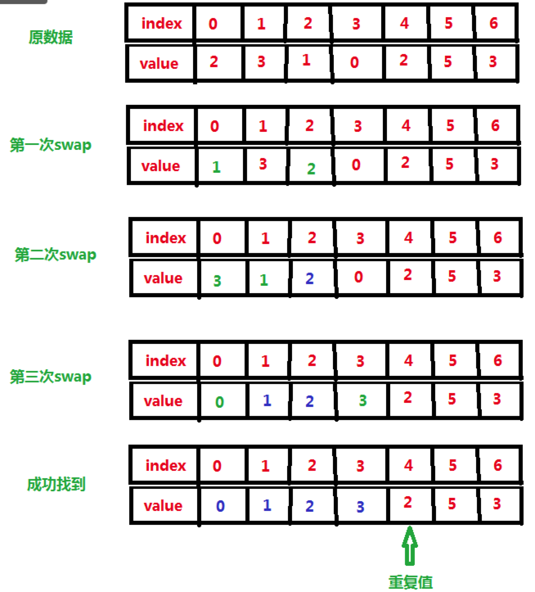

# 数组中重复的数字

在一个长度为n的数组里的所有数字都在0到n-1的范围内。 数组中某些数字是重复的，但不知道有几个数字是重复的。也不知道每个数字重复几次。请找出数组中第一个重复的数字。 例如，如果输入长度为7的数组{2,3,1,0,2,5,3}，那么对应的输出是第一个重复的数字2。

返回描述：

如果数组中有重复的数字，函数返回true，否则返回false。

如果数组中有重复的数字，把重复的数字放到参数duplication[0]中。（ps:duplication已经初始化，可以直接赋值使用。）

<!--more-->

## 方法一：哈希+遍历

题目中含有**重复**的字眼，第一反应应该想到哈希，set。这里我们用哈希来解。
算法步骤：

1. 新建一个HashSet对象

2. 遍历数组，如果Set中包含此数，则返回True，否则继续循环

3. 若直到循环结束没有遇到Set中包含的数据，则数组没有重复的数

代码如下：

```java
  public boolean duplicate(int numbers[],int length,int [] duplication) {
      if(numbers==null||numbers.length==0){
            return false;
        }
        Set<Integer> set = new HashSet<>();
        //set.add(numbers[0]);
        for (int i = 0; i < numbers.length; i++) {
            if (set.contains(numbers[i])){
                duplication[0]=numbers[i];
                return true;
            }else {
                set.add(numbers[i]);
            }
        }
    
        return false;
    }
```

时间复杂度：O(N)
空间复杂度：O(N)

## 方法二：in-place算法 (这个算法算出的不是第一个重复的数，是任意的)

方法一中的一个条件我们没有用到。也就是数据的范围是0-n-1。所以我们可以这么做：

1. 设置一个指针i指向开头0，

2. 对于arr[i]进行判断，如果arr[i] == i， 说明下标为i的数据**正确的放在了该位置上**，让i++

3. 如果arr[i] != i, 说明没有正确放在位置上，那么我们就把arr[i]放在正确的位置上，也就是交换
   arr[i] 和arr[arr[i]]。交换之后，如果arr[i] ！= i, 继续交换。

4. 如果交换的过程中，arr[i] == arr[arr[i]]，说明遇到了重复值，返回即可。
   如下图：
   
   


   ```java
public boolean duplicate(int[] nums, int length, int[] duplication) {
    if (nums == null || length <= 0)
        return false;
    for (int i = 0; i < length; i++) {
        while (nums[i] != i) {
            if (nums[i] == nums[nums[i]]) {
                duplication[0] = nums[i];
                return true;
            }
            swap(nums, i, nums[i]);
        }
    }
    return false;
}

private void swap(int[] nums, int i, int j) {
    int t = nums[i];
    nums[i] = nums[j];
    nums[j] = t;
}

   ```

   

时间复杂度：O(N)
空间复杂度：O(1)


