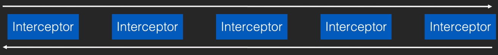

# 从OkHttp的原理来看HTTP

## OkHttp的演进之路

- 原生方案不好用，Square 自己造： OkHttp的初版
- 从头撸到脚：脱离对原生的依赖
- 被Android官方收录: 成为业界公认最佳方案

## OkHttp基本使用方法

1. 创建一个OkHttp的实例

   ```java
    OkHttpClient client = new OkHttpClient.Builder().build();
   ```

2. 创建Request

   ```java
    Request request = new Request.Builder().url("http://hencoder.com").build();
   ```

3. 创建`Call`并发起请求

   ```java
   client.newCall(request).enqueue(new Callback() { 
   	@Override
   	public void onFailure(Call call, IOException e) {}
   	@Override
   	public void onResponse(Call call, Response response) throws IOException {
           Log.d("okhttp response",response.body().string());
   }});
   ```

   

## OkHttp 框架结构分析

发出请求的大框架：`client.newCall(request).enqueue(new Callback(){...})`

1. 先是newCall 里面创建一个RealCall，创建完之后执行的enqueue方法也就是RealCall的enqueue方法
2. RealCall的enqueue调用了Dispatcher的enqueue方法，将最新的call扔进readyAsyncCalls里（将准备好要执行还没执行的List）
3. 符合条件的call全部执行一遍：将符合条件的call放进 executableCalls，遍历执行每个asyncCall的executeOn方法
4. executeOn本质上执行runnable的run方法，到了run里面会调用getResponseWithInterceptorChain()获得响应，最终获得响应就会给responseCallback返回结果，出错就会返回responseCallback的onFailure()
5. 同步执行execute一般不会使用，但是例如拿到token之后再请求一次就需要用到同步请求，它会直接调用getResponseWithInterceptorChain()方法发起请求获得响应

`enqueue`方法，是一个抽象接口调用的：

```kotlin
interface Call : Cloneable {...fun enqueue(responseCallback: Callback)...}
```

`newCall` 方法是`HttpClient`中的方法,会返回一个`RealCall`对象，他`Call`接口的实现。

```kotlin
/** Prepares the [request] to be executed at some point in the future. */
override fun newCall(request: Request): Call = RealCall(this, request, forWebSocket = false)
```

### RealCall

```kotlin
class RealCall(
  //OkHttpClient：Okhttp的大总管，所有的通用配置都在这配置比如超时时间等
  val client: OkHttpClient,
  //初始的请求，后续会多次封装，对于Okhttp来说request就是你发起一个Http请求需要的所有条件（method，body，header等）
  val originalRequest: Request,
  // WebSocket：应用层协议，服务器可以主动给客户端发送消息，适用于频繁刷新数据，链接是通过HTTP协议建立的（为了兼容浏览器）
  val forWebSocket: Boolean
) : Call {...}
  ...
  
  override fun enqueue(responseCallback: Callback) {
    synchronized(this) {
      check(!executed) { "Already Executed" }
      executed = true
    }
    //跟踪错误，监听请求内容
    callStart()
    //调用dispatcher执行enqueue
    client.dispatcher.enqueue(AsyncCall(responseCallback))
  }
  
   private fun callStart() {
    // 跟踪出现的错误用于错误分析
    this.callStackTrace=Platform.get().getStackTraceForCloseable("response.body().close()")
   // 反馈/回调，evetnListener是Http交互过程的监听器，他会监听各种内容【header，body开始发送/接收，TCP    的链接（socket）等】，对整个程序没有干预。
    eventListener.callStart(this)
  }
  ...
  internal inner class AsyncCall(
    private val responseCallback: Callback
  ) : Runnable {
    ...
    }
    ..
	
    fun executeOn(executorService: ExecutorService) {
      client.dispatcher.assertThreadDoesntHoldLock()

      var success = false
      try {
        // 切换线程执行 runnable方法
        executorService.execute(this)
        success = true
      } catch (e: RejectedExecutionException) {
        ...
      } finally {
        ...
      }
    }

    override fun run() {
      threadName("OkHttp ${redactedUrl()}") {
        var signalledCallback = false
        timeout.enter()
        try {
          //拿到服务器的响应
          val response = getResponseWithInterceptorChain()
          signalledCallback = true
          //responseCallback就是在真正使用时调用的Callback：client.newCall(request).enqueue(new Callback(){...})
          responseCallback.onResponse(this@RealCall, response)
        } catch (e: IOException) {
          if (signalledCallback) {
          ...
          } else {
            responseCallback.onFailure(this@RealCall, e)
          }
        } catch (t: Throwable) {
          ...
        } finally {
          ...
        }
      }
    }
  }
}  
```

Dispatcher

```kotlin
class Dispatcher constructor() {
  //依靠Excutor进行线程调度，若没有线程调度同时有多个请求发生时只能排队
  private var executorServiceOrNull: ExecutorService? = null
  // maxRequests： 最大有多少个请求同时进行，超出需要等待。可以配置
  @get:Synchronized var maxRequests = 64
    set(maxRequests) {
      require(maxRequests >= 1) { "max < 1: $maxRequests" }
      synchronized(this) {
        field = maxRequests
      }
      promoteAndExecute()
    }
	
  //maxRequestsPerHost你的每个主机同时能有多少个请求，超出需要等待。可以配置
  @get:Synchronized var maxRequestsPerHost = 5
    set(maxRequestsPerHost) {
      require(maxRequestsPerHost >= 1) { "max < 1: $maxRequestsPerHost" }
      synchronized(this) {
        field = maxRequestsPerHost
      }
      promoteAndExecute()
    }
  // 双向队列，存放准备好执行还没执行的请求
  //这种请求有两种，
  //1. 调用enqueue传递的call: AsyncCall
  //2. 刚才传递来的call：AsynCall，因为稍后的请求个数被限制了被挡住的请求。
  private val readyAsyncCalls = ArrayDeque<AsyncCall>()
 
  internal fun enqueue(call: AsyncCall) {
    synchronized(this) {
      readyAsyncCalls.add(call)
      if (!call.call.forWebSocket) {
        // 和主机的连接数是根据主机名存储的变量，存在每个AsyncCall内部且可以共享
        // 遍历已有的AsyncCall，如果有和这次请求的Host建立的链接就拿出来
        val existingCall = findExistingCallWithHost(call.host)
        if (existingCall != null) call.reuseCallsPerHostFrom(existingCall)
      }
    }
    // 执行readyAsyncCalls里的请求
    promoteAndExecute()
  }

	// promote:推举 Execute：执行，把符合条件（还没执行过且执行它不会超负载）的没有执行的Call全部推举出来拿去执行。
  private fun promoteAndExecute(): Boolean {
    this.assertThreadDoesntHoldLock()
		
    val executableCalls = mutableListOf<AsyncCall>()
    val isRunning: Boolean
    synchronized(this) {
      //遍历已经准备好的Call
      val i = readyAsyncCalls.iterator()
      while (i.hasNext()) {
        val asyncCall = i.next()
				//把符合条件的筛选出来（不超过maxRequests和maxRequestsPerHost最大限制）
        if (runningAsyncCalls.size >= this.maxRequests) break // Max capacity.
        if (asyncCall.callsPerHost.get() >= this.maxRequestsPerHost) continue // Host max capacity.

        i.remove()
        asyncCall.callsPerHost.incrementAndGet()
        //将筛选过的Call推举出来，即加入专门的Listzhong（executableCalls）
        executableCalls.add(asyncCall)
        //顺便加入正在执行的Calls，用于做记录
        runningAsyncCalls.add(asyncCall)
      }
      isRunning = runningCallsCount() > 0
    }
		//将推举出的asyncCall挨个去执行，遍历执行AsyncCall的ExecuteOn函数
    for (i in 0 until executableCalls.size) {
      val asyncCall = executableCalls[i]
      asyncCall.executeOn(executorService)
    }

    return isRunning
  }
  
   fun executeOn(executorService: ExecutorService) {
      client.dispatcher.assertThreadDoesntHoldLock()
       ...
        //切换线程，将Runnable丢过去执行
        executorService.execute(this)
       ...
    }  
}  
```

`execute`方法同步执行,一般来说请求网络都是要异步的，但也有例外比如：请求过程中拿到一个token要继续请求，我们不需要切换线程。

RealCall: 直接调用getResponseWithInterceptorChain

```kotlin
 override fun execute(): Response {
    synchronized(this) {
      check(!executed) { "Already Executed" }
      executed = true
    }
    timeout.enter()
    callStart()
    try {
      client.dispatcher.executed(this)
      return getResponseWithInterceptorChain()
    } finally {
      client.dispatcher.finished(this)
    }
  }
```

### OkHttpClient 配置清单

```kotlin
open class OkHttpClient internal constructor(
  builder: Builder
) : Cloneable, Call.Factory, WebSocket.Factory {
	//调度器，用于调度后台发起的网络请求， 有后台总请求数和单主机总请求数的控制。
  @get:JvmName("dispatcher") val dispatcher: Dispatcher = builder.dispatcher
  //连接池：管理连接的工具，存储批量的连接，创建一个连接的时候不先创建，先看连接池里有没有，有就直接调用
  //若调用结束也不急着销毁，先存储在连接池，超时不用再销毁（看配置）
  //池概念：同类变量的管理，通过资源复用和动态回收形成性能和资源占用的动态平衡。
  //连接池重用 
  //http1：已经用完了的连接可以在创建其他连接时重用
  //http2：正在使用的连接也可以重用（多路复用）
  @get:JvmName("connectionPool") val connectionPool: ConnectionPool = builder.connectionPool
  //拦截器
  @get:JvmName("interceptors") val interceptors: List<Interceptor> =
      builder.interceptors.toImmutableList()
  //请求拦截器
  @get:JvmName("networkInterceptors") val networkInterceptors: List<Interceptor> =
      builder.networkInterceptors.toImmutableList()
  //生产eventListener 的工厂，是监听各种事件的监听器（请求发起，连接创立等）
  @get:JvmName("eventListenerFactory") val eventListenerFactory: EventListener.Factory =
      builder.eventListenerFactory
  //连接失败/请求失败是否重试的配置，403不算失败，管理的是TCP请求连接失败或者无响应，默认true
  @get:JvmName("retryOnConnectionFailure") val retryOnConnectionFailure: Boolean =
      builder.retryOnConnectionFailure
	//自动重新认证。配置之后，在 请求收到 401 状态码的响应时，会直接调用authenticator，手动加入Authorization header 之后自动重新发起请求
  @get:JvmName("authenticator") val authenticator: Authenticator = builder.authenticator
	//重定向时，如果原先请求的是 http 而重定向的目标是 https，或者原先请求的是 https 而重定向的目标是 //http，是否依然自动 follow。(记得，不是「是否自动 follow HTTPS URL 重定向的意思，而是是否自动 follow //在 HTTP 和 HTTPS 之间切换的重定向)
  @get:JvmName("followRedirects") val followRedirects: Boolean = builder.followRedirects
	//额外开关默认true：上面开关打开的前提下，重定向的时候发生协议切换的时候是否进行重定向，有人可以利用协议切换进行恶意攻击
  @get:JvmName("followSslRedirects") val followSslRedirects: Boolean = builder.followSslRedirects
  //饼干罐cookie：饼干Jar：罐子，存储是默认不实现的。想用要自己实现
  @get:JvmName("cookieJar") val cookieJar: CookieJar = builder.cookieJar
  //缓存，本地缓存
  @get:JvmName("cache") val cache: Cache? = builder.cache
	//域名解析成ip地址，使用的Java原生方法
  @get:JvmName("dns") val dns: Dns = builder.dns
  //代理，为了做网络管制，请求都要由代理服务器选择性转发可以代理 DIRECT(直连),HTTP,SOCKS，默认null
  @get:JvmName("proxy") val proxy: Proxy? = builder.proxy
  //proxySelector的select方法会返回一个List<Proxy>，若proxy没配置，则会在连接后调用select()遍历
  //List<Proxy> 选择可以使用的Proxy（默认直连）
  @get:JvmName("proxySelector") val proxySelector: ProxySelector =
      when {
        builder.proxy != null -> NullProxySelector
        else -> builder.proxySelector ?: ProxySelector.getDefault() ?: NullProxySelector
      }
	// Proxy独立的验证机制
  @get:JvmName("proxyAuthenticator") val proxyAuthenticator: Authenticator =
      builder.proxyAuthenticator
	//Http的请求本质是个Socket，使用socketFactory创建
  @get:JvmName("socketFactory") val socketFactory: SocketFactory = builder.socketFactory
	
  private val sslSocketFactoryOrNull: SSLSocketFactory?
  // socket TCP连接开始之前 
  @get:JvmName("sslSocketFactory") val sslSocketFactory: SSLSocketFactory
    get() = sslSocketFactoryOrNull ?: throw IllegalStateException("CLEARTEXT-only client")
	// 证书的验证器，（x509是证书格式标准，是系统提供的类）
  @get:JvmName("x509TrustManager") val x509TrustManager: X509TrustManager?
  //连接标准，应用层支持的 Socket 设置，即使用明文传输(用于 HTTP)还是某个版本的 TLS(用于 HTTPS)。
  @get:JvmName("connectionSpecs") val connectionSpecs: List<ConnectionSpec> =
      builder.connectionSpecs
	//支持的应用层协议，即 HTTP/1.1、 HTTP/2 等。
  // SPDY_3（http2前身，已经废弃）
  // H2_PRIOR_KNOWLEDGE 没有TLS的HTTP2
  // 浏览器是无法确定是否支持HTTP2，一般会加一个Upgrade： h2c的header试着请求，询问服务器是否支持
  //Http2.0，但是Android客户端不需要这样试探
  @get:JvmName("protocols") val protocols: List<Protocol> = builder.protocols
  // --------证书验证相关--------------
  // 验证证书的Host是否是自己请求的
  @get:JvmName("hostnameVerifier") val hostnameVerifier: HostnameVerifier = builder.hostnameVerifier
  //用于设置 HTTPS 握手 过程中针对某个 Host 额外的的 Certificate Public Key Pinner，即把网站证 书链
  //中的每一个证书公钥直接拿来提前配置进 OkHttpClient 里去，作为正常的证书验证机制之外的一次额外验证。
  //最好不要使用，因为若是换了签发机构，但是客户端的信息还是写的老证书的信息，可能造成问题
  @get:JvmName("certificatePinner") val certificatePinner: CertificatePinner
	// x509TrustManager的操作员，验证证书是否合法
  @get:JvmName("certificateChainCleaner") val certificateChainCleaner: CertificateChainCleaner?
  // --------证书验证相关--------------
  @get:JvmName("callTimeoutMillis") val callTimeoutMillis: Int = builder.callTimeout
  //建立连接(TCP 或 TLS)的超时时间。
  @get:JvmName("connectTimeoutMillis") val connectTimeoutMillis: Int = builder.connectTimeout

  //发起请求到读到响应数据的超时时间。
  @get:JvmName("readTimeoutMillis") val readTimeoutMillis: Int = builder.readTimeout
  //发起请求并被目标服务器接受的超时时间。(为什么?因为有时候对方服务器可能由于某种原因而不读取你的 Request)
  @get:JvmName("writeTimeoutMillis") val writeTimeoutMillis: Int = builder.writeTimeout
  //心跳机制
  @get:JvmName("pingIntervalMillis") val pingIntervalMillis: Int = builder.pingInterval
}
```

OkHttpClient 相当于配置中心，所有的请求都会共享这些配置(例如出错

是否重试、共享的连接池)。 OkHttpClient 中的配置主要有

Dns：Java 自带的方法，从域名获得ip地址

```kotlin
interface Dns {
  @Throws(UnknownHostException::class)
  fun lookup(hostname: String): List<InetAddress>
  companion object {
    
    @JvmField
    val SYSTEM: Dns = DnsSystem()
    private class DnsSystem : Dns {
      override fun lookup(hostname: String): List<InetAddress> {
        try {
          return InetAddress.getAllByName(hostname).toList()
        } catch (e: NullPointerException) {
          throw UnknownHostException("Broken system behaviour for dns lookup of $hostname").apply {
            initCause(e)
          }
        }
      }
    }
  }
}
```

### getResponseWithInterceptorChain()

RealCall

```kotlin
  @Throws(IOException::class)
  internal fun getResponseWithInterceptorChain(): Response {
    //第一部分 把一个个的Interceptor加入List中，网络事件拦截器（雁过插毛器）
    // 
    val interceptors = mutableListOf<Interceptor>()
    interceptors += client.interceptors
    interceptors += RetryAndFollowUpInterceptor(client)
    interceptors += BridgeInterceptor(client.cookieJar)
    interceptors += CacheInterceptor(client.cache)
    interceptors += ConnectInterceptor
    if (!forWebSocket) {
      interceptors += client.networkInterceptors
    }
    interceptors += CallServerInterceptor(forWebSocket)
	//第二部分： 创建一个 RealInterceptorChain实例（拦截器的链），核心仍然是Interceptor的List，不过封装
  //了一些功能
    val chain = RealInterceptorChain(
        call = this,
        interceptors = interceptors,//Interceptor组成的List
        index = 0,
        exchange = null,
        request = originalRequest,
        connectTimeoutMillis = client.connectTimeoutMillis,
        readTimeoutMillis = client.readTimeoutMillis,
        writeTimeoutMillis = client.writeTimeoutMillis
    )
	// 第三部分： 调用这个拦截器链
    var calledNoMoreExchanges = false
    try {
      //拦截器链处理初始request
      val response = chain.proceed(originalRequest)
      if (isCanceled()) {
        response.closeQuietly()
        throw IOException("Canceled")
      }
      return response
    } catch (e: IOException) {
      calledNoMoreExchanges = true
      throw noMoreExchanges(e) as Throwable
    } finally {
      if (!calledNoMoreExchanges) {
        noMoreExchanges(null)
      }
    }
  }

```

链式调用模型：

拦截器依次调用过去，再调用回来，每个拦截器都有前置/中间/后置工作，除了最后一环。



### RealInterceptorChain:

```kotlin
    internal fun copy(
    index: Int = this.index,
    exchange: Exchange? = this.exchange,
    request: Request = this.request,
    connectTimeoutMillis: Int = this.connectTimeoutMillis,
    readTimeoutMillis: Int = this.readTimeoutMillis,
    writeTimeoutMillis: Int = this.writeTimeoutMillis
  ) = RealInterceptorChain(call, interceptors, index, exchange, request, connectTimeoutMillis,
      readTimeoutMillis, writeTimeoutMillis)

  
  @Throws(IOException::class) //proceed 继续
  override fun proceed(request: Request): Response {
    check(index < interceptors.size)

    calls++

    if (exchange != null) {
      check(exchange.finder.sameHostAndPort(request.url)) {
        "network interceptor ${interceptors[index - 1]} must retain the same host and port"
      }
      check(calls == 1) {
        "network interceptor ${interceptors[index - 1]} must call proceed() exactly once"
      }
    }

    // 获取第index个 interceptor
    val next = copy(index = index + 1, request = request)
    val interceptor = interceptors[index]

    @Suppress("USELESS_ELVIS")
    //执行 interceptor的拦截方法 注意，interceptor是个接口，我们接下来拿默认的实例
    //RetryAndFollowUpInterceptor举例
    val response = interceptor.intercept(next) ?: throw NullPointerException(
        "interceptor $interceptor returned null")

    if (exchange != null) {
      check(index + 1 >= interceptors.size || next.calls == 1) {
        "network interceptor $interceptor must call proceed() exactly once"
      }
    }

    check(response.body != null) { "interceptor $interceptor returned a response with no body" }

    return response
  }
```

### RetryAndFollowUpInterceptor：

它会对连接做一些初始化工作，并且负责在请求失败时的重试，以及重定向的自动后续请求。它的存在，可以让重试和重定向对于开发者是无感知的;

```kotlin
// 重试&重定向拦截器
class RetryAndFollowUpInterceptor(private val client: OkHttpClient) : Interceptor {

  @Throws(IOException::class)
  override fun intercept(chain: Interceptor.Chain): Response {
    // 前置工作
    val realChain = chain as RealInterceptorChain
    var request = chain.request
    val call = realChain.call
    var followUpCount = 0
    var priorResponse: Response? = null
    var newExchangeFinder = true
    // 始终执行请求，直到不需要重试或者重定向
    // 循环的一直是中间/后置工作
    while (true) {
      // 准备去找到找一个可用的连接（TCP/TLS 连接）
      // 并不是真正连接（连接还没发生）只是做好连接准备，所以这是一个初始化过程
      // 它会初始化一个address对象
      // 包含从url中解析的host地址和端口号，以及从okhttpclient 配置的dns等信息
      // 这些初始化的内容和信息会交给connectInterceptor去建立真正的TCP/TLS连接
      
      // newExchangeFinder 默认为true，会创建一个默认的ExchangeFinder对象 
      // 在connectinterceptor中会用于寻找连接
      // ExchangeFinder对象会让原有nextRouteToTry等信息失效，
      // 所以重试时newExchangeFinder = false 使用原有的ExchangeFinder建立连接
      
      call.enterNetworkInterceptorExchange(request, newExchangeFinder)

      var response: Response
      var closeActiveExchange = true
      try {
        if (call.isCanceled()) {
          throw IOException("Canceled")
        }

        try {
          // 1.发起请求
          // 中间工作：交给下一棒
          response = realChain.proceed(request)
          // 后置工作：拿到下一棒返回的response再进行
          newExchangeFinder = true
          // 2.出错时看下要不要重试
        } catch (e: RouteException) { 
          // 通过某条连接线路连接失败了，是否可以重试如果不能，直接抛异常，可以回复调用recover方法
          if (!recover(e.lastConnectException, call, request, requestSendStarted = false)) {
            throw e.firstConnectException
          }
          newExchangeFinder = false
          //继续请求
          continue
        } catch (e: IOException) {
          // An attempt to communicate with a server failed. The request may have been sent.
          if (!recover(e, call, request, requestSendStarted = e !is ConnectionShutdownException)) {
            throw e
          }
          newExchangeFinder = false
          continue
        }

        // Attach the prior response if it exists. Such responses never have a body.
        if (priorResponse != null) {
          response = response.newBuilder()
              .priorResponse(priorResponse.newBuilder()
                  .body(null)
                  .build())
              .build()
        }

        val exchange = call.interceptorScopedExchange
        // 3. 若没出错，返回301，302，304等信息，则需要进行重定向，发起重新请求
        val followUp = followUpRequest(response, exchange)
				// 4. 若不需要重定向，直接返回请求结果response，退出循环
        if (followUp == null) {
          
          if (exchange != null && exchange.isDuplex) {
            call.timeoutEarlyExit()
          
          closeActiveExchange = false
          
          return response
        }

        val followUpBody = followUp.body
        if (followUpBody != null && followUpBody.isOneShot()) {
          closeActiveExchange = false
           
          return response
        }
				//5. 若发生重定向则继续进行下一轮循环
        response.body?.closeQuietly()

        if (++followUpCount > MAX_FOLLOW_UPS) {
          throw ProtocolException("Too many follow-up requests: $followUpCount")
        }

        request = followUp
        priorResponse = response
      } finally {
        call.exitNetworkInterceptorExchange(closeActiveExchange)
      }
    }
  }
  // 找到一个可用的连接
  fun enterNetworkInterceptorExchange(request: Request, newExchangeFinder: Boolean) {
    check(interceptorScopedExchange == null)
     ...

    if (newExchangeFinder) {
      // ExchangeFinder 找到一个数据交换者，其实也就是可用的TCP连接或者SSL文件，总之就是找到一个可用的连接， 准备好连接所需参数
      this.exchangeFinder = ExchangeFinder(
          connectionPool,
          createAddress(request.url),
          this,
          eventListener
      )
    }
  } 
  // recover 恢复连接方法，在请求出错时触发
  private fun recover(
    e: IOException,
    call: RealCall,
    userRequest: Request,
    requestSendStarted: Boolean
  ): Boolean {
    // okhttp client配置是否需要重试
    if (!client.retryOnConnectionFailure) return false
    // 判断是否可以恢复连接
    if (requestSendStarted && requestIsOneShot(e, userRequest)) return false
    if (!isRecoverable(e, requestSendStarted)) return false
    ...
  }
    private fun isRecoverable(e: IOException, requestSendStarted: Boolean): Boolean {
    // 判断是否可以恢复连接
    if (e is ProtocolException) {
      return false
    }
    
    if (e is InterruptedIOException) {
    ...
  }
  // 重定向判断
  @Throws(IOException::class)
  private fun followUpRequest(userResponse: Response, exchange: Exchange?): Request? {
    val route = exchange?.connection?.route()
    val responseCode = userResponse.code

    val method = userResponse.request.method
    when (responseCode) {
    ...

      HTTP_MULT_CHOICE, HTTP_MOVED_PERM, HTTP_MOVED_TEMP, HTTP_SEE_OTHER -> {
        return buildRedirectRequest(userResponse, method)
      }     

}  
abstract public class HttpURLConnection extends URLConnection {  	
   	//重定向
    public static final int HTTP_MULT_CHOICE = 300;	
		//永久移动
    public static final int HTTP_MOVED_PERM = 301;
		//暂时移动
    public static final int HTTP_MOVED_TEMP = 302;
}			
```
#### RealCall.enterNetworkInterceptorExchange

retryfllowupInterceptor 用于初始化创建TCP/TLS连接的方法

```kotlin
fun enterNetworkInterceptorExchange(request: Request, newExchangeFinder: Boolean) {
  check(interceptorScopedExchange == null)
  check(exchange == null) {
  ...
  // 若发生重连/重定向， newExchangeFinder 会传入false，仍就使用原有的exchangeFinder对象  
  if (newExchangeFinder) {
    this.exchangeFinder = ExchangeFinder(
        connectionPool,
     
        createAddress(request.url),
        this,
        eventListener
    )
  }
}
// 创建Adress对象， 包含从url分析的host 地址，port端口号，okhttp client 配置好的信息
 private fun createAddress(url: HttpUrl): Address {
    var sslSocketFactory: SSLSocketFactory? = null
    var hostnameVerifier: HostnameVerifier? = null
    var certificatePinner: CertificatePinner? = null
    if (url.isHttps) {
      sslSocketFactory = client.sslSocketFactory
      hostnameVerifier = client.hostnameVerifier
      certificatePinner = client.certificatePinner
    }

    return Address(
        uriHost = url.host,
        uriPort = url.port,
        dns = client.dns,
        socketFactory = client.socketFactory,
        sslSocketFactory = sslSocketFactory,
        ...
    )
  }
```

### BridgeInterceptor

桥接Interceptor，你所准备好的和即将要发布的请求做一个连接

负责一些不影响开发者开发，但影响 HTTP 交互的一些额外预处理。例如，`Content-Length` 的计算和添加、`gzip` 的支持` (Accept-Encoding: gzip)`、`gzip` 压缩数据的解包，都是发生在这里;

```kotlin
class BridgeInterceptor(private val cookieJar: CookieJar) : Interceptor {

  @Throws(IOException::class)
  override fun intercept(chain: Interceptor.Chain): Response {
    val userRequest = chain.request()
    val requestBuilder = userRequest.newBuilder()

    val body = userRequest.body
    if (body != null) {
      //添加加各种header，若发生重定向/重连，header内容已经被赋值过，已经有是否为空的判断，不会重复赋值
      val contentType = body.contentType()
      if (contentType != null) {
        // 内容数据类型
        requestBuilder.header("Content-Type", contentType.toString())
      }

      val contentLength = body.contentLength()
      if (contentLength != -1L) {
        // body长度
        requestBuilder.header("Content-Length", contentLength.toString())
        requestBuilder.removeHeader("Transfer-Encoding")
      } else {
        // 不定长度类型
        requestBuilder.header("Transfer-Encoding", "chunked")
        requestBuilder.removeHeader("Content-Length")
      }
    }

    ...
    // gzip的支持
    if (userRequest.header("Accept-Encoding") == null && userRequest.header("Range") == null) {
      transparentGzip = true
      requestBuilder.header("Accept-Encoding", "gzip")
    }

    val cookies = cookieJar.loadForRequest(userRequest.url)
    if (cookies.isNotEmpty()) {
      requestBuilder.header("Cookie", cookieHeader(cookies))
    }

    if (userRequest.header("User-Agent") == null) {
      requestBuilder.header("User-Agent", userAgent)
    }

    val networkResponse = chain.proceed(requestBuilder.build())

    cookieJar.receiveHeaders(userRequest.url, networkResponse.headers)

    val responseBuilder = networkResponse.newBuilder()
        .request(userRequest)
		//拿到response响应后解析gzip压缩的内容
    if (transparentGzip &&
        "gzip".equals(networkResponse.header("Content-Encoding"), ignoreCase = true) &&
        networkResponse.promisesBody()) {
      val responseBody = networkResponse.body
      // 拿到响应后解析各种header
    	val strippedHeaders = networkResponse.headers.newBuilder()
            .removeAll("Content-Encoding")
            .removeAll("Content-Length")
            .build()
        responseBuilder.headers(strippedHeaders)
        val contentType = networkResponse.header("Content-Type")
        responseBuilder.body(RealResponseBody(contentType, -1L, gzipSource.buffer()))
  }


}
```

### CacheInterceptor

负责 Cache 的处理。把它放在后面的网络交互相关` Interceptor `的前面的好处是，如果本地有了可用的 Cache，一个 请求可以在没有发生实质网络交互的情况下就返回缓存结果，而完全不需要 开发者做出任何的额外工作，让 Cache 更加无感知;

```kotlin
class CacheInterceptor(internal val cache: Cache?) : Interceptor { 
	@Throws(IOException::class)
  override fun intercept(chain: Interceptor.Chain): Response {
    
    // CacheStrategy缓存相关逻辑都在这里，内容相对独立
    val strategy = CacheStrategy.Factory(now, chain.request(), cacheCandidate).compute()
    ...
    
    //前置工作：查看是否有缓存，如果有可用的缓存直接返回
    if (networkRequest == null && cacheResponse == null) {
      return Response.Builder()
          .request(chain.request())
          .protocol(Protocol.HTTP_1_1)
          .code(HTTP_GATEWAY_TIMEOUT)
          .message("Unsatisfiable Request (only-if-cached)")
          .body(EMPTY_RESPONSE)
          .sentRequestAtMillis(-1L)
          .receivedResponseAtMillis(System.currentTimeMillis())
          .build()
    }

    // If we don't need the network, we're done.
    if (networkRequest == null) {
      return cacheResponse!!.newBuilder()
          .cacheResponse(stripBody(cacheResponse))
          .build()
    }
    
    //中置工作， 交棒进行实质上的网络请求
    var networkResponse: Response? = null
    try {
      networkResponse = chain.proceed(networkRequest)
    } finally {
      // If we're crashing on I/O or otherwise, don't leak the cache body.
      if (networkResponse == null && cacheCandidate != null) {
        cacheCandidate.body?.closeQuietly()
      }
    }
    // 后置工作，请求完成判断响应的网络数据的是不是可以缓存
    
    if (cacheResponse != null) {
      if (networkResponse?.code == HTTP_NOT_MODIFIED) {
        val response = cacheResponse.newBuilder()
            .headers(combine(cacheResponse.headers, networkResponse.headers))
            .sentRequestAtMillis(networkResponse.sentRequestAtMillis)
        ...
        
     	val cacheRequest = cache.put(response)
        ...
  }
}
```

### ConnectInterceptor

最难理解的拦截器

Okhttp使用ConnectInterceptor责建立连接：

HTTP请求会创建出网络请求所需要的 TCP 连接，

HTTPS请求回创建建立在 TCP 连接之上 的 TLS 连接(如果是 )

根据连接创建出对应的 `HttpCodec `对象 (用于编码解码 HTTP 请求，不同的协议 http1/2不同的读取规则)

```kotlin
object ConnectInterceptor : Interceptor {
  @Throws(IOException::class)
  override fun intercept(chain: Interceptor.Chain): Response {
    // 前置工作： 创建连接
    val realChain = chain as RealInterceptorChain
    // 所以核心就是前置工作的initExchange，它是Realcall的一个方法
    val exchange = realChain.call.initExchange(chain)
     // 中置工作：交棒
    val connectedChain = realChain.copy(exchange = exchange)
    return connectedChain.proceed(realChain.request)
    // 后置工作：实际连接交给连接池处理，所以没有
  }
}
```

#### RealCall.initExchange()

```kotlin
  // 初始化一个Exchange，也就是RetryAndFollowUpInterceptor中FindExchange寻找却没找到的TCP/TLS连接
  internal fun initExchange(chain: RealInterceptorChain): Exchange {
    synchronized(connectionPool) {
      check(!noMoreExchanges) { "released" }
      check(exchange == null)
    }
		// codec 即 coder & decoder 编码解码器
    // 按照http1/http2需要按照不同的格式来读，需要根据不同的协议返回不同的codec
    // 除了编码器，还包含一个可用的连接
    // 接下来只要用codec读/写就可以向网络读/写
    val codec = exchangeFinder!!.find(client, chain)
    // 将codec封装进Exchange ，Exchange将使用codec读写数据
    // 本地与网络一来一回的数据读/写交互即为Exchange（交互）
    val result = Exchange(this, eventListener, exchangeFinder!!, codec)
    this.interceptorScopedExchange = result

    synchronized(connectionPool) {
      this.exchange = result
      this.exchangeRequestDone = false
      this.exchangeResponseDone = false
      return result
    }
  }
```
#### ExchangeFinder （核心）

创建TCP/TLS连接的步骤

1. call对象中的connection连接不为空（发生过重定向/重连可能会这样），校验连接是否可以在新的请求复用（host地址，端口，代理信息是否一致），校验通过接复用
2. 从连接池获取符合http1连接复用条件的连接进行复用
3. 从连接池中获取满足http2多路复用或者http1复用条件的连接
4. 创建新连接后，从连接池获取只满足http2多路复用条件的连接，若验证可以复用到新请求则直接复用
5. 使用新创建的连接

```kotlin
class ExchangeFinder(
  private val connectionPool: RealConnectionPool,
  ...
) {
	private var routeSelection: RouteSelector.Selection? = null

  ...

  fun find(
    client: OkHttpClient,
    chain: RealInterceptorChain
  ): ExchangeCodec {
    try {
      // 找到一个可用的连接
      val resultConnection = findHealthyConnection(
          connectTimeout = chain.connectTimeoutMillis,
          ...
          
      )
     //  健康的连接(可用且没有关闭)
      if (!candidate.isHealthy(doExtensiveHealthChecks)) {
        // 连接可用且健康才执行下一步 
        candidate.noNewExchanges()
        continue
      }

      // 根据连接创建出编码解码器（HttpCodec）确定编码规则http1 or http2？
      return resultConnection.newCodec(client, chain)
    } ...
  // 查找健康（可用）连接的方法  
  @Throws(IOException::class)
  private fun findHealthyConnection(
   ...
  ): RealConnection {
    // 循环寻找可用连接
    while (true) {
      // 先找到一个可用连接
      val candidate = findConnection(
          connectTimeout = connectTimeout,
          ...
      )

     // 查看是否健康
      if (!candidate.isHealthy(doExtensiveHealthChecks)) {
        candidate.noNewExchanges()
        // 不可用继续找
        continue
      }
			//可用返回连接
      return candidate
    }
  }
  // 查找连接（无论会否可用）
   @Throws(IOException::class)
  private fun findConnection(
    connectTimeout: Int,
    ...
  ): RealConnection {
    var foundPooledConnection = false
    var result: RealConnection? = null
    var selectedRoute: Route? = null
    var releasedConnection: RealConnection?
    // 待关闭的连接
    val toClose: Socket?
    synchronized(connectionPool) {
      // 若取消，则抛出异常
      if (call.isCanceled()) throw IOException("Canceled")
     
			// 第五种情况，若发生重定向/重新连接，call的connection对象不再为空可以复用连接
      val callConnection = call.connection // changes within this overall method
      releasedConnection = callConnection
      // 如果要进行一次新的请求，而call对象中包含的连接不能复用，则需要close它
      
      // toClose 待关闭连接，判断条件：
      // callConnection != null 连接创建成功，又再次请求，call内部的connection 不为null
      // callConnection.noNewExchanges 不再接受新的连接
      // callConnection.route().address.url))： 原有连接不适合新的url（端口或者url或host是否一致）
      toClose = if (callConnection != null && (callConnection.noNewExchanges ||
              !sameHostAndPort(callConnection.route().address.url))) {
        // 将call的connection连接置空 释放连接
        //toClose通过 eleaseConnectionNoEvents()拿到一个socket对象（ return released.socket()）
        call.releaseConnectionNoEvents()
      } else {
        null
      }
      // 若经过call的connection对象是否可以复用的判断依然没有置为空，说明连接可以复用
   
      if (call.connection != null) {
        // call的connection对象可以复用，其他创建连接的方式可以忽略，逻辑会直接return result
        result = call.connection
        releasedConnection = null
      }
      
      //1. 第一次从连接池取连接 
      // reslut初始值为空，所以第一次一定走这里
      if (result == null) {
        // The connection hasn't had any problems for this call.
        refusedStreamCount = 0
        connectionShutdownCount = 0
        otherFailureCount = 0

        // 第一次尝试拿连接 直接从连接池拿连接
        // callAcquirePooledConnection 
        // route 参数为空 无法满足http2的连接合并判断条件，只能使用http1的连接复用条件判断
        // 所以第一次只拿不能满足http2多路复用的连接
        if (connectionPool.callAcquirePooledConnection(address, call, null, false)) {
          foundPooledConnection = true
          result = call.connection
        } else if (nextRouteToTry != null) {
          selectedRoute = nextRouteToTry
          nextRouteToTry = null
        }
      }
    }
    // 关闭待关闭的连接（toClose是一个socket实际调用的是Socket.closeQuietly()）
    toClose?.closeQuietly()
   	// 发通知，连接已释放
    if (releasedConnection != null) {
      eventListener.connectionReleased(call, releasedConnection!!)
    }
    if (foundPooledConnection) {
      eventListener.connectionAcquired(call, result!!)
    }
    //如果成功从连接池拿到连接，直接返回即可
    if (result != null) {
      // If we found an already-allocated or pooled connection, we're done.
      return result!!
    }

    // 第二次从连接池拿连接： 若第一次没有成功从连接池拿到连接，

    var newRouteSelection = false
    // Route 路由对象，包含proxy代理信息，ip地址，Adress对象（包含port端口号)
    // routeSelection: 类型是一个Selection，内部是 List<Route>包含多个Route
    // 同一个 Selection 代理模式和端口都是一样的，只有ip地址不一样（端口可以通过uri推断，proxy可配置）
    // RouteSelector：包含多个routeSelection
    // RouteSelector > Selection(routeSelection) 按代理/端口分组 > Route

    if (selectedRoute == null && (routeSelection == null || !routeSelection!!.hasNext())) {
      var localRouteSelector = routeSelector
      if (localRouteSelector == null) {
        localRouteSelector = RouteSelector(address, call.client.routeDatabase, call, eventListener)
        this.routeSelector = localRouteSelector
      }
      newRouteSelection = true
      // 默认返回值是直连，无代理，routeSelection包含多个route（ip地址不同）
      // 实际上我们会遍历RouteSelector中存储的Selection，Selection又会遍历存储的routes
      routeSelection = localRouteSelector.next()
    }

    var routes: List<Route>? = null
    synchronized(connectionPool) {
      if (call.isCanceled()) throw IOException("Canceled")

      if (newRouteSelection) {
        // 从当前route分组routeSelection拿到route信息 
        routes = routeSelection!!.routes
        //第二次：从连接池再次去取连接
        // routes不再是空，所以这次调用可以满足http2的连接合并的判断条件，有机会拿到符合连接合并条件的连接
        // 第三个参数 requireMultiplexed = false 代表不只取满足http2多路复用连接条件的连接
        // 这次取连接拿到满足http1条件和满足http2多路复用条件的连接的可能性都存在
        if (connectionPool.callAcquirePooledConnection(address, call, routes, false)) {
          foundPooledConnection = true
          result = call.connection
        }
      }
			// 第三次拿连接，若第二次还拿不到，自己新建连接
      if (!foundPooledConnection) {
        if (selectedRoute == null) {
          // 从route分组拿到route
          selectedRoute = routeSelection!!.next()
        }
				//新建连接
        result = RealConnection(connectionPool, selectedRoute!!)
        connectingConnection = result
      }
    }

    // 第二次若从线程池拿到连接，则直接返回
    if (foundPooledConnection) {
      eventListener.connectionAcquired(call, result!!)
      return result!!
    }

    // 第三次连接：用自己新建的连接,进行网络连接（阻塞TCP/TLS握手）
    result!!.connect(
       ...
    )
    call.client.routeDatabase.connected(result!!.route())

    var socket: Socket? = null
    synchronized(connectionPool) {
      connectingConnection = null
      // 第四次连接：创建新连接后再次尝试从连接池里拿可以支持http2多路复用的连接
     
      // 因为极端情况下，连接池为空时，同时有两个甚至多个可以复用连接http2请求发生
      // 第一次只取http1配置条件的连接，所以肯定无法取到
      // 第二次取时连接池为空，也无法取到
      // 所以第三次创建连接后也要再次尝试从连接池取连接
      // 这样若是此时其他请求刚好创建好支持http2多路复用的连接并放入连接池，直接复用能节约资源
    
      // 最后一个参数 true 表示需要多路复用（是否只拿多路复用的连接 
      //  http1使用完的连接可以复用， http2使用中的连接可以复用也就是多路复用）
      // 第三个参数 requireMultiplexed =true 表示只取支持http2多路复用的连接
      // 前两次取连接这个参数为false
      if (connectionPool.callAcquirePooledConnection(address, call, routes, true)) {
        //不再接受新连接
        result!!.noNewExchanges = true
        socket = result!!.socket()
        // 若连接池中有可以复用的连接，则赋值给result返回
        result = call.connectionh.
        // 虽然新建的连接被丢弃了，但是这种复用方式是不稳定的，其他请求可能创建连接后又马上丢弃连接
        // 若发生这种情况，我们仍需要重新创建连接，既然我们的连接新建成功了，那么它的selectedRoute信息是
        // 可信任的，我们把它存储到临时变量  nextRouteToTry中，下次创建连接信息的时候可以优先使用这个信息
        nextRouteToTry = selectedRoute
      } else {
        // 第三次自自己创建连接后，塞入连接池，和其他请求共享
        connectionPool.put(result!!)
        call.acquireConnectionNoEvents(result!!)
      }
    }
    socket?.closeQuietly()

    eventListener.connectionAcquired(call, result!!)
    return result!!      
  }
}  
```

#### RealConnectionPool.callAcquirePooledConnection

```kotlin
class RealConnectionPool(
  //帮call拿已经在连接池里的连接
fun callAcquirePooledConnection(
  // 对象包含： host ip地址，port端口，okhttp client 配置好的相关信息（代理模式）
  address: Address,
  call: RealCall,
  routes: List<Route>?,
  requireMultiplexed: Boolean
): Boolean {
  this.assertThreadHoldsLock()
	//遍历池中所有连接，看能不能用
  for (connection in connections) {
    // requireMultiplex参数：true/false 只取http2可以多路复用的连接
    // 第一、二次请求requireMultiplex的值是false所以不会执行，这个参数为true，
    
    // isMultiplexed 是指HTTP2中的多路复用
    // isMultiplexed: Boolean get() = http2Connection != null 池中http2连接不为null时=true
    if (requireMultiplexed && !connection.isMultiplexed) continue
    // isEligible 判断连接是否可用（连接数没有超标，连接方式相同）
    if (!connection.isEligible(address, routes)) continue
     // 连接可用则重用连接
    // 连接可用执行  call.acquireConnectionNoEvents (拿到连接并且不发出任何事件),
    // 即： 若判断连接剋用 isEligible返回true 则执行 acquireConnectionNoEvents 拿到连接
  
    call.acquireConnectionNoEvents(connection)
    return true
  }
  return false
}
  
fun sameHostAndPort(url: HttpUrl): Boolean {
  // 端口或者url或host是否一致，
  val routeUrl = address.url
  return url.port == routeUrl.port && url.host == routeUrl.host
}
}  
```

#### RealCall. acquireConnectionNoEvents

```kotlin
fun acquireConnectionNoEvents(connection: RealConnection) {...
  // 将连接直接复制给realcall
  this.connection = connection ...
```

#### RealConnection.isEligible

判断连接是否可用：

1. 连接数没有超标：http1:连接的请求数只能为1，http2不超过限定的值
2. 连接采用同样的配置方式，端口号，tls版本，代理，ip地址（不相同也要满足http2的要求，证书相同）都相同

```kotlin
class RealConnection( val connectionPool: RealConnectionPool,
  private val route: Route
) : Http2Connection.Listener(), Connection {
  
// 判断连接是否可用
internal fun isEligible(address: Address, routes: List<Route>?): Boolean {
  // calls.size连接承受的请求数量没有超过限制（http2之前，每个连接只能承受一个请求）
  // noNewExchanges = true 表示愿意接受新请求
  // 算上本次请求不能超过限制，而且愿意接受新的请求
 if (calls.size >= allocationLimit || noNewExchanges) return false
  // 端口：http 80， https 443
  // 所谓建立连接应该是戳到了对方主机到某个端口，具体应该是主机ip地址到某个TCP端口
  // 所以ip地址和tcp端口都要对才能用一个连接发两个请求
  // 除此之外，TLS版本，代理配置也也需要保持一致
  
  // 验证当前连接的配置是否和需要连接的主机配置是否一致
 if (!this.route.address.equalsNonHost(address)) return false
		
  // 验证主机地址是否一致
 if (address.url.host == this.route().address.url.host) {
    return true // This connection is a perfect match.
 }
  
  // http2 特殊的连接合并规则 connection coalescing
  // 若两个连接地址的ip地址一样，那么说明他们所在的主机一样，那么连接可以重用
  // 但是由于虚拟主机的存在，同一个ip地址下不同的网址可能指向的是不同的主机
  // 所以在https的协议下，我们可以通过验证证书是否一致来决定连接是否可以重用
  // 若ip地址和https下发的服务器证书一致，http2可以将这个连接重用

    // 若非http2协议，以下的规则不适用
    if (http2Connection == null) return false

    // ip 以及代理信息一致， routes不能为空（ip，代理信息都存在routes中）
    if (routes == null || !routeMatchesAny(routes)) return false

    // hostnameVerifie （证书）是否一致
    if (address.hostnameVerifier !== OkHostnameVerifier) return false
    // supportsUrl(address.url) 
    // 端口是否一致
    // 验证当前重用的连接的证书是否可以用在新请求的网站
    if (!supportsUrl(address.url)) return false

    //  Certificate pinning 是否一致
    try {
      address.certificatePinner!!.check(address.url.host, handshake()!!.peerCertificates)
    } catch (_: SSLPeerUnverifiedException) {
      return false
    }
	
    return true // 全部符合http2 的连接合并要求，则可以重用此连接 
  
}}
```

##### Address.equalsNonHost

```kotlin
// 验证连接的配置是否相同，包括端口，代理等各项配置
internal fun equalsNonHost(that: Address): Boolean {
    return this.dns == that.dns &&
        this.proxyAuthenticator == that.proxyAuthenticator &&
        this.protocols == that.protocols &&
        this.connectionSpecs == that.connectionSpecs &&
        this.proxySelector == that.proxySelector &&
        this.proxy == that.proxy &&
        this.sslSocketFactory == that.sslSocketFactory &&
        this.hostnameVerifier == that.hostnameVerifier &&
        this.certificatePinner == that.certificatePinner &&
        this.url.port == that.url.port
  }
```

##### RealConnection.supportsUrl

```kotlin
  fun supportsUrl(url: HttpUrl): Boolean {
    val routeUrl = route.address.url
		// 验证端口号
    if (url.port != routeUrl.port) {
      return false // Port mismatch.
    }
    if (url.host == routeUrl.host) {
      return true // Host match. The URL is supported.
    }
    // 验证当前重用的连接的证书是否可以用在新请求的网站
    return !noCoalescedConnections && handshake != null && certificateSupportHost(url, handshake!!)
  }
  private fun certificateSupportHost(url: HttpUrl, handshake: Handshake): Boolean {
    val peerCertificates = handshake.peerCertificates

    return peerCertificates.isNotEmpty() && OkHostnameVerifier.verify(url.host,
        peerCertificates[0] as X509Certificate)
  }
```

#### Address

包含ip地址/端口号，都是从url解析得到的，来自RetryAndFollowUPInterceptor配置

其他相关配置都是直接从HttpClient的配置中读取的

```kotlin
class Address(
  uriHost: String, // host 地址
  uriPort: Int, //端口
  @get:JvmName("dns") val dns: Dns,//OkhttpClient 配置的信息
  ....
```

#### Route

路由，包含 Address对象，代理和ip地址

Adress对象包含host地址/端口号

```kotlin
class Route(
  @get:JvmName("address") val address: Address,
  // 代理
  @get:JvmName("proxy") val proxy: Proxy,
  // ip地址
  @get:JvmName("socketAddress") val socketAddress: InetSocketAddress
)
```

#### RealCall.releaseConnectionNoEvents()

```kotlin
internal fun releaseConnectionNoEvents(): Socket? {
  connectionPool.assertThreadHoldsLock()

  val index = connection!!.calls.indexOfFirst { it.get() == this@RealCall }
  check(index != -1)
	// 连接置空
  val released = this.connection
  released!!.calls.removeAt(index)
  this.connection = null

  if (released.calls.isEmpty()) {
    released.idleAtNs = System.nanoTime()
    if (connectionPool.connectionBecameIdle(released)) {
      // 释放连接，返回一个socket
      return released.socket()
    }
  }

  return null
}
```

#### RealConnection(核心)

建立一个新连接的过程

以sslSocketFactory 是否为空判断连接是否需要加密

先判断是否需要HTTP Tunnel

1. 请求类型是是http，且内容需要加密，要按HTTP Tunnel规范向服务器发一段专有信息并建立socket通道，这样就能用http代理https请求
2. 若请求只是普通的http请求,则直接建立TCP连接（socket）

再建立实际的连接（http1/http2/https）

- 不需要加密 sslSocketFactory = null

  1. http2请求需要先发送一个preface
  2. http1请求直接返回即可

- 需要加密 

  1. http2请求先发送preface

  2. http1请求直接创建TLS连接

     

  

```kotlin
// rawSocket是TCP连接
private var rawSocket: Socket? = null
// socket就是具体写数据的对象：https： socket是TLS连接，http： socket是TCP连接
private var socket: Socket? = null
fun connect(
  ...
) {
  ...
    if (route.address.sslSocketFactory == null) {
      if (ConnectionSpec.CLEARTEXT !in connectionSpecs) {
        throw RouteException(UnknownServiceException(
            "CLEARTEXT communication not enabled for client"))
      }
     ...
  while (true) {
    try {
    // Tunnel 专有名词：例如建立一个http连接，但访问的资源却是https的，就需要服务器帮替你转接
    // HTTP Tunnel是一种很标准的用http代理https的方式 是http协议本身支持的
  
      // requiresTunnel：有sslSocketFactory并且代理是http时返回true
      if (route.requiresTunnel()) {
        // 若是http请求https资源，则需要创建 Http Tunnel
        connectTunnel(connectTimeout, readTimeout, writeTimeout, call, eventListener)
        if (rawSocket == null) {  
          break
        }
      } else {
        // 不是http代理请求https资源，则直接创建普通的 tcp socket
        connectSocket(connectTimeout, readTimeout, call, eventListener)
      }
      // 建立实际的https或http2的连接
      establishProtocol(connectionSpecSelector, pingIntervalMillis, call, eventListener)
      ...
    } catch (e: IOException) {
      ...
    }
  }...
}

	// 创建Tunnel
	@Throws(IOException::class)
  private fun connectTunnel(
    connectTimeout: Int,
    readTimeout: Int,
    writeTimeout: Int,
    call: Call,
    eventListener: EventListener
  ) {
    var tunnelRequest: Request = createTunnelRequest()
    val url = tunnelRequest.url
    for (i in 0 until MAX_TUNNEL_ATTEMPTS) {
      // 建立一个TCP连接（Socket），因为我们要用它发送http请求，然后用它创建一个TLS连接发送https请求
      connectSocket(connectTimeout, readTimeout, call, eventListener)
      // 建好之后我们基于这个socket再搭建一个通道(HTTP Tunnel，它是一种很标准的用http代理https的方式)
      tunnelRequest = createTunnel(readTimeout, writeTimeout, tunnelRequest, url)
          ?: break // Tunnel successfully created.

    
      rawSocket?.closeQuietly()
      rawSocket = null
      sink = null
      source = null
      eventListener.connectEnd(call, route.socketAddress, route.proxy, null)
    }
  }

	// 基于socket创建一个HTTP Tunnel，它是一种很标准的用http代理https的方式
  private fun createTunnel(
    ...
    tunnelRequest: Request,
    url: HttpUrl
  ): Request? {
    var nextRequest = tunnelRequest
    // 向服务器发送一段Http请求，来建立标准的http tunnel
    val requestLine = "CONNECT ${url.toHostHeader(includeDefaultPort = true)} HTTP/1.1"
    while (true) {
      val source = this.source!!
     ...

      when (response.code) {
        HTTP_OK -> {
        ...
  }
  // 创建TCP Socket      
  
  private fun connectSocket(
    connectTimeout: Int,
    ...
  ) {
    // 代理
    val proxy = route.proxy
    // Address对象 包含uriHost，uriPort，以及OkHttp Client配置的DNS信息等内容
    val address = route.address
    // rawSocket就是TCP连接
    val rawSocket = when (proxy.type()) {
      // 将TCP 连接建立出来
      Proxy.Type.DIRECT, Proxy.Type.HTTP -> address.socketFactory.createSocket()!!
      else -> Socket(proxy)
    }
    // 赋值给RealConnection中的rawSocket，就是实际TCP连接的端口
    this.rawSocket = rawSocket

    ..
  }  
  // 创建实际的http/http2/https连接，完成连接协议
  private fun establishProtocol(
    connectionSpecSelector: ConnectionSpecSelector,
    pingIntervalMillis: Int,
    call: Call,
    eventListener: EventListener
  ) {
    // sslSocketFactory == null 表示不需要加密
    // 分两种情况
    // 1.http2连接需要先发送一个preface
    // 2.http1连接直接返回即可
    if (route.address.sslSocketFactory == null) {
      // Protocol.H2_PRIOR_KNOWLEDGE若很确定服务器是http2的那么可以直接明文连接
     
      if (Protocol.H2_PRIOR_KNOWLEDGE in route.address.protocols) {
        socket = rawSocket
        protocol = Protocol.H2_PRIOR_KNOWLEDGE
        //1. 建立http2 连接（也就是先发一个preface给服务器作为http2的招手）
        startHttp2(pingIntervalMillis)
        return
      }
			// 2. 如果是http1 则直接返回
      socket = rawSocket
      protocol = Protocol.HTTP_1_1
      return
    }

    eventListener.secureConnectStart(call)
    // 3. 建立加密连接TLS（http1的加密连接）
    connectTls(connectionSpecSelector)
    eventListener.secureConnectEnd(call, handshake)
    // 4. 若是基于http2的加密连接，需要先发送preface握手
    if (protocol === Protocol.HTTP_2) {
      startHttp2(pingIntervalMillis)
    }
  }
 @Throws(IOException::class)
  private fun startHttp2(pingIntervalMillis: Int) {
    ...
    // 建立http2连接
    http2Connection.start()
  } 
 // 建立加密连接TLS
private fun connectTls(connectionSpecSelector: ConnectionSpecSelector) {
    val address = route.address
    val sslSocketFactory = address.sslSocketFactory
    var success = false
    var sslSocket: SSLSocket? = null
    try {
      // 创建TCP Socket 建立TCP连接
      sslSocket = sslSocketFactory!!.createSocket(
          rawSocket, address.url.host, address.url.port, true /* autoClose */) as SSLSocket

      // Configure the socket's ciphers, TLS versions, and extensions.
      val connectionSpec = connectionSpecSelector.configureSecureSocket(sslSocket)
      if (connectionSpec.supportsTlsExtensions) {
        Platform.get().configureTlsExtensions(sslSocket, address.url.host, address.protocols)
      }

      // 开始TlS handshake
      sslSocket.startHandshake()
      // block for session establishment
      val sslSocketSession = sslSocket.session
      val unverifiedHandshake = sslSocketSession.handshake()

      // 验证证书的Host Name 是否正确
      if (!address.hostnameVerifier!!.verify(address.url.host, sslSocketSession)) {
        val peerCertificates = unverifiedHandshake.peerCertificates
        if (peerCertificates.isNotEmpty()) {
          val cert = peerCertificates[0] as X509Certificate
          throw SSLPeerUnverifiedException("""
              |Hostname ${address.url.host} not verified:
              |    certificate: ${CertificatePinner.pin(cert)}
              |    DN: ${cert.subjectDN.name}
              |    subjectAltNames: ${OkHostnameVerifier.allSubjectAltNames(cert)}
              """.trimMargin())
        } else {
          throw SSLPeerUnverifiedException(
              "Hostname ${address.url.host} not verified (no certificates)")
        }
      }

      val certificatePinner = address.certificatePinner!!

      handshake = Handshake(unverifiedHandshake.tlsVersion, unverifiedHandshake.cipherSuite,
          unverifiedHandshake.localCertificates) {
        // 验证证书合法性
        certificatePinner.certificateChainCleaner!!.clean(unverifiedHandshake.peerCertificates,
            address.url.host)
      }

      // 检查pinner 是否符合要求
      certificatePinner.check(address.url.host) {
        handshake!!.peerCertificates.map { it as X509Certificate }
      }

      // Success! Save the handshake and the ALPN protocol.
      val maybeProtocol = if (connectionSpec.supportsTlsExtensions) {
        Platform.get().getSelectedProtocol(sslSocket)
      } else {
        null
      }
      // socket赋值成 ssl Socket ，TLS连接
      socket = sslSocket
      source = sslSocket.source().buffer()
      sink = sslSocket.sink().buffer()
      protocol = if (maybeProtocol != null) Protocol.get(maybeProtocol) else Protocol.HTTP_1_1
      success = true
    } finally {
      if (sslSocket != null) {
        Platform.get().afterHandshake(sslSocket)
      }
      if (!success) {
        sslSocket?.closeQuietly()
      }
    }
  }        
```

#### Route.requiresTunnel()

查看是否可以创建tunnel

```kotlin
// 有sslSocketFactory并且代理是http
fun requiresTunnel() = address.sslSocketFactory != null && proxy.type() == Proxy.Type.HTTP
```

#### Http2Connection

```kotlin
@Throws(IOException::class) @JvmOverloads
fun start(sendConnectionPreface: Boolean = true) {
  if (sendConnectionPreface) {
    // 建立http2连接之前先发送preface，就是一段消息，类似于握手，相当于建立一个连接
    // 无论是否加密都要发送这段preface消息
    writer.connectionPreface()
    writer.settings(okHttpSettings)
    val windowSize = okHttpSettings.initialWindowSize
    if (windowSize != DEFAULT_INITIAL_WINDOW_SIZE) {
      writer.windowUpdate(0, (windowSize - DEFAULT_INITIAL_WINDOW_SIZE).toLong())
    }
  }
  Thread(readerRunnable, connectionName).start() // Not a daemon thread.
}

 @Synchronized
  fun isHealthy(nowNs: Long): Boolean {
    if (isShutdown) return false

    // 验证心跳是否正常 A degraded pong is overdue.
    if (degradedPongsReceived < degradedPingsSent && nowNs >= degradedPongDeadlineNs) return false

    return true
  }
```


```kotlin
class Http2Writer(
  ...
) : Closeable {
 
  ...
  @Synchronized @Throws(IOException::class)
  fun connectionPreface() {
    if (closed) throw IOException("closed")
    if (!client) return // Nothing to write; servers don't send connection headers!
    if (logger.isLoggable(FINE)) {
      // http2 发送的preface消息，是所有的http2连接都要发送的，无论是否加密
      // 服务器拿到这段消息就知道客户端发送的是http2的消息
      logger.fine(format(">> CONNECTION ${CONNECTION_PREFACE.hex()}"))
    }
    sink.write(CONNECTION_PREFACE)
    sink.flush()
  }
```

#### RealConnection.isHealthy()

检查链接是否健康

```kotlin
  fun isHealthy(doExtensiveChecks: Boolean): Boolean {
    ...
    // socket 是否关闭
    if (socket.isClosed || socket.isInputShutdown || socket.isOutputShutdown) {
      return false
    }
		// http2 连接是否健康
    val http2Connection = this.http2Connection
    if (http2Connection != null) {
      return http2Connection.isHealthy(nowNs)
    ...
  }
```

#### RealConnection.newCodec()

根据协议创建对应的编码解码器

```kotlin
@Throws(SocketException::class)
internal fun newCodec(client: OkHttpClient, chain: RealInterceptorChain): ExchangeCodec {
  ...
  val http2Connection = this.http2Connection
	// 根据http1/http2连接创建对应的编码解码器
  return if (http2Connection != null) {
    Http2ExchangeCodec(client, this, chain, http2Connection)
  } else {
    ...
    Http1ExchangeCodec(client, this, source, sink)
  }
}
```

#### Http1ExchangeCodec

编码解码器

```kotlin
 override fun writeRequestHeaders(request: Request) {
    val requestLine = RequestLine.get(request, connection.route().proxy.type())
    writeRequest(request.headers, requestLine)
  }
 // 把请求写进数据里面（向网络传出），http1是明文传输
 fun writeRequest(headers: Headers, requestLine: String) {
    check(state == STATE_IDLE) { "state: $state" }
   // writeUtf8(requestLine) 输入请求行
   // writeUtf8("\r\n") 输入回车换行
    sink.writeUtf8(requestLine).writeUtf8("\r\n")
   // 输入每一个header
    for (i in 0 until headers.size) {
      sink.writeUtf8(headers.name(i)) // 输入header 名
          .writeUtf8(": ") // 输入：号
          .writeUtf8(headers.value(i))// 输入header 值
          .writeUtf8("\r\n")// 回车换行
    }
    sink.writeUtf8("\r\n")// 回车换行
    state = STATE_OPEN_REQUEST_BODY
  }
```

#### Http2ExchangeCodec

格式与http1不同，需要不同的编码解码器

```kotlin
override fun writeRequestHeaders(request: Request) {
  if (stream != null) return
  ...
  // http2需要stream 方式写/读数据
  // http2 报文格式更复杂，多用，灵活
  // http1是一个请求过去一个响应回来，
  // http2会封装多个stream，每个stream可以有多个请求/响应（多个发过去多个返回来）
  // 这一串流程就是stream，一个请求可以得到多个响应 
  // 响应不是一次性返回的，是通过服务器推送消息分次 推送过来的
  // 但是本质上和http1一样，都是要发请求和响应报文
  stream = http2Connection.newStream(requestHeaders, hasRequestBody)
  ...
}
```

#### Exchange

codec 包装类,与网络交互，读写数据。

```kotlin
class Exchange(
 ...
  private val codec: ExchangeCodec
) {
  ...
  fun writeRequestHeaders(request: Request) {
    try {
      eventListener.requestHeadersStart(call)
      codec.writeRequestHeaders(request)
      eventListener.requestHeadersEnd(call, request)
  ...

  @Throws(IOException::class)
  fun createRequestBody(request: Request, duplex: Boolean): Sink {
    this.isDuplex = duplex
  	...
  }

```

### CallServerInterceptor

它负责实质的请求与响应的 I/O 操作，即 往 Socket 里写入请求数据，和从 Socket 里读取响应数据。

```kotlin
class CallServerInterceptor(private val forWebSocket: Boolean) : Interceptor {

  @Throws(IOException::class)
  override fun intercept(chain: Interceptor.Chain): Response {
    ...
    if (HttpMethod.permitsRequestBody(request.method) && requestBody != null) {
      // 使用Exchange实例读写数据
      if ("100-continue".equals(request.header("Expect"), ignoreCase = true)) {
        exchange.flushRequest()
     ...
      }
      if (responseBuilder == null) {
        if (requestBody.isDuplex()) {
          // Prepare a duplex body so that the application can send a request body later.
          exchange.flushRequest()
          ...
      ...
    var response = responseBuilder
        .request(request)
        .handshake(exchange.connection.handshake())
        .sentRequestAtMillis(sentRequestMillis)
        .receivedResponseAtMillis(System.currentTimeMillis())
        .build()
    var code = response.code
    if (code == 100) {
      // Server sent a 100-continue even though we did not request one. Try again to read the actual
      // response status.
      responseBuilder = exchange.readResponseHeaders(expectContinue = false)!!
      if (invokeStartEvent) {
        exchange.responseHeadersStart()
      }
      response = responseBuilder
          .request(request)
          .handshake(exchange.connection.handshake())
          .sentRequestAtMillis(sentRequestMillis)
          .receivedResponseAtMillis(System.currentTimeMillis())
          .build()
      code = response.code
    }

    exchange.responseHeadersEnd(response)

    ...
    if ((code == 204 || code == 205) && response.body?.contentLength() ?: -1L > 0L) {
      throw ProtocolException(
          "HTTP $code had non-zero Content-Length: ${response.body?.contentLength()}")
    }
    return response
  }
}
```

## 总结

- `OkHttpClient `相当于配置中心，所有的请求都会共享这些配置(例如出错是否重试、共享的连接池)。 

- `newCall(Request) `方法会返回一个 RealCall 对象，它是 Call 接口的它是 Call 接口的实现。当调用 `RealCall.execute()` 的时候，` RealCall.getResponseWithInterceptorChain() `会被调用，它会发起网络请求并拿到返回的响应，装进一个` Response `对象并作为返回值返 回; 

  `RealCall.enqueue() `被调用的时候大同小异，区别在于`enqueue()` 会使用` Dispatcher `的线程池来把请求放在后台线程进行，但实质上使用的同样也是 `getResponseWithInterceptorChain() `方法。

- `getResponseWithInterceptorChain()` 方法做的事:把所有配置好的 `Interceptor `放在一个 List 里，然后作为参数，创建一个` RealInterceptorChain `对象，并调用` chain.proceed(request) `来发起请求和获取响应。
- 在 `RealInterceptorChain` 中，多个` Interceptor` 会依次调用自己的`intercept()` 方法。这个方法会做三件事:
  1. 对请求进行预处理
  2. 预处理之后，重新调用 `RealIntercepterChain.proceed() `把请求交给下一个 `Interceptor`
  3. 在下一个 `Interceptor `处理完成并返回之后，拿到 Response 进行后续处理

> 当然了，最后一个 Interceptor 的任务只有一个:做真正的网络请求并 拿到响应

- 从上到下，每级 Interceptor 做的事:
  - 首先是开发者使用` addInterceptor(Interceptor) `所设置的，它们会按照开发者的要求，在所有其他 `Interceptor` 处理之前，进行最早的 预处理工作，以及在收到 Response 之后，做最后的善后工作。如果你有统 一的 header 要添加，可以在这里设置;
  - 然后是` RetryAndFollowUpInterceptor` :它会对连接做一些初始化工作，并且负责在请求失败时的重试，以及重定向的自动后续请求。它的存在，可以让重试和重定向对于开发者是无感知的;
  - `BridgeInterceptor` :它负责一些不影响开发者开发，但影响 HTTP 交互的一些额外预处理。例如，`Content-Length` 的计算和添加、`gzip` 的支持` (Accept-Encoding: gzip)`、`gzip` 压缩数据的解包，都是发生在这里;
  - `CacheInterceptor `:它负责 Cache 的处理。把它放在后面的网络交互相关` Interceptor `的前面的好处是，如果本地有了可用的 Cache，一个 请求可以在没有发生实质网络交互的情况下就返回缓存结果，而完全不需要 开发者做出任何的额外工作，让 Cache 更加无感知;
  - `ConnectInterceptor` :它负责建立连接。在这里，OkHttp 会创建出网络请求所需要的 TCP 连接(如果是 HTTP)，或者是建立在 TCP 连接之上 的 TLS 连接(如果是 HTTPS)，并且会创建出对应的 `HttpCodec `对象 (用于编码解码 HTTP 请求)它被封装到Exchange类中;
  - 然后是开发者使用 `addNetworkInterceptor(Interceptor)` 所设置的，它们的行为逻辑和使用 `addInterceptor(Interceptor)` 创建的 一样，但由于位置不同，所以这里创建的` Interceptor `会看到每个请求和响应的数据(包括重定向以及重试的一些中间请求和响应)，并且看到的 是完整原始数据，而不是没有加` Content-Length` 的请求数据，或者` Body` 还没有被 gzip 解压的响应数据。多数情况，这个方法不需要被使用，不过如果你要做网络调试，可以用它;
  - `CallServerInterceptor` :它负责实质的请求与响应的 I/O 操作(使用ConnectInteceptor构建的Exchange对象)，即 往 Socket 里写入请求数据，和从 Socket 里读取响应数据。

### 结合HTTP协议理解

#### RetryAndFollowUpInterceptor

它所谓的初始化可选连接的任务主要是初始化一些对象给ConnectInterceptor去建立真正的TCP/TLS连接
它会初始化

- 一个address对象，包含从url中解析的host，port，以及从okhttpclient 配置的dns等信息
- bool值newExchangeFinde，决定是否让ExchangeFinder对象失效（会让原有nextRouteToTry等信息失效）    
  

#### ConnectInterceptor核心类1. ExchangeFinder

建立连接的核心类

创建TCP/TLS连接的步骤

1. call对象中的connection连接不为空（发生过重定向/重连可能会这样），校验连接是否可以在新的请求复用（host地址，端口，代理信息是否一致），校验通过接复用
2. 从连接池获取符合http1连接复用条件的连接进行复用
3. 从连接池中获取满足http2多路复用或者http1复用条件的连接
4. 创建新连接后，从连接池获取只满足http2多路复用条件的连接，若验证可以复用到新请求则直接复用
5. 使用新创建的连接

#### 细节：

##### selectedRoute

- Route 路由对象，包含proxy代理信息，ip地址，Adress对象（包含port端口号)

- routeSelection: 类型是一个Selection，内部是 List<Route>包含多个Route

  同一个 Selection 代理模式和端口都是一样的，只有ip地址不一样（端口可以通过uri推断，proxy可配置）

- RouteSelector：包含多个routeSelection

RouteSelector > Selection(routeSelection) 按代理/端口分组 > Route

##### nextRouteToTry

4中的新建连接可能会丢弃，但是这种复用方式是不稳定的，其他请求可能创建连接后又马上丢弃连接
若发生这种情况，我们仍需要重新创建连接，既然我们的连接新建成功了，那么它的selectedRouter信息是
可信任的，我们把它存储到临时变量  nextRouteToTry中，下次创建连接信息的时候可以优先使用这个信息

##### ConnectInterceptor核心类2 RealConnection(核心)

建立一个新连接的过程

以sslSocketFactory 是否为空判断连接是否需要加密

先判断是否需要HTTP Tunnel

1. 请求类型是是http，且内容需要加密，要按HTTP Tunnel规范向服务器发一段专有信息并建立socket通道，这样就能用http代理https请求
2. 若请求只是普通的http请求,则直接建立TCP连接（socket）

再建立实际的连接（http1/http2/https）

- 不需要加密 sslSocketFactory = null

  1. http2请求需要先发送一个preface
  2. http1请求直接返回即可

- 需要加密 

  1. http2请求先发送preface
2. http1请求直接创建TLS连接

##### HttpCodec

因为http1和http2的差异导致需要不同的编码解码器

虽然本质上都是要发请求和响应报文但是，http2需要stream 方式写/读数据，

因为http2报文格式更复杂，多用，灵活，所以产生了差异

- http1直接一个明文报文请求过去一个响应回来，

- http2会封装多个stream，每个stream可以有多个请求/响应（响应可以通过服务器消息分次推送过来）

根据连接协议不同生成的codec编码解码器最终会封装成Exchange对象，通过内部的codec进行真正的数据交互。

  


​     
