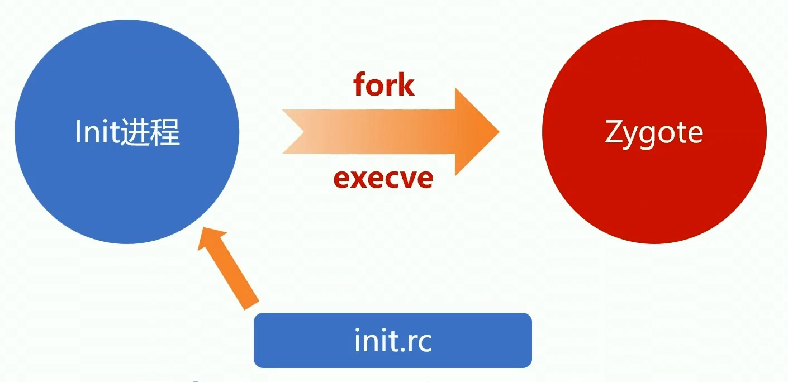

# 应用服务相关

网络图，方便理解


## 谈谈对Zygote的理解

考察点：Zygote的作用、Zygote的启动流程、Zygote的工作原理
### 作用

- 启动SystemServer

  系统服务进程SystemServer是由Zygote进程fork出的（系统中比较重要的ActivityManagerService、PackageManagerService，WindowManagerService以及PowerManagerService等也是由SystemServer进程创建而来的），fork出的SystemServer进程会继承Zygote的资源，比如：常用类、JNI函数、主题资源、共享库等。

- 孵化应用进程
	

[参考android的启动流程](https://blog.csdn.net/HUandroid/article/details/103454434)
里面有一个方法zygoteSendArgsAndGetResult方法，就是AMS请求Zygote来创建新的应用程序进程的。


  

### 启动三段式 

Android进程启动常用套路：


### 启动流程

#### 启动Zygote进程

Init进程：Linux启动后用户空间的第一个进程



1. Init进程启动后，首先会去加载一个启动配置文件`init.rc`。
2. 查看启动配置文件定义了哪些需要启动的系统服务 `Zygote`服务也是需要启动的进程之一，`Service Manager`也是需要启动的进程。
3. 通过 `fork`和 `execve`系统调用，启动`Zygote`。

##### 启动配置


红色：service的名称。蓝色：可执行路径。黄色：参数。

进程启动靠的是fork和exeve系统调用，需要传可执行的路径和参数，

##### 启动进程

启动进程有两种方式

- fork + handle

  ```cpp
  pid_t pid = fork();
  if( pid == 0) {
    // child process
  }else{
    // parent process
  }
  ```

- fork + exeve

  ```cpp
  pid_t pid = fork();
  if( pid == 0) {
    // child process
    execve(path,argv,env);// 执行程序路径，执行程序参数，环境变量
  }else{
    // parent process
  }
  ```

第一步都调用`fork`函数创建子进程。`fork()`函数会返回两次，子进程父进程各一次。区别在于子进程的`pid`返回0 ，父进程的pid返回的是子进程的`pid` ，所以可以根据判断pid是不是0判断是否是子进程还是父进程。

默认来说创建的子进程会继承父进程的所有资源，调用`execve`系统调用去启动新的二进制程序，子进程继承的父进程资源就会被清掉，完全被新的二进制程序替换。

##### 信号处理- SiGCHILD

fork进程的时候父进程一般都要关注这个信号。


如果父进程`fork`一个子进程，子进程挂了会发送一个`SIGCHILD`信号给父进程，这时父进程就可以做一些处理。比如`Zygote`挂了就会发送一个`SIGCHILD`信号给`Init`进程进行重启。

#### Zygote进程启动之后做了什么？

- Native 部分（准备部分）

  Zygote启动之后执行了一个`execve`系统调用,执行一个二进制可执行程序（c++，里面有一个`main`函数作为入口）所以说Zygote天生就是Native的，做一些准备工作之后就切到Java中运行了。

- Java 部分实际运行

##### Native部分

目的是为了Java执行做准备。


###### Native切换到Java


关键： JNICreateJavaVM 函数创建虚拟机。

1. JNICreateJavaVM 创建虚拟机
2. 找到ZygoteInit这个Java类
3. 在ZygoteInit类中找到 Main这个静态函数
4. 用CallStaticVoidMethod去调用这个函数
5. 最后DestoryJavaVM 销毁Java虚拟机

应用进程不需要创建虚拟机，是因为在Zygote进程中已经加载好了，我们应用进程是由Zygote孵化出来的，继承了Java虚拟机，只需要在进程启动的时候重置一下虚拟机的状态属性，再重启一下虚拟机就可以了

c++代码看着太难受，说下入口是哪里，想研究可看下：
`app_main.cpp `是`app_process`的入口文件
创建虚拟机的位置在：
`AndroidRuntime.cpp`中的`startVm`方法来启动虚拟机，`startReg`来注册JNI函数，`CallStaticVoidMethod(startClass, startMeth, strArray)`来调用`ZygoteInit`类的`main`方法，启动Java部分。
注意点：应用程序的虚拟机是继承Zygote进程的，然后再重置虚拟机的状态，再重启下虚拟机。

##### Java部分

主要做了三件事

1. 预加载资源：孵化子进程的时候可以继承给他们，包括常用类、主题相关的资源、共享库。
2. fork 启动SystemServer进程。
3. 进入Loop循环，等待Socket消息。用于AMS通信，参考android启动流程中的ZygoteState.connect(mSocket)，这里会创建Socket链接，在接受到AMS跨进程发过来的消息后，会调用handleChildProc启动ActivityThread.main()方法，进入新的进程了。
  


###### Loop循环

Zygote启动之后，会启动Socket Loop循环，会不断轮询Socket，当有请求过来的时候会执行runOnce函数。

runOnece方法：

1. 读取参数列表 readArgumentLIst()。

2. 根据参数启动子进程 forkAndSpecialize()。

3. 子进程启动后调用ActivityThread.Main函数

   子进程中调用 handleChidPro()，它会在子进程中调用一个Java类的Main函数，Java类名来自于读取的参数列表，是由AMS跨进程发过来的，类名其实是ActivityThread


### 细节与问题

#### Zygote fork 要单线程

Zygote里面有很多其他线程，为了保证状态一致并避免死锁，在fork子进程的时候，会停掉其他线程，在fork完成后，再恢复。可以理解为fork只能拷贝当前线程，不支持多线程的fork。

我们知道，应用在启动的时候需要做很多准备工作，包括启动虚拟机，加载各类系统资源等等，这些都是非常耗时的，如果能在zygote里就给这些必要的初始化工作做好，子进程在fork的时候就能直接共享，那么这样的话效率就会非常高。

这个就是zygote存在的价值，这一点呢SystemServer是替代不了的，主要是因为SystemServer里跑了一堆系统服务，这些是不能继承到应用进程的。所以给SystemServer和应用进程里都要用到的资源抽出来单独放在一个进程里，也就是这的zygote进程，然后zygote进程再分别孵化出SystemServer进程和应用进程。

#### Zygote的IPC为啥没有采用binder通信？

Zygote的mian方法中会创建一个server端Socket（LocalSocket\LocalServerSocket），用于等待AMS请求Zygote来创建新的应用程序进程的，并且封装了TCP/IP协议，去掉网络相关。
首先这里**有一坑**，别跳：binder线程的初始化是在ServiceManger初始化的，而ServiceManger是Init进程孵化的，比Zygote进程更早，所以就**不存在先后顺序问题**。
原因：

1. 为了避免父亲进程死锁、状态不一致等其他多线程问题，如果采用binder，在父进程binder线程有锁，然后子进程的主线程一直在等其子线程的资源，但是其实父进程的子进程并没有被拷贝过来，造成死锁，所以fork进程不允许存在多线程。而Binder通信是多线程的。
2. 对于Zygote和SystemServer而言，Socket更加简单便捷，也符合单线程规范。

#### 孵化应用进程为什么不交给SystemServer来做，而专门设计一个zygote？

因为效率问题，SystemServer里面会跑一些其他的服务，如果SystemServer来fork进程，可能造成资源污染，不适合继承。而Zygote进程专门设计来干这事的。

## 说一说Android系统的启动流程

### android有那些主要的系统进程？

主要的系统进程，可以查看`init.rc`

- service `zygote` system/bin/app_process..

- service `servicemanager` system/bin/servicemanager..

- service `surfacefilinger` system/bin/`surfacefilinger` ..

- service `media` system/bin/media..

- ......

`zygote` `ServiceManager` `surfaceflinger` `media` `SystemServer` `AMS` `PMS`等

### 这些系统进程怎么启动的？

主要说下`zygote`、`ServiceManager` `SystemServer`

### ServiceManager启动流程

先看网上博主的流程图，方便理解：后面会讲。


### Zygote启动流程

参考上面。

### SystemServer启动流程

#### zygote启动部分

看下zygote启动SystemServer的伪代码：
pid为0就是处于fork后的子进程，大于0就是处于父进程。
具体源码位置：frameworks/base/core/java/com/android/internal/os/ZygoteInit.jav


通过zygote来fork出SystemServer ，然后再处理`handleSystemServerProcess(parsedArgs)`方法了。

```java
private static Runnable handleSystemServerProcess(ZygoteConnection.Arguments parsedArgs) {
  return ZygoteInit.zygoteInit(parsedArgs.targetSdkVersion, parsedArgs.remainingArgs, cl);
}
```

再到`ZygoteInit.zygoteInit`方法：

```java
public static final Runnable zygoteInit(int targetSdkVersion, String[] argv, ClassLoader classLoader) {
        RuntimeInit.redirectLogStreams();
        RuntimeInit.commonInit();
        ZygoteInit.nativeZygoteInit();
        return RuntimeInit.applicationInit(targetSdkVersion, argv, classLoader);
}
```

源码地址：/frameworks/base/core/java/com/android/internal/os/RuntimeInit.java
`RuntimeInit.redirectLogStreams()是`初始化日志、`RuntimeInit.commonInit()`是公用初始化、`ZygoteInit.nativeZygoteInit()`是用来启用binder机制，注意不是创建，启动了一个binder线程、`RuntimeInit.applicationInit`来启动`SystemServer`的java类入口。

#### SystemServer的部分

看下`RuntimeInit.applicationInit`代码，会调用到`findStaticMain()`方法

```java
 protected static Runnable findStaticMain(String className, String[] argv,
            ClassLoader classLoader) {
            //className 就是上面传进来的 com.android.server.SystemServer
        Class<?> cl;
        cl = Class.forName(className, true, classLoader);
        Method m;
        m = cl.getMethod("main", new Class[] { String[].class });    
        return new MethodAndArgsCaller(m, argv);
    }
```

就是反射启动Java类调用main方法，类名为`com.android.server.SystemServer`，跟进看SystemServer.java的main方法：

```java
public static void main(String[] args) {
        new SystemServer().run();
    }
```

直接执行`run()`函数，代码太多，看伪代码了：


根据上面伪代码，可看出主要干了：

1. 给主线程绑定一个Looper
2. 加载一个共享库android_servers，是SystemServer系统层的代码
3. 创建一个系统的上下文，可看成一个应用
4. 启动bootstrap引导相关Services，AMS、DisplayManagerService等服务。
5. 启动Core核心相关Services , BatteryService、UserStatsService和WebviewUpdateService。
6. 启动Other其他相关Services，AlarmMangerService、VibratorService。
7. 开始Looper的轮询

#### 桌面的启动

当SystemServer服务就绪的时候，会调用` startHomeActivityLocked(currentUserId, "systemReady")`方法，然后会调用`ActivityInfo aInfo = resolveActivityInfo(intent, STOCK_PM_FLAGS, userId);`去找到`Launcher`启动的`Activity`，然后调用`mActivityStartController.startHomeActivity(intent, aInfo, myReason)`来通过意图启动Launcher。

```xml
<intent-filter>
    <action android:name="android.intent.action.MAIN" />
    <category android:name="android.intent.category.DEFAULT" />
    <category android:name="android.intent.category.HOME" />
    <category android:name="com.aliyun.ushell.action.detailpage" />
</intent-filter>
```

### 细节与问题

#### 系统服务是怎么发布，让应用程序可见？

绑定到ServiceManager


#### 系统服务跑在什么线程？

几乎没有在主线程上的，大部分创建在binder线程，部分例如DisplayThread、FgThread(前台线程)、IoThread、UiThread跑在工作线程

1. 为什么系统服务不都跑在binder线程里？
   因为binder线程是共享的，存在资源抢占问题，会影响系统服务响应的实时性。
2. 为什么系统服务不都跑在自己私有的工作线程里？
   开辟的线程太多，系统负载高，同时会浪费资源在切换线程里。
3. 跑在binder线程和跑在工作线程，如何取舍？
   对于实时性不高、耗时不多的可以跑在binder线程里

#### 怎么解决系统服务之间的相互依赖

分批启动：比较基础的服务放在前面启动，比如AMS、PKMS
分阶段启动：每到一个阶段告诉Service，那些资源可用，可以做那些初始化

## 怎么添加一个系统服务

### 如何使用系统服务


接着看下`ServiceFetcher`中`getService(ctx)`的实现：


然后看createService()相关代码，这里以POWER_SERVICE为例：

```java
registerService(Context.POWER_SERVICE, PowerManager.class,
        new CachedServiceFetcher<PowerManager>() {
            @Override
            public PowerManager createService(ContextImpl ctx) throws ServiceNotFoundException {
               //ServiceManager 通过名称拿到IBinder对象
                IBinder b = ServiceManager.getServiceOrThrow(Context.POWER_SERVICE);
                //IPowerManager 是业务类
                IPowerManager service = IPowerManager.Stub.asInterface(b);
                //PowerManager 是IPowerManager 的包装类，调用还是在IPowerManager里面
                return new PowerManager(ctx.getOuterContext(),
                        service, ctx.mMainThread.getHandler());
            }});

```

具体来看`getServiceOrThrow`方法，就是调用`getService`方法

```java
/**
 * Cache for the "well known" services, such as WM and AM.
*/
 private static HashMap<String, IBinder> sCache = new HashMap<String, IBinder>()
 public static IBinder getService(String name) {
        try {
            IBinder service = sCache.get(name);
            if (service != null) {
                return service;
            } else {
                return Binder.allowBlocking(rawGetService(name));
            }
        } catch (RemoteException e) {
            Log.e(TAG, "error in getService", e);
        }
        return null;
    }

```

其中`rawGetService(name)`会通过`ServiceManagerNative .asInterface(Binder.allowBlocking(BinderInternal.getContextObject()));`返回IBinder对象。

### 服务的注册原理


部分系统服务注册是在SystemService初始化注册的。
独立进程的系统服务，需要改init.rc的配置且要有main入口函数。

### 怎么添加一个系统服务

#### 添加时机

添加系统服务的时机：如果想跑到SystemServer里，可以利用SystemServer发布自己的服务；如果想跑在单独的进程，需要改init.rc的配置且要有main入口函数

#### 服务端

启用binder机制和其他线程通信

1. 打开binder驱动
2. 映射内存，分配缓冲区
3. 启动binder线程，进入binder loop

初始化配置
把服务的binder注册到ServiceManager

#### 客户端

为了保证调用方式一致，需要为这个服务注册ServiceFactory。

## 系统服务和bind的应用服务区别

### 启动方式

#### 系统服务

在SystemServer里面进行分批、分阶段启动，大部分都跑在binder线程里面。


#### 应用服务


```java
private ComponentName startServiceCommon(Intent service, boolean requireForeground,
            UserHandle user) {
        try {
            validateServiceIntent(service);
            service.prepareToLeaveProcess(this);
            ComponentName cn = ActivityManager.getService().startService(
                mMainThread.getApplicationThread(), service, service.resolveTypeIfNeeded(
                            getContentResolver()), requireForeground,
                            getOpPackageName(), user.getIdentifier());
            if (cn != null) {
                if (cn.getPackageName().equals("!")) {
                    throw new SecurityException(
                            "Not allowed to start service " + service
                            + " without permission " + cn.getClassName());
                } else if (cn.getPackageName().equals("!!")) {
                    throw new SecurityException(
                            "Unable to start service " + service
                            + ": " + cn.getClassName());
                } else if (cn.getPackageName().equals("?")) {
                    throw new IllegalStateException(
                            "Not allowed to start service " + service + ": " + cn.getClassName());
                }
            }
            return cn;
        } catch (RemoteException e) {
            throw e.rethrowFromSystemServer();
        }
    }
```

通过`ActivityManager.getService().startService()`启动的，后面会跟到源码`ActiveServices`这里：

```java
// frameworks/base/services/core/java/com/android/server/am/ActiveServices.java

public final class ActiveServices {

    private final void realStartServiceLocked(ServiceRecord r,
            ProcessRecord app, boolean execInFg) throws RemoteException {
        ... ...

        try {
            ... ...

            app.thread.scheduleCreateService(r, r.serviceInfo,
                    mAm.compatibilityInfoForPackage(r.serviceInfo.applicationInfo), app.getReportedProcState());
            ... ...

        }
        ... ...

    }

}

```

app 对象的 thread 会调用到客户端的 ActivityThread 中：

```java
public final class ActivityThread extends ClientTransactionHandler {

    // ApplicationThread 是一个 Binder
    private class ApplicationThread extends IApplicationThread.Stub {

        public final void scheduleCreateService(IBinder token,
                ServiceInfo info, CompatibilityInfo compatInfo, int processState) {
            updateProcessState(processState, false);
            CreateServiceData s = new CreateServiceData();
            s.token = token;
            s.info = info;
            s.compatInfo = compatInfo;
            sendMessage(H.CREATE_SERVICE, s);
        }
    }  
}
```

很熟悉的`sendMessage`方法，会发送消息到`H`类里面：

```java
class H extends Handler {

        public void handleMessage(Message msg) {
            switch (msg.what) {
			 ...	
                case CREATE_SERVICE:
                    Trace.traceBegin(Trace.TRACE_TAG_ACTIVITY_MANAGER, ("serviceCreate: " + String.valueOf(msg.obj)));
                    handleCreateService((CreateServiceData)msg.obj);    // 调用 handleCreateService() 方法
                    Trace.traceEnd(Trace.TRACE_TAG_ACTIVITY_MANAGER);
                    break;
			...
            }
        }

    }
```

跟入`handleCreateService((CreateServiceData)msg.obj)`方法：

```java
private void handleCreateService(CreateServiceData data) {
        // If we are getting ready to gc after going to the background, well
        // we are back active so skip it.
        unscheduleGcIdler();

        LoadedApk packageInfo = getPackageInfoNoCheck(
                data.info.applicationInfo, data.compatInfo);
        Service service = null;

        java.lang.ClassLoader cl = packageInfo.getClassLoader();
        service = packageInfo.getAppFactory()
                .instantiateService(cl, data.info.name, data.intent);
        
        ContextImpl context = ContextImpl.createAppContext(this, packageInfo);
        context.setOuterContext(service);

        Application app = packageInfo.makeApplication(false, mInstrumentation);
        service.attach(context, this, data.info.name, data.token, app,
                ActivityManager.getService());
        service.onCreate();
        mServices.put(data.token, service);
        ActivityManager.getService().serviceDoneExecuting(
                data.token, SERVICE_DONE_EXECUTING_ANON, 0, 0);

    }
```

分开看，`instantiateService`用来构建Service对象，`attach`给service赋予application，最后调用`onCreate`方法。

### 注册方式

#### 系统服务


总体上无论SystemServer、还是单独进程，都是要注册到ServiceManager上的。

#### 应用服务


1. 应用端会向AMS发起bindService。
2. AMS会先判断这个Service是否已经注册过了，注册过就直接把之前发布的binder返回给应用；如果没有，AMS会像Service请求binder对象。（AMS请求的，属于被动注册）
3. Service会响应AMS的请求，发布这个binder对象到AMS
4. AMS再把这个binder对象回调给应用

### 使用方式

#### 系统服务


通过服务名去找到对应的ServiceFetcher对象：

1. 先通过SM.getService拿到binder对象
2. 封装了一层拿到服务的管理对象。

#### 应用服务


1. 通过bindService向AMS发送绑定服务端请求
2. AMS通过onServiceConnected()回调把服务的binder对象返回给业务端，然后把这个对象封装成业务接口对象给业务接口调用。

## ServiceManager启动和工作原理

### ServiceManager启动流程

1. 启动进程
2. 启用Binder机制
3. 发布自己的服务
4. 等待并响应请求

**具体流程：**
ServiceManager也是配置`init.rc`启动文件中的,也是通过init进程拉起来的。


然后执行了`service_manager.c`的main函数：
frameworks/native/cmds/servicemanager/service_manager.c


`binder_open(128*1024)`，打开binder驱动。


主要是打开binder驱动，会返回一个描述符，然后再调用mmap给描述符创建一块内存（128K，业务比较简单，够用了）。

`binder_become_context_manager(bs)`，把自己注册成上下文管理者。


就是告诉binder驱动，自身已经准备就绪了。

`binder_loop(bs,svcmgr_handler)`，开启轮询，等待并处理请求。


binder_write用来处理读写请求的。
BINDER_WRITE_READ 是读写指令，如何判断是读还是写，是看read_size和write_size是否大于0，都大于0 ，优先写。）


`for(;;)`开启轮询，然后调用`binder_parse`去执行请求。

### 获取ServiceManager的binder对象

以SurfaceFlinger获取SM为例子，`defaultServiceManager()`来获取ServiceManager：


先判断缓存是否存在，不存在会开启一个等待。SurfaceFlinger也是init.rc拉起来，存在ServiceManager还没初始化完成的状态。通过getContextObject获取ServiceManager的binder对象。


IBinder对象就是BpBinder。	

### 向ServiceManager添加服务


通过remote()获得BpBinder对象，再调用BpBinder的transcat函数：


IPCThreadState是线程内的单例，负责与binder交互的，通过Handle与驱动交互。
再看ServiceManager接收方：


通过svcmgr_handler()，switch处理code，调用`do_add_service(bs,s,len,handle,...)`，注册一个handler插入到一个单链表里面。

### 从ServiceManager获取服务

跟注册服务差不多，发起binder调用：


跟上面一样，ServiceManager接受handler消息处理：


接收方也是通过svcmgr_handler()，switch处理code，调用`do_find_service`找到对应binder对象的handle值返回。

# 应用进程相关

## 应用进程是怎么启动的

### Linux下进程的启动方式

还记得前面提到SystemService的启动么，都是通过fork()孵化出来的：


两者区别就是exevce方法的执行，普通fork()子进程会共享父进程资源，而exevce的fork()出的子进程资源会被path替换掉，path是一个二进制程序的路径。

### 应用进程启动的原理

#### 什么时候触发的进程启动？谁发起的？

一般是被动触发的，对于android而言，如果要启动的组件所在进程未启动，就会启动进程了。


解释下`app.thread`:


在应用启动的时候，会向AMS通信，即会调用IActivityManager的函数告诉AMS自身启动意图和注册IApplicationThread句柄（句柄是一个标识符）。


#### 进程是谁启动的？怎么启动？

启动参考：[9.0app启动](https://blog.csdn.net/HUandroid/article/details/103454434)


zygote启动loop后，收到消息会调用runOnce函数，里面会fork进程后，子进程（pid==0）会调用handleChildProc()方法，会启动ActivityThread的入口函数main；父进程（pid>0）会调用handlePanrentProc（pid..）方法，会通过socket将pid写回去。


1. 由AMS通过socket向zygote发起 --> socket是为了避免启动多线程
2. zygote fork出应用进程，即通过startProcessLocked方法，打开本地socket，发送参数列表，返回创建的进程id，执行ActivityThread的main函数
3. 进程启动之后向AMS报告，整个启动才算结束（AMS确定进程启动后才能去启动各个组件

## 应用怎么启用Binder机制的

### 支持binder时机

根据前面系统启动可知，binder机制是zygote拉起SystemServer时候就开始支持的。

### 怎么启动Binder机制


## 对Application的理解

### 作用

- 保存应用进程内的全局变量
- 提供应用的上下文
- 提供初始化入口

注意：Application是对应的进程，而不是应用。一般情况下，一个应用对应一个进程一个虚拟机，也可以在清单文件中配置多个进程，这样Application会初始化多次。

### 类继承关系及生命周期～

直接看图：


Application就是一个全局的上下文。
生命周期：

- 构造函数
- attachBaseContext
- onCreate

调用顺序请查看：[9.0app启动](https://blog.csdn.net/HUandroid/article/details/103454434)

### 初始化原理


面试题：Application创建、Application.onCreate()、Activity创建、Activity.onCreate()的执行顺序？
答：Activity创建 -》Application创建-》Application.onCreate()-》Activity.onCreate()
注意点1：不要在Application初始化阶段，执行耗时操作。
注意点2: Application中使用使用静态变量的问题，在挂在后台后，再次进入应用可能会内存重建（内存不足，杀掉app，再进入前台后创建进程和恢复activity），这个静态变量可能没有初始化导致的bug。对Context的理解

## 对Context的理解

### 作用


根据官方注解，Context是一个有关应用程序环境的全局信息的接口。这是一个抽象类，其实现由Android系统提供。它允许访问特定于应用程序的资源和类，以及对应用程序级操作（例如启动活动，广播和接收意图等）的调用。
而具体实现是由ContextImpl来实现的：包含了各类资源的调用。


### 初始化流程

Context 的创建分为三种组件：`Application` `Activity` `Service`。

#### Application的Context


而Application继承于ContextWrapper的：


将创建的ContextImpl的实现类给交了ContextWrapper，ContextWrapper就是作为一个包装类来使用。

#### Activity的Context


#### Service的context


### 问题

1. 应用里面有多少个Context？不同Context之间有什么区别？
   application+activity+service，注意多进程。activity的context是继承ContextThemeWrapper，多了UI组件。
2. Activty里的this和getBaseContext有什么区别？
   this是返回自身，而getBaseContext 是返回ContextWrapper里面的mBase。
3. getApplication和getApplicationContext有什么区别？
   getApplication是Activity和Service里面特有的，getApplicationContext是Context里面的抽象函数。
4. Dialog使用Application作为context为什么会报错？
   使用Application的context构建dialog会报BadTokenException，因为activity这类context是带有Token信息的。每一个ActivityRecord里面都有一个appToken变量，它是一个Binder对象，主要用于维持该Activity在AMS里与WindowManager之间的联系。它在ActivityRecord的构造函数中被初始化，通过调用WindowManager.addAppToken方法将该Token注册到WindowManagerService里面。


# Activity组件相关

## Activity的启动流程

参考9.0启动流程https://blog.csdn.net/HUandroid/article/details/103454434

## Activity的显示原理

### 显示原理

Activity启动的时候会调用到`handleResumeActivity()`，实现在`ActivityThread`里面的简化代码如下：

```java
   public void handleResumeActivity(IBinder token, boolean finalStateRequest, boolean isForward,
            String reason) {
        final ActivityClientRecord r = performResumeActivity(token, finalStateRequest, reason);
        final Activity a = r.activity;
        r.window = r.activity.getWindow();
        View decor = r.window.getDecorView();
        //makeVisible 方法会设置VISIBLE
        decor.setVisibility(View.INVISIBLE);
      	//获取ViewManager 其实就是WindowManager
        ViewManager wm = a.getWindowManager();
        //a.mWindowAdded = true;
       // wm.addView(decor, layoutParams);
         r.activity.makeVisible()
        Looper.myQueue().addIdleHandler(new Idler());
    }

```

先理解两个概念Window、WindowManager：

**Window**是一个抽象类，**PhoneWindow**是它的唯一实现类。Android中的所有视图都是通过Window来实现的。不管是Activity、Dialog还是Toast，它们的视图实际上都是附加在Window上的。View是Android中呈现视图的方式，但是View不能单独存在，必须附着在Window这个抽象的概念上。**每个Window都对应着一个View和一个ViewRootImpl**，Window和View通过ViewRootImpl来建立联系。

**WindowManager**
Window的管理者，可以**创建Window**。Window的具体实现是在WindowManagerService中，WindowManager和WindowManagerService之间的交互是一个**IPC**过程。WindowManager的实现类是WindowManagerImpl，而WindowManagerImpl是个包装类，真正干活的是WindowManagerGlobal，提供了WMS的通信。

接着跟进`makeVisible`方法：

```java
 void makeVisible() {
        if (!mWindowAdded) {
            ViewManager wm = getWindowManager();
            wm.addView(mDecor, getWindow().getAttributes());
            mWindowAdded = true;
        }
        mDecor.setVisibility(View.VISIBLE);
    }

```

回调用ViewManager的addView方法，其实就是就是调用WindowManager的addView方法，最后由`WindowManagerGlobal`实现`addView`方法：

```java
  @UnsupportedAppUsage
    private final ArrayList<View> mViews = new ArrayList<View>();
    @UnsupportedAppUsage
    private final ArrayList<ViewRootImpl> mRoots = new ArrayList<ViewRootImpl>();
    @UnsupportedAppUsage
    private final ArrayList<WindowManager.LayoutParams> mParams =
            new ArrayList<WindowManager.LayoutParams>();
    private final ArraySet<View> mDyingViews = new ArraySet<View>();
    
 public void addView(View view, ViewGroup.LayoutParams params,
            Display display, Window parentWindow) {
      
        ViewRootImpl root;
        View panelParentView = null;

        synchronized (mLock) {
          

            root = new ViewRootImpl(view.getContext(), display);

            view.setLayoutParams(wparams);

            mViews.add(view);
            mRoots.add(root);
            mParams.add(wparams);
            root.setView(view, wparams, panelParentView);
            // do this last because it fires off messages to start doing things
            try {
                root.setView(view, wparams, panelParentView);
            } catch (RuntimeException e) {
                // BadTokenException or InvalidDisplayException, clean up.
                if (index >= 0) {
                    removeViewLocked(index, true);
                }
                throw e;
            }
        }
    }

```

最后是调用`ViewRootImpl`去`setView`方法：

```java
 public void setView(View view, WindowManager.LayoutParams attrs, View panelParentView) {
        synchronized (this) {
                ...
                //请求绘制
                requestLayout();
                //收集属性
  				collectViewAttributes();
                res = mWindowSession.addToDisplay(mWindow, mSeq, mWindowAttributes,
                            getHostVisibility(), mDisplay.getDisplayId(), mTmpFrame,
                            mAttachInfo.mContentInsets, mAttachInfo.mStableInsets,
                            mAttachInfo.mOutsets, mAttachInfo.mDisplayCutout, mInputChannel,
                            mTempInsets);
                    setFrame(mTmpFrame);
              
                ...               
    }

```

重要的方法`requestLayout()`，大家都很熟悉，会调用到`scheduleTraversals()`:

```java
 public void requestLayout() {
        if (!mHandlingLayoutInLayoutRequest) {
            checkThread();
            mLayoutRequested = true;
            scheduleTraversals();
        }
    }

```

最终会走到`performTraversals()`方法，执行`performMeasure()` `performLayout()` `performDraw()`，完成view的绘制。

分析`mWindowSession`：

IWindowSession其实是个binder对象，其最后是一个Session对象，负责与WMS通信的。


分析`addToDisplay`调用：

主要是将mWindow注册到WMS端构成双向绑定，重要的是WMS将获取到的Window信息进行汇总即位置、层级、大小等进行合成，显示在屏幕的缓冲区里面。


**setContentView原理是什么：**

```java
public void setContentView(@LayoutRes int layoutResID) {
        getWindow().setContentView(layoutResID);
        initWindowDecorActionBar();
    }
```

`getWindow()` 是返回Window对象，在attach()函数里初始化的: `mWindow = new PhoneWindow(this, window, activityConfigCallback)`,跟进`PhoneWindow.setContentView`方法：

```java
 public void setContentView(int layoutResID) {
        // Note: FEATURE_CONTENT_TRANSITIONS may be set in the process of installing the window
        // decor, when theme attributes and the like are crystalized. Do not check the feature
        // before this happens.
        // 用来装ContentView的
        if (mContentParent == null) {
            installDecor();
        } else if (!hasFeature(FEATURE_CONTENT_TRANSITIONS)) {
            mContentParent.removeAllViews();
        }

        if (hasFeature(FEATURE_CONTENT_TRANSITIONS)) {
            final Scene newScene = Scene.getSceneForLayout(mContentParent, layoutResID,
                    getContext());
            transitionTo(newScene);
        } else {
        //将生成的view 装入mContentParent里面
            mLayoutInflater.inflate(layoutResID, mContentParent);
        }
        mContentParent.requestApplyInsets();
        final Callback cb = getCallback();
        if (cb != null && !isDestroyed()) {
            cb.onContentChanged();
        }
        mContentParentExplicitlySet = true;
    }

```

所以要看看 `installDecor()`干了那些活：


然后大致可以理解成这样的：


### UI线程

UI线程是刷新UI所在的线程，是单线程模型。

#### UI线程是主线程嘛？

从`Activity.runOnUiThread(Runnable)`和`View.post(Runnable)`对比找到答案：

```java
   public final void runOnUiThread(Runnable action) {
        if (Thread.currentThread() != mUiThread) {
            mHandler.post(action);
        } else {
            action.run();
        }
    }
```

其中mHandle是activity中创建的，所以对应的是activity创建所在的线程的Looper。
而mUiThread是在activty的attach函数中赋值的。而Activity的创建都是在主线程的，所以，对与 Activity来说，UI线程就是主线程。
再看View.post(Runnable)：

```java
public boolean post(Runnable action) {
        final AttachInfo attachInfo = mAttachInfo;
        if (attachInfo != null) {
            return attachInfo.mHandler.post(action);
        }

        // Postpone the runnable until we know on which thread it needs to run.
        // Assume that the runnable will be successfully placed after attach.
        getRunQueue().post(action);
        return true;
    }

```

attachInfo是在视图被添加到window时候附加的信息，即是ViewTree在递归的时候对每个view赋予的，在ViewRootImpl构造函数里面创建的。所以attachInfo.mHandler就是ViewRootImpl.ViewRootHandler,所以对应的当前线程就是创建ViewRootImpl的线程。
另一种情况：attachInfo==null （因为ViewRootImpl是在onResume创建的）,会将action丢到HandlerActionQueue里面，也是绑定了创建ViewRootImpl的线程。所以，**对View来说，它的UI线程就是ViewRootImpl创建时候所在的线程。**

#### 一个异常


具体位置：

```java
  void checkThread() {
        if (mThread != Thread.currentThread()) {
            throw new CalledFromWrongThreadException(
                    "Only the original thread that created a view hierarchy can touch its views.");
        }
    }
```

其中mThread就是ViewRootImpl初始化的，对应就是ViewRootImpl创建的线程。所以要理解ViewRootImpl创建流程：


所以，**Activty的DecorView对应的ViewRootImpl是在主线程创建的！**	

#### 三个结论


根据上面的结论，可退出：**UI线程==主线程**

#### 非UI线程能更新UI嘛

所以，又有一个经典问题：非UI线程能更新UI嘛？
答：特定情况能更新，为啥了？
还记得checkThread()的报错么？是ViewRootImpl报的，如果ViewRootImpl还没被创建，就能更新UI了。ViewRootImpl的创建是在onResume之后执行的。
测试代码：

```java
  @Override
    protected void onCreate(Bundle savedInstanceState) {
        super.onCreate(savedInstanceState);
        setContentView(R.layout.activity_test);
        TextView textView = (TextView) findViewById(R.id.actv_test);
        new Thread(new Runnable() {
            @Override
            public void run() {
                textView.setText("子线程更新UI");
            }
        }).start();
    }
```

发现textView的文本发生了变化，是不是达到了非UI线程更新UI的效果了。
然后在理解理解这句话 对View来说，它的UI线程就是ViewRootImpl创建时候所在的线程，记得每个window是跟ViewRootImpl是对应关系的，所以我们也可以在非UI线程添加窗口，并操作。反而你在主线程操作反而会报错
              

```java
WindowManager.LayoutParams layoutParams = new WindowManager.LayoutParams(300, 300, WindowManager.LayoutParams.TYPE_APPLICATION_OVERLAY, 0, PixelFormat.RGBA_8888);
            layoutParams.flags = WindowManager.LayoutParams.FLAG_NOT_TOUCH_MODAL | WindowManager.LayoutParams.FLAG_NOT_FOCUSABLE | WindowManager.LayoutParams.FLAG_SHOW_WALLPAPER;
            layoutParams.gravity = Gravity.CENTER;
            WindowManager mWindowManager = (WindowManager) getApplicationContext().getSystemService(WINDOW_SERVICE);

            mWindowManager.addView(button1,layoutParams);
             //当前线程绑定view，所以能操作view
            button1.setText("非");
            button1.setTextSize(66);
            
            Looper.loop();
        }
    }).start();

    Handler sHandler = new Handler(Looper.getMainLooper());
    sHandler.postDelayed(new Runnable() {
        @Override
        public void run() {
        //这里放开就会报CalledFromWrongThreadException错，就是checkThread()报的
            //   button1.setText("主");
        }
    },5000);
```

