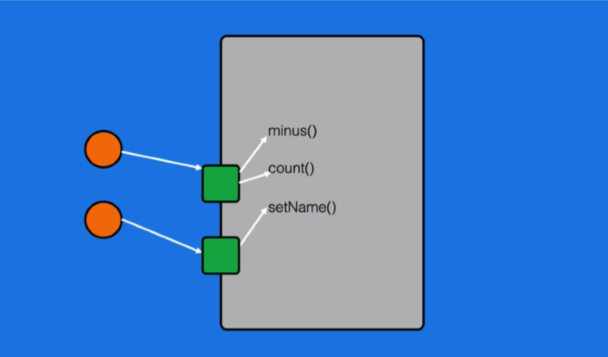
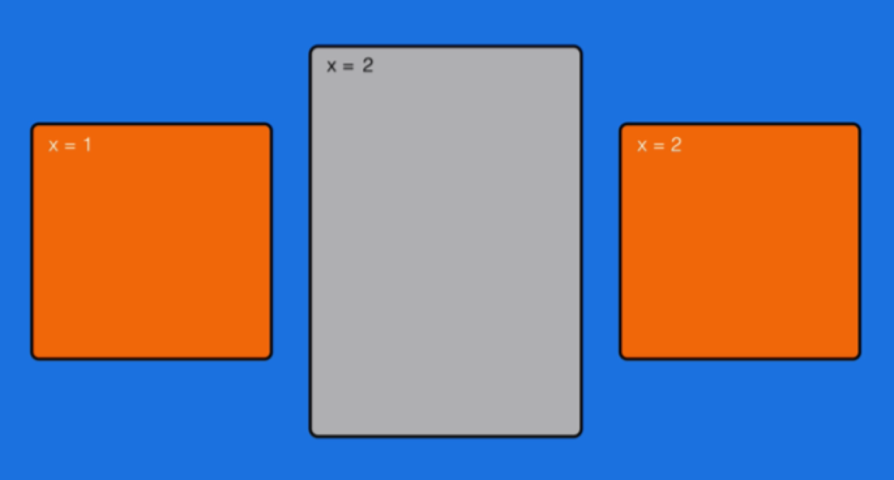

# 进程和线程(介绍)

- 操作系统中运行多个软件。
- 一个运行中的软件可能包含多个进程。

-  一个运行中的进程可能包含多个线程。
-  操作系统开辟一段内存/资源给进程。

## 进程和线程的异同

- 进程之间的内存不共享，线程程可以共享资源，都可以并行工作。
- 他们本质上不是一个东西，像是家庭和家庭成员的关系,进程相当于一个运行的程序，线程是一个程序里的并行线路之一。


## CPU 线程和操作系统线程 

1. CPU 线程：

   多核 CPU 的每个核各自独立运行，因此每个核一个线程 「四核八线程」:CPU 硬件方在硬件级别对 CPU 进行了一核多线程的 支持(本质上依然是每个核一个线程)

2. 操作系统线程:

   操作系统利用时间分片的方式，把 CPU 的运行拆分给多条 运行逻辑，即为操作系统的线程，开发中接触的是操作系统线程。

单核 CPU 也可以运行多线程操作系统 

## 线程是什么:

按代码顺序执行下来，执行完毕就结束的一条线

## UI 线程为什么不会结束?

因为它在初始化完毕后会执行死循环，循环的内 容是刷新界面。

为什么一直循环却不会卡，就是因为在循环所以程序才没有结束，一次循环就是一次生命周期。

如果在ui线程中写了死循环，那么ui的下一次刷新就永远无法到来，就卡住了。

<!-- more -->

# 多线程的使用

## Java中开启线程的方法

1. new Thread: 可复写Thread#run方法。也可传递Runnable对象，更加灵活。
   - 缺点:缺乏统一管理，可能无限制新建线程，相互之间竞争，及可能占用过多系统资源导致死机或oom
2. ThreadFactory 是个接口类需要实现newThread()，其实还是使用new Thread()开启
3. ThreadPoolExecutor:适用快速处理大量耗时较短的任务场景


## Thread 和 Runnable

### Thread

```java
 private static void thread() {
        Thread thread = new Thread() {
            @Override
            public void run() {
                System.out.println("Thread started");

            }
        };
        thread.start(); //后台启动
        thread.run();//直接运行，不会在后台启动
    }
```

- Android 中 Thread 的start 方法调用的是nativeCreate（）方法，java中是调用start0方法，因为Java代码是不能开启虚拟机的，也没有切换线程的能力，只能交给Jvm让通过natvive平台实现
- run()方法只是类的一个普通方法而已，如果直接调用Run方法，程序中依然只有主线程这一个线程，其程序执行路径还是只有一条，
  还是要顺序执行，还是要等待run方法体执行完毕后才可继续执行下面的代码，这样就没有达到写线程的目的。
- 总结：
  - Jvm虚拟机开启了新线程之后又调用了Java 的run方法。
  - 其实Thread也是实现了Runnable接口的，回调函数也是run方法

> * Java 中的 registerNatives 本地方法，该方法主要的作用就是注册一些本地方法供 Thread 类使用，如 start0()，stop0() 等等，可以说，所有操作本地线程的本地方法都是由它注册的。
> * 这个方法放在一个 static 语句块中，当该类被加载到 JVM 中的时候，它就会被调用，进而注册相应的本地方法。(查看本地方法的源码需要前往 http://jdk.java.net/java-se-ri/8 下载openjdk的源代码)
> * 而本地方法 registerNatives 是定义在 Thread.c 文件中的。Thread.c 是个很小的文件，它定义了各个操作系统平台都要用到的关于线程的公用数据和操作，
> *  Java 线程调用 start->start0 的方法，实际上会调用到 JVM_StartThread 方法，     

### Runnable

```java
        System.out.println(Thread.currentThread().getName());

        Runnable runnable = new Runnable() {
            @Override
            public void run() {
                System.out.println("Thread with runnable started:"+Thread.currentThread().getName());

            }
        };
        Thread thread = new Thread(runnable);
//        thread.start();
        thread.run();
        System.out.println(Thread.currentThread().getName());
```

Thread和Runnable调用run方法最终都会调用`runnable.run`

所以用runnable的方法可以复用runnable且便于管理。

## ThreadFactory
它只是一个接口类，只是用来new Thread 而已.
```java
        ThreadFactory factory = new ThreadFactory() {
            AtomicInteger count = new AtomicInteger(0); // int

            @Override
            public Thread newThread(Runnable r) {
                return new Thread(r, "Thread-" + count.incrementAndGet()); // ++count
            }
        };

        Runnable runnable = new Runnable() {
            @Override
            public void run() {
                System.out.println(Thread.currentThread().getName() + " started!");
            }
        };

        Thread thread = factory.newThread(runnable);
        thread.start();
        Thread thread1 = factory.newThread(runnable);
        thread1.start();

```

## 线程池的实现原理

### 为什么引入线程池

- **降低资源消耗**。通过重复利用已创建的线程降低线程创建和销毁造成的消耗。
- **提高响应速度**。当任务到达时，任务可以不需要的等到线程创建就能立即执行。
- **提高线程的可管理性**。线程是稀缺资源，如果无限制的创建，不仅会消耗系统资源，还会降低系统的稳定性，使用线程池可以进行统一的分配，调优和监控。

### 如何构建线程池

无论是使用Executors 还是直接创建线程池都会实例化ThreadPoolExecutor()来创建线程池

```java
public ThreadPoolExecutor(int corePoolSize,
                              int maximumPoolSize,
                              long keepAliveTime,
                              TimeUnit unit,BlockingQueue<Runnable> workQueue,
                              ThreadFactory threadFactory,       
                            RejectedExecutionHandler handler)

```

|      参数       |                             意义                             |
| :-------------: | :----------------------------------------------------------: |
|  corePoolSize   | 线程池中**核心**线程数量(默认线程数，刚创建的时候有多少线程，一直存在不会被销毁) |
| maximumPoolSize | **最大**能创建的线程数量（MAX_VALUE是无限，因为创建和销毁都要消耗资源，所以要限定） |
|  keepAliveTime  | **非核心**线程最大存活时间（非核心线程执行完任务多久要销毁） |
|      unit       |                   keepAliveTime的时间单位                    |
|    workQueue    | 等待队列。当任务提交时，如果线程池中**正在运行的的线程**数量**大于等于corePoolSize（核心线程数量）的时候，把该任务放入等待队列**（这个队列满了之后才会创建非核心线程） |
|  threadFactory  | **线程创建工程厂**。默认使用Executors.defaultThreadFactory() 来创建线程，线程具有相同的NORM_PRIORITY优先级并且是非守护线程 |
|   **handler**   | **线程池的饱和拒绝策略**。如果阻塞队列满了并且没有空闲的线程，这时如果继续提交任务，就需要采取一种策略处理该任务（默认策略是抛出异常）。 |


```
private static void executor() {
    Runnable runnable =new Runnable() {
        @Override
        public void run() {
            System.out.println("Thread with Runnable started");
        }
    };
		//线程池
    Executor executor = Executors.newCachedThreadPool();
    executor.execute(runnable);
}
```

### JUC包下Executors提供的几种线程池


- Executor可以创建4种线程池(缓存，单线程，固定线程数，可定时的线程池)

  ```java
  //单一线程数,同时只有一个线程存活,但线程等待队列无界
   Executors.newSingleThreadExecutor();
  //线程可复用线程池,核心线程数为0，最大可创建的线程数为Interger.max,线程复用存活时间是60s.  
   Executors.newCachedThreadPool();
  //固定线程数量的线程池
   Executors.newFixedThreadPool(int corePoolSize);
  //可执行定时任务,延迟任务的线程池
   Executors.newScheduledThreadPool(int corePoolSize);
  ```

  

- 创建好线程池后会返回一个 ExecutorService，用于管理线程池，ExecutorService包含两个主要方法：

  - shutdown会保守的结束线程，等待当前执行中的线程结束后再停止线程，但允许再排队。
  - shutdownNow直接结束线程，使用的是interrupt。

#### ExecutorService

Executors 创建线程池的方法会返回ExecutorService，里面有几个个重要方法

```java
void execute(Runnable run)//提交任务,交由线程池调度
void shutdown()//关闭线程池,等待任务执行完成
void shutdownNow()//关闭线程池，不等待任务执行完成
int  getTaskCount()//返回线程池找中所有任务的数量
int  getCompletedTaskCount()//返回线程池中已执行完成的任务数量
int  getPoolSize()//返回线程池中已创建线程数量 
int  getActiveCount()//返回当前正在运行的线程数量
```

#### newCachedThreadPool 新建缓存线程池

```java
        ExecutorService cachedThreadPool = Executors.newCachedThreadPool();
        for (int i = 0; i < 10; i++) {
            final int index = i;
            try {
                Thread.sleep(index * 1000);
            } catch (InterruptedException e) {
                e.printStackTrace();
            }

            cachedThreadPool.execute(new Runnable() {

                @Override
                public void run() {
                    System.out.println(index);
                }
            });
        }
```


```java
public static ExecutorService newCachedThreadPool(ThreadFactory threadFactory) {
        return new ThreadPoolExecutor(0, Integer.MAX_VALUE,
                                      60L, TimeUnit.SECONDS,
                                      new SynchronousQueue<Runnable>(),
                                      threadFactory);
    }
```

#### newSingleThreadExecutor创建一个单线程

```java
        ExecutorService singleThreadExecutor = Executors.newSingleThreadExecutor();
        for (int i = 0; i < 10; i++) {
            final int index = i;
            singleThreadExecutor.execute(new Runnable() {

                @Override
                public void run() {
                    try {
                        System.out.println(index);
                        Thread.sleep(2000);
                    } catch (InterruptedException e) {
// TODO Auto-generated catch block
                        e.printStackTrace();
                    }
                }
            });
        }
```


```
Executors.newSingleThreadExecutor();

public static ExecutorService newSingleThreadExecutor(ThreadFactory threadFactory) {
        return new FinalizableDelegatedExecutorService
            (new ThreadPoolExecutor(1, 1,
                                    0L, TimeUnit.MILLISECONDS,
                                    new LinkedBlockingQueue<Runnable>(),
                                    threadFactory));
```

创建一个单线程，一般用于取消线程的时候使用，不然在一个线程回收所有标记取消的线程太慢了。

#### newFixedThreadPool  固定线程数的线程池

```java
        ExecutorService fixedThreadPool = Executors.newFixedThreadPool(3);
        for (int i = 0; i < 10; i++) {
            final int index = i;
            fixedThreadPool.execute(new Runnable() {

                @Override
                public void run() {
                    try {
                        System.out.println(index);
                        Thread.sleep(2000);
                    } catch (InterruptedException e) {
// TODO Auto-generated catch block
                        e.printStackTrace();
                    }
                }
            });
        }
```


```java
Executors.newFixedThreadPool(2);

public static ExecutorService newFixedThreadPool(int nThreads) {
        return new ThreadPoolExecutor(nThreads, nThreads,
                                      0L, TimeUnit.MILLISECONDS,
                                      new LinkedBlockingQueue<Runnable>());
    }
```

固定线程数的线程池，不能增加也不能减少，空闲时候会一致占着不会回收，需要增加时也不能扩展。

适用于集中处理多个瞬时爆发的任务。

#### newScheduledThreadPool:延迟任务

```java
        ScheduledExecutorService scheduledThreadPool = Executors.newScheduledThreadPool(5);

        scheduledThreadPool.scheduleAtFixedRate(new Runnable() {

            @Override
            public void run() {
                System.out.println("delay 1 seconds, and excute every 3 seconds");
            }
        }, 1, 3, TimeUnit.SECONDS);
```

```java
Executors.newScheduledThreadPool(1);
Executors.newSingleThreadScheduledExecutor(factory);
```

我们可以建造一个全局通用的线程池 

 可以用于RxJava

```java
ExecutorService myExecutor = new ThreadPoolExecutor(5, 100, 5, TimeUnit.SECONDS, new SynchronousQueue<Runnable>());
myExecutor.execute(runnable);
```

### 线程池状态流转


### execute 提交任务流程


## Callable

很少用到，可以认为是个有返回值的runnable

```java
Callable<String> callables = new Callable<String>() {
    @Override
    public String call() {
        try {
            Thread.sleep(1500);
        } catch (InterruptedException e) {
            e.printStackTrace();
        }
        return "Done";
    }
};
ExecutorService executorService = Executors.newCachedThreadPool();
Future<String> future = executorService.submit(callables);
try {
    String result = future.get();
    System.out.println("result: " + result);
} catch (ExecutionException e) {
    e.printStackTrace();
} catch (InterruptedException e) {
    e.printStackTrace();
}
```

executorService.submit一个callable对象。

future.get()是阻塞式的api，可以等一会再取。这就是JavaApi能做到的极限了，这仍然是阻塞式的。

我们可以通过 future.isDone()来查询cllable是否完成。通过轮询来实现。

```java
Callable<String> callables = new Callable<String>() {
            @Override
            public String call() {
                try {
                    Thread.sleep(1500);
                } catch (InterruptedException e) {
                    e.printStackTrace();
                }
                return "Done";
            }
        };
        ExecutorService executorService = Executors.newCachedThreadPool();
        Future<String> future = executorService.submit(callables);
        while (true) {
            //...
            if (future.isDone()) {
                try {
                    String result = future.get();
                    System.out.println("result: " + result);
                } catch (ExecutionException e) {
                    e.printStackTrace();
                } catch (InterruptedException e) {
                    e.printStackTrace();
                }
                break;
            }
        }
```

# 线程同步和线程安全

## 关键字

### synchronized 关键字（锁）

- synchronized

  - synchronized方法 

    ```java
    private synchronized void count(int newValue) {
    	x = newValue;
    	y = newValue; 
    	if (x != y) {
            System.out.println("x: " + x + ", y:" +y);
            }
    }        
    ```

  - synchronized 代码块

    ```java
    //这个写法等价于在，方法前加 sychronized，因为是用这个类本身来监视代码块 
    private void count(int newValue) { 
      synchronized (this) { 
    		x = newValue; y = newValue; if (x != y) {
        System.out.println("x: " + x + ", y:"+ y);
        }
      } 
    }
    ```
  ```
  
    ```java
    synchronized (monitor1) { 
    		synchronized (monitor2) {
            name = x + "-" + y;
        }
    }
  ```
  
- synchronized 的本质
  
  - 保证方法内部或代码块内部资源(数据)的互斥访问。即同一时间、由 同一个 Monitor 监视的代码，最多只能有一个线程在访问
  
    
  
  - 保证线程之间对监视资源的**数据同步**。即，任何线程在获取到 Monitor 后的第一时间，会先将共享内存中的数据复制到自己的缓存中;任何线程在释放 Monitor 的第一时间，会先将缓存中的数据复制到共享内存中。
  
      

#### 例子1:

```java
class Synchronized2Demo implements TestDemo {

    private int x = 0;

    private synchronized void count() {
        x++;
    }

    @Override
    public void runTest() {
        new Thread() {
            @Override
            public void run() {
                super.run();
                for (int i = 0; i < 1_000_000; i++) {
                    count();
                }
                System.out.println("final x from 1: " + x);

            }
        }.start();

        new Thread() {
            @Override
            public void run() {
                super.run();
                for (int i = 0; i < 1_000_000; i++) {
                    count();
                }
                System.out.println("final x from 2: " + x);
            }
        }.start();

    }
}

```

两个线程都执行1百万次 count，理论上x++会执行2百万次，结果应该是2000000，实际输出结果是：

```
final x from 1: 1963117
final x from 2: 2000000
```

因为两个线程一定不是同时结束运行的，后加完的结果应该就是2000000，执行完的结果应该小于2000000，但是如果不加关键字，执行结果是：

```
final x from 1: 1466918
final x from 2: 1670223
```

两个线程的输出结果都没有到2000000，因为两个线程对x进行内存拷贝时可能存在互相覆盖的情况，会导致最后的结果不到200w

如果此时给int 值x 加一个volatile参数，而不是sychronize关键字，输出的结果仍然不会到200w，因为i++在Java中不是一步操作（原子操作），而是分两步完成（int temp= x+1 ,x=temp），这导致volatile关键字无法同步数值（可能在给临时变量temp赋值的时候切换线程，导致计数错误 ）。

所以想保持线程安全，不光要保证数值的同步，还要把那些会互相影响的操作合成为一个操作（原子操作）。

此时我们给执行x++操作的count方法加一个sychronized 关键字，它能让方法里的内容保持同步性，**~~可以理解为当一个线程执行这个count方法时，其他线程就不能调用了，里面的变量值也能保证同步性~~**注意这个理解是不全面的。

#### 例子2：

```java
class Synchronized3Demo implements TestDemo {

    private  int x = 0;
    private  int y = 0;

    private String name;

    private synchronized void count(int newValue){
        x = newValue;
        y = newValue;
    }
  
  	private  synchronized void minus(int delta) {
        x -= delta;
        y -= delta;
    }

    public  void setName(String name) {
        this.name = name;
    }

    @Override
    public void runTest() {

    }
}
```

事实上，我们想保护的是数据而不是方法，Java中会通过一个监视者Monitor来监视方法是不是被其他线程调用，当我们为两个方法加上synchronized关键字的时候，会使用同一个Monitor，当线程1调用count方法的时候，线程2级不能调用count方法也不能调用setName方法，非常影响效率。

这个设计的意义是，minus方法没有加synchronized关键字，仍然可以被其他线程改变x，y的值，为了让 x,y的数据不被其他线程修改，我们对会影响数据x，y的 两个方法使用synchronized，公用一个Monitor，让其它线程无法调用。

对于setName方法，它不会影响到x和y我们希望它能有一个独立的Monitor，synchronized代码块

```java
private void count(int newValue) { 
  synchronized (this) {
		x = newValue; y = newValue; if (x != y) {
    System.out.println("x: " + x + ", y:"+ y);
    }
  } 
}
```

这里 this 的含义是 ，这个TestDemo类本身将会作为这块代码的Monitor

Monitor我们也可以自己定义

```java
  private final Object monitor1 = new Object();
  private final Object monitor2 = new Object();

  private void count(int newValue) {
    synchronized (monitor1) {
      x = newValue;   // monitor
      y = newValue;
    }
  }

  private void minus(int delta) {
    synchronized (monitor1) {
      x -= delta;
      y -= delta;
    }
  }

  private synchronized void setName(String newName) {
    synchronized (monitor2) {
      name = newName;
    }
  }

```

这样可以给count和minus分配monitor1观察，setName用monitor2观察。

这里之所以用Object作为监视者是因为monitor本身只是一个标识位，具体监视行为交给Jvm即可，没必要特地使用Monitor类，而且省资源。

自己手动new，直接使用synchronized以及用this synchronized代码块会产生三个不同好的monitor。

### 死锁

- 有的时候我们不只要锁一个东西，在同一个代码块里面可能要锁两个东西。

- 当两个方法互相拿着对方的锁的时候就会造成死锁（count 方法想拿monitor2往下执行，恰巧此时setName方法想使用monitor1再继续往下执行，但是此时恰巧monitor都被对方占用等待释放，此时就会形成死锁，永远也无法释放）

- 单锁永远不会死锁，双锁才会。

```java
   	private int x = 0;
    private int y = 0;
    private String name;
    private final Object monitor1 = new Object();
    private final Object monitor2 = new Object();

    private void count(int newValue) {
        synchronized (monitor1) {
            x = newValue;   // monitor
            y = newValue;
        }
        synchronized (monitor2){
            name =newValue+"";
        }
    }
    private synchronized void setName(String newName) {
        synchronized (monitor2) {
            name = newName;
        }
        synchronized (monitor1){
            x = 1;   // monitor
            y = 2;
        }
    }
```

### 悲观锁和乐观锁
对于Android 线程应用场景比较简单，其实没有那么多乐观锁悲观锁问题。这是一个数据库问题，在大型的应用里面，比如web服务，每时每刻都有很多人访问数据库，可能很多人在同时间想改变数据库的某条数据然后存进数据库。

乐观锁，乐观并发控制：当我们修改数据时，如果遇到别人也在修改数据，我们撤回修改等其他人改完了再去改。我们乐观的认为其他人不会老这么做，如果别人老这么做就没法干了。当我们不太会冲突的时候一般这样做效率比较好，不用总使用很大的成本上锁。它的重点不在于锁，而在于不锁。

当我们想锁一个静态变量的时候有两个方法：

1. 用一个静态的monitor对象来观察它。
2. 用class对象观察

```java
   	//静态方法无法访问本地变量，所以也要改成静态的
		private static int x = 0; 
    private static int y = 0;
    private String name;
		//使用静态monitor观察静态方法的sychronized
    private final static Object monitor1 = new Object(); 
    private final static Object monitor2 = new Object(); 


    private static void count(int newValue) {
        synchronized (monitor1) {
            x = newValue;   // monitor
            y = newValue;
        }
    }
	  //使用此时sychronized锁方法，和使用class对象观察等价，因为是静态方法所以不再能使用this对象观察，所以			//锁方法也是使用class对象观察
		private static void count(int newValue) {
        synchronized (Synchronized3.class) {
            x = newValue;   // monitor
            y = newValue;
        }
    }
		//和用class对象观察等价,不再等价
		private synchronized static void count(int newValue) {
            x = newValue;   // monitor
            y = newValue;
    }

```

### volatile 关键字

- 保证加了 volatile 关键字的字段的操作具有同步性，以及对 long 和 double 的操作的原子性(long double 原子性这个简单说一下就行)。
- 因此 volatile 可以看做是简化版的 synchronized。volatile 只对基本类型 (byte、char、short、int、long、float、double、 boolean) 的赋值操作和对象的引用赋值操作有效，你要修改 User.name 是 不能保证同步的。
-  volatile 依然解决不了 ++ 的原子性问题。

#### 例子1:

```java
public class SynchronizedDemo implements TestDemo {
    private volatile boolean isRunning = true;
    @Override
    public void runTest() {
        new Thread(){
            @Override
            public void run() {
                while (isRunning){

                }
            }
        }.start();
        try {
            Thread.sleep(1000);
        } catch (InterruptedException e) {
            e.printStackTrace();
        }
        stop();
    }

    private void stop() {
        isRunning = false;
    }
}
```

>    volatile 关键字
>   实际上，如果不加volatile关键字这个程序是不会停的，
>    每个线程是使用一段独立的内存空间的，他们会把主线程中的变量拷过来单独处理再传回去，
>   线程的每块内存和程序核心的内存（ 一般是使用你的操作系统，去利用cpu的高速缓存）反复交互，程序效率会很低，
>    而独立区域，适时同步，效率会大幅度提升，可能会提高几倍。
>  
>   但是多个线程同时操作同一个变量的时候会造成错误，例如以上的代码，自线程拿到的running一直是true，
> 不去跟主线程同步，子线程就会一直执行下去。
>  
>   volatile就是强制打开变量的同步积极性，也就是每次执行的时候，
>  子线程绝对不从自己的内存中读取变量，而是从主内存中读取，
>   自线程修改变量后会马上同步给主线程。
>  每次修改变量的时候都会先读取主线程中的变量，以防被其他变量修改。
>    
>    程序的效率降低了，但是安全性提升了。
>  所以我们只有在需要的时候才打开它，比如用不同的线程操作相同的变量的时候。

### java.util.concurrent.atomic包：

下面有 AtomicInteger AtomicBoolean 等类，作用和 volatile 基本 一致，可以看做是通用版的 volatile。可以保证数据的原子性和数据同步。

```java
AtomicInteger atomicInteger = new AtomicInteger(0);
atomicInteger.getAndIncrement();
atomicInteger。incrementAndGet();
```

　　getAndIncrement()：

```java
public final int getAndIncrement() {
        return unsafe.getAndAddInt(this, valueOffset, 1);
}
```

　　incrementAndGet()：

```java
  public final int incrementAndGet() {
        return unsafe.getAndAddInt(this, valueOffset, 1) + 1;
  }
```

从返回结果来看，getAndIncrement()返回的是原值，incrementAndGet()返回的是原值+1。那么大家是不是有种似曾相识的赶脚呢？？

没错！这就是i++和++i的原子操作。众所周知++i，i++，--i，i--这些操作都不是原子性的，在多线程下，我们要对这些操作加锁。

 补充：addAndGet(i)和getAndAdd(i)

当i=1时，这些方法可以两两互换，当i为其它，addAndGet(i)相当于a =+ i，getAndAdd(i)第一个值为原值，然后执行a=+i

```
AtomicInteger a = new AtomicInteger(0);
System.out.println(a.getAndAdd(4));

输出：0 4 8 12

System.out.println(a.addAndGet(4));

输出：4 8 12 16
```

## Lock / ReentrantReadWriteLock（可重用锁）

- 同样是「加锁」机制。但使用方式更灵活，同时也更麻烦一些。

  ```java
  Lock lock = new ReentrantLock();
  ...
  lock.lock(); try {
  x++;
  } finally {
      lock.unlock();
  }
  ```

  > finally 的作用:保证在方法提前结束或出现 Exception 的时候，依然 能正常释放锁。

- 一般并不会只是使用 Lock ，而是会使用更复杂的锁，例如 ReadWriteLock :

  ```java
  ReentrantReadWriteLock lock = new ReentrantReadWriteLock();
  Lock readLock = lock.readLock(); 
  Lock writeLock = lock.writeLock();
  private int x = 0;
  
  // 写的时候其他线程不可以拿来写
  private void count() {
   writeLock.lock(); 
  try {
      x++;
  } finally {
          writeLock.unlock();
      }
  }
  // 读的时候其他线程可以拿来读，但是不能写
  private void print(int time) { 
    readLock.lock();
  try {
  for (int i = 0; i < time; i++) { 
  System.out.print(x + " ");
  }
  System.out.println(); 
  } 
    finally {
          readLock.unlock();
      }
  }
  ```
  
  ReentrantReadWriteLock是JDK代码层面的锁，而synchronized是JVM关键字

## 线程安全问题的本质

在多个线程访问共同的资源时，在**某一个线程**对资源进行**写操作的中途**(写入已 经开始，但还没结束)，**其他线程**对这个写了一半的资源进行了**读操作**，或者基 于这个写了一半的资源进行了**写操作**，导致出现**数据错误**。

## 锁机制的本质:

通过对共享资源进行访问限制，让同一时间只有一个线程可以访问资源，保证了数据的准确性。

不论是线程安全问题，还是针对线程安全问题所衍生出的锁机制，它们的核心都在于共享的**资源**，而不是某个方法或者某几行代码。

