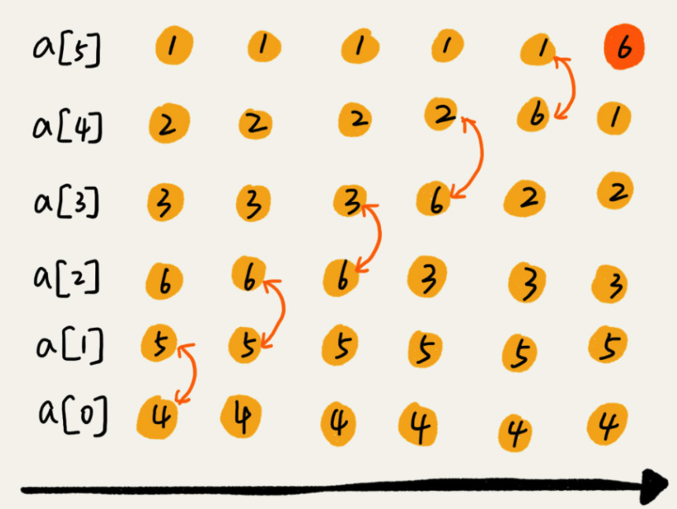
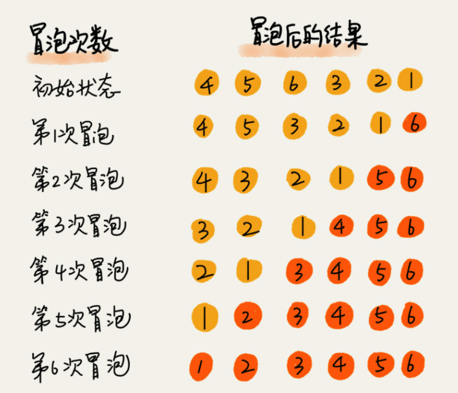
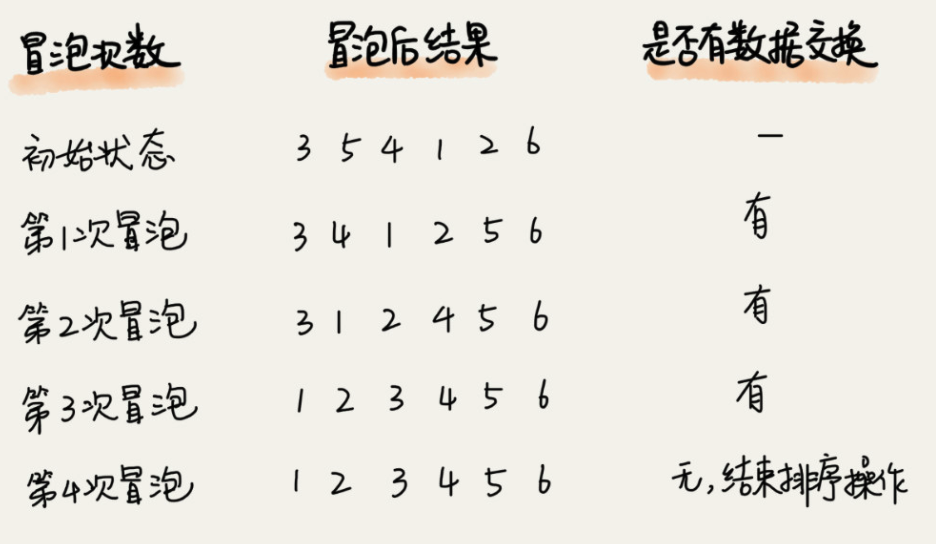
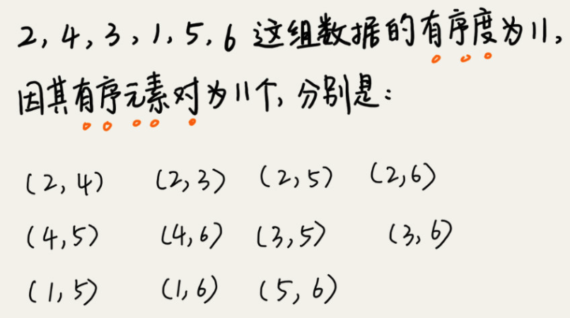
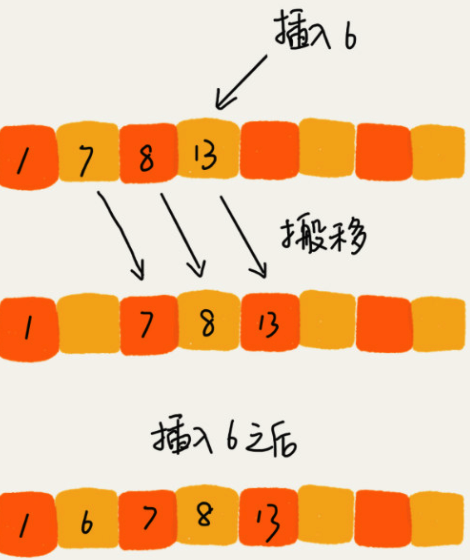
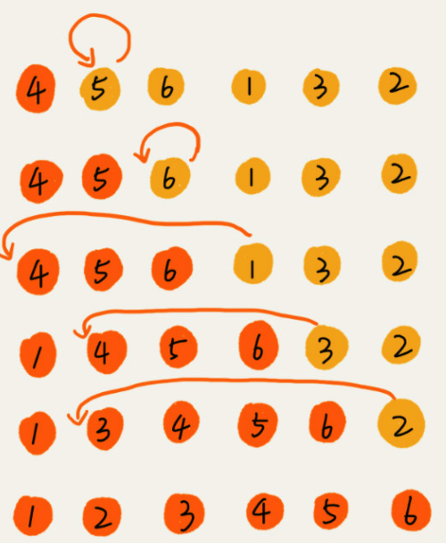
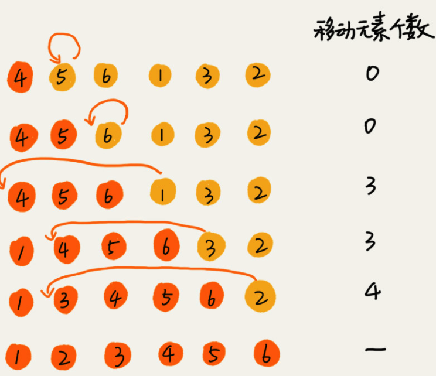
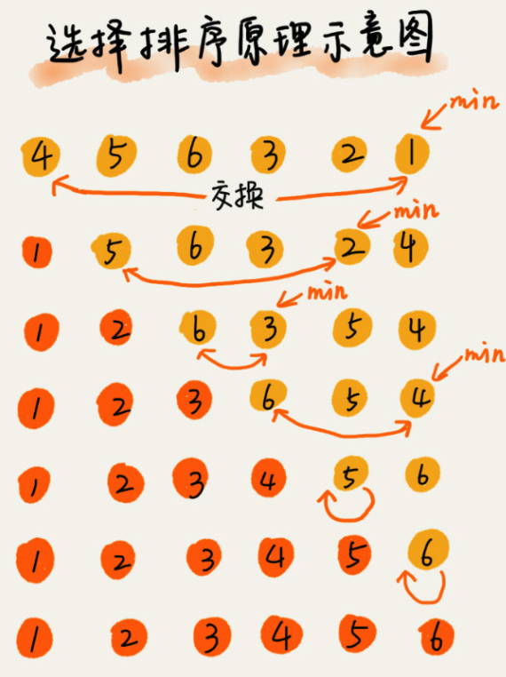
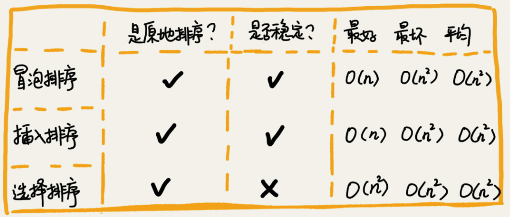

# Geek时间：排序（上）原地排序 笔记
<!-- more -->
## 如何分析一个“排序算法”？

### 排序算法的执行效率

​	对于排序算法执行效率的分析，我们一般会从这几个方面来衡量：

#### 1. 最好情况、最坏情况、平均情况（均摊）时间复杂度

​	我们在分析排序算法的时间复杂度时，要分别给出最好情况、最坏情况、平均情况下的时间复杂度。除此之外，你还要说出最好、最坏时间复杂度对应的要排序的原始数据是什么样的。为什么要区分这三种时间复杂度呢？	第一，有些排序算法会区分，为了好对比，所以我们最好都做一下区分。

​	第二，对于要排序的数据，有的接近有序，有的完全无序。

​	有序度不同的数据，对于排序的执行时间肯定是有影响的，我们要知道排序算法在不同数据下的性能表现。

#### 2. 时间复杂度的系数、常数 、低阶

​	我们知道，时间复杂度反映的是数据规模 n 很大的时候的一个增长趋势，所以它表示的时候会忽略系数、常数、低阶。但是实际的软件开发中，我们排序的可能是 10 个、100 个、1000 个这样规模很小的数据，所以，在对同一阶时间复杂度的排序算法性能对比的时候，我们就要把系数、常数、低阶也考虑进来。

### 排序算法的内存消耗

​	我们前面讲过，算法的内存消耗可以通过空间复杂度来衡量，排序算法也不例外。不过，针对排序算法的空间复杂度，我们还引入了一个新的概念，**原地排序**（Sorted in place）。原地排序算法，就是特指空间复杂度是 O(1) 的排序算法。

### 排序算法的稳定性

​	仅仅用执行效率和内存消耗来衡量排序算法的好坏是不够的。针对排序算法，我们还有一个重要的度量指标，***稳定性***。这个概念是说，**如果待排序的序列中存在值相等的元素，经过排序之后，相等元素之间原有的先后顺序不变**。

## 原地排序（Sorted in place）

​	原地排序算法，就是特指空间复杂度是 O(1) 的排序算法。我们今天讲的三种排序算法，都是原地排序算法。

### 冒泡排序 （Bubble Sort）

​	冒泡排序只会操作相邻的两个数据。每次冒泡操作都会对相邻的两个元素进行比较，看是否满足大小关系要求。如果不满足就让它俩互换。

​	一次冒泡会让至少一个元素移动到它应该在的位置，重复 n 次，就完成了 n 个数据的排序工作。

​	例子：我们要对一组数据 4，5，6，3，2，1，从小到大进行排序。第一次冒泡操作的详细过程就是这样：



​	可以看出，经过一次冒泡操作之后，6 这个元素已经存储在正确的位置上。要想完成所有数据的排序，我们只要进行 6 次这样的冒泡操作就行了。



​	实际上，刚讲的冒泡过程还可以优化。当某次冒泡操作已经没有数据交换时，说明已经达到完全有序，不用再继续执行后续的冒泡操作。我这里还有另外一个例子，这里面给 6 个元素排序，只需要 4 次冒泡操作就可以了。



#### 冒泡排序实现

```java
   public static int[] bubbleSort(int[] arr) {
        int n = arr.length;
        // 需要比较多少轮，所有数据都比较一次所以就是length -1（i<length）
        for (int i = 0; i < n; ++i) {
            // 提前退出冒泡循环的标志位
            boolean flag = false;
          	//	第二层代表需要比较的次数，因为每次都会把最大的排出来所以 所以最大index = length- i就是第二层循环的最大index
            //在比较过程中会使用j+1,所以最大index是length-i-1
          	
            for (int j = 0; j < n - i - 1; ++j) {
                if (arr[j] > arr[j + 1]) { // 若 j > j+1 交换
                    int tmp = arr[j];
                    arr[j] = arr[j + 1];
                    arr[j + 1] = tmp;
                    flag = true;  // 表示有数据交换
                }
            }
            if (!flag) break;  // 没有数据交换，提前退出
        }
        return arr;
    }
```

#### 第一，冒泡排序是原地排序算法吗？

​	冒泡的过程只涉及相邻数据的交换操作，只需要常量级的临时空间，所以它的空间复杂度为 O(1)，是一个原地排序算法。

#### 第二，冒泡排序是稳定的排序算法吗？

​	在冒泡排序中，只有交换才可以改变两个元素的前后顺序。为了保证冒泡排序算法的稳定性，当有相邻的两个元素大小相等的时候，我们不做交换，相同大小的数据在排序前后不会改变顺序，所以冒泡排序是稳定的排序算法。第

#### 三，冒泡排序的时间复杂度是多少？

​	最好情况下，要排序的数据已经是有序的了，我们只需要进行一次冒泡操作，就可以结束了，所以最好情况时间复杂度是 O(n)。

​	而最坏的情况是，要排序的数据刚好是倒序排列的，我们需要进行 n 次冒泡操作，所以最坏情况时间复杂度为 O(n2)。

​	平均时间复杂度就是加权平均期望时间复杂度，分析的时候要结合概率论的知识。对于包含 n 个数据的数组，这 n 个数据就有 n! 种排列方式。不同的排列方式，冒泡排序执行的时间肯定是不同的。

​	我们可以通过**“有序度”**和**“逆序度”**这两个概念来进行分析。

​	**有序度**是数组中具有有序关系的元素对的个数。有序元素对用数学表达式表示就是这样：

​	`有序元素对：a[i] <= a[j], 如果i < j。`

​	

​	同理，对于一个倒序排列的数组，比如 6，5，4，3，2，1，有序度是 0；对于一个完全有序的数组，比如 1，2，3，4，5，6，有序度就是 n*(n-1)/2，也就是 15。我们把这种完全有序的数组的有序度叫作**满有序度**。

​	`逆序元素对：a[i] > a[j], 如果i < j。`

​	我们还可以得到一个公式：逆序度 = 满有序度 - 有序度。我们排序的过程就是一种增加有序度，减少逆序度的过程，最后达到满有序度，就说明排序完成了。

​	拿前面举的那个冒泡排序的例子来说明。要排序的数组的初始状态是 4，5，6，3，2，1 ，其中，有序元素对有 (4，5) (4，6)(5，6)，所以有序度是 3。n=6，所以排序完成之后终态的满有序度为 n*(n-1)/2=15。此例中就是 15–3=12，要进行 12 次交换操作。

​	我们使用一个不严格的平均时间复杂度推导：

​	最坏情况下，初始状态的有序度是 0，所以要进行 n*(n-1)/2 次交换。

​	最好情况下，初始状态的有序度是 n*(n-1)/2，就不需要进行交换。

​	平均情况下，需要 n*(n-1)/4 次交换操作，比较操作肯定要比交换操作多，而复杂度的上限是 O(n2)，所以平均情况下的时间复杂度就是 O(n2)。

### 插入排序（Insertion Sort）

​	一个有序的数组，我们往里面添加一个新的数据后，如何继续保持数据有序呢？很简单，我们只要遍历数组，找到数据应该插入的位置将其插入即可。	



#### 插入排序核心思想	

​	借助这个思想，就可以实现插入排序。

​	首先，我们将数组中的数据分为两个区间，**已排序区间**和**未排序区间**

​	插入算法的核心思想是取未排序区间中的元素，在已排序区间中找到合适的插入位置将其插入，并保证已排序区间数据一直有序。重复这个过程，直到未排序区间中元素为空，算法结束。

​	如图，左侧为已排序区间，右侧是未排序区间。



​	插入排序也包含两种操作，一种是**元素的比较**，一种是**元素的移动**。当我们需要将一个数据 a 插入到已排序区间时，需要拿 a 与已排序区间的元素依次比较大小，找到合适的插入位置。找到插入点之后，我们还需要将插入点之后的元素顺序往后移动一位，这样才能腾出位置给元素 a 插入

​	对于不同的查找插入点方法（从头到尾、从尾到头），元素的比较次数是有区别的。但对于一个给定的初始序列，**移动操作的次数总是固定的，就等于逆序度**。如下图：



​	满有序度是 n*(n-1)/2=15，初始序列的有序度是 5，所以逆序度是 10。插入排序中，数据移动的个数总和也等于 10=3+3+4。

#### 插入排序实现

```java
// 插入排序，a表示数组，n表示数组大小
public void insertionSort(int[] a, int n) {
  if (n <= 1) return;
	//把数组分成两部分 
  //有序分区，无序分区
  //有序分区，数组的第一个元素
  //无序分区，即为index 1 - 数组末尾
  
  ///从头遍历无序分区数组，将数据比较，插入到有序数组中
  for (int i = 1; i < n; ++i) {
    //无序分区数组中本次要插入的数据的value
    int value = a[i];
    //我们从从尾到头遍历有序分区数组，来寻找适合的插入点所以有序分区遍历的初始index为i-1
    int j = i - 1;
    // 遍历有序分区数组，查找插入的位置
    for (; j >= 0; --j) {
      //比较有序数组的数据和将要插入的数据的value
      if (a[j] > value) {
        a[j+1] = a[j];  // 若有序的数据>插入数据则要进行数据移动
      } else {
        //因为插入排序是稳定的并且从尾部开始比较，最后一位不大于插入数据，则直接break
        break; 
      }
    }
    // 插入数据,j+1 是因为循环最后的--会执行，j比实际要插入的index小1
    a[j+1] = value; 
  }
}
```

#### 第一，插入排序是原地排序算法吗？

​	从实现过程可以很明显地看出，插入排序算法的运行并不需要额外的存储空间，所以空间复杂度是 O(1)，也就是说，这是一个原地排序算法。

#### 第二，插入排序是稳定的排序算法吗？

​	在插入排序中，对于值相同的元素，我们可以选择将后面出现的元素，插入到前面出现元素的后面，这样就可以保持原有的前后顺序不变，所以插入排序是稳定的排序算法。

#### 第三，插入排序的时间复杂度是多少？

​	如果要排序的数据已经是有序的，我们并不需要搬移任何数据。如果我们从尾到头在有序数据组里面查找插入位置，每次只需要比较一个数据就能确定插入的位置。所以这种情况下，最好是时间复杂度为 O(n)。注意，这里是从尾到头遍历已经有序的数据。如果数组是倒序的，每次插入都相当于在数组的第一个位置插入新的数据，所以需要移动大量的数据，所以最坏情况时间复杂度为 O(n2)。还记得我们在数组中插入一个数据的平均时间复杂度是多少吗？没错，是 O(n)。所以，对于插入排序来说，每次插入操作都相当于在数组中插入一个数据，循环执行 n 次插入操作，所以平均时间复杂度为 O(n2)。

### 选择排序 Slecection Sort

​	选择排序（Selection Sort）选择排序算法的实现思路有点类似插入排序，也分已排序区间和未排序区间。

​	但是选择排序每次会从**未排序区间中找到最小的元素，将其放到已排序区间的末尾**。



#### 选择排序实现

```java
public static int[] selectionSort(int[] arr) {
        int len = arr.length;
        // 总共要经过 N-1 轮比较
        for (int i = 0; i < len -1; i++) {
            //最小值 的index
            int min = i;
            // 每轮需要比较的次数 N-i,因为头部已经是有序
            for (int j= i+1;j<len;j++){
                if (arr[j]<arr[min]){
                 min = j;
                }
            }
            // 如果找到的最小值和i位置所在的值不同，则交换
            if (i != min) {
                int tmp = arr[i];
                arr[i] = arr[min];
                arr[min] = tmp;
            }
        }
        return arr;
}
```


#### 第一，选择排序是原地排序算法么？

​	是的，空间复杂度为O(1)。

​	

#### 第二，选择排序是稳定的排序算法么？

 	不是的，选择排序每次都要找剩余未排序元素中的最小值，并和前面的元素交换位置，这样破坏了稳定性。

#### 第三，选择排序的时间复杂度是多少？

​	选择排序的最好情况时间复杂度、最坏情况和平均情况时间复杂度都为 O(n2)

## 小结

### 为什么插入排序要比冒泡排序更受欢迎呢？

​	冒泡排序和插入排序的时间复杂度都是 O(n2)，都是原地排序算法，为什么插入排序要比冒泡排序更受欢迎呢？

​	冒泡排序不管怎么优化，元素交换的次数是一个固定值，是原始数据的逆序度。插入排序是同样的，不管怎么优化，元素移动的次数也等于原始数据的逆序度。

​	但是，从代码实现上来看，冒泡排序的数据交换要比插入排序的数据移动要复杂，冒泡排序需要 3 个赋值操作，而插入排序只需要 1 个。我们来看这段操作：

```java

冒泡排序中数据的交换操作：
if (a[j] > a[j+1]) { // 交换
   int tmp = a[j];
   a[j] = a[j+1];
   a[j+1] = tmp;
   flag = true;
}

插入排序中数据的移动操作：
if (a[j] > value) {
  a[j+1] = a[j];  // 数据移动
} else {
  break;
}
```

​	我们把执行一个赋值语句的时间粗略地计为单位时间（unit_time），然后分别用冒泡排序和插入排序对同一个逆序度是 K 的数组进行排序。用冒泡排序，需要 K 次交换操作，每次需要 3 个赋值语句，所以交换操作总耗时就是 3*K 单位时间。而插入排序中数据移动操作只需要 K 个单位时间。

​	所以，虽然冒泡排序和插入排序在时间复杂度上是一样的，都是 O(n2)，但是如果我们希望把性能优化做到极致，那肯定首选插入排序。插入排序的算法思路也有很大的优化空间，我们只是讲了最基础的一种。如果你对插入排序的优化感兴趣，可以自行学习一下希尔排序。

​	

​	这三种时间复杂度为 O(n2) 的排序算法中，冒泡排序、选择排序，可能就纯粹停留在理论的层面了，学习的目的也只是为了开拓思维，实际开发中应用并不多，但是插入排序还是挺有用的。后面讲排序优化的时候，我会讲到，有些编程语言中的排序函数的实现原理会用到插入排序算法。