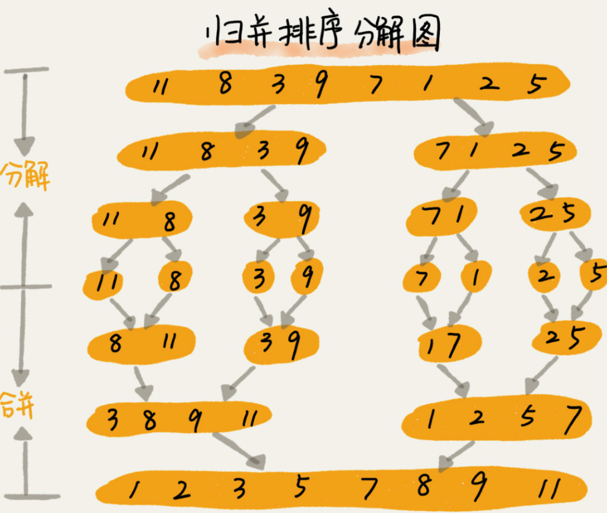
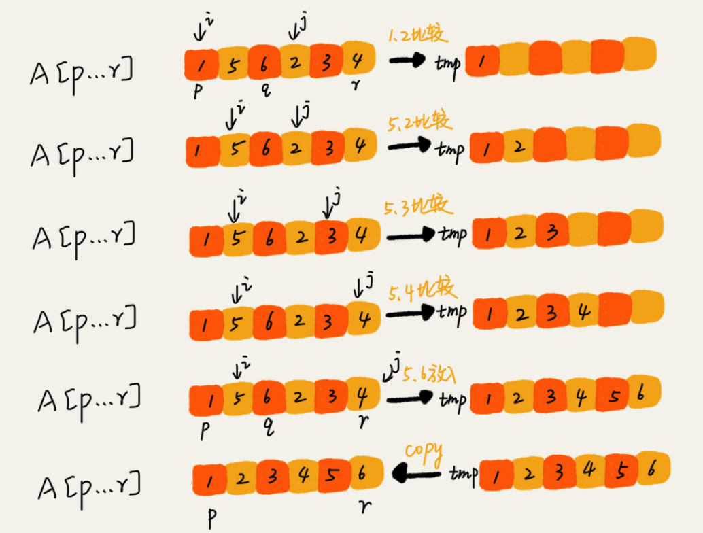

# 排序（下）归并 快速，用快排思想在O(n)内查找第K大元素
<!-- more -->

## 归并排序

​	如果要排序一个数组，我们先把数组从中间分成前后两部分，然后对前后两部分分别排序，再将排好序的两部分合并在一起，这样整个数组就都有序了。



​	归并排序使用的就是**分治思想**。分治，顾名思义，就是分而治之，将一个大问题分解成小的子问题来解决。小的子问题解决了，大问题也就解决了。分治思想跟我们前面讲的递归思想很像，**分治是一种解决问题的处理思想，递归是一种编程技巧，这两者并不冲突**。

​	写递归代码的技巧就是，分析得出递推公式，然后找到终止条件，最后将递推公式翻译成递归代码。所以，要想写出归并排序的代码，我们先写出归并排序的递推公式。

```
递推公式：
merge_sort(p…r) = merge(merge_sort(p…q), merge_sort(q+1…r))

终止条件：
p >= r 不用再继续分解
```

​	merge_sort(p…r) 表示，给下标从 p 到 r 之间的数组排序。我们将这个排序问题转化为了两个子问题，merge_sort(p…q) 和 merge_sort(q+1…r)，其中下标 q 等于 p 和 r 的中间位置，也就是 (p+r)/2。当下标从 p 到 q 和从 q+1 到 r 这两个子数组都排好序之后，我们再将两个有序的子数组合并在一起，这样下标从 p 到 r 之间的数据就也排好序了。

​	伪代码：

```java

// 归并排序算法, A是数组，n表示数组大小
merge_sort(A, n) {
  merge_sort_c(A, 0, n-1)
}

// 递归调用函数
merge_sort_c(A, p, r) {
  // 递归终止条件
  if p >= r  then return

  // 取p到r之间的中间位置q
  q = (p+r) / 2
  // 分治递归
  merge_sort_c(A, p, q)
  merge_sort_c(A, q+1, r)
  // 将A[p...q]和A[q+1...r]合并为A[p...r]
  merge(A[p...r], A[p...q], A[q+1...r])
}
```

​	merge(A[p...r], A[p...q], A[q+1...r]) 这个函数的作用就是，将已经有序的 A[p...q]和 A[q+1....r]合并成一个有序的数组，并且放入 A[p....r]。

如图：



​	我们申请一个临时数组 tmp，大小与 A[p...r]相同。我们用两个游标 i 和 j，分别指向 A[p...q]和 A[q+1...r]的第一个元素。比较这两个元素 A[i]和 A[j]，如果 A[i]<=A[j]，我们就把 A[i]放入到临时数组 tmp，并且 i 后移一位，否则将 A[j]放入到数组 tmp，j 后移一位。

​	继续上述比较过程，直到其中一个子数组中的所有数据都放入临时数组中，再把另一个数组中的数据依次加入到临时数组的末尾，这个时候，临时数组中存储的就是两个子数组合并之后的结果了。最后再把临时数组 tmp 中的数据拷贝到原数组 A[p...r]中。

mrege（）函数伪代码

```java

merge(A[p...r], A[p...q], A[q+1...r]) {
  var i := p，j := q+1，k := 0 // 初始化变量i, j, k
  var tmp := new array[0...r-p] // 申请一个大小跟A[p...r]一样的临时数组
  while i<=q AND j<=r do {
    if A[i] <= A[j] {
      tmp[k++] = A[i++] // i++等于i:=i+1
    } else {
      tmp[k++] = A[j++]
    }
  }
  
  // 判断哪个子数组中有剩余的数据
  var start := i，end := q
  if j<=r then start := j, end:=r
  
  // 将剩余的数据拷贝到临时数组tmp
  while start <= end do {
    tmp[k++] = A[start++]
  }
  
  // 将tmp中的数组拷贝回A[p...r]
  for i:=0 to r-p do {
    A[p+i] = tmp[i]
  }
}
```

### 归并排序的性能分析

#### 第一，归并排序是稳定的排序算法吗？

​	是稳定的。

​	归并排序稳不稳定关键要看 merge() 函数，也就是两个有序子数组合并成一个有序数组的那部分代码。

​	在合并的过程中，如果 A[p...q]和 A[q+1...r]之间有值相同的元素，那我们可以像伪代码中那样，先把 A[p...q]中的元素放入 tmp 数组。这样就保证了值相同的元素，在合并前后的先后顺序不变。所以，归并排序是一个稳定的排序算法。

#### 第二，归并排序的时间复杂度是多少？

​	在递归那一节我们讲过，递归的适用场景是，一个问题 a 可以分解为多个子问题 b、c，那求解问题 a 就可以分解为求解问题 b、c。问题 b、c 解决之后，我们再把 b、c 的结果合并成 a 的结果。

​	如果我们定义求解问题 a 的时间是 T(a)，求解问题 b、c 的时间分别是 T(b) 和 T( c)，那我们就可以得到这样的递推关系式：

```
T(a) = T(b) + T(c) + K
```

其中 K 等于将两个子问题 b、c 的结果合并成问题 a 的结果所消耗的时间。

**不仅递归求解的问题可以写成递推公式，递归代码的时间复杂度也可以写成递推公式**。

​	套用这个公式，我们来分析一下归并排序的时间复杂度。我们假设对 n 个元素进行归并排序需要的时间是 T(n)，那分解成两个子数组排序的时间都是 T(n/2)。我们知道，merge() 函数合并两个有序子数组的时间复杂度是 O(n)。所以，套用前面的公式，归并排序的时间复杂度的计算公式就是：

```
T(1) = C；   n=1时，只需要常量级的执行时间，所以表示为C。
T(n) = 2*T(n/2) + n； n>1
```

​	通过这个公式，如何来求解 T(n) 呢？还不够直观？那我们再进一步分解一下计算过程。

```

T(n) = 2*T(n/2) + n
     = 2*(2*T(n/4) + n/2) + n = 4*T(n/4) + 2*n
     = 4*(2*T(n/8) + n/4) + 2*n = 8*T(n/8) + 3*n
     = 8*(2*T(n/16) + n/8) + 3*n = 16*T(n/16) + 4*n
     ......
     = 2^k * T(n/2^k) + k * n
     ......
```

​	我们可以得到 T(n) = 2^kT(n/2^k)+kn。当 T(n/2^k)=T(1) 时，也就是 n/2^k=1，我们得到 k=log2n 。我们将 k 值代入上面的公式，得到 T(n)=Cn+nlog2n 。如果我们用大

​	归并排序的执行效率与要排序的原始数组的有序程度无关，所以其时间复杂度是非常稳定的，不管是最好情况、最坏情况，还是平均情况，时间复杂度都是 O(nlogn)。

#### 第三，归并排序的空间复杂度是多少？

​	归并排序并没有像快排那样，应用广泛，这是为什么呢？因为它有一个致命的“弱点”，那就是归并排序不是原地排序算法。

​	这是因为归并排序的合并函数，在合并两个有序数组为一个有序数组时，需要借助额外的存储空间。这一点你应该很容易理解。那我现在问你，归并排序的空间复杂度到底是多少呢？是 O(n)，还是 O(nlogn)，应该如何分析呢？

​	实际上，递归代码的空间复杂度并不能像时间复杂度那样累加。刚刚我们忘记了最重要的一点，那就是，尽管每次合并操作都需要申请额外的内存空间，但在合并完成之后，临时开辟的内存空间就被释放掉了。在任意时刻，CPU 只会有一个函数在执行，也就只会有一个临时的内存空间在使用。临时内存空间最大也不会超过 n 个数据的大小，所以空间复杂度是 O(n)。

