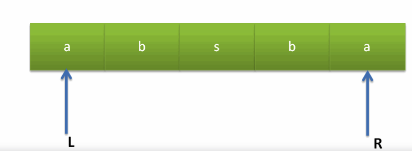

### 20210322

#### 回文字符串

给定一个字符串，请编写一个函数判断该字符串是否回文。如果回文请返回true，否则返回false。


**题解：**

双指针可解决




```java
 public boolean judge (String str) {
        // write code here
        if(str == null || str == "")
            return false;
            
        int len = str.length();
        int l =0, r = len-1;
        while(l<r){
            if(str.charAt(l)!=str.charAt(r)) return false;
            l++;
            r--;
        }
        return true;
    }
```


<!-- more -->
#### 二维数组查找

在一个二维数组中（每个一维数组的长度相同），每一行都按照从左到右递增的顺序排序，每一列都按照从上到下递增的顺序排序。请完成一个函数，输入这样的一个二维数组和一个整数，判断数组中是否含有该整数


**题解：**

思路
矩阵是有序的，从左下角来看，向上数字递减，向右数字递增，
因此从左下角开始查找，当要查找数字比左下角数字大时。右移
要查找数字比左下角数字小时，上移

```java
    public boolean Find(int target, int [][] array) {
        int rowCount =array.length;
        int colCount = array[0].length;
        int i,j;
   

        for(i=rowCount-1,j=0;i>=0&&j<colCount;)
        {
            if(target == array[i][j])
                return true;
            if(target < array[i][j])
            {
                i--;
                continue;
            }
            if(target > array[i][j])
            {
                j++;
                continue;
            }
        }
        return false;
    }
```

### 20210323

#### 排序算法

##### 冒泡

它重复地遍历要排序的序列，会依次比较两个相邻的元素，如果发现两个相邻的元素顺序错误就把它们交换过来。遍历序列的工作会重复地进行直到没有相邻的元素需要交换位置，也就是说序列的排序工作已经完成。

冒泡排序的算法名称的由来就是因为在排序的过程中，按照排序规则（升序或者降序），越小或者越大的元素会经过交换之后慢慢 “浮” 到序列的顶端，就如同水中的气泡一样最终会浮到顶端一样，所以起名为 “冒泡排序”。