---

title: 登陆和授权
date: 2021-07-02 12:45:47
categories:
- 网络
- http
- 登陆和授权
tags:
- 网络
- http
- 登陆和授权
---

# 登陆和授权

## 登录和授权的区别：

- 登录:身份认证，即确认「你是你」的过程
- 授权:由身份或持有的令牌确认享有某些权限(例如获取用户信息)。

登录过程实质上的目的也是为了确认权限。因此，在实际的应用中，多数场景下的「登录」和「授权」界限是模糊的。

## HTTP 中确认授权(或登录)的两种方式 

1. 通过Cookie
2. 通过Authorization Header

### Cookie

起源:「购物⻋」功能的需求，由 Netscape 浏览器开发团队打造。 工作机制:

1. 服务器需要客户端保存的内容，放在 Set-Cookie headers 里返回，客户端会自动保存。
2. 客户端保存的 Cookies，会在之后的所有请求里都携带进 Cookie header 里发回给服务器。
3. 客户端保存Cookie是按照服务器域名来分类的，例如shop.com发回的 Cookie 保存下来以后，在之后向 games.com 的请求中并不会携带。

4. 客户端保存的Cookie在超时后会被删除、没有设置超时时间的Cookie (称作 Session Cookie)在浏览器关闭后就会自动删除;另外，服务器也可以主动删除还未过期的客户端 Cookies。

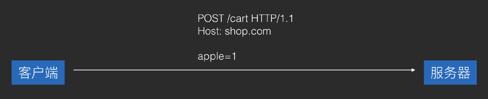			 			 

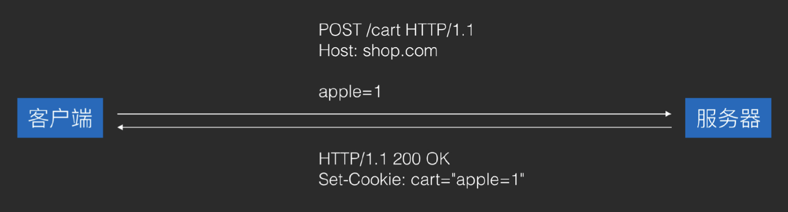		 			 			 		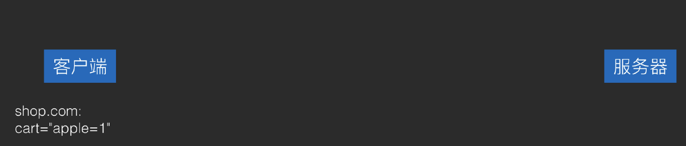	 			 			 			 			 			 			 			 			 		

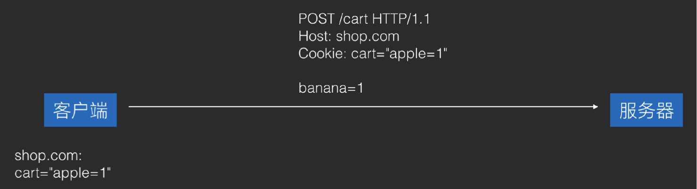

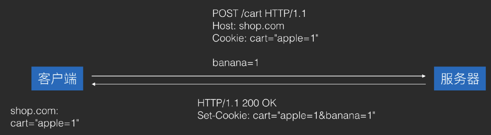

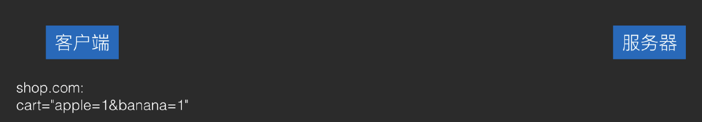

#### Cookie 的作用

> 会话（Session）也是用户状态机制。Cookie是存本地的，Session是存服务器的。
>
> 由于HTTP是无状态的请求无法确定用户状态，服务器通过存储SessionId并配合Cookie验证用户是否登陆。

-  会话管理:登录状态、购物⻋

1. 登陆后服务器会记录此次会话（Session）并声称SessionId
  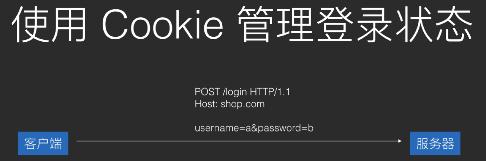
2. 服务端返回SessionId给客户端
  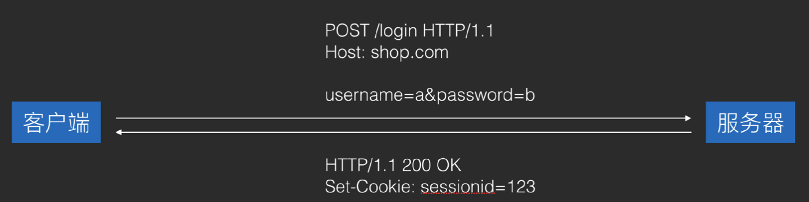
3. 客户端本地存储SessionId

  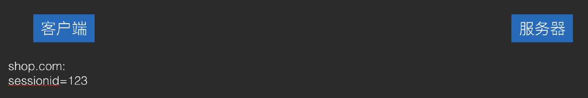

  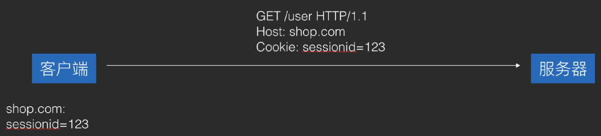

- 个性化:用户偏好、主题 

  服务器记录clientId来存储风格，和Session类似

  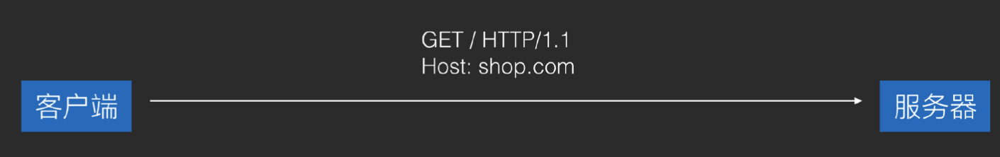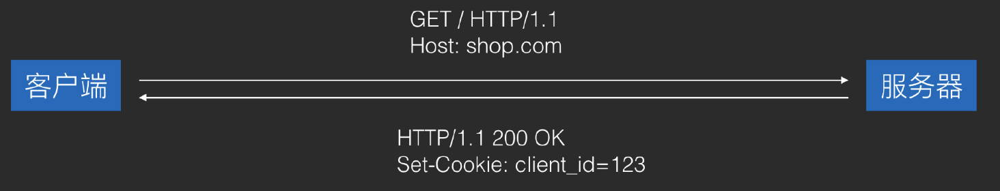

  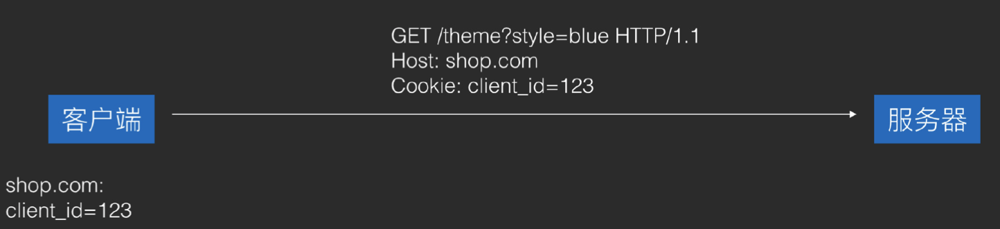

  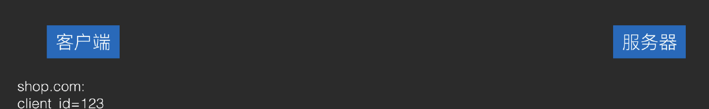

- Tracking:分析用户行为

  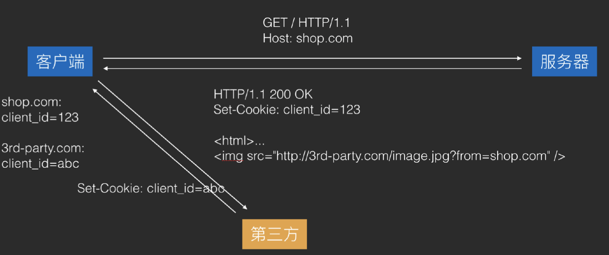


#### XSS (Cross-site scripting)(了解即可):跨站脚本攻击。

即使用 JavaScript 拿 到浏览器的 Cookie 之后，发送到自己的网站，以这种方式来盗取用户 Cookie。应对方式:Server 在发送 Cookie 时，敏感的 Cookie 加上 HttpOnly。

应对方式:HttpOnly——这个 Cookie 只能用于 HTTP 请求，不能被 JavaScript 调用。它可以防止本地代码滥用 Cookie。

#### XSRF (Cross-site request forgery)(了解即可):跨站请求伪造。

即在用户不知情的情况下访问已经保存了 Cookie 的网站，以此来越权操作用户账户(例如 盗取用户资金)。应对方式主要是从服务器安全⻆度考虑，就不多说了。

应对方式:Referer 校验。是浏览器自动加的header，如果是从其他网站跳转的，referer中会存储跳转来源，我们可以强制网站不接受从其他网站跳转而来的请求，也可以根据referer 判断来源网站是否在白名单中。

### Authorization （现在常用）

两种主流方式: Basic 和 Bearer

####  Basic:

- 格式:Authorization: Basic <username:password(Base64ed)>
- 风险:header可以被解码（base64）,在http请求中会被截获，可以使用https解决。本地存储的token可能被盗，可以通过加密本地存储。

####  Bearer:

- 格式:Authorization: Bearer <bearer token>

- bearer token 的获取方式:通过 OAuth2 的授权流程

  OAuth2 的流程:

  1. 第三方网站向授权方网站申请第三方授权合作，拿到clientid和client secret

  2. 用户在使用第三方网站时，点击「通过XX(如GitHub)授权」按钮，第三方 网站将⻚面跳转到授权方网站，并传入 client id 作为自己的身份标识

  3. 授权方网站根据clientid，将第三方网站的信息和第三方网站需要的用户权 限展示给用户，并询问用户是否同意授权

  4. 用户点击「同意授权」按钮后，授权方网站将⻚面跳转回第三方网站，并传 入 Authorization code 作为用户认可的凭证。

  5. 第三方网站将Authorization code发送回自己的服务器

  6. 服务器将Authorization code和自己的client secret一并发送给授权方的服务器(必须https)，授权方服务器在验证通过后，返回 access token。OAuth 流程结束。

  7. 在上面的过程结束之后，第三方网站的服务器(或者有时客户端也会)就可以使用 access token 作为用户授权的令牌，向授权方网站发送请求来获取 用户信息或操作用户账户。但这已经在 OAuth 流程之外。

- 为什么 OAuth 要引入 Authorization code，并需要申请授权的第三方将 Authorization code 发送回自己的服务器，再从服务器来获取 access token， 而不是直接返回 access token ?这样复杂的流程意义何在?

   为了安全。OAuth 不强制授权流程必须使用 HTTPS，因此需要保证当通信路径中存在窃听者时， 依然具有足够高的安全性。

- 第三方 App 通过微信登录的流程，也是一个 OAuth2 流程:

  1. 第三方App向腾讯申请第三方授权合作，拿到clientid和clientsecret

  2. 用户在使用第三方App时，点击「通过微信登录」，第三方App将使用微信 SDK 跳转到微信，并传入自己的 client id 作为自己的身份标识

  3. 微信通过和服务器交互，拿到第三方App的信息，并显示在界面中，然后询问用户是否同意授权该 App 使用微信来登录

  4. 用户点击「使用微信登录」后，微信和服务器交互将授权信息提交，然后跳转回第三方 App，并传入 Authorization code 作为用户认可的凭证

  5. 第三方App调用自己服务器的「微信登录」Api，并传入Authorization code，然后等待服务器的响应

  6. 服务器在收到登录请求后，拿收到的Authorizationcode去向微信的第三方授权接口发送请求，将 Authorization code 和自己的 client secret 一起作为参数发送，微信在验证通过后，返回 access token

  7. 服务器在收到accesstoken后，立即拿着access token去向微信的用户信息接口发送请求，微信验证通过后，返回用户信息

  8. 服务器在收到用户信息后，在自己的数据库中为用户创建一个账户，并使用从微信服务器拿来的用户信息填入自己的数据库，以及将用户的 ID 和用户的微信 ID 做关联

  9. 用户创建完成后，服务器向客户端的请求发送响应，传送回刚创建好的用户信息

  10. 客户端收到服务器响应，用户登录成功

- 在自家 App 中使用 Bearer token

  有的 App 会在 Api 的设计中，将登录和授权设计成类似 OAuth2 的过程，但简 化掉 Authorization code 概念。即:登录接口请求成功时，会返回 access token，然后客户端在之后的请求中，就可以使用这个 access token 来当做 bearer token 进行用户操作了。

- Refresh token

  ```
  {
      "token_type": "Bearer",
      "access_token": "xxxxx",
      "refresh_token": "xxxxx",
      "expires_time": "xxxxx"
  ```

  }

  用法:access token 有失效时间，在它失效后，调用 refresh token 接口，传入 refresh_token 来获取新的 access token。

  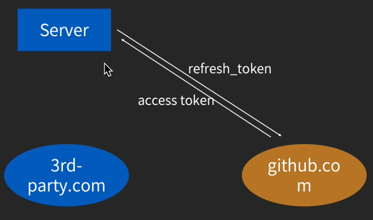

  **目的:**
  
  安全。当 access token 失窃，由于它有失效时间，因此坏人只有较短的时间来「做坏事」;同时，由于(在标准的 OAuth2 流程中)refresh token 永 远只存在与第三方服务的服务器中，因此 refresh token 几乎没有失窃的⻛险。

