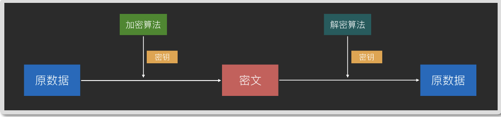
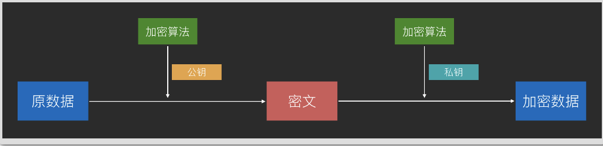
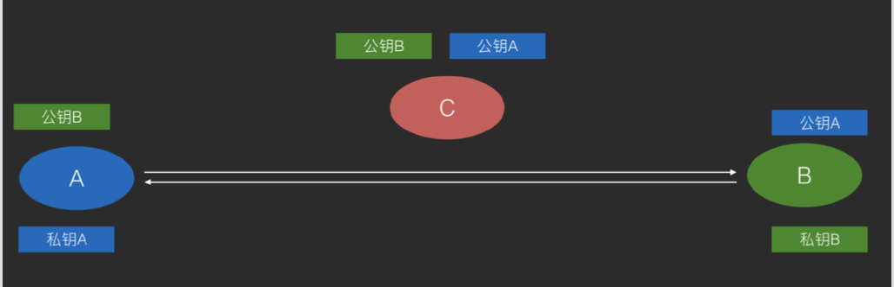
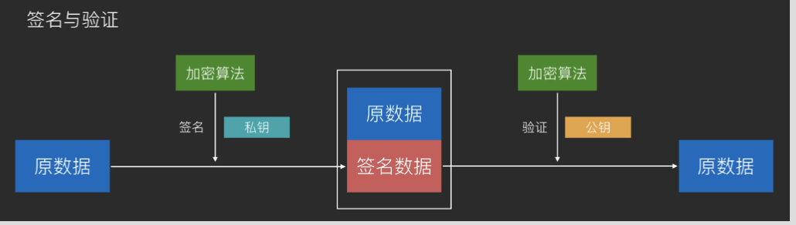
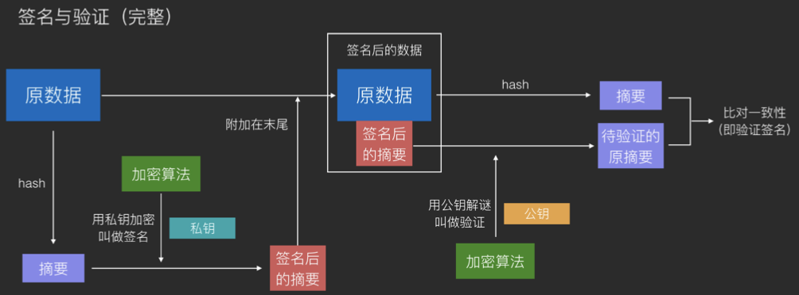
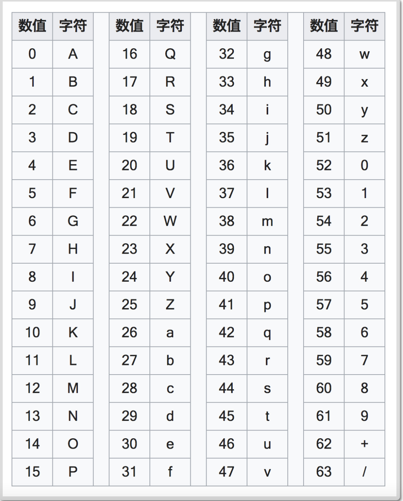
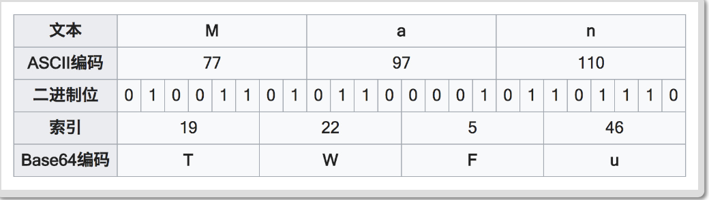

# 编码、加密、Hash、序列化和字符集

## 加密

### 古典密码学

```
起源于古代战争:在战争中，为了防止书信被截获后重要信息泄露，人们开始对书
信进行加密。
```

#### 移位式加密

如密码棒，使用布条缠绕在木棒上的方式来对书信进行加密。
加密算法:缠绕后书写
密钥: 木棒的尺寸

#### 替换式加密

按规则使用不同的文字来替换掉原先的文字来进行加密。

码表: 

原始字符:ABCDEFGHIJKLMNOPQRSTUVWXYZ 

密码字符:BCDEFGHIJKLMNOPQRSTUVWXYZA 

原始书信:I love you
加密书信:J mpwf zpv
解读后:I love you

加密算法:替换文字
密钥:替换的码表

### 现代密码学

可以加密任何二进制数据
非对称加密的出现使得密码学有了更广泛的用途:数字签名

#### 对称加密

##### 原理

加密：通信双方使用同一个密钥，使用加密算法配合上密钥来加密，得到无意义的数据即为密文。

解密：使用加密过程的完全逆过程配合密钥来进行解密，得到原数据。

简化模型即上面的古典密码学中替换式加密的模型:对文字进行规则化替换来加
密，对密文进行逆向的规则化替换来解密。



##### 经典算法

DES(56 位密钥，密钥太短而逐渐被弃用)、AES(128 位、192 位、256 位密钥， 现在最流行)

##### 对称加密的作用

加密通信，防止信息在不安全网络上被截获后，信息被人读取或篡改。

对称加密(如 **AES**)的破解 

##### 破解思路

拿到一组或多组原文-密文对 设法找到一个密钥，这个密钥可以将这些原文-密文对中的原文加密为密文，以 及将密文解密为原文的组合，即为成功破解

##### 反破解

一种优秀的对称加密算法的标准是，让破解者找不到比穷举法(暴力破解法)更有效的破解手段，并且穷举法的破解时间足够⻓(例如数千年)。

##### 对称加密的缺点

密钥泄露:不能在不安全网络上传输密钥，一旦密钥泄露则加密通信失败。

#### 非对称加密

##### 原理

使用公钥对数据进行加密得到密文;使用私钥对数据进行解密得到原数据。

非对称加密使用的是复杂的数学技巧，在古典密码学中没有对应的原型。



使用非对称加密通信，可以在不可信网络上将双方的公钥传给对方，然后在发消息前分别对消息使用对方的公钥来加密和使用自己的私钥来签名，做到不可信网络上的可靠密钥传播及加密通信。



由于私钥和公钥互相可解，因此非对称加密还可以应用于数字签名技术。

ps：（公钥一般是私钥算出来的，私钥不适合暴露，因为可以计算出来，比特币的公钥使用的椭圆曲线算法）



通常会对原数据 hash 以后对 hash 签名，然后附加在原数据的后面作为签名。这是 为了让数据更小。



ps一个简单的模型

```
原数据：110 算法：加法 加密密钥：4 解密密钥 6
加密： 110 按位+4  
加密结果：554
解密： 554 按位+6
解密结果： 11，11，
```


##### 经典算法

**RSA**(可用于加密和签名)、**DSA**(仅用于签名，但速度更快)

##### 非对称加密的优缺点

  优点:可以在不安全网络上传输密钥
  缺点:计算复杂，因此性能相比对称加密差很多

##### 非对称加密(如 **RSA**、**ECDSA**)的破解 破解思路

和对称加密不同之处在于，非对称加密的公钥很容易获得，因此制造原文-密文 对是没有困难的事 所以，非对称加密的关键只在于，如何找到一个正确的私钥，可以解密所有经过 公钥加密过的密文。找到这样的私钥即为成功破解 由于非对称加密的自身特性，怎样通过公钥来推断出私钥通常是一种思路(例如 RSA)，但往往最佳手段依然是穷举法，只是和对称加密破解的区别在于，对称 加密破解是不断尝试自己的新密钥是否可以将自己拿到的原文-密文对进行加密 和解密，而非对称加密时不断尝试自己的新私钥是否和公钥互相可解。

##### 反破解

和对称加密一样，非对称加密算法优秀的标准同样在于，让破解者找不到比穷举法
更有效的破解手段，并且穷举法的破解时间足够⻓。

### 密码学密钥和登录密码

密钥(key)

```
    场景:用于加密和解密
    目的:保证数据被盗时不会被人读懂内容
    焦点:数据
```

登录密码(password)

```
    场景:用户进入网站或游戏前的身份验证
    目的:数据提供方或应用服务方对账户拥有者数据的保护，保证「你是你」
    的时候才提供权限
    焦点:身份
 上面这些区别不必背会，理解就可以了
```

## 编码

### Base64

将二进制数据转换成由 64 个字符组成的字符串的编码算法 

#### 什么是二进制数据?

  广义:所有计算机数据都是二进制数据
  狭义:非文本数据即二进制数据

#### 算法

将原数据每 6 位对应成 Base 64 索引表中的一个字符编排成一个字符串(每个字符 8 位)。

#### Base64 索引表



编码示例:把「Man」进行 Base64 编码



编码示例:Base64 的末尾补足


#### Base64 的用途

1. 将二进制数据扩充了储存和传输途径(例如可以把数据保存到文本文件、可以通 过聊天对话框或短信形式发送二进制数据、可以在 URL 中加入简单的二进制数据)
2. 普通的字符串在经过Base64编码后的结果会变得肉眼不可读，因此可以适用于 一定条件下的防偷窥(较少用)

#### Base64 的缺点

 因为自身的原理(6 位变 8 位)，因此每次 Base64 编码之后，数据都会增大约1/3，所以会影响存储和传输性能。

####  「Base64 加密图片传输更安全和高效」

???

不。首先，Base64 并不是加密;另外，Base64 会导致数据增大 1/3，降低网络性 能，增大用户流量开销，是画蛇添足的手段。(最好不要拿来 diss 你们公司的后端 哟，友善)

Base64 对图片进行编码的用于在于，有时需要使用文本形式来传输图片。除此之 外，完全没必要使用 Base64 对图片进行额外处理。

#### 变种:Base58

比特币使用的编码方式，去掉了 Base64 中的数字 "0"，字母大写 "O"，字母大写

"I"，和字母小写 "l"，以及 "+" 和 "/" 符号，用于比特币地址的表示。

Base58 对于 Base64 的改动，主要目的在于用户的便捷性。由于去掉了难以区分的 字符，使得 Base58 对于「人工抄写」更加方便。另外，去掉了 "+" "/" 号后也让大 多数的软件可以方便双击选取。

### URL Encoding 使用的百分号编码

 在 URL 的字符串中，对一些不用于特殊用途的保留字符，使用百分号 "%" 为前缀进行单编码，以避免出现解析错误。

例如，要在 http://hencoder.com/users 后面添加查询字符串，查询 name 为「隐秘&伟大」的用户，如果直接写成 http://hencoder.com/user/?name=隐秘&伟大 ，"&" 符号就会被解析为分隔符号，因此需要对它进行转码，转码后的 URL 为 http: //hencoder.com/user/?name=隐秘%26伟大 。

这种编码仅用于 URL，目的是避免解析错误的出现。 

### 压缩与解压缩

#### 含义

  压缩:将数据使用更具有存储优势的编码算法进行编码（换一种存储方式，减小存储空间）。
  解压缩:将压缩数据解码还原成原来的形式，以方便使用。

#### 目的

减小数据占用的存储空间。

#### 粗暴算法举例

将下面文本内容压缩:

```
aaaaaaaaaaaaaaaaaaaaaaaaaaaaaaaaaaaaaaaaaaaaaaaaaaaaaaaa
aaaaaaaaaaaaaaaaaaaaaaaaaaaaaaaaaaaaaaaaaaaaaaaaaaaaaaaa
aaaaaaaaaaaaaaaaaaaaaaaaaaaaaaaaaaaaaaaaaaaaaaaaaaaaaaaa
aaaaaaaaaaaaaaaaaaaaaaaaaaaaaaaaaaaaaaaaaaaaaaaaaaaaaaaa
aaaaaaaaaaaaaaaaaaaaaaaaaaaaaaaaaaaaaaaaaaaaaaaaaaaaaaaa
aaaaaaaaaaaaaaaaaaaaaaaaaaaaaaaaaaaaaaaaaaaaaaaaaaaaaaaa
aaaaaaaaaaaaaaaaaaaaaaaaaaaaaaaaaaaaaaaaaaaaaaaaaaaaaaaa
aaaaaaaaaaaaaaaaaaaaaaaaaaaaaaaaaaaaaaaaaaaaaaaaaaaaaaaa
aaaaaaaaaaaaaaaaaaaaaaaaaaaaaaaaaaaaaaaaaaaaaaaaaaaaaaaa
aaaaaaaaaaaaaaaaaaaaaaaaaaaaaaaaaaaaaaaaaaaaaaaaaaaaaaaa
aaaaaaaaaaaaaaaaaaaaaaaaaaaaaaaaaaaaaaaaaaaaaaaaaaaaaaaa
aaaaaaaaaaaaaaaaaaaaaaaaaaaaaaaaaaaaaaaaaaaaaaaaaaaaaaaa
aaaaaaaaaaaaaaaaaaaaaaaaaaaaaaaaaaaaaaaaaaaaaaaaaaaaaaaa
aaaaaaaaaaaaaaaaaaaaaaaaaaaaaaaaaaaaaaaaaaaaaaaaaaaaaaaa
aaaaaaaaaaaaaaaaaaaaaaaaaaaaaaaaaaaaaaaaaaaaaaaaaaaaaaaa
aaaaaaaaaaaaaaaaaaaaaaaaaaaaaaaaaaaaaaaaaaaaaaaaaaaaaaaa
aaaaaaaaaaaaaaaaaaaaaaaaaaaaaaaaaaaaaaaaaaaaaaaaaaaaaaaa
aaaaaaaaaaaaaaaaaaaaaaaaaaaaaaaaaaaaaaaaaaaaaaaaaaaaaaaa
aaaaaaaaaaaaaaaaaaaaaaaaaaaaaaaaaaaaaaaaaaaaaaaaaaaaaabb
bbbbbbbbbbbbbbbbbbbbbbbbbbbbbbbbbbbbbbbbbbbbbbbbbbbbbbbb
bbbbbbbbbbbbbbbbbbbbbbbbbbbbbbbbbbbbbbbbbbbbbbb
使用某种算法压缩后的数据为:
   compress:a:1062;b:105
 注:具体的压缩场景有很多，因此压缩算法也会复杂得多，上面只是一个原型
 算法。
```

#### 压缩是编码吗?

是。所谓编码，即把数据从一种形式转换为另一种形式。压缩过程属于编码过程，
解压缩过程属于解码过程。

#### 常⻅压缩算法

DEFLATE（zip是归档过程，即把所有文档打包，顺便会做压缩，算法交deflate）、JPEG、MP3 等。

### 图片与音频、视频（媒体数据）编解码 

#### 含义

将图像、音频、视频数据通过编码来转换成存档形式(编码)，以及从存档形式转
换回来(解码)。

#### 目的

存储和压缩媒体数据(大多数媒体编码算法会压缩数据，但不是全部)。

有损压缩：不可逆，压缩过程丢弃一些数据，减少体积。

无损压缩：编码后可以解码回原数据，无缝转换，不丢弃收据，可逆。

#### 图片压缩粗暴算法举例

一张纯白(白色的 16 进制数值为 0xffffff)的 64x64 不透明像素图片，原数据格式 大致为:

```
width:64;height:64;fffffffffffffffffffffffffffffffffffff
ffffffffffffffffffffffffffffffffffffffffffffffffffffffff
ffffffffffffffffffffffffffffffffffffffffffffffffffffffff
ffffffffffffffffffffffffffffffffffffffffffffffffffffffff
ffffffffffffffffffffffffffffffffffffffffffffffffffffffff
ffffffffffffffffffffffffffffffffffffffffffffffffffffffff
ffffffffffffffffffffffffffffffffffffffffffffffffffffffff
ffffffffffffffffffffffffffffffffffffffffffffffffffffffff
ffffffffffffffffffffffffffffffffffffffffffffffffffffffff
ffffffffffffffffffffffffffffffffffffffffffffffffffffffff
ffffffffffffffffffffffffffffffffffffffffffffffffffffffff
ffffffffffffffffffffffffffffffffffffffffffffffffffffffff
ffffffffffffffffffffffffffffffffffffffffffffffffffffffff
ffffffffffffffffffffffffffffffffffffffffffffffffffffffff
fffffffffffffffffffffffffffffffff.......ffffff
使用某种算法压缩后的数据为:
   width:64;height:64;ffffff:[0,0]-[63,63]
 注:具体的压缩场景有很多，因此压缩算法也会复杂得多，上面只是一个原型
 算法。
音频与视频的编码与上面的图片编码同理。
```

### 序列化

把数据对象(一般是内存中的，例如 JVM 中的对象)转换成字节序列的过程。对象 在程序内存里的存放形式是散乱的(存放在不同的内存区域、并且由引用进行 接)，通过序列化可以把内存中的对象转换成一个字节序列，从而使用 byte[] 等形 式进行本地存储或网络传输，在需要的时候重新组装(反序列化)来使用。

#### 目的

让内存中的对象可以被储存和传输。

#### 序列化是编码吗?

不是

#### 和编码的区别

编码是把数据由一种数据格式转换成另一种数据格式;而序列化是把数据由内存中
的对象(而不是某种具体的格式)转换成字节序列。

### Hash

#### 定义

把任意数据转换成指定大小范围(通常很小，例如 256 字节以内)的数据。 

#### 作用

相当于从数据中提出摘要信息，因此最主要用途是数字指纹。

#### 经典算法

MD5，SHA1，SHA256 等 


#### Hash 的实际用途:数据完整性验证

从网络上下载文件后，通过比对文件的 Hash 值(例如 MD5、SHA1)，可以确认下载的文件是否有损坏。如果下载的文件 Hash 值和文件提供方给出的 Hash 值一致， 则证明下载的文件是完好无损的。

#### Hash 的实际用途:快速查找 

HashMap和HashCode(); 

一般来说hashcode 不够精细，hashcode不同可以确定两个对象一定不同，但是相等也不代表两个对象一定相等，需要equals 进行更高精度的比较，所以可以实现快速查找。

#### Hash 的实际用途：唯一性验证

 例如 Java 中的 hashCode() 方法。

##### 为什么每次重写 equals() 方法都需要同事修改HashCode()方法?

因为Hash 相关类（HashMap）初步判断是否相等会先用HashCode()比较而不是直接用equals。

##### 怎么重写 hashCode 方法?

把 equals() 方法中的每个用于判断相等的变量都放进 hashCode() 中，一起生成一 个尽量不会碰撞的整数即可

#### Hash 的实际用途:隐私保护

当重要数据必须暴露的时候，有事可以选择暴露它的 Hash 值(例如 MD5)，以保障原数据的安全。例如网站登录时，可以只保存用户密码的 Hash 值，在每次登录验 证时只需要将输入的密码的 Hash 值和数据库中保存的 Hash 值作比对就好，网站无 需知道用户的密码。这样，当网站数据失窃时，用户不会因为自己的密码被盗导致 其他网站的安全也受到威胁。

注意:这不属于加密。

彩虹表：

常用密码的hash映射值数据库表表，如果你注册的网站脱库（数据库被盗），而你设置的密码很常见，那么即使网站存储的是hash值，你的密码也会很快在彩虹表中找到从而暴露。

加盐：密码 经历hash之前先加入其他数据，提高破解难度。

#### Hash 是编码吗?

 不是。 Hash 是单向过程，往往是不可逆的，无法进行逆向恢复操作，因此 Hash 不属于编码。

#### Hash是加密吗?

 不是。Hash 是单向过程，无法进行逆向回复操作，因此 Hash 不属于加密。(记住，MD5 不是加密!)

#### 但百度百科说它是加密?

它说错啦!

## 字符集

### 含义:

一个由整数向现实世界中的文字符号的 Map

### 分支:

- ASCII:128 个字符，1 字节 
- ISO-8859-1:对 ASCII 进行扩充，1 字节 
- Unicode:13 万个字符，多字节
  - UTF-8:Unicode 的编码分支
  - UTF-16 :Unicode 的编码分支
- GBK / GB2312 / GB18030:中国自研标准，多字节，字符集 + 编码


