# 图形的位置和尺寸测量

绘制的基本要素:

- 重写 onDraw() 
- 使用 Canvas 来绘制
-  使用 Paint 来配置 
- 坐标系

坐标系：

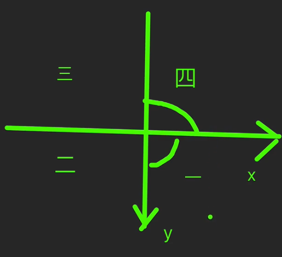

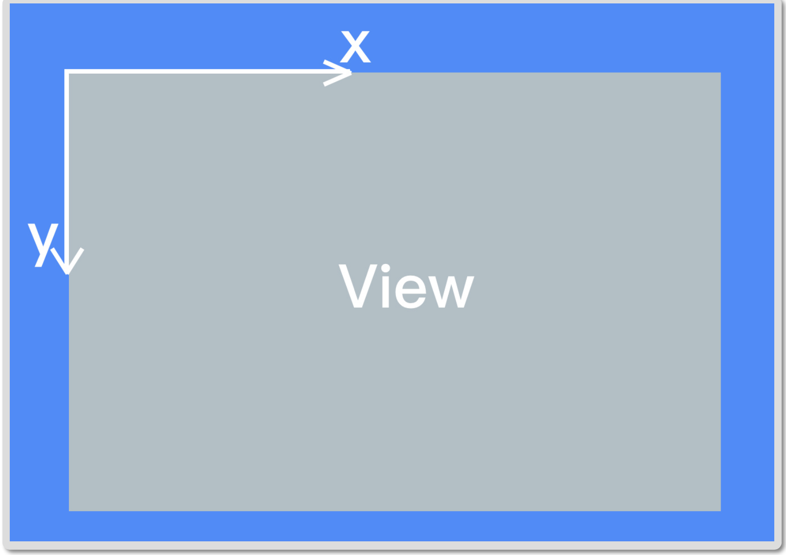

## 尺寸单位，像素px，而不是 dp。转换方式:

```java
 public static float dp2px(float dp) { 
 return TypedValue.applyDimension(TypedValue.COMPLEX_UNIT_DIP, dp,Resources
                                  .getSystem()
  																.getDisplayMetrics());}
```


## Path 的方向以及封闭图形的内外判断:

path不见得是路径，可能是路径圈出来的形状

FillType：

```kotlin
        p path.reset()
        path.addCircle(width/2f,height/2f, RADIUS,Path.Direction.CW)
        path.addRect(width/2f- RADIUS,height/2f,
            width/2f+ RADIUS, height/2f+2*RADIUS,Path.Direction.CCW)
        path.addCircle(width/2f,height/2f, RADIUS*1.5f,Path.Direction.CW)

        // CWclockwise 正向
        // CCWcounter-clockwise 反向
//        Path.FillType.WINDING 方向相同的都算内部，不等则为外部
//        Path.FillType.EVEN_ODD 不考虑方向。穿插奇数次则为内部，偶数次则为外部:
        path.fillType =Path.FillType.EVEN_ODD
```


- Winding: 如果方向相反的穿插次数相等则为内部，不等则为外部:

  单圆:

  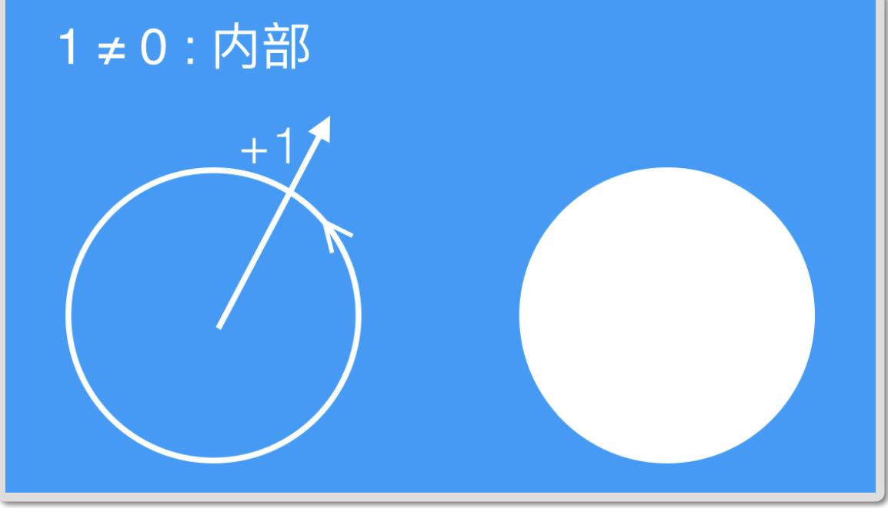

  双圆同向:

  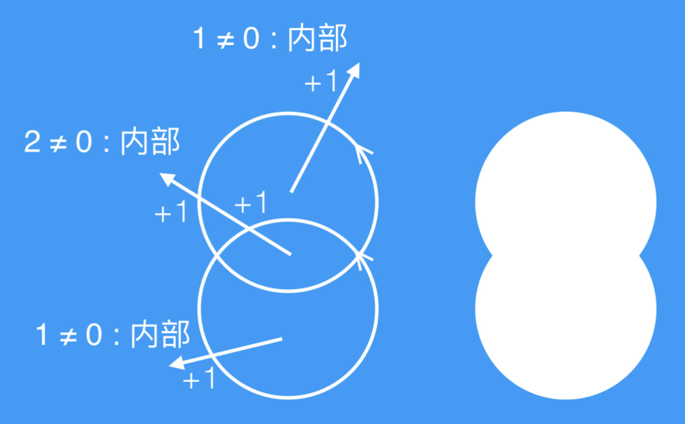

  双圆不同向:

  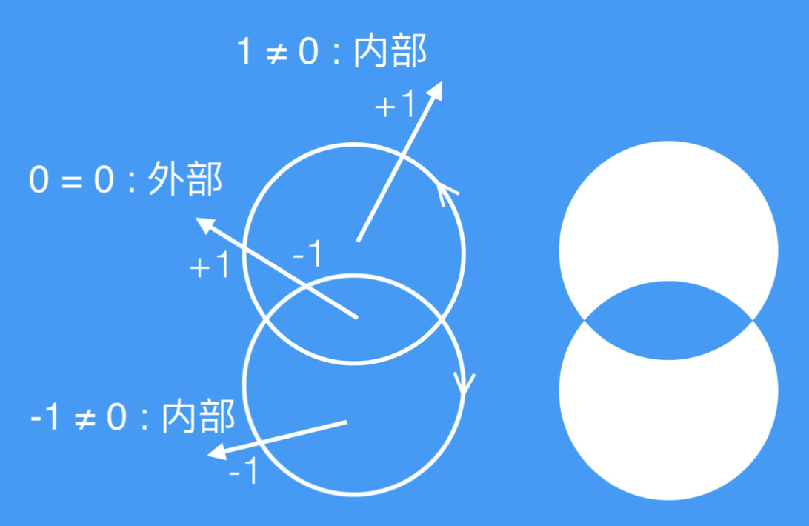

- Even Odd:不考虑方向。穿插奇数次则为内部，偶数次则为外部:

  单圆:

  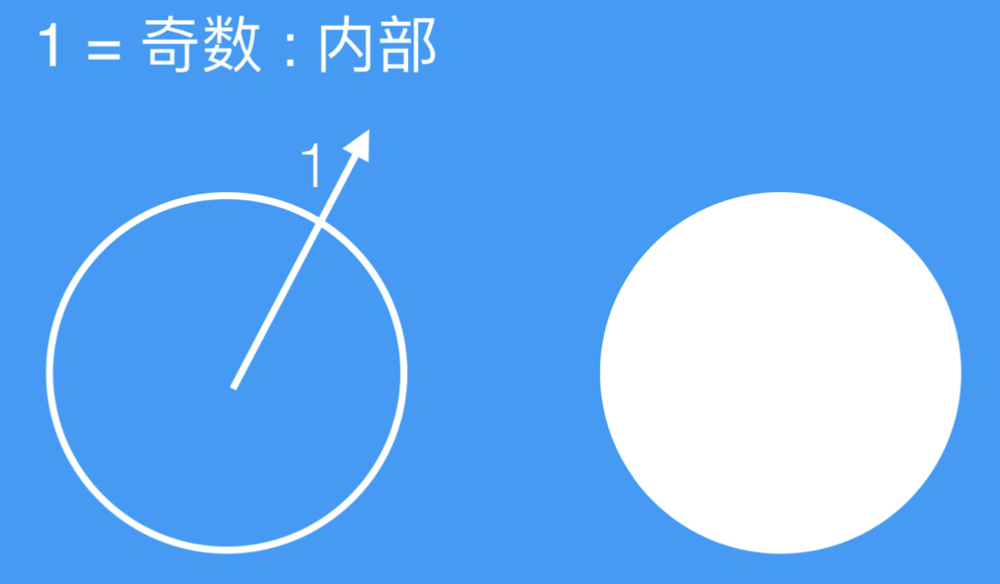

  双圆：

  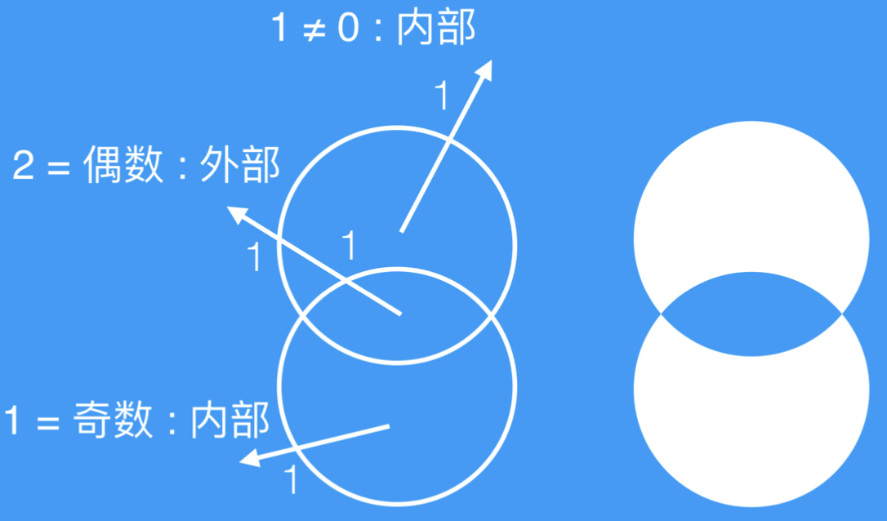

## PathMeasure

把 Path 对象填入，用于对 Path 做针对性的计算(例如图形周⻓)

```kotlin
lateinit var pathMeasure: PathMeasure
 // bool 意思时是否需要封口后再测量
 pathMeasure = PathMeasure(path,false)
 // 周长
 pathMeasure.length
 // 切角
 pathMeasure.getPosTan()
```

## 仪表盘

- 用 drawArc() 绘制弧形

```kotlin
        // args 坐标：左上右下也可以传Rect矩形，起始角度startAngle，
        // 扫过角度sweepAngle，是否扫过中心bool，画笔paint
        canvas.drawArc(
            width / 2f - 150f.px,
            height / 2f - 150f.px,
            width / 2f + 150f.px,
            height / 2f + 150f.px,
            90 + OPEN_ANGLE / 2f,
            360f - OPEN_ANGLE, false, paint)
```

- 三⻆函数的计算 横向的位移是 cos，纵向的位移是 sin

- PathDashPathEffect

- Path 效果，其中就有虚线效果

  - 加上 PathEffect 之后，就只绘制 effect，而不绘制原图形。所以需要弧线和 刻度分别绘制，一共两

  - dash 的方向

    - 绘制 dash 的轨迹是这样的:

      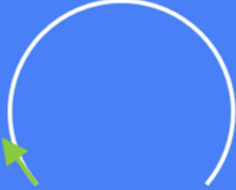

    - 而由于 x 轴的正向是轨迹的正向(这是规定)，所以实际上的物理模型 是这样的:

      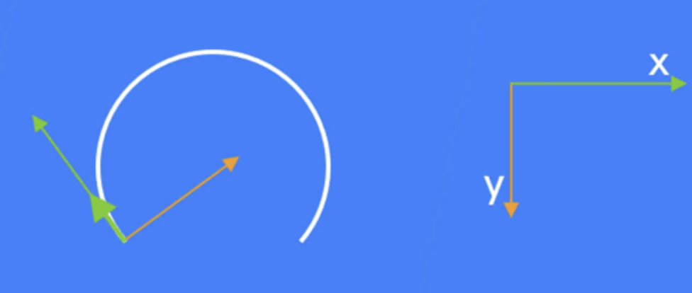

    - 那么，如果你要加上刻度，就应该这样设置:

      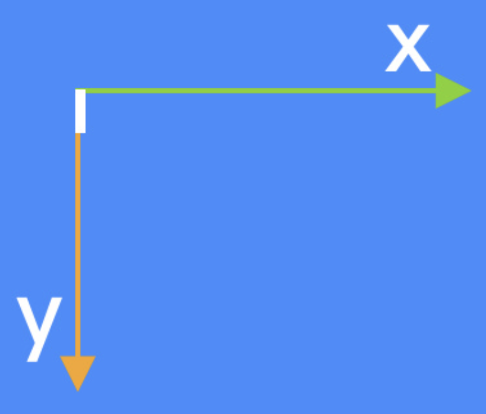

    - 然后，你的刻度就会沿着轨迹绘制:

      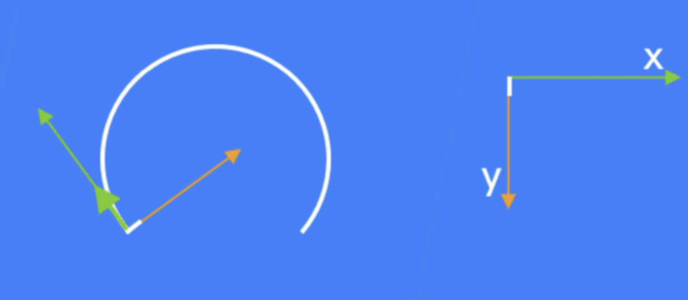

  ```kotlin
  package com.hencoder.customviewdrawing.view
  
  import android.content.Context
  import android.graphics.*
  import android.util.AttributeSet
  import android.view.View
  import java.lang.Math.cos
  import java.lang.Math.sin
  
  /**
   * Created by amazingZZ on 8/16/21
   */
  //仪表盘开口角度
  const val OPEN_ANGLE = 120f
   val DASH_WIDTH = 2f.px
   val DASH_LENGTH = 10f.px
   val MARK = 4
  private val RADIUS = 150f.px
  private val LENGTH = 120f.px
  
  class DashboardView(context: Context?, attrs: AttributeSet?) : View(context, attrs) {
      // Paint.ANTI_ALIAS_FLAG 抗锯齿，会破坏原本的构图，经常使用
      private val paint = Paint(Paint.ANTI_ALIAS_FLAG)
      private var dash =Path()
      private var path =Path()
  
  
      lateinit var pathEffect: PathDashPathEffect
      init {
          paint.strokeWidth= 3f.px
          paint.style = Paint.Style.STROKE
          dash.addRect(0f,0f, DASH_WIDTH, DASH_LENGTH,Path.Direction.CCW)
   }
  
      override fun onSizeChanged(w: Int, h: Int, oldw: Int, oldh: Int) {
          super.onSizeChanged(w, h, oldw, oldh)
          path.addArc(width / 2f - 150f.px,
              height / 2f - 150f.px,
              width / 2f + 150f.px,
              height / 2f + 150f.px,
              90 + OPEN_ANGLE / 2f,
              360f - OPEN_ANGLE)
          val pathMeasure = PathMeasure(path,false)
  
          //args :path ,advance是图形之间的间距，phase是path的偏移量，显示风格
          pathEffect = PathDashPathEffect(
              dash,
              (pathMeasure.length - DASH_WIDTH)/20f,0f,
              PathDashPathEffect.Style.ROTATE)
      }
  
      override fun draw(canvas: Canvas) {
          super.draw(canvas)
          // 画弧
          // args 坐标：左上右下也可以传Rect矩形，起始角度startAngle，
          // 扫过角度sweepAngle，是否扫过中心bool，画笔paint
  //        canvas.drawArc(
  //            rectf,
  //            90 + OPEN_ANGLE / 2f,
  //            360f - OPEN_ANGLE, false, paint)
          canvas.drawPath(path,paint)
          // 画刻度
          paint.pathEffect = pathEffect
          canvas.drawArc(
              width / 2f - 150f.px,
              height / 2f - 150f.px,
              width / 2f + 150f.px,
              height / 2f + 150f.px,
              90 + OPEN_ANGLE / 2f,
              360f - OPEN_ANGLE, false, paint)
          paint.pathEffect = null
          canvas.drawLine(width/2f,
              height/2f,
              (width/2f+ LENGTH* cos(markToRadians(MARK))).toFloat(),
              (height/2f+ LENGTH* sin(markToRadians(MARK))).toFloat(),
              paint)
      }
  
      private fun markToRadians(mark:Int) =
          Math.toRadians(((90 + OPEN_ANGLE / 2f + (360f - OPEN_ANGLE) / 20f * mark).toDouble()))
  }
  ```

  

## 饼图

- 用 drawArc() 绘制扇形

- 用 Canvas.translate() 来移动扇形，并用 Canvas.save() 和 Canvas.restore() 来 保存和恢复位置

- 用三⻆函数 cos 和 sin 来计算偏移

```kotlin
package com.hencoder.customviewdrawing.view

import android.content.Context
import android.graphics.*
import android.util.AttributeSet
import android.view.View
import java.lang.Math.cos
import java.lang.Math.sin

/**
 * 饼图
 */

private val RADIUS = 150f.px
private val ANGLES = floatArrayOf(60f, 90f, 150f, 60f)
private val COLORS = listOf(
    Color.parseColor("#C2185B"),
    Color.parseColor("#00AAC1"),
    Color.parseColor("#558B2F"),
    Color.parseColor("#5D4037")
)
private val OFFSET_LENGTH = 20f.px

class PieView(context: Context?, attrs: AttributeSet?) : View(context, attrs) {
    private val paint = Paint(Paint.ANTI_ALIAS_FLAG)

    lateinit var pathEffect: PathDashPathEffect
    lateinit var rectF: RectF

    init {
        paint.strokeWidth = 3f.px
        paint.style = Paint.Style.FILL
    }

    override fun onSizeChanged(w: Int, h: Int, oldw: Int, oldh: Int) {
        super.onSizeChanged(w, h, oldw, oldh)
        rectF = RectF(
            width / 2f - RADIUS,
            height / 2 - RADIUS,
            width / 2f + RADIUS,
            height / 2f + RADIUS
        )
    }

    override fun draw(canvas: Canvas) {
        super.draw(canvas)
        var startAngle = 0f
        for ((index, angle) in ANGLES.withIndex()) {

            paint.color = COLORS[index]

            if (index == 1) {
                // 偏移计算
                canvas.save()
                canvas.translate(OFFSET_LENGTH * cos(Math.toRadians(startAngle + angle / 2f.toDouble())).toFloat(), OFFSET_LENGTH * sin(Math.toRadians(startAngle + angle / 2f.toDouble())).toFloat())
            }
            canvas.drawArc(
                rectF,
                startAngle,
                angle,
                true,
                paint
            )
            startAngle += angle
            if (index == 1) {
                // 恢复
                canvas.restore()
            }

        }
    }

}
```

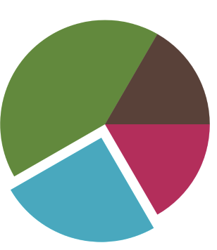